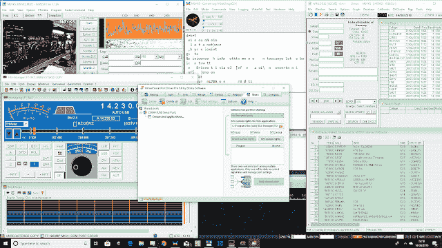

# 同时使用多个应用程序控制业余无线电收发机

> 原文：<https://dev.to/helgayork/using-several-apps-simultaneously-to-control-a-ham-radio-transceiver-3gp>

大量业余无线电爱好者面临的一个问题是，通过 Windows 操作系统一次只能访问一个串行端口。如果你想用同一个物理 COM 接口同时使用几个应用程序，你需要使用专用的串行端口分离软件。

# 业余业余无线电爱好者遇到的一些标准问题以及解决这些问题的最佳方法。

*   PC 上运行的站控制软件需要通过其连接的 COM 端口访问 Ham 无线电收发器。其他软件，如站簿或记录软件，也需要通过相同的串行端口访问收发器。

本机操作系统不允许同时连接，迫使您一次只能使用一个应用程序作为解决方法。这是解决这个问题的常用方法，但不是一个非常有效的解决方案。

允许两个程序与同一个串行端口交互的更好的方法是使用 COM 端口分离器应用程序，如[虚拟 COM 端口驱动程序 PRO](https://www.eltima.com/products/vspdxp/#vspd-versions) 。

[T2】](https://res.cloudinary.com/practicaldev/image/fetch/s--V_ae1Wh5--/c_limit%2Cf_auto%2Cfl_progressive%2Cq_auto%2Cw_880/https://1.bp.blogspot.com/-AkmVhqTbGp0/W3NRaE8kUyI/AAAAAAAArZU/oUvVYMiLV0Md0v9LTjTPtG_CpU9BANPSgCEwYBhgL/s640/Using%252BEtima%252BSoftware%252BTo%252Bshare%252Ba%252BSerial%252BPort.png)

使用该软件解决方案，您可以将单个物理串行端口拆分成多个虚拟副本。这允许所有的串行程序同时连接到同一个真实端口。虚拟副本显示为不同的 COM 端口，而实际上它们都使用相同的物理接口。使用串行端口分离软件可以让你连接尽可能多的程序到你的业余无线电收发机。

**虚拟串行端口驱动程序 PRO 可以用于 32 位和 64 位版本的 Windows 10 以及许多旧版本的 Windows 操作系统。**

*   这是虚拟 COM 端口驱动程序 PRO 非常有用的另一个例子。

如果你有 [CW Skimmer](http://www.dxatlas.com/cwskimmer/) 、 [MixW](http://mixw.net/) 或者其他一些专门的软件在运行，并且想用你的日志程序来控制你的收音机，你又会遇到需要同时访问同一个端口的问题。使用串行端口分离器软件，这个问题很容易解决。每个应用程序可以简单地附加到你的界面的一个虚拟副本上。

您也可以考虑将 Eltima 的[串行嗅探器](https://www.eltima.com/products/serial-port-monitor/)用于您的数据记录软件解决方案。它使您能够跟踪、调试和监控环境中的所有串行端口，并以多种方便的格式显示所有记录的数据。

*   另一个具有挑战性的情况是当 GPS 用户想要与几个应用程序共享单个 NMEA(国家海洋电子协会)信息流时。

同样，我们需要将单个数据流分割成多个数据流的能力，否则将面临一次只使用一个应用程序的前景。虚拟 COM 端口驱动程序 PRO 是解决这个问题的一个优秀而简单的解决方案，它允许您从一个物理接口创建任意多的虚拟串行端口。这使您可以与任意多的应用程序共享来自 GPS 单元的信息。所有程序将同时访问相同的数据。

[T2】](https://res.cloudinary.com/practicaldev/image/fetch/s--01fmoMEN--/c_limit%2Cf_auto%2Cfl_progressive%2Cq_auto%2Cw_880/http://www.virtual-serial-port.org/imgnew/products/sps/splash/image.png)

如上所示，你可以看到虚拟串行端口驱动程序 PRO 是最好的 Com 端口分离器之一。它的高级功能对于使用 PC 与设备交互的业余无线电爱好者来说非常有用。使用虚拟串行端口驱动程序专业版，您可以:

*   将一个串行数据流分割成多个精确的副本；

*   将来自多个来源的串行数据组合成一个数据流；

*   使用同一个串行接口连接多个串行应用程序；

*   [在您的系统上创建无限数量的虚拟串口](https://www.eltima.com/create-virtual-serial-port.html)；

*   合并多个真实和虚拟的 COM 端口，使几个硬件设备和串行应用程序可以同时相互交换数据。