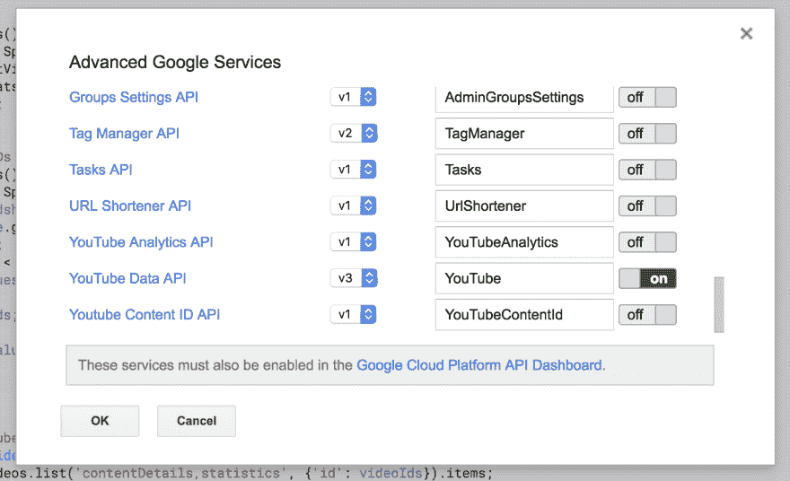

# 使用工作表和 YouTube API 跟踪视频分析

> 原文：<https://dev.to/rick_viscomi/using-sheets-and-the-youtube-api-to-track-video-analytics-6el>

我在 YouTube 上主持了一个名为 [The State of the Web](https://www.youtube.com/playlist?list=PLNYkxOF6rcIBGvYSYO-VxOsaYQDw5rifJ) 的双周视频系列，作为一个数据狂，我希望有一种方法来监控每个视频的公共统计数据，看看它们的表现如何:观看次数、喜欢、不喜欢、评论等。在这篇文章中，我将带你了解如何设置自己的仪表盘来监控你感兴趣的视频。

[T2】](https://res.cloudinary.com/practicaldev/image/fetch/s--vFwLcG_c--/c_limit%2Cf_auto%2Cfl_progressive%2Cq_auto%2Cw_880/https://thepracticaldev.s3.amazonaws.com/i/ecpej5zma3t40codbw9k.png)

你可以在这张纸上看到我的成品。如果你愿意，你可以复制一份表格，然后插入你自己的视频，但是请记住，你可能仍然需要遵循这些步骤中的一些来启用像[YouTube API](https://developers.google.com/apps-script/advanced/youtube)这样的东西。

## 入门

你需要一张空白的[谷歌表单](https://sheets.google.com)来开始。将默认工作表重命名为“Video Stats ”,以便在脚本中有一个可识别的名称。

第 1 行将是统计表的标题:

*   视频标题
*   视频 ID
*   视图
*   喜欢
*   厌恶
*   评论
*   持续时间

您需要的唯一输入是 A 列和 b 列中每个视频的标题和 ID。或者，您可以添加以下各列以获得更多统计信息:

*   每次观看的点赞数
*   每个视图不喜欢的内容
*   点赞百分比
*   不喜欢的百分比
*   每个视图的评论

这些是使用简单的工作表公式根据 API 结果在本地计算的。比如计算喜欢的百分比就用这个公式:`=IFERROR(D2/(D2+E2), "")`。将同一公式应用于该列中的所有单元格的一个技巧是，选择已经应用了公式的单元格，按 Cmd+Shift+Down 选择该列中所有后面的单元格，然后按 Cmd+D 应用公式。`IFERROR`函数防止空行被零除的错误。

您还可以设置列的格式来修饰它们各自的值。例如，持续时间最好采用 MM:SS 格式，而计算字段最好采用百分比格式。

接下来，转到数据>命名范围，为视频 ID 值创建一个“命名范围”...并为范围`'Video Stats'!B2:B1000`添加一个名为“IDs”的新范围。这允许脚本更容易地扫描视频 id 列表。

## 大脑的分析学

为了让仪表板工作，我们需要与 YouTube 对话并获得每个视频的统计数据。这可以通过一点应用程序脚本来实现，你可以通过工具>脚本编辑器来编写。

在新打开的编辑器中，将您的项目命名为“YouTube Analytics”并粘贴以下脚本:

```
// This is "Sheet1" by default. Keep it in sync after any renames.
var SHEET_NAME = 'Video Stats';

// This is the named range containing all video IDs.
var VIDEO_ID_RANGE_NAME = 'IDs';

// Update these values after adding/removing columns.
var Column = {
  VIEWS: 'C',
  LIKES: 'D',
  DISLIKES: 'E',
  COMMENTS: 'F',
  DURATION: 'G'
};

// Adds a "YouTube" context menu to manually update stats.
function onOpen() {
  var spreadsheet = SpreadsheetApp.getActive();
  var entries = [{name: "Update Stats", functionName: "updateStats"}];

  spreadsheet.addMenu("YouTube", entries);
};

function updateStats() {
  var spreadsheet = SpreadsheetApp.getActive();
  var videoIds = getVideoIds();
  var stats = getStats(videoIds.join(','));
  writeStats(stats);
}

// Gets all video IDs from the range and ignores empty values.
function getVideoIds() {
  var spreadsheet = SpreadsheetApp.getActive();
  var range = spreadsheet.getRangeByName(VIDEO_ID_RANGE_NAME);
  var values = range.getValues();
  var videoIds = [];
  for (var i = 0; i < values.length; i++) {
    var value = values[i][0];
    if (!value) {
      return videoIds;
    }
    videoIds.push(value);
  }
  return videoIds;
}

// Queries the YouTube API to get stats for all videos.
function getStats(videoIds) {
  return YouTube.Videos.list('contentDetails,statistics', {'id': videoIds}).items;
}

// Converts the API results to cells in the sheet.
function writeStats(stats) {
  var spreadsheet = SpreadsheetApp.getActive();
  var sheet = spreadsheet.getSheetByName(SHEET_NAME);
  var durationPattern = new RegExp(/PT((\d+)M)?(\d+)S/);
  for (var i = 0; i < stats.length; i++) {
    var cell = sheet.setActiveCell(Column.VIEWS + (2+i));
    cell.setValue(stats[i].statistics.viewCount);
    cell = sheet.setActiveCell(Column.LIKES + (2+i));
    cell.setValue(stats[i].statistics.likeCount);
    cell = sheet.setActiveCell(Column.DISLIKES + (2+i));
    cell.setValue(stats[i].statistics.dislikeCount);
    cell = sheet.setActiveCell(Column.COMMENTS + (2+i));
    cell.setValue(stats[i].statistics.commentCount);
    cell = sheet.setActiveCell(Column.DURATION + (2+i));
    var duration = stats[i].contentDetails.duration;
    var result = durationPattern.exec(duration);
    var min = result && result[2] || '00';
    var sec = result && result[3] || '00';
    cell.setValue('00:' + min + ':' + sec);
  }
} 
```

请参考代码中的注释，了解每个函数的作用。

在脚本编辑器中还有几件事要做，以使一切正常工作:

1.  启用 API
2.  设置触发器，以便统计数据自动更新

[T2】](https://res.cloudinary.com/practicaldev/image/fetch/s--xFcVz9n---/c_limit%2Cf_auto%2Cfl_progressive%2Cq_auto%2Cw_880/https://thepracticaldev.s3.amazonaws.com/i/y0ogwyu0wfk6xnrvzyeb.png)

要启用 API，请转到资源>高级谷歌服务...向下滚动并启用 YouTube 数据 API。您还必须单击“Google Cloud Platform API Dashboard”链接并搜索“YouTube Data API v3 ”,以便为您的项目启用它。

[T2】](https://res.cloudinary.com/practicaldev/image/fetch/s--EKSx_EVP--/c_limit%2Cf_auto%2Cfl_progressive%2Cq_auto%2Cw_880/https://thepracticaldev.s3.amazonaws.com/i/8oof5ehnrrvp6mz15jao.png)

要设置触发器，进入编辑>当前项目的触发器，并按照上面的截图进行配置。它做两件事:

*   每 15 分钟更新一次统计数据，这样您就可以打开工作表并获得最新数据
*   一打开工作表就更新统计数据

[T2】](https://res.cloudinary.com/practicaldev/image/fetch/s--f3aa0FoS--/c_limit%2Cf_auto%2Cfl_progressive%2Cq_auto%2Cw_880/https://thepracticaldev.s3.amazonaws.com/i/wolikomkpitdoo49cwz7.png)

如果您想手动触发更新，还可以在表单中添加一个“YouTube”菜单。

## 包装完毕

这就是全部了。我的工作表也有一些二级工作表的例子，它们用其他表格和图表汇总统计数据，但是您可以按照自己喜欢的方式定制您的仪表板。

如果你拥有上传视频的 YouTube 频道，你也可以访问观看时间和订阅数据等私人数据。但是这个脚本的伟大之处在于，你可以监控*任何* YouTube 视频，而不管其所有权如何——这都是公共信息！