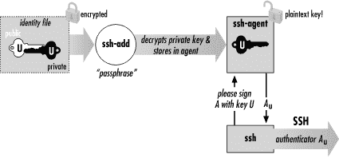

# 使用 SSH-Agent 简化您的 SSH 体验

> 原文：<https://dev.to/samuyi/using-ssh-agent-to-simplify-your-ssh-experience--1in8>

[T2】](https://res.cloudinary.com/practicaldev/image/fetch/s--QLruX-gP--/c_limit%2Cf_auto%2Cfl_progressive%2Cq_66%2Cw_880/https://thepracticaldev.s3.amazonaws.com/i/gnjx8wzk5di0i2wkdsdi.gif)

SSH 密钥用于 SSH 服务器和客户端之间的身份管理。基本上 SSH 中的键有两种用法；以识别服务器和识别用户。SSH 主机密钥用于识别服务器，这确保了客户端知道它正在与正确的服务器对话。通常，主机密钥存储在由系统管理员维护的安全存储库中。当服务器被提供时，管理员在服务器地址上运行 ssh-keyscan 来获取服务器的密钥指纹。如果存在 SSH 服务器，服务器的主机密钥将在服务器启动时生成。
SSH 密钥的第二个用途是向 SSH 服务器标识用户。(如果您在 SSH 服务器上使用密码，最好改为公钥，以保护您的服务器免受即将到来的字典攻击。)每次你尝试访问 SSH 服务器时，你都需要解密你的私钥，因此如果你运行:

```
$ ssh -l pat shell.isp.com
Enter passphrase for key '/home/you/.ssh/id_rsa': ************ 
```

系统会提示您输入密码来解密您的私钥。如果您每次临时注销远程服务器(可能是为了上厕所)时都不断地被提示输入密码短语，并且您必须重新登录，这很快就会变得很烦人。如果你只得到一次输入密码的提示，不是更好吗？也许最初当你在工作开始时启动你的工作站？

假设您有几十台 SSH 服务器，您需要用一个脚本来做一些维护工作。每次脚本尝试 SSH 到每个服务器时，您都必须输入每个不同私钥的密码，以便在每个服务器上验证您的身份。假设每台服务器都有不同的密钥(这是绝对应该的),那么为每个私钥输入密码短语就成了一件非常麻烦的事情。我知道你在想什么；为什么不直接将密码存储在客户机磁盘上，然后将它们输入到脚本中以实现身份验证的自动化。你绝对不应该这样做，因为客户端机器会将密码存储在历史文件中。如果任何有权访问你的机器的人在脚本运行时运行 ps，他们会在脚本运行的命令中看到密码，即使在磁盘上加密也救不了你，最糟糕的是没有办法发现密码是否已被泄露。您需要做的是使用 ssh 代理，这是本文的主题。

ssh-agent 是一个程序，它缓存私有密钥并响应来自 ssh 客户端的与身份验证相关的查询。它与另一个名为 ssh-add 的程序配合使用，使您在每次尝试向 ssh 服务器进行身份验证时不必重新键入密码，ssh-add 可以在代理的密钥缓存中添加和删除密钥。典型的用法可能是这样的:

```
# Start an agent  for bash like shells
$ ssh-agent $SHELL
# Load an SSH key
$ ssh-add .ssh/id_rsa
Enter passphrase for /home/you/.ssh/id_rsa:********** 
```

通过键入您的密码短语，您可以省去每次尝试认证 SSH 服务器时解密密钥的麻烦。您的私钥现在由代理存储在内存中。从现在起直到您注销或终止代理，密钥仍保留在代理内。SSH 客户端现在联系代理进行所有基于密钥的操作。代理执行两项任务:
将您的私钥存储在内存中
回答 SSH 客户端关于这些密钥的问题

它们既不会将您的私钥存储在磁盘上，也不会通过网络发送它们。SSH 客户端需要回答的任何与私钥相关的事情都由代理处理。

回到我们假设的场景，登录到许多服务器来执行维护工作。一个人只需要用各种服务器的所有必要密钥加载代理一次，允许维护脚本在无人值守的情况下执行它们的功能。但是当然，这里有一个复杂性的权衡；如果您有 100 个批处理作业，那么为每个作业设置单独的帐户或密钥可能会太难处理。在这种情况下，根据作业所需的权限将作业分成不同的类别，并为每个类别的作业使用单独的帐户和/或密钥。更好的是，您可以将每个服务器的密码存储在一个外部磁盘上，只在需要获取密码时才挂载它。只要运行 ssh-agent 的系统没有重新启动，就没有必要再次输入密码。

SSH 代理非常安全。由于私钥存储在内存中，因此只有非常熟练的攻击者才能以 root 权限窃取内存中的密钥。但是，使用代理时有一些最佳实践可以遵循。登录到 SSH 客户机时，最好不要让终端处于无人看管的状态。当您的私钥加载到代理中时，任何人都可以使用您的终端通过这些密钥连接到任何远程帐户，而不需要您的密码！更糟糕的是，老练的入侵者可能会成功地从你的系统中窃取你的密钥。如果您必须离开您的 SSH 客户机，请确保注销。更好的是，您可以运行 ssh-add -D 来清除您离开时加载到代理中的所有键，并在您返回时重新加载它们。

结论
在使用 SSH 时，SSH 代理是一个强大的自动化工具。它们省去了每次您想要解密一个私钥来访问 SSH 服务器时必须键入密码短语的麻烦。
它们安装在大多数 SSH 客户端上，因为它是 SSH 协议的一部分。