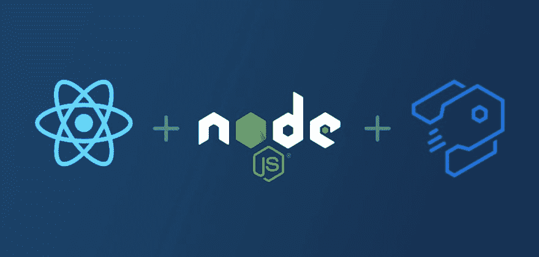
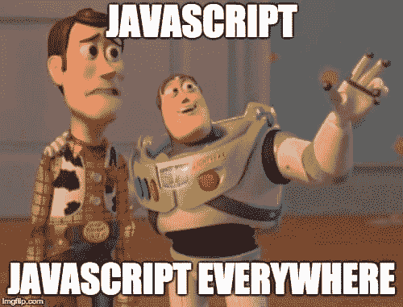

# 通过 React SPA 使用 Strapi 进行 Node.js 内容管理

> 原文：<https://dev.to/couellet/using-strapi-for-nodejs-content-management-with-a-react-spa-1n9f>

[T2】](https://res.cloudinary.com/practicaldev/image/fetch/s--XSmxGvy1--/c_limit%2Cf_auto%2Cfl_progressive%2Cq_auto%2Cw_880/https://snipcart.com/media/203792/node-js-react-strapi-1.png)

几个月前，我们召集了 Node.js 的内部专家来撰写一篇关于其生态系统状况的文章。

在里面，他从未提及 **Strapi.js** 。

真是个傻瓜。🤦‍♂️

果不其然，我们的读者在评论中推荐了这个强大的 Node.js API 框架，让他重回正轨。

今天，为了证明我们把这个反馈放在心上，我将充分利用 Strapi。我将向您展示如何使用 React 单页面应用程序处理 Node.js 中的内容管理。

步骤:

1.  用 MongoDB 为 Strapi 设置 Node.js 后端。
2.  在 Strapi 中为 SPA 创建适当的内容类型。
3.  用`create-react-app`建一个 React SPA(基础网店)。
4.  捆绑和部署通用 JS 应用程序！

在这个过程中，我思考了很多关于这种*通用 JavaScript* 栈及其在开发者空间中的位置。

所以，在进入技术层面之前，让我们先从哲学角度来思考一下。

## Node.js with React:为什么要走通用 JavaScript 的路？

仅仅几年前，构建一个完整的 JavaScript 应用程序还是一个纯粹的幻想。但是事情已经改变了。

[T2】](https://res.cloudinary.com/practicaldev/image/fetch/s--a2Yo5sFr--/c_limit%2Cf_auto%2Cfl_progressive%2Cq_auto%2Cw_880/https://snipcart.com/media/203785/javascript-everywhere.jpg)

有些人可能称之为*同构 JavaScript* ，但是[似乎对术语*通用 JavaScript* 有共识](https://cdb.reacttraining.com/universal-javascript-4761051b7ae9)。所以我坚持使用后者。

这一切都始于平均栈(MongoDB/Express/Angular/Node)——第一个要去的 JS 全栈。你现在仍然可以选择它，但是认为它是唯一可用的堆栈是错误的。

→阅读完整帖子和技术教程[此处](https://snipcart.com/blog/node-js-react-strapi-tutorial)