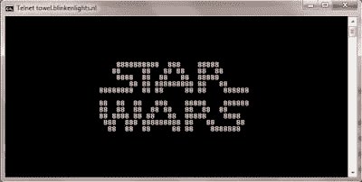

# 使用 telnet 排除连通性故障....看星球大战

> 原文：<https://dev.to/briannipper/using-telnet-to-troubleshoot-connectivity-and-watch-star-wars-5haf>

所以我要先说的是，在这篇文章的最后，你会知道如何观看 ASCII 艺术形式(即基于文本的图形)的《星球大战:新的希望》...让我们开始吧。

[T2】](https://1.bp.blogspot.com/-ignzeE25inc/W6MB7SE3k9I/AAAAAAAAHKw/Ntk-y1vkga0gUbqebNS0c8GyXsSmyIcwQCLcBGAs/s1600/watching-star-wars-cmd-4telnet.jpg)

最近，我发现自己正在开发一个遗留应用程序，因此我必须将多节点应用程序重新部署到运行在 Azure 上的基础设施中。其中两个模型通过 net.tcp 上的 WCF 绑定进行通信。当我在防火墙已经打开以允许通信的印象下工作时，我有点困惑于如何验证通信是否正常。所以我走到网络区和我们的网络架构师聊天。正如我经常发现的那样，在翻译领域，与那些专业知识与你不同的人聊天需要耐心和努力。尽管我们都在 IT 领域工作，我们都有自己的行话要处理，但入场费是非常值得的。

在解释我的挑战的短短几分钟内，我得到了一个极好的方法来证实，从网络的角度来看，交流是可能的。输入 telnet。 [Telnet](https://en.wikipedia.org/wiki/Telnet) ，如果你不知道的话，这是一个已经过时的协议。同样明确的是，telnet 并不安全，不应该一直运行，但是在我们的例子中，它是一个短期的有用工具。

如前所述，我需要确认网络中两个节点之间通过 net.tcp 进行的通信是否正常，那么如何才能“轻松”地完成这一任务呢？我们想要做的是模拟通信，这样您就可以在 net.tcp 侦听器所在的端口上使用 telnet，如果您看到一个空白屏幕，那么您就有了连接。当 telnet 客户端通过侦听流量的端口(比如 HTTP 或 net)呼叫目标服务器时。TCP 请求响应将会返回，telnet 客户端除了显示一个空白屏幕之外不知道该做什么。但它证明了该端口上的通信正常。所以首要问题回答了。

所以看看这个例子，再看看星球大战。

**启用远程登录客户端**

完成后一定要禁用 TELNET，我会在最后提到这一点。

*   以管理员身份打开 PowerShell 命令

*   输入命令

    Enable-windows optional feature-Online-feature name“telnet client”

*   关闭 PowerShell

*   打开命令提示符

*   输入命令，根据需要替换您的信息

Telnet [IP 或 DNS][net . TCP 侦听器端口]

例如:Telnet google.com 443

如果你得到一个空白的屏幕，那么一个应用程序正在监听目标端口，可以通过网络进行通信。TCP(或 HTTPS 等)。

如果你得到错误“无法打开到主机的连接，在端口 xxx:连接失败”，那么你可能需要回到防火墙，看看是否有其他东西阻塞。

《星球大战》怎么样

正如所承诺的，如果你已经启用了 telnet 并完成了故障排除，你可以通过 telnet 打开一个 telnet 连接来查看星球大战，如下所示。

telnet 毛巾. blinkenlights.nl

**禁用远程登录客户端**

*   以管理员身份打开 PowerShell 命令

*   输入命令

禁用-windows optional feature-Online-feature name " telnet client "