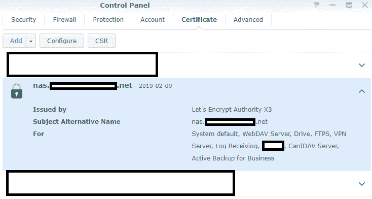

# 对专用网络使用有效证书

> 原文：<https://dev.to/xlebenny/using-valid-cert-for-private-network-218>

忘了是谁说的想办法不用 NAT 使用 cert】最后我想办法做了
但是 [pfsense](https://www.pfsense.org/) 帮我施了点魔法
我是*不是*网络/安全专业人士
我只能解释成我是 65535，谁能解释给 5 听？
对糟糕的文章和英语感到抱歉

# TL；博士；医生

你需要

*   DNS 解析器
*   公共域名
*   比如说[让我们加密](https://letsencrypt.org/)

# 步

#### 1。创建子域并`cert`它

因为`CA`有效，所以在浏览器
 会显示`valid`

#### [2](#2-create-raw-host-overrides-endraw-on-your-raw-dns-resolver-endraw-)。在您的`DNS Resolver`上创建`Host Overrides`

因为`cert`会在 url
中检查你的域名和实际域名，你必须使用步骤 1 的域名

#### 3。使用子域`cert`设置您的服务器

[T2】](https://res.cloudinary.com/practicaldev/image/fetch/s--JlsMy4ws--/c_limit%2Cf_auto%2Cfl_progressive%2Cq_auto%2Cw_880/https://thepracticaldev.s3.amazonaws.com/i/g9wjh5if4rx53hxxf1qn.png)

# 引用

[本地 IP 地址的 SSL 证书](https://forum.netgate.com/topic/132256/ssl-certificates-for-local-ip-address-solved/14)