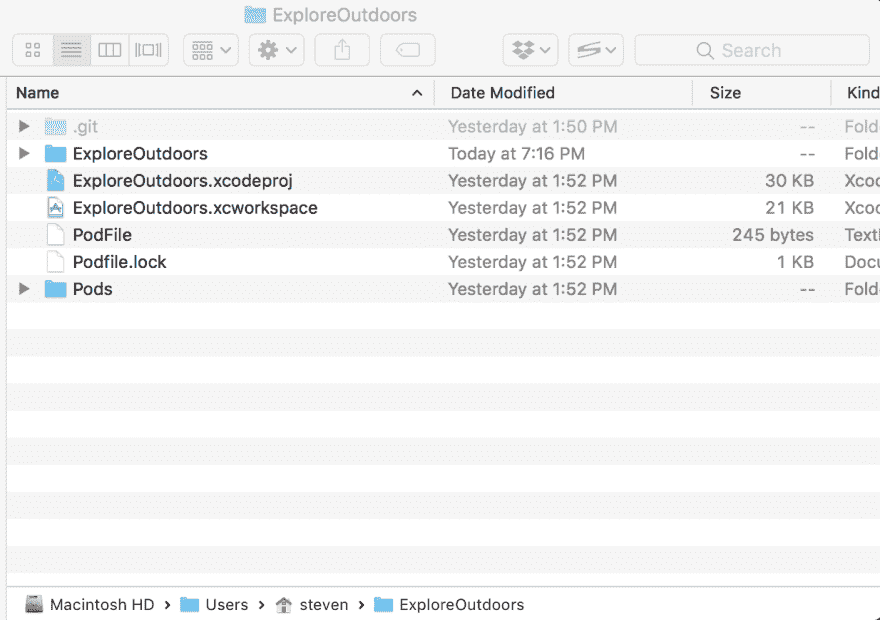

# 使用您的自定义 Mapbox 地图并使用 Swift 添加导航

> 原文：<https://dev.to/rockarts/using-your-custom-mapbox-map-and-adding-navigation-using-swift-1dje>

在[上一篇文章中，我们使用 Mapbox Studio](https://dev.to/rockarts/building-a-custom-map-using-mapbox-studio-to-add-to-your-apps-3oi6) 创建了一个定制地图，在这篇博文中，我们将在用 Swift 编写的 iOS 应用程序中使用这个定制地图，并为其添加一些导航功能。

如果你更喜欢看关于这个的截屏，你可以在下面看。

[https://www.youtube.com/embed/YKjbJqp4Wbc](https://www.youtube.com/embed/YKjbJqp4Wbc)

首先，我们需要在 XCode 中创建新项目。转到文件->新建->项目(单视图应用程序)，并将您的项目命名为 ExploreOutdoors。现在，在您保存项目的目录中，我们需要创建一个 PodFile，以便安装 Mapbox 和 Mapbox 导航 API。我的目录布局如下所示:

[T2】](https://res.cloudinary.com/practicaldev/image/fetch/s--uiW7GfIS--/c_limit%2Cf_auto%2Cfl_progressive%2Cq_auto%2Cw_880/https://thepracticaldev.s3.amazonaws.com/i/2z9bnxtp19y48fa3lwr8.png)

创建一个名为 PodFile 的文件，并添加以下代码。