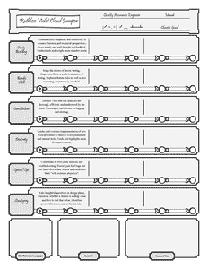
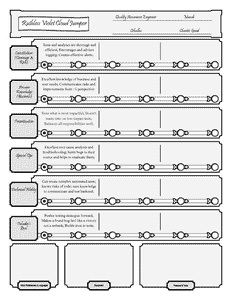

# 利用一个标准来分享对 QA 工程师角色的期望

> 原文：<https://dev.to/alanmbarr/utilizing-a-rubric-to-share-expectations-of-the-qa-engineer-role--3kfm>

[T2】](https://res.cloudinary.com/practicaldev/image/fetch/s--CrIp_gT---/c_limit%2Cf_auto%2Cfl_progressive%2Cq_auto%2Cw_880/https://s3.amazonaws.com/www.alanmbarr.com/blimg/void_header_sheet.png)

## 为什么要加标题

当我在韩国教英语的时候，我和一位教授一起工作，他教我如何使用量规来给学生的表现评分。很难衡量彼此的表现，尤其是在软件开发领域。量规创造了角色表现和期望的透明度。我创建了一个标题来增加可见性，并告诉其他人质量工程师可以为他们的团队带来什么。我曾在几个不同的角色和企业工作过，很多次遇到一个新的角色，我不知道他们做什么以及他们是如何做到的。

## 创建透明度

我最初创建一个标题的尝试来自于对我自己在一个后端大型团队中的表现的深入思考。我思考了我做出贡献的不同方式，以及我可以改进的地方，并将其推广到几个不同的类别。我开始与我的同事分享，并开始集体塑造这个文档，以代表一个可能在我们的任何开发团队中工作的普通人的角色。这成了质量工程师的出发点，他们要么照原样使用它，要么制作自己的版本与他们的团队分享。

<colgroup><col> <col> <col> <col></colgroup> 
| **标准** | **超过** | **中级** | **新手** |
| 与不同角色的关系。POs、开发人员、TA | 能够提供出色而及时的反馈。理解并权衡团队成员的需求。 | 能够提供一定程度的反馈，并了解其他角色的需求。 | 关系是肤浅的。难以提供反馈和理解角色的观点。 |
| 影响 | 能够将错误转化为他人学习的机会。建立跨业务的影响力。 | 能够有效地影响团队成员的想法。了解建立影响力的各种方法。 | 发现很难分享一个观点或联系，只使用逻辑细节来支持一个论点。 |
| 编码能力 | 能够参与创建复杂的测试自动化，或者与开发人员一起协助日常工作。读取、写入和调试代码。指出风险。 | 能够读写和调试代码。可以指出哪些常见问题会增加项目的风险。 | 能够阅读但难以理解代码的局限性以及开发人员可能会遇到的问题。 |
| Bug 销售能力/风险 | 能够提高对 bug 或有影响的变更的正确认识水平，并优先修复它。 | 提高对错误或有影响的变更的认识。 | 输入了 bug，但产品负责人没有跟进。不考虑风险水平。 |
| 设计 | 在设计阶段提出关于产品和测试的有见地的问题。质疑功能是否增值。关于如何测试和为什么测试的问题。识别潜在的业务/技术风险。 | 关于如何测试和为什么测试的问题。 | 设计中的问题只讨论如何测试，不讨论为什么测试。 |
| 开发人员测试辅导 | 开发人员觉得自己有能力编写不同层次的测试，并推动测试编写方式和原因的界限。解释测试金字塔并衡量特定测试的风险、维护和 ROI 水平。 | 能够向开发人员解释测试金字塔，并权衡特定测试的风险、维护和 ROI 水平。 | 编写测试时没有考虑可维护性或所需的测试级别。 |
| 业务领域知识和主题专业知识 | 对最终用户需求和业务运作方式有很好的了解。从最终用户和业务角度传达潜在的改进和风险。 | 对最终用户需求和业务运作方式有足够的知识。 | 对最终用户需求和业务运作方式的了解有限。 |
| 流程改进 | 指导和监督新工具/流程的实施，以消除过多的冗余和手动任务。发现并强调需要改进的地方。 | 指出并建议工具/流程，以消除过度冗余的手动任务。参与某种程度的实现。 | 流程改进建议和实施有限。 |
| 测试覆盖率和风险 | 测试分析是彻底和高效的。让团队参与风险分析并提供建议。确保团队理解测试覆盖范围和风险。 | 测试分析不会导致明显的差距。围绕测试覆盖和风险的充分沟通和可见性。【T2  | 测试分析可能会导致明显的差距。围绕测试覆盖和风险的有限的交流和可见性。 |

## 为团队定制 QA 任务日志

### 团队 1

<colgroup><col> <col></colgroup> 
| **标准** |  |
| 党建 | 频繁有效地沟通，将业务和技术观点联系起来；给出及时和深思熟虑的反馈；理解并衡量团队成员的需求。 |
| 吟游诗人技能 | 歌唱英勇考验的故事；使开发人员能够拓展测试的范围；解释功能风险以及测试推理、维护和 ROI。 |
| 组成 | 确保测试和风险分析是彻底的、有效的，并被团队所理解；鼓励记录和报警并提出建议； |
| 特种部队 | 有助于根本原因分析和故障排除；不仅仅是找到漏洞，而且要“带着极端的偏见”追踪它们的源头并根除它们； |
| 策略 | 在设计阶段提出有见地的问题；质疑某个特性是否增加了价值，以及如何测试这种价值；识别潜在的业务和技术风险； |

 [
T4】](https://s3.amazonaws.com/www.alanmbarr.com/blimg/QAQuestLog_Cthulhu_20170705.png)

### 团队二

<colgroup><col> <col></colgroup> 
| **标准** |  |
| 构成(保险和风险) | 测试和分析是彻底和有效的；鼓励和建议伐木；创建有效的警报； |
| 神秘的知识(商业) | 出色的业务和用户需求知识；从 1 个以上的角度传达风险和改进。 |
| 优化 | 测试什么是最有影响力的；不会在低影响测试上浪费时间；很好地平衡所有责任； |
| 特种部队 | 出色的根本原因分析和故障排除；追踪臭虫的来源，并帮助根除它们； |
| 技能 | 可以创建复杂的自动化测试；知道代码的风险；利用知识交流和测试后端； |
| 圣骑士的热情 | 可以创建复杂的自动化测试；知道代码的风险；利用知识交流和测试后端； |

[T2】](https://s3.amazonaws.com/www.alanmbarr.com/blimg/QAQuestLog_Cthulhu_20170705.png)

## 给团队发言权并进行测试

我为我的团队成员感到自豪，并把这个想法放在自己的道路上，并对其进行定制。尽管我们经常想为每个团队开发一个通用的标准来使用
,但事实是每个团队在维护他们的软件时都需要一定程度的定制。我们应该接受在团队中不断重新评估我们的技能组合。