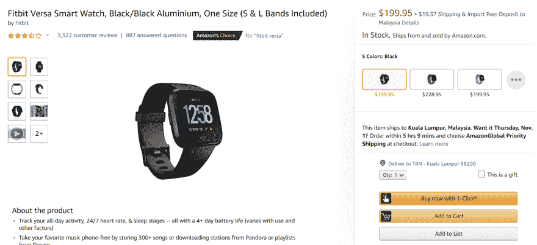
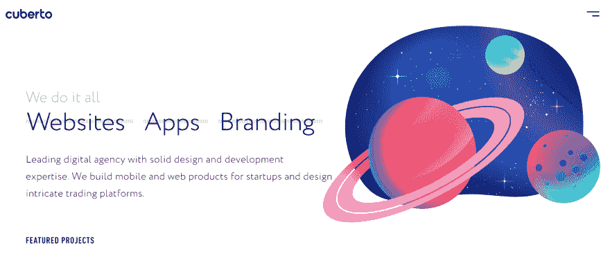
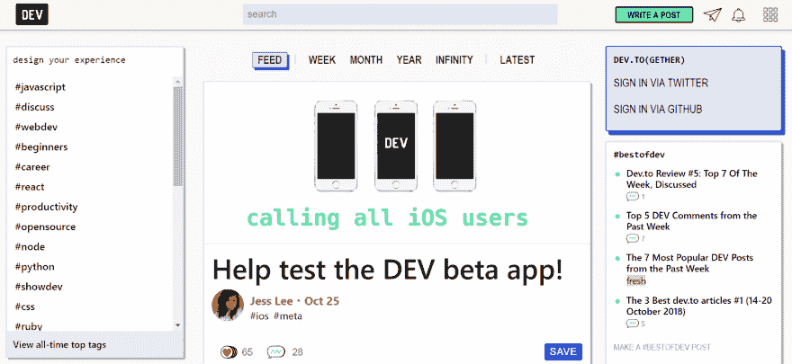

# 产品设计师应具备的 UX 品质

> 原文：<https://dev.to/isaactan/ux-qualities-to-look-for-in-a-product-designer-3247>

 **这篇[文章](https://medium.com/@supahands_techblog/ux-qualities-to-look-for-in-a-product-designer-622329d6394e)最初发布在我们公司网站上。 [Supahands](https://www.supahands.com) 是一个平台，帮助公司结合人类智能和技术支持的自动化来训练他们的人工智能。我们在东南亚拥有超过 2，000 名远程员工，与机器学习行业的客户合作，包括自动驾驶汽车和面部识别。**

***在 Supahands 中，我们经常看到产品设计是设计的不同部分的组合。因此，当谈到产品设计团队的招聘时，我们已经了解到，在设计专业知识的不同领域，有一些关键技能可以成为一名伟大的产品设计师。【T2***

> 用户体验又名 UX
> 名词
> 名词:用户体验；复数名词:用户体验
> 一个人使用网站或计算机应用程序等产品的总体体验，尤其是在使用起来有多容易或令人愉快方面。

由于近年来越来越多的科技公司，产品设计是一个相当新的关注领域。在职业生涯的早期，设计师只专注于设计的一个方面(如图形、UX、用户界面等)。)可以通过适当的软技能和经验转变为产品设计角色

在这篇文章中，我们将只关注产品设计师的 UX 品质。

* * *

# 设计师不仅仅是他们的作品集

公司在招聘团队中的产品设计职位时，经常会犯只看设计师作品的错误。但在查看了数百份投资组合和简历，并与不到四分之一通过第一轮筛选的人交谈后，我们了解到，对于一名优秀的设计师来说，不仅仅是漂亮的设计。

首先，它有助于快速理解良好的 UX 背景对产品设计师的重要性。好的 UX 设计可以为用户带来更吸引人、更个性化、更有意义的互动。它为最复杂的技术产品提供了便利和易用性。

随着企业设计更多创新和先进的方法来解决问题，优秀的 UX 对用户学习和采用新的做事方式至关重要。因此，如果用户不能无缝地亲身体验，即使是最惊人的工程努力也很容易被浪费掉。

许多文章谈到了当你开始筛选产品设计职位的候选人时需要注意的一般技能。但我们想把它分解成不同的设计学科，从强调我们在 Supahands 的招聘过程中学会的 3 项 UX 技能开始。

对于那些正在考虑或正在寻找产品设计师职位的人，我们还在最后增加了一个部分。

# 产品设计师应该具备的三个与 UX 相关的重要品质

**感同身受**
一个好的设计师需要能够设身处地为他人着想。经常会遇到 UX 的专业人士，他们很难将自己对自己设计的执着分离出来，去寻找功能可能更好的东西。

他们需要能够理解他们为之设计的用户，并将用户的需求放在他们自己的需求之前。对于一个优秀的产品设计师来说，通过研究、采访和分析来充分了解最终用户，并将他们所知道的转化为可行的设计是非常重要的。

第一次雇佣产品设计师的企业可能很容易被“设计师”这个术语误导，因为他们倾向于做出一个共同的假设，即好的设计仅仅意味着一个在美学上令人愉悦的设计。相反，最好的设计往往是实用多于美观。

以亚马逊这样的主要电子商务网站为例。它有 3 亿用户，而且还在增加。该网站的设计并不十分吸引眼球，但它确实为用户提供了流畅无缝的网上购物体验。

事实上，亚马逊在 UX 最明智的举措之一就是引入了一键式购买系统，使在线购物成为当时最简单快捷的方式。

 
*<small>亚马逊的一键功能让网上购物格外轻松</small>* 

多才多艺
如果你还没有一个现成的产品设计团队，这一点尤为重要。你最早雇佣的设计人员需要非常多才多艺，才华横溢。他们需要尽可能成为最好的多面手。

寻找这样的人，他能从产品的最早期阶段就想到产品，并继续思考她或他能不断创新设计和更多改进的方法。

为了做到这一点，产品设计师将需要能够理解产品的路线图策略，并展示他们如何以视觉形式传达其演变。

对于初创公司的产品设计师来说，从定义公司的品牌形象到设计商标或图标等品牌标识，不得不执行每一项与设计相关的任务并不罕见。

*<small>[cuberto](http://cuberto.com)拥有一个我们见过的最漂亮、最简单、最实用的网站</small>*

找到一个拥有多种技能，能够进行战略和艺术思考的人可能很难，但这绝对不是不可能的，花时间寻找合适的人是值得的。

产品设计不仅仅是在屏幕上画画或移动像素。理想的 UX 驱动的候选人不仅仅是设计，她或他还工程解决方案和制定商业战略。

有了数码产品，就不会有完美的用户体验这种东西了。这是因为数字化的本质和人们越来越多地接触不同类型的应用程序和平台意味着用户的偏好会随着时间的推移而不断变化。因此，人们普遍感到永远没有足够的时间来实施最终的 UX。

 
*<small>dev.to 有一个最好的 UX，它充分利用了空间，内容丰富，有吸引力，界面简单，便于新用户导航</small>*

一个熟悉产品是如何构建的，以及它如何对用户有价值的人，将能够设计出运行速度很快的东西，而不会牺牲交易的便利性。在这些限制下，他们仍然能够做出惊人的事情。

* * *

# 你想找一份产品设计师的工作吗？

经过数百名候选人的筛选，我们看到了最好和最差的申请。这里有一些关键的方法可以让你从最初的筛选到面试阶段脱颖而出。

准备一份精心设计的作品集
产品设计不仅仅是漂亮的图案、插图和颜色——尽管这也是一项需要掌握的重要技能。

你的作品集是你进入面试的最佳途径。一家餐馆不会雇佣一个没有尝过食物的厨师。同样，一家公司不先查看你的投资组合就雇佣你做产品设计师也是极不可能的。

看一下职位描述和招聘的公司。他们制造什么样的产品？展示一份精心设计的作品集，展示招聘者想要的东西。

即使你之前没有设计与招聘公司直接相关的东西的经验，也要用你的作品集来解释你之前工作的思考过程。无论是你为过去的设计所做的研究，还是展示证明你的设计可行的数据——都要超越美学，多想想功能。

研究，研究，研究
一旦你获得了面试的分数，不要停止研究你申请的公司。通过真正理解公司试图解决的问题，展现出你感同身受的一面。设身处地为用户或客户着想。

你必须能够展示你熟悉公司所处的行业，他们有什么不同，以及你的技能如何有助于实现他们的业务目标。

几乎在所有情况下，面试官的第一个问题都会是“你对公司了解多少？”。所以花点时间准备这个问题，从其他可能花了同样多时间准备面试的应聘者中脱颖而出。

* * *

# 产品设计和用户体验

从 UX 的角度理解产品设计是一个真正迷人的旅程。这可能是一个快节奏的角色，因为不同公司的用户、业务、设计趋势和工程能力的需求不断变化。

但是近年来，设计师的角色越来越受到重视。

公司现在认识到，UX 的设计师是用户采用他们试图创造的新技术的桥梁。

当前的 UX 设计师需要不断学习和提升自己的技能，才能脱颖而出，适应日益增多的机器在业务流程中的应用。因此，作为一名招聘人员，要寻找能和你一起进步的人。而且作为申请人，要有好奇心，不要停止学习。

* * *

*Want to be part of a company that’s making waves in the field of artificial intelligence and machine learning?*

我们正在寻找最独特的 UX 人才。点击此处查看所有职位空缺并立即提交您的申请。

*封面图片由我们才华横溢的产品设计师 [Baim Kamil](https://dribbble.com/baimhanifkamil) 拍摄

你认为我遗漏了你在产品设计师身上寻找的其他重要品质吗？下面评论让我知道！