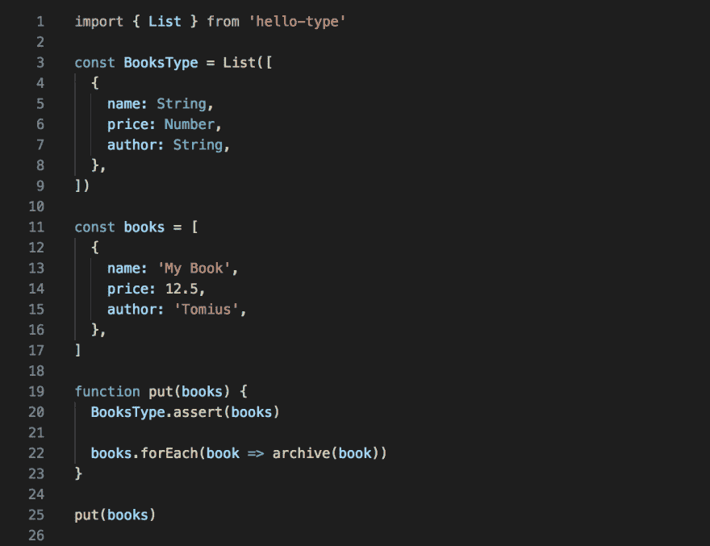
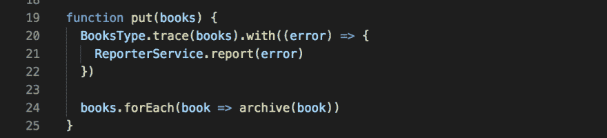
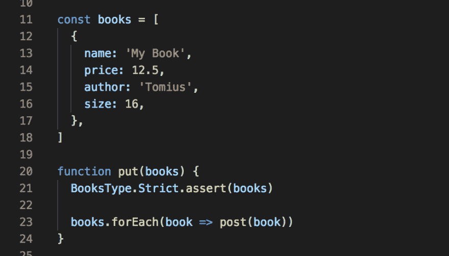

# 在运行时验证 javascript 数据类型？是的，你好型。

> 原文：<https://dev.to/frustigor/validate-javascript-data-type-in-runtime-yes-hello-type-27m>

**更新:我已经发布了 [tyshemo](https://github.com/tangshuang/tyshemo) 里面包含了数据类型系统，更具合理性。**

几天前，我开始学习 Typescript。当我遇到*接口*和*仿制药*的时候，我的头脑突然混乱了，“这是什么？那是什么？”。作为一个前端保守的弱类型追随者，我不想写这么多与我的商业逻辑无关的代码。后来，我研究了 facebook 倡导的心流，我感到很沮丧，因为这将是趋势。

然而，它们使我们的项目代码更加复杂，但不能解决运行时的数据类型检查。作为一个小 jser，我总是被来自 API 的数据搞得崩溃。" TypeError:未定义的 xxx 属性"，" type error:null 的 xxx 属性"，" xxx 不是函数"，" xxx 没有' slice '方法"...

有没有一种方法可以轻松验证数据类型和对象结构？最后我写了一个库: [HelloType](https://github.com/tangshuang/hello-type) 。

## 从 API 数据结构中幸存

在使用来自 API 的数据之前，通过 HelloType 验证其结构。首先，用 HelloType 的 api 方法包装一个结构，然后使用实例断言:

[T2】](https://res.cloudinary.com/practicaldev/image/fetch/s--fOhrHKAO--/c_limit%2Cf_auto%2Cfl_progressive%2Cq_auto%2Cw_880/https://thepracticaldev.s3.amazonaws.com/i/8fdhm2dcclxnutl4hi6j.png)

如果`put`的参数与 BooksType 不匹配，将会抛出错误。在函数中，在`assert`之后，你不需要担心任何数据类型和结构，只要按照你想要的使用数据。

## 跟踪错误而不中断程序

如果只想收集错误信息，不想中断程序进程，使用`trace`方法:

[T2】](https://res.cloudinary.com/practicaldev/image/fetch/s--IwvLfZ2V--/c_limit%2Cf_auto%2Cfl_progressive%2Cq_auto%2Cw_880/https://thepracticaldev.s3.amazonaws.com/i/hoq1yn5n76xoqw4hoc7w.png)

它不会对渲染性能产生任何影响，因为它是异步运行的。

## 严格模式

由于发送到服务器的数据应该必须且应该仅具有某些属性，因此使用严格模式检查数据结构是否正确:

[T2】](https://res.cloudinary.com/practicaldev/image/fetch/s--x4iUwUP1--/c_limit%2Cf_auto%2Cfl_progressive%2Cq_auto%2Cw_880/https://thepracticaldev.s3.amazonaws.com/i/jptizgx0ya7x9m5ctxsn.png)

由于`books`的第一项有一个附加属性`size`，并且使用了严格模式，断言会中断程序。

还有更多功能，查看我的 [github](https://github.com/tangshuang/hello-type) 了解你的兴趣。