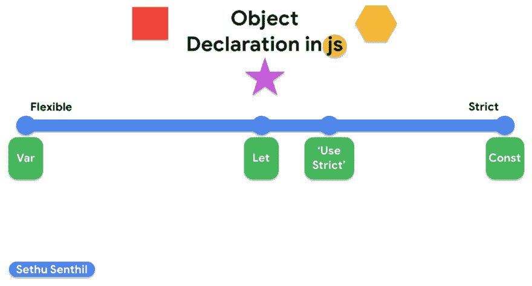

# Var vs Let vs Const

> 原文：<https://dev.to/sethusenthil/var-vs-let-vs-const-1cgc>

# Var(变量)

Var 从一开始就伴随着我们。你可能会想，“这太基础了”，但是我们必须完全理解 var 的工作**和幕后发生的事情，以便理解 Const & Let 的用例。**

## 范围

与 js 中声明变量的其他方式的主要区别在于，变量有一个函数作用域。例如:

`(function(){ console.log(i); //Var's value is undefined, this means the var is declared (but how?) if("5"==="5"){ var i = 100; } console.log(i); //Var's value is 100, but i'm out of the if statement! })();`

为什么密码没有破解？因为 js 有一个属性叫“吊装”。它试图将任何类型的声明(包括名为的**函数)尽可能放在最顶层的作用域中。因为变量使用函数作用域，所以将它放在函数的第一行。请记住，Var 只是被声明，而不是被赋值。这就是为什么我们得到的是字符串“未定义”而不是“错误:变量 I 未定义”。下面是一个幕后到底发生了什么的例子:** 

`(function(){ var i; //Var is declared but the value is not defined, so it automatically inherits the string 'undefined' console.log(i); if("5"==="5"){ i = 100; //^ its changing var i's value from 'undefined' to the integer 100. } console.log(i); //Var's value is 100 like expected })();`
Note: The variable's value can be accessed outside the if statement.

# 让

既然我们了解了 var，我们现在可以深入了解 let。

## 范围

这是个转折。所有 let 声明的作用域是这样一个事实，即 let 语句使用块作用域，类似于其他 OOPS 编程语言，如 Java 或 js 中的“use strict”。块作用域意味着它只能在被声明为块的对象中使用。让我们(一语双关)用 let:
代替我们的旧例子

`(function(){ console.log(i); //Error: i not defined if("5"==="5"){ console.log(i); //Error: i not defined let i = 100; console.log(i); //Should print '100' (delete the first two logs) } console.log(i);//Error: i not defined })();`
As runkit suggests, i can only be accessed in the if statement after the line of the declaration. Hoisting has no power when we declare statements with let.

# 常数

Const 是一个非常容易理解的，因为它本质上和 var & let 是一样的东西(不是全部)。

## 范围

Const 就像 let 一样使用块范围，所以除了防止变量重新声明的能力之外，它还拥有 let 的所有属性。我们来看几个例子:

`(function(){ const message ="what up"; console.log(message); message = "bye"; //Error: Message is already declared console.log(message); })();`
As you can see above, there are a few exceptions. If you have declared a string or a number the value can't be changed either. But when you are declaring as an object, it gets a bit interesting.
`(function(){ var message = {body:"what up", title:"rcs"}; //Runkit is being weird please fix the obvious syntax error //If you know why this is happening please comment below! console.log(message); message.body = "bye"; message.send = true; console.log(message); message = 100; //Error: message is already declared })();`
Message's properties can be modified, or added but message cannot be redeclared into a integer with a value of 100.

下面是我做的一个小小的图表:
