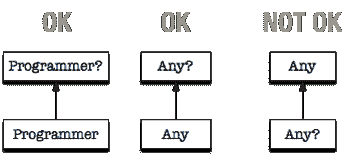
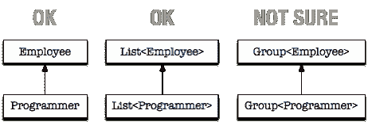
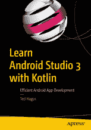

# Kotlin 仿制药的差异

> 原文：<https://dev.to/tedhagos/variance-in-kotlin-generics-4j21>

我们需要回顾一些 OOP 基础知识，为方差的讨论做准备。希望我们能唤起你的记忆，记住一些面向对象编程的基本原则。

OOP 对开发者来说是福音，因为它，我们可以写这样的代码

```
val a:Int =  1
val b:Number = a

println("b:$b is of type ${b.javaClass.name}") 
```

Enter fullscreen mode Exit fullscreen mode

我们也可以写这样的函数

```
foo(1)        // (1)
foo(100F)     // (2)
foo(120.0)      // (3)

fun foo(arg:Number) { // (4)
  println(arg)
} 
```

Enter fullscreen mode Exit fullscreen mode

(1)*Int*literal
(2)*Float*literal
(3)*Double*literal
(4)function*Foo*期望一个*数*，它可以取*Int，Float*和*Double*。没问题

由于*利斯科夫替代原理* (LSP)，这些代码是可能的。这是 OOP 中最重要的部分之一——在需要父类型的地方，你可以用子类型来代替它。我们使用更一般化的类型(如清单 7-9 中的 Number)的原因是，将来如果需要，我们可以编写一个子类型的实现，并插入到现有的工作代码中。这是开放封闭原则的精髓(该原则规定一个类必须对扩展开放，但对修改关闭)。

**NOTE** The *Liskov Substitution Principle* and *Open Closed Principle* are part of the SOLID design principles. It’s one of the more popular sets of design principles in OOP. SOLID stands for (S) Single Responsibility (O) Open Closed (L) Liskov Substitution (I) Interface Segregation and (D) Dependency Inversion

让我们看另一个例子，参见清单 1

*清单 1。员工、程序员和测试人员*

```
open class Employee(val name:String) {
  override fun toString(): String {
    return name
  }
}

class Programmer(name:String) : Employee(name) {}
class Tester(name:String) : Employee(name) {}

fun main(args: Array<String>) {
  val employee_1 :Employee = Programmer("Ted")   // (1)
  val employee_2 :Employee = Tester("Steph")     // (2)

  println(employee_1)
  println(employee_2)
} 
```

Enter fullscreen mode Exit fullscreen mode

(1) employee_1 的类型是 employee，我们给它分配一个程序员对象。这没关系。程序员是雇员的一个子类

(2)这里同样的事情，类型测试者是雇员的一个子类型，所以分配应该没问题

毫无疑问，利斯科夫原理仍然在起作用。即使您将程序员和雇员放在一个列表中，类型关系也会保留。

*清单 2。列表*
中的员工和程序员

```
val list_1: List<Programmer> = listOf(Programmer("James"))
val list_2: List<Employee> = list_1 
```

Enter fullscreen mode Exit fullscreen mode

*清单 3。集团员工和程序员*

```
class Group<T>
val a:Group<Employee> = Group<Programmer>() 
```

Enter fullscreen mode Exit fullscreen mode

这是泛型最棘手的部分之一。目前的清单 3 是行不通的。即使我们知道*程序员*是*雇员*的子类型，并且我们所做的是类型安全的，编译器也不会让我们通过，因为上面代码中的第二条语句有问题。

当你使用泛型时，请记住默认情况下 Group，`Group<Programmer>`和`Group<Tester>`没有任何类型关系——即使我们知道 Tester 和 Programmer 是 Employee 的子类型。默认情况下，类组中的类型参数是不变的。为了让第二条语句(清单 3 中)起作用，`Group<T>`必须是协变的。我们将在清单 4 中解决。

*清单 4。员工、程序员、测试人员和团队*

```
class Group<out T>   // (1) 

open class Employee(val name:String) {
  override fun toString(): String {
    return name
  }
}
class Programmer(name:String) : Employee(name) {}
class Tester(name:String) : Employee(name) {}

fun main(args: Array<String>) {
  val a:Group<Employee> = Group<Programmer>()  // (2)
} 
```

Enter fullscreen mode Exit fullscreen mode

(1)当您将 out 关键字放在类型参数之前时，会使类型参数协变

(2)这段代码有效是因为，由于 out 关键字，Group 现在是 Group 的一个子类型

从这些例子中，我们现在可以归纳出，如果类型 Programmer 是 Employee 的子类型，Group 是协变的，那么`Group<Programmer>`就是`Group<Employee>`的子类型。此外，我们可以概括出，如果对于给定类型 Employee 和 Programmer，`Group<Programmer>`不是`Group<Employee>`的子类型，那么泛型类(如 Group)在类型参数上是不变的。

现在我们已经处理了*不变量*和*协变量*。我们需要处理的最后一个术语是*逆变*。如果`Group<T>`的类型参数是逆变的，对于相同的给定类型 Employee 和 Programmer，那么我们可以说`Group<Employee>`是`Group<Programmer>`的一个子类型——这与协变正好相反。

*清单 5。使用 in 关键字进行逆变*

```
class Group<in T>  // (2)

open class Employee(val name:String) {
  override fun toString(): String {
    return name
  }
}
class Programmer(name:String) : Employee(name) {}
class Tester(name:String) : Employee(name) {}

fun main(args: Array<String>) {
  val a:Group<Programmer> = Group<Employee>()   // (2)
} 
```

Enter fullscreen mode Exit fullscreen mode

(1)in 关键字使类型参数逆变，这意味着；

(2)类型组现在是组的子类型

## 子类 vs 子类

好吧。我怀疑你在过去 10 分钟里读到的东西让你觉得很苦涩。程序员是雇员的子类型，列表是列表的子类型，而组不是`Group<Employee>?`的子类型，这是怎么发生的呢？让我们通过回到类、类型、子类和子类型的概念来回答这个问题。

我们认为类在某种程度上是类型的同义词，一般来说是这样的——至少对于非泛型类来说是这样，在大多数情况下也是这样。我们知道一个类至少有一种类型，它与类本身的类型相同。回到你第一次学习 Java 类的时候，你的老师、导师或者可能是你最喜欢的作者一定已经定义了一个对象的类型，就像这样——“它是它所有公共行为的总和，或者称为对象的方法或契约”——或者类似的东西；我们姑且说它是对象拥有的行为集合。

回到“一个类至少有一种类型”，好吧，它可以有更多。请看图 1。

[](https://res.cloudinary.com/practicaldev/image/fetch/s--2BnvqNlg--/c_limit%2Cf_auto%2Cfl_progressive%2Cq_auto%2Cw_880/https://thepracticaldev.s3.amazonaws.com/i/rlbykhvskais66q84mox.png) 
*图 1*

从图 1 中，我们可以说

*   Any 位于类图的顶部——Any 类相当于 java.lang.Object
*   雇员是 Any 的子类。Employee 有两种类型，一种是从 Any 继承的，另一种是它自己——因为 Employee 类可以定义自己的一组行为(方法),所以这也算作一种类型
*   程序员是 Employee 的子类，Employee 是 Any 的子类，这意味着程序员有 3 种类型。一个来自 Any，另一个来自 Employee，还有一个来自程序员类本身
*   Number 是 Any 的子类型，但它也实现 Comparable 接口。因此，Number 有三种类型，一种来自 Any，另一种来自自身，还有一种来自可比接口。我们可以说，数字是 Any 的一个子类型，也是 Comparable 的一个子类型——无论你期望 Comparable 做什么，数字都能做，Any 能做什么，数字也能做什么。这是基本的面向对象编程
*   字符串类有 4 种类型。一个来自 Any，另一个来自 Comparable，另一个来自 CharSequence，最后一个来自自己的类

根据上面的陈述和图表，可以互换使用子类和子类型。两者没有太大区别。当我们开始考虑可空类型时，它们的区别将变得明显。

可空类型就是一个子类不同于子类型的例子。参见图 2。

[](https://res.cloudinary.com/practicaldev/image/fetch/s--psKPeXXh--/c_limit%2Cf_auto%2Cfl_progressive%2Cq_auto%2Cw_880/https://thepracticaldev.s3.amazonaws.com/i/c8zhcozasn5h26y1wu53.png) 
*图二*

当你在一个类型的名字后面加上一个问号时，它就变成了该类型的可空版本。在 Kotlin 中，我们可以从同一个类中创建两种类型——可空版本和不可空版本。我们真的不能说*程序员*是*程序员的子类？*因为*程序员*只有一个类定义，而*程序员*(不可空版本)是程序员的子类型？(可空的那个)。同样， *Any* 是 *Any 的子类型？*但是*有吗？*不是 *Any* 的子类型——反方向不成立。

写这个
没事

```
var j:Programmer? = Programmer("Ted") // assign non-null to nullable Programmer
j = null. // then we assign a null to j 
```

Enter fullscreen mode Exit fullscreen mode

但是写这个
就不行了

```
var i:Programmer = j // assign j (which is null) to non-nullable Programmer 
```

Enter fullscreen mode Exit fullscreen mode

现在我们来看泛型。图 3 应该有助于我们阐明我们需要理解的下一组概念。

[](https://res.cloudinary.com/practicaldev/image/fetch/s--u-9wKQia--/c_limit%2Cf_auto%2Cfl_progressive%2Cq_auto%2Cw_880/https://thepracticaldev.s3.amazonaws.com/i/kn8ueiizfce6h14ubqji.png) 
*图 3*

我们知道第一种关系，雇员是程序员的超类型。我们还知道`List<Employee>`将接受`List<Programmer>`，我们在清单 2 中测试了这一点——您可能不太清楚为什么它会工作，所以，在我们处理完第三组盒子后，我将回到这一点。

现在，给定代码

```
class Group<T>
val a:Group<Employee> = Group<Programmer>() // not sure 
```

Enter fullscreen mode Exit fullscreen mode

为什么我们不能可靠地回答“是不是`Group<Employee>`的超类型`Group<Programmer>`”这个问题。

这是因为，虽然`Group`是一个类，但是`Group<Employee>`不是，并且推而广之，`Group<Programmer>`不是`Group<Employee>`的子类——如果你现在正在考虑`List<Employee>`和`List<Programmer>`，请停止。我说过我会回到那个话题。先用`Group<Employee>`和`Group<Programmer>`坚持。表 1 应该有助于我们总结其中的一些内容。

[T2】](https://res.cloudinary.com/practicaldev/image/fetch/s--L89g1Vn7--/c_limit%2Cf_auto%2Cfl_progressive%2Cq_auto%2Cw_880/https://thepracticaldev.s3.amazonaws.com/i/xt5aopj9yb80zlh6vqyx.png)

现在我们可以确定`Group<Employee>`与`Group<Programmer>`没有类型关系，即使类 Employee 与程序员有类型关系。默认情况下，`Group<T>`中的类型参数是不变的(没有类型关系)。为了改变的方差，你需要使用 out(使其协变)或 In(使其逆变)关键字。

所以，如果我们想让`Group<Programmer>`成为`Group<Employee>`的一个子类型，我们需要像这样写*组*类

```
class Group<out T>
val a:Group<Employee> = Group<Programmer>() // this is ok now 
```

Enter fullscreen mode Exit fullscreen mode

现在我们可以绕回`List<Employee>`和`List<Programmer>`的问题。为什么和如何工作。为什么写这个
没事

```
var m:List<Employee> = listOf(Programmer("Ted")) 
```

Enter fullscreen mode Exit fullscreen mode

简单的答案在于 List 接口的定义，为了方便你，我复制了清单 6 中 List 接口的源代码；我把所有的评论都删了。

*清单 6，清单界面(节选)*

```
public interface List<out E> : Collection<E> {  // (1)
    override val size: Int
    override fun isEmpty(): Boolean
    override fun contains(element: @UnsafeVariance E): Boolean
    override fun iterator(): Iterator<E>
    override fun containsAll(elements: Collection<@UnsafeVariance E>): Boolean
    public operator fun get(index: Int): E
    public fun indexOf(element: @UnsafeVariance E): Int
    public fun lastIndexOf(element: @UnsafeVariance E): Int
    public fun listIterator(): ListIterator<E>
    public fun listIterator(index: Int): ListIterator<E>
    public fun subList(fromIndex: Int, toIndex: Int): List<E>
} 
```

Enter fullscreen mode Exit fullscreen mode

(1)类型参数是协变的。List 在类型参数 E 之前使用 out 关键字

之所以把`List<Programmer>`赋给`List<Employee>`没问题，是因为`List<E>`上的类型参数是协变的。因此，如果类型*雇员*是*程序员*的超类型，并且`List<E>`是协变的，那么`List<Programmer>`是`List<Employee>`的子类型。

所以，现在我们对类型和子类型有了更好的理解，就像在昆汀·塔伦蒂诺的电影中一样，我希望你回到文章的开头，再读一遍。我希望到那时会更有意义。

* * *

(不要脸塞)本文摘自[用 Kotlin](https://www.amazon.com/Learn-Android-Studio-Kotlin-Development/dp/1484239067/ref=sr_1_1?ie=UTF8&qid=1543408646&sr=8-1&keywords=learn+android+studio+3+kotlin) 学习 Android Studio 3 第七章。

[T2】](https://res.cloudinary.com/practicaldev/image/fetch/s--JX6fE5Rz--/c_limit%2Cf_auto%2Cfl_progressive%2Cq_auto%2Cw_880/https://thepracticaldev.s3.amazonaws.com/i/c9fg6pmd1uj71y498ixl.jpg)