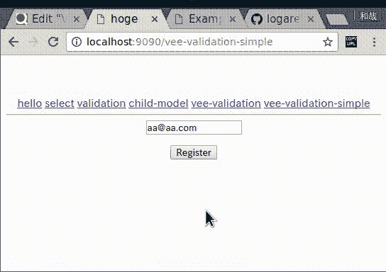
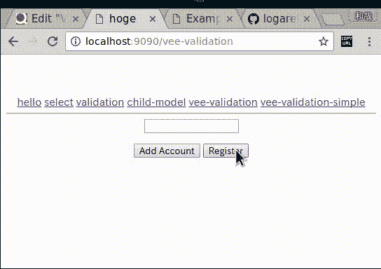

# VeeValidate 对 Vue.js 前端验证很有用

> 原文：<https://dev.to/acro5piano/veevalidate-is-useful-for-vuejs-frontend-validation-40be>

我找到了[一篇关于 Validatorjs(日语)](http://qiita.com/hirohero/items/e51ff5a98a0eea425d44)的文章，并试图在我当前的项目中使用它，但是失败了。

原因是我必须创建复杂的前端来实现以下需求:

*   给定 1:n 数据结构，用户可以动态添加元素(例如，多个电子邮件)
*   加载页面后不运行验证
    *   用户开始输入后，只验证用户正在交互的元素
*   提交表单前运行验证。
    *   更改元素的样式
*   在元素旁边显示一条错误消息**，比如“需要电子邮件地址”**
*   验证规则应该在一个地方，在输入和提交之间使用相同的逻辑。

然后我找到了`VeeValidate`。

(本文原创于 2017 年 4 月。在我的记忆中，当时 VeeValidate 只有不到 1000 颗星，但现在超过了 4000 颗星。它正迅速流行起来。)

[https://github.com/logaretm/vee-validate](https://github.com/logaretm/vee-validate)

我想介绍这个伟大的图书馆。

# 简单验证

假设有一个电子邮件表单，我们希望在以下时间运行验证:

*   在用户输入之后
*   提交表单之前

[T2】](https://res.cloudinary.com/practicaldev/image/fetch/s--82HCjLBI--/c_limit%2Cf_auto%2Cfl_progressive%2Cq_66%2Cw_880/https://qiita-image-store.s3.amazonaws.com/0/103885/82eaf966-31b9-2bf5-a2d0-e61d86406074.gif)

代码应该是这样的:

```
 // VeeValidationSimple.vue

<template>
  <div>
    <input
      name="email"
      v-model="email"
      v-validate="'required|email'"
      :class="{'has-error': errors.has('email')}"
    >
    <p v-if="errors.has('email')" class="alert-danger">
      {{ errors.first('email') }}
    </p>

    <button @click="register">Register</button>
  </div>
</template>

<script>
import Vue from 'vue'
import VeeValidate from 'vee-validate'

Vue.use(VeeValidate)

export default {
  data () {
    return {
      email: ''
    }
  },
  methods: {
    register () {
      this.$validator.validateAll().then(() => {
        alert('Hello, ' + this.email)
      }).catch(() => {
        alert(this.errors.all())
      })
    }
  }
}
</script>

<style>
.alert-danger {
  color: red;
}
.has-error {
  border-color: red;
}
</style> 
```

Enter fullscreen mode Exit fullscreen mode

Promise 使代码可读。

我个人更喜欢`<input>`元素有验证规则，因为验证是一个 UI 逻辑。

# 多元素验证

多元素验证也比我预期要容易。

假设用户可以像这样添加其他电子邮件:

[T2】](https://res.cloudinary.com/practicaldev/image/fetch/s--9AgCehxp--/c_limit%2Cf_auto%2Cfl_progressive%2Cq_66%2Cw_880/https://qiita-image-store.s3.amazonaws.com/0/103885/64ed17cc-96bc-29ca-59f1-1322a19a12f8.gif)

VeeValidate 通过`name`属性识别元素，所以我们为每个元素设置唯一的`name`属性。只要迭代次数就可以了。

```
 // VeeValidationMultiple.vue

<template>
  <div>
    <!-- set unique name -->
    <div v-for="(account, i) in accounts">
      <input
        :name="'email' + i"
        v-model="account.email"
        v-validate="'required|email'"
        :class="{'has-error': errors.has('email' + i)}"
      >
      <p v-if="errors.has('email' + i)" class="alert-danger">
        {{ errors.first('email' + i) }}
      </p>
    </div>

    <p>
      <button @click="addAccount">Add Account</button>
      <button @click="register">Register</button>
    </p>
  </div>
</template>

<script>
import Vue from 'vue'
import VeeValidate from 'vee-validate'

Vue.use(VeeValidate)

export default {
  data () {
    return {
      // v-for need Object array
      accounts: [{
        email: '',
      }],
    }
  },
  methods: {
    addAccount () {
      this.accounts.push({
        email: '',
      })
    },
    register () {
      this.$validator.validateAll().then(() => {
        alert('Hello, ' + this.accounts)
      }).catch(() => {
        alert(this.errors.all())
        return false
      })
    }
  },
}
</script>

<style>
.alert-danger {
  color: red;
}
.has-error {
  border-color: red;
}
</style> 
```

Enter fullscreen mode Exit fullscreen mode

对用户交互添加的元素进行验证效果很好。

# 参

VeeValidate 有很棒的文档。我们可以很容易地找到验证规则。

*   [https://m . dot dev . co/form-validation-using-vue-js-2-35 Abd 6b 18 C5 d](https://m.dotdev.co/form-validation-using-vue-js-2-35abd6b18c5d)
*   [http://vee-validate.logaretm.com/index.html](http://vee-validate.logaretm.com/index.html)

下面是本文使用的源代码。

[https://github . com/acro 5 piano/vue-CLI-test/blob/master/src/components/vee validation . vue](https://github.com/acro5piano/vue-cli-test/blob/master/src/components/VeeValidation.vue)