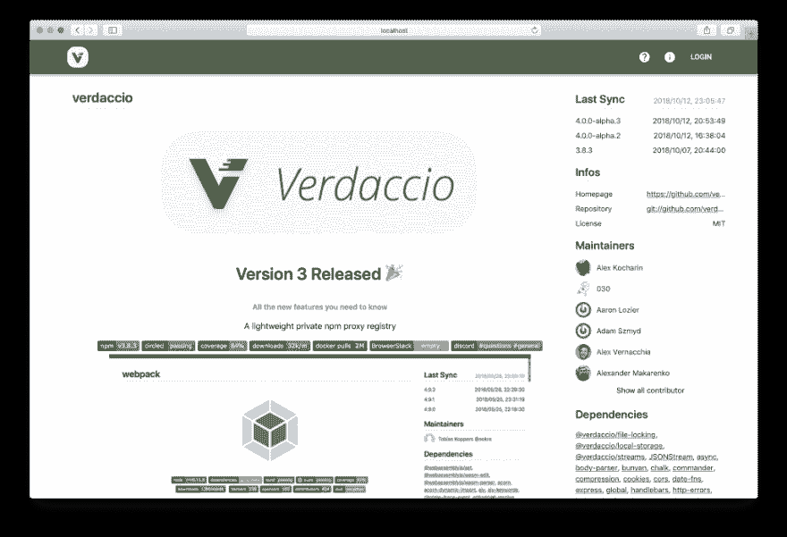
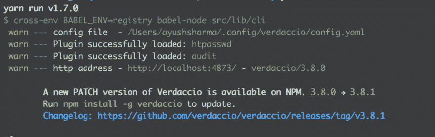
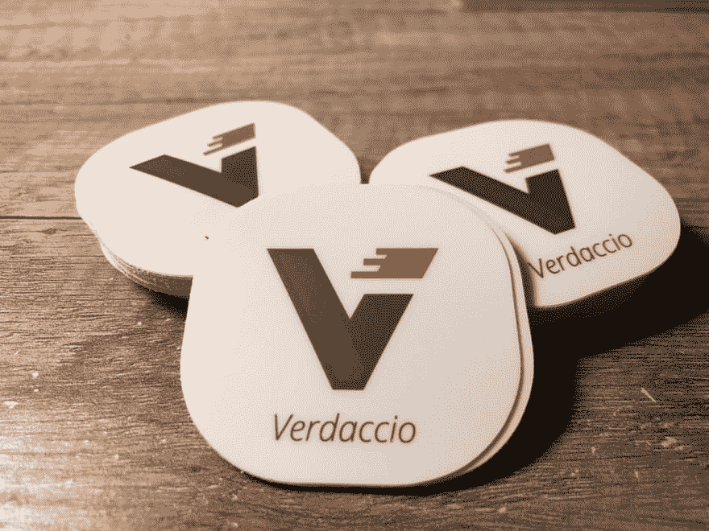

# Verdaccio 4 alpha 版本

> 原文：<https://dev.to/verdaccio/verdaccio-4-alpha-release-19dl>

由于几个月前， **[verdaccio@4.0.0](mailto:verdaccio@4.0.0)** 正在开发中，我们想给你第一次更新当前准备测试和即将推出的功能列表。

<figure>[](https://res.cloudinary.com/practicaldev/image/fetch/s--PTKA2uSx--/c_limit%2Cf_auto%2Cfl_progressive%2Cq_auto%2Cw_880/https://cdn-images-1.medium.com/max/1024/1%2AGK9U1wZmB0JUN2XGhu5LjA.png) 

<figcaption>基于素材的 Verdaccio 4 UI-UI</figcaption>

</figure>

### Verdaccio 4 Alpha 有什么新功能？🐣

#### 代币🛡

提高安全性是我们的主要目标之一，我们希望在对用户来说最重要的领域之一进行改进，**令牌**。目前，令牌验证是基于对每个请求解包令牌，并询问插件作者是否被授权。如果身份验证的提供者不能很好地处理大量的请求或者完全没有必要，这可能有点令人不知所措。

为此，我们发布了一种基于 JSON Web Token (JWT) 标准的生成令牌的新方法。此功能不会取代当前的实现，并将保留为可选功能。在 API 上启用 JWT 非常简单，如下例所示。

```
security:
 api:
 jwt:
 sign:
 expiresIn: 60d
 notBefore: 1
 web:
 sign:
 expiresIn: 7d 
```

我们将允许根据需求定制 JWT，例如，**允许过期令牌**。*我们将在以后的文章*中深入探讨新的 JWT 系统。

#### 修改密码🔐

也许这是我们论坛中被问得最多的问题，而一个如此微不足道的行为现在可能已经不是问题了。我们听取了机构群体的意见，并在这一重要功能上投入了时间。

```
npm profile set password -ddd --registry http://localhost:4873/ 
```

我们允许使用 npm 配置文件通过 CLI 更改密码。目前这种支持仅限于 htpasswd [内置插件](https://github.com/verdaccio/verdaccio-htpasswd)，但是在某个时候插件开发者会提前获得这种支持。

#### 保持更新🛰

我们希望帮助您保持更新，因此我们发布了一个 CLI 通知，显示可用的最新稳定版本。

[T2】](https://res.cloudinary.com/practicaldev/image/fetch/s--1KGoH4Jx--/c_limit%2Cf_auto%2Cfl_progressive%2Cq_auto%2Cw_880/https://cdn-images-1.medium.com/max/1024/1%2AYw0NdQlZgm46s5cAgew1VQ.png)

#### 新界面💅🏻

我们意识到我们的 UI 一直很简单，但是我们决定是时候对它进行扩展以添加新的功能了。出于这个原因，我们计划迁移到一个新的 UI 工具包来帮助 ups 实现这个目标， **Material-UI** 。

作为第一步，我们迁移了当前的 UI，改进了标题。但这还不是全部，我们在下一个 alpha 版本中还有更大的计划，例如:

*   从用户界面更改密码
*   i18n
*   详细信息页面的改进

我们欢迎新的想法，在这个开发阶段，请随时提出建议或分享您的想法。

#### 码头工人🐳

我们减小了映像的大小，并遵循最佳实践为环境变量添加了一个名称空间 VERDACCIO_XXX_XXX。为了我们的流行形象，我们还计划了许多其他的新东西，到今天为止，我们已经有了将近 250 万的点击量。

#### 未来🔮

我很乐意分享我们的路线图，无论你是否有兴趣知道我们的待办事项列表中有什么，也无论你是否邀请你在我们的任何频道中贡献或发表你的想法，我们都希望听到反馈。

[维尔达奇奥/维尔达奇奥](https://github.com/verdaccio/verdaccio/projects/10)

### 如何安装

```
npm install -g verdaccio@next 
```

或者使用 Docker

```
docker pull verdaccio/verdaccio:4.x-next 
```

⚠️We 强烈建议不要使用 alpha 版本🚧在生产中，但是如果你愿意测试，**总是备份你的存储和配置文件**。在任何情况下，我们都非常小心我们的部署，并且总是高度可靠，但是，我们毕竟是人。

然而，如果你正在使用 Verdaccio 3，有一些小的突破性变化你应该记住，特别是对于那些使用 Docker 的环境变量，[所有细节在这里](https://github.com/verdaccio/verdaccio/pull/924)。

### 贡献与社区🌍

Verdaccio 是一个开源项目，但我们的目标也是成为一个不错的社区，我想向你们介绍**一粒一粒地制作这个惊人项目的团队**。

轻量级私有 npm 代理注册表

我们感谢所有贡献者，无论是通过 GitHub 还是翻译，**任何贡献对我们来说都是金子。**

### 捐款👍🏻

我想提醒我们的读者，还有其他方式来为这个项目做贡献**成为支持者**。此外，所有的贡献者都是志愿者，没有人在这个项目上全职工作，但我们知道它越来越大，值得一些推广。

[verdaccio-Open collection](https://opencollective.com/verdaccio)

对于那些已经支持和赞助，非常感谢👏👏👏。

> 胡安皮卡多(胡)[@ jotadeveloper](https://dev.to/jotadeveloper)看看我的邮箱里刚刚有什么🔥🔥 ... [@verdaccio_npm](https://twitter.com/verdaccio_npm) ..👌🏼我爱他们[#贴纸](https://twitter.com/hashtag/stickers)[# nodejs](https://twitter.com/hashtag/nodejs)[# NPM](https://twitter.com/hashtag/npm)2018 年 9 月 11 日下午 17:31[](https://twitter.com/intent/tweet?in_reply_to=1039567122144354305)[](https://twitter.com/intent/retweet?tweet_id=1039567122144354305)2[](https://twitter.com/intent/like?tweet_id=1039567122144354305)6

如果您有机会见到我们的任何团队成员，请随意索要贴纸(希望他们会带一些)，我们的预算主要用于推广，您可以帮助我们传播声音，提供您的开始，或者只是向您的同事推荐 Verdaccio 有多棒。

### 包装完毕👋🏼

如果你住在维也纳(奥地利)附近，**我们将于明年初(2019 年 1 月)在 ViennaJS meetup** 举办一场演讲，如果你想了解这个项目的更多信息，请随时加入我们。

[维也纳 2019 年 1 月-聚会-维也纳每月聚会](https://viennajs.org/en/meetup/2019-01)

未来的核心团队会议将于 11 月 29 日至 30 日在**柏林**举行，我们将参加[柏林](https://reactday.berlin/)React Day，如果您想与我们中的任何人聊天，请随时联系我们。

* * *