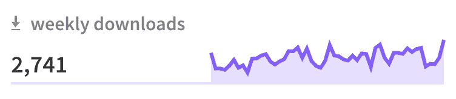
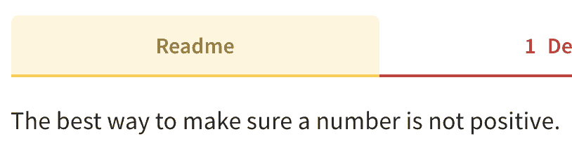
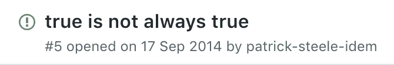

# 非常迷人的 NPM 套餐

> 原文：<https://dev.to/ravernkoh/very-fascinating-npm-packages-7ib>

最近，我在浏览 NPM(什么？)当我偶然发现一些非常有趣和迷人的包时。当然，我把最有趣的留到了最后😬。

# [`is-positive`T4】](https://www.npmjs.com/package/is-positive)

正是这个包让我开始深入研究 NPM 的 683162 个包(在我发表这篇文章的时候可能更多)。

事实证明，这个包确实返回了参数是否为正。

```
const isPositive = require('is-positive');

isPositive(1);
//=> true 
```

Enter fullscreen mode Exit fullscreen mode

**这就是它所做的一切**。我思考了这个包可能的用例，因为显然有很多。

[T2】](https://res.cloudinary.com/practicaldev/image/fetch/s--6jFZvIfK--/c_limit%2Cf_auto%2Cfl_progressive%2Cq_auto%2Cw_880/https://thepracticaldev.s3.amazonaws.com/i/786078hzuu1ad36apz5t.png)

在浏览 NPM 提供的`Dependents`部分时，我发现了另一颗隐藏的宝石(共有 4 颗)。

# [`is-not-positive`T4】](https://www.npmjs.com/package/is-not-positive)

这个包只是做了与`is-positive`完全相反的事情。它的描述非常贴切。

[T2】](https://res.cloudinary.com/practicaldev/image/fetch/s--igYRwfwc--/c_limit%2Cf_auto%2Cfl_progressive%2Cq_auto%2Cw_880/https://thepracticaldev.s3.amazonaws.com/i/0workjjji0alqwwsl7vl.png)

# [`is-negative`T4】](https://www.npmjs.com/package/is-negative)

这是 JavaScript，非正可能并不意味着负，所以必须创建一个新的包来检查负。

这个软件包的负面性甚至通过它的每周下载量表现得很明显，下载量远低于它更受欢迎的同类软件。

[T2】](https://res.cloudinary.com/practicaldev/image/fetch/s--5BfahkEC--/c_limit%2Cf_auto%2Cfl_progressive%2Cq_auto%2Cw_880/https://thepracticaldev.s3.amazonaws.com/i/ssshl75zswiz24udxvg2.png)

# [`true`T4】](https://www.npmjs.com/package/true)

这就是乐趣的开始。在输入一些其他搜索查询，如“`is-wrong`”和“`woah`”后，我偶然发现了这个。原来这其实是 Unix 实用程序`true`的一个端口。

与所有 Unix 实用程序一样，它的用法很容易掌握。

```
var t = require('./true')
var myTrueValue = t();

console.log(myTrueValue === true); // Logs 'true' 
```

Enter fullscreen mode Exit fullscreen mode

然而，我觉得这个包由于使用了`var`，看起来比其他的要模糊一些。因此，我决定看看 GitHub 上的一些公开问题。*你不会相信接下来发生了什么。*

[T2】](https://res.cloudinary.com/practicaldev/image/fetch/s--cPS-gq2h--/c_limit%2Cf_auto%2Cfl_progressive%2Cq_auto%2Cw_880/https://thepracticaldev.s3.amazonaws.com/i/0xt3elkuoy3ve3yfjo95.png)

我觉得被背叛了。

事实证明，代码中有一个严重的漏洞，是由帕特里克·斯蒂尔·艾姆发现的，他花了几个小时追踪这个问题。

原来另一个库包含了下面的代码，这导致了`true`返回`false`。

```
require.cache[require.resolve('true')].exports = function() {
    return false;
}; 
```

Enter fullscreen mode Exit fullscreen mode

幸运的是，他想出了一个非常快速的方法来解决这个问题。

```
setInterval(function() {
    if (require('true')() !== true) {
        // Fix it!
        require.cache[require.resolve('true')].exports = function() {
            return true;
        };
    }
}, 10); 
```

Enter fullscreen mode Exit fullscreen mode

# 结论

总的来说，(重新)发现所有这些精彩的包对我来说是一次非常有益的经历。我可能再也不会这么做了。