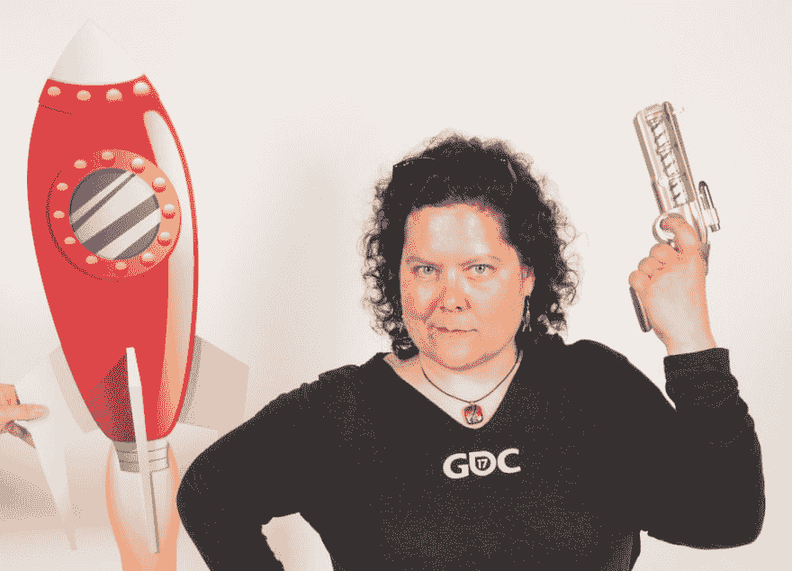

# Vicky (VM) Brasseur 谈开源和公共演讲

> 原文：<https://dev.to/samjarman/vicky-vm-brasseur-on-open-source-and-public-speaking-2i6k>

[T2】](https://res.cloudinary.com/practicaldev/image/fetch/s--txZfVZeH--/c_limit%2Cf_auto%2Cfl_progressive%2Cq_auto%2Cw_880/https://static1.squarespace.com/static/58bfb8c059cc68cc36914ea9/t/5a769ddb9140b782980437bc/1517723132423/rocket.jpg%3Fformat%3D1000w)

图片来自 http://www.juliancash.com/

这是我的“开发聊天”系列中的一篇文章，在这篇文章中，我大约每周都会与一位出色的开发人员或技术人员交谈。你可以在这里阅读更多。如果你觉得这些对你有用，请在评论中告诉我！

### 自我介绍！你是谁？你在哪里工作？

Ohai！我是 VM Brasseur，但是因为我们都是朋友，你可以叫我 Vicky。除此之外，回答这个问题，“你是谁？”出奇的难。我的外部身份是一个自由开放源码/软件开发领导者，在这个领域有二十年的经验。我领导过软件工程部门，并担任过 VP/CTO 级别的职位，但自由和开源是我的心所在。我周游世界，就开源、社区、失败和管理进行教学和演示(有时是同时进行)。

我的内在身份是这样一个人，她仍然惊讶地醒来，发现她现在是一个成年人，她真的很失望，坐在家里和我的猫玩，看高飞科幻电影，吃奶酪，没有真正的钱。

目前，我在任何我碰巧在的地方工作。这不仅是因为我在过去十年的大部分时间里都是远程办公，或者因为我经常出差参加会议，还因为我是一名自由职业者。如果你或你的公司需要帮助理解或实现自由和开源软件的任何方面(遵守许可，贡献或发布你自己的)，我是你的 gal。我还为公众演讲和开源贡献提供[企业培训](https://www.vmbrasseur.com/services/)。

### 是谁或什么让你开始编程的？

啊，看，在这个问题中有一个假设:我从来没有真正“投入”过编程，但是我热爱技术。在我成长的过程中，我们有一个准将 64。我偷偷看了看，戳了一下，但是没有一个问题让它为我解决，实在不值得我花时间去摆弄它。我在大学时对编程感兴趣，但是我从其他选修课程的人那里得到的居高临下的待遇使我确信这不值得我花时间。这并没有阻止我在计算机实验室花费无数的时间学习如何使用 UNIX(这是在 Linux 之前),探索新闻组、Archie、Gopher 和 BBSs。

在大学快结束的时候，我在主图书馆的流通部工作。图书馆正在向新的软件系统迁移。这一个的特色是一个尖端的(当时)图形用户界面，我们的图书馆正在进行 beta 测试。我接管了 beta 测试的库方面，与我在加州软件公司的同事协调测试和错误报告。

当我完成第二个学位时，那家软件公司给了我一份工作，让我在他们那边进行 beta 测试。自然，我接受了。这项工作需要在几十个*NIX 系统上进行大量重复的手动软件安装。最后，我拥有了我在《海军准将 64 天》中所缺少的东西:一个需要用编程来解决的问题。我自学了 shell 脚本来自动化我的任务，然后继续学习 Perl 来完成更高级的工作。我还把 MySQL 加入了我的锦囊妙计中，差一点就要成为一名 DBA。相反，我离开了那家公司，去了一家需要具备 MySQL 技能的 Perl 程序员的公司。这种情况持续了大约一年，之后我(仍在同一家公司)先是升至产品经理，然后升至产品开发总监。

这是我的第一个管理职位，我被吸引住了。我热爱技术，但不想编程。我喜欢给开发软件的人授权，清除他们路上的障碍，并指导他们实现目标。领先技术专家的一天对我来说比我所有编程年的总和还要令人满意。

### 什么让开源对你如此重要？

去年，美国食品和药物管理局批准了一种基因癌症疗法。这种治疗是一项研究的结果，这项研究建立在一项研究的基础上…如果没有参与早期研究的数百名研究人员，这项突破可能实现吗？或者如果他们的方法和结果没有被今天的科学家参考和借鉴呢？我真的需要回答这个问题吗？

软件开发类似于癌症研究吗？从很多方面来说，是的。要创建最稳定、最安全、最具创新性的软件，需要在前人工作的基础上再接再厉。随着软件渗透到我们生活的日常用品中，我们比以往任何时候都更需要共同努力来确保最终用户(也就是我们所服务的人)的安全。

自由和开源软件、方法和协作不仅是为我们的最终用户提供良好服务的关键，也是创造创新的关键，这些创新将确保价值、就业和未来的魔力。如果你可以自由地使用我为一个目的创造的东西，并对它进行改进以服务于不同的人群，那么我的软件的价值链就会被延长和加强。对于专有软件，没有价值链。这是一个单一的循环链接，为一小部分人提供价值。对于某些目的来说，这很好，但是将创新锁定在视线之外不会帮助任何人推进技术。

除了方法和创新，自由和开源软件社区正在为我们日益全球化的社会所需要的分布式和协作的劳动力引领方向。这些社区已经在这方面工作了近四十年，在开发工具和实践方面领先了几十年，这些工具和实践是由成员不固定的分散团队进行高效软件开发所必需的。研究和学习这些工具和实践的企业将在未来的几十年里蓬勃发展。

是的，我也相信分享。但是我的个人信仰远没有我上面列出的其他好处重要。这不是我的事，是我们的事。

### 如何在(多！)会议对你的职业生涯有帮助？有什么令人惊讶的结果吗？

不出席所有这些会议，我无法完成我的工作。会议是我会见来自世界各地的免费和开放源码维护者、贡献者和用户的地方。这是我学习新东西、结识新朋友、提供和接受各种战略、技术和社区问题建议的地方。

与许多自由和开源软件不同，我不认为自己是任何一个社区的成员(例如 Apache、Node.js 或 Debian)。我与所有需要的人合作并贡献我的专业知识。这让我对影响自由和开源软件的问题有了一个更广阔的视野，但它也使我能够介绍那些可能没有见过面的人，以便他们可以分享他们在不同项目和社区中面临的类似挑战的方法。如果不参加这么多会议，这是不可能的。

我在会议上遇到的许多人已经成为亲密的朋友，更多的人成为同事，甚至更多的人加入了我的个人网络。当我有问题、顾虑或需要时，我从不缺少可以寻求帮助和建议的人。

当然，作为一名自由职业者，获得曝光率和提供有知识和高质量建议的声誉对我来说非常重要。在会议上展示不仅如此，这也是我找到客户的最好方法。

在如此多的会议上演讲的最令人惊讶的结果是，我不仅擅长于此，而且我真的很喜欢它。我从没想到会有这一天，如果我没有尝试过也不会知道。

### 迄今为止，在你的软件生涯中，你学到的最难的一课是什么？

逃避假期，长时间工作，把工作看得比生活更重要？那不是奉献；这纯粹是愚蠢。他妈的，别闹了，活下去。

我还在研究这个。

### 对于成功的软件职业生涯，你的第一条建议是什么？

你在服务行业。你编程没有报酬；你被雇来创造一个工具让别人的生活变得更好。

这与技术无关。不是关于你的。这是关于你可以利用科技为他人做些什么。

### 工作之外，你有什么爱好吗？你认为它们对你的科技事业有任何帮助吗？

我现在没有给自己足够的业余爱好时间(再说一次，我正在努力)，但当我这样做的时候，我会花在烹饪、编织和缝纫上。高层管理并不是一个能产生很多你能看到和使用的东西的角色。当你为你的团队和用户服务时，你让你的团队去创造东西，而不是你自己去创造。我的爱好填补了我的创作空白。

至于他们是否对我的科技事业有帮助…？我可能会编造一些虚假的深刻的(profauxnd？)关于最终产品的缓慢创造如何让我更全面地考虑目标，或者不做一件事的难度如何教会我对我生命中的所有项目衡量两次削减一次，但是…是的，我们都知道那是精神自慰思想领导扯淡。

我不知道这些事情对我的职业生涯是否有帮助，因为我没有那样想，也不想那样想。在否则可能太快的工作生活中，它们是一个受欢迎的暂停。我喜欢它们，这就是我从这些追求中所需要的。我不会因为影响我的职业生活而给他们增加负担。

此外，手织袜子比你穿大众市场袜子的梦想更令人惊奇。你错过了。学会编织。

### 你会推荐哪些开源和公开演讲的资源？

山姆，问题叠得真好！

只有一个公共演讲资源值得推荐，但它是所有其他公共演讲资源的集合:GitHub 上的[公共演讲库](https://github.com/vmbrasseur/Public_Speaking)。这是你演讲辅助的一站式商店。我们也有一群人随时准备帮助你的会议提案、演示和表演。那是在 Freenode IRC 的[#公众演讲](https://webchat.freenode.net/?channels=%23public-speaking)频道。(该链接会转到一个 webchat 用户界面，因此您不需要设置 IRC 客户端来获得帮助)请加入我们，让我们帮助您教授他人！

至于开源的资源…嗯，这是一个非常大的要求。关于投稿的资源？使用？释放？那里有太多的地方要讨论。所以我不会亲自报道，我会直接带你去 opensource.com。在那里搜索，你会找到你需要的文章。如果你找不到文章，[联系我](//mailto:vmbrasseur@opensource.com)，我会帮你自己写文章。

### 听说你有本书要出版了？给我们讲讲吧！

我仍在努力接受这个事实，所以如果我现在有点混乱，请原谅我。写作吗？很难。写书？硬++。谢天谢地，我有一个[才华横溢的编辑](https://twitter.com/bmac_editor)来帮助我保持动力和灵感。没有他的帮助，这一切都不会发生。

那么，你有没有去为一个开源项目做贡献，却发现这种体验是次优的呢？每个人都期望你知道很多你没有意识到你应该知道的东西，而这些期望的东西没有得到很好的记录，这些记录分散在十几个不同的博客帖子中？是啊，那个。

我代表整个自由和开源软件社区(我无权代表他们发言):我道歉。我们让你这个新贡献者失望了，我们可以做得更好。

这本书做得更好。如果你对开源项目有点兴趣，你应该去看看。如果你不是程序员呢？你还是应该去看看，因为这本书包含了交付优秀软件所需的所有技能。程序员、作家、设计师、测试人员、营销人员等等。开源需要你的技能。这本书帮助你贡献它们，不需要编码。

这本书还没有完成，但是已经有了测试版的早期版本。这意味着如果你现在买了这本书，你不仅可以开始为自由和开源软件社区做贡献并参与其中，还意味着你可以得到频繁的更新，当它完成时整本书(est。六月后，复制编辑，排版)，并提供反馈的机会，而写作仍在进行中。

这是我的第一本书，所以我既兴奋又害怕向你们发布。我希望你尝试一下，这对你有帮助。

### 最后，当你对某人做哑剧编程时，你是用霸王龙的手臂还是摆动的手指？

这个问题比我应该承认的更让我烦恼。思考一个典型的行为会导致典型的行为，还是只有你希望的行为才是典型的？我是真的做了我认为我在做的事，还是只是想想而已？我是不是因为想比赛而输掉了比赛，现在也让你们所有人输掉了比赛？谁把 bomp 放进了 bomp bah bomp bah bomp bomp？这么多问题！

经过深思熟虑，答案是:都不是，或者更确切地说，两者都是。我用摆动的手指做霸王龙。