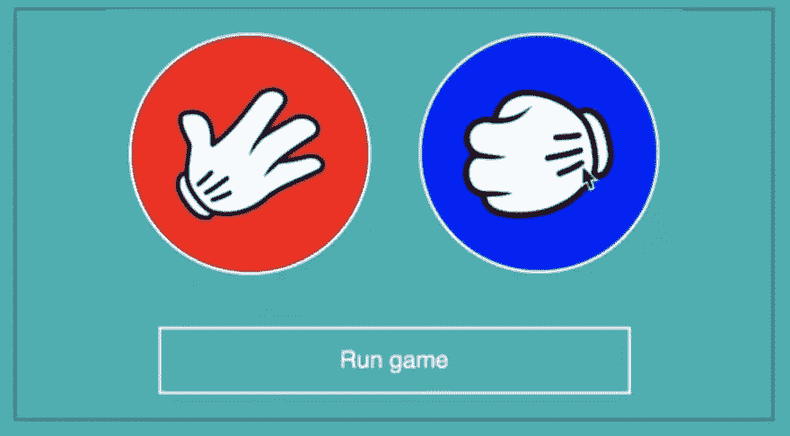

# 视频课程:用 React 构建一个完整的石头剪刀布游戏

> 原文：<https://dev.to/js_craft_hq/video-course-building-a-complete-rock-paper-scissors-game-with-react-1f7c>

这个 3 部分视频教程的目的是看 React 的概念如何一起工作，从头开始构建一个简单的 React JS 应用程序。有什么比制作一个简单的游戏更有趣的呢，就像图片中的那个。

[T2】](https://res.cloudinary.com/practicaldev/image/fetch/s--hOP073nf--/c_limit%2Cf_auto%2Cfl_progressive%2Cq_auto%2Cw_880/https://thepracticaldev.s3.amazonaws.com/i/okqj3agjop766mhvnahp.png)

[用 React 构建一个游戏——第 1 部分:项目设置、基本组件、内嵌样式](http://www.js-craft.io/screencast/18-02-14-Build-a-game-with-React-xd-Part-1-xsc-project-setup-xc-basic-components-xc-inline-styles/)

第二部分:在 React 中使用 setState、事件处理和随机符号

[用 React 构建游戏-第三部分:使用 React JS 中的 setInterval 和 clearInterval 制作简单动画](http://www.js-craft.io/screencast/18-03-02-Build-a-game-with-React-xd-Part-3-xsc-simple-animations-by-using-setInterval-and-clearInterval-in-React-JS/)

请注意，本教程并不打算成为一个完整的初学者 React Js 教程。然而，它包含非常基本的反应概念。观看一节课后，您需要创建一个免费帐户。