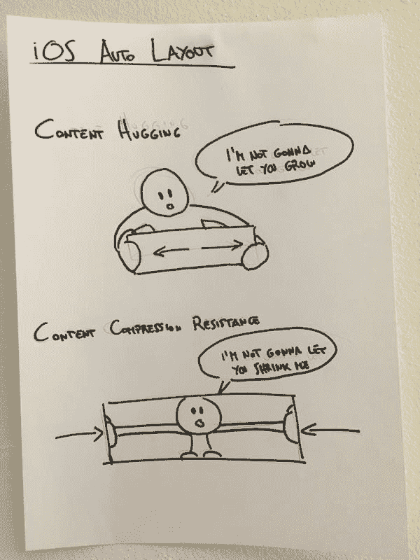

# 查看自动布局使用的属性

> 原文：<https://dev.to/abelagoi/view-properties-use-by-auto-layout--34l4>

> 固有内容大小、抗压优先级、内容拥抱优先级

[T2】](https://res.cloudinary.com/practicaldev/image/fetch/s--Fq3THKeV--/c_limit%2Cf_auto%2Cfl_progressive%2Cq_auto%2Cw_880/https://cdn-images-1.medium.com/max/1600/1%2AReQ7-rRbMO-moiBe6rwRNA.jpeg)

有些视图会根据它们所包含的内容自动调整大小，这被称为它们的内在内容大小。例如，一个按钮的内部内容大小是其标题的大小加上一个小的空白。并非所有视图都有固有的内容大小。对于这样的视图，内在内容大小可以定义视图的高度、宽度或两者。

假设我们有一个文本为“点击我”的按钮。

[T2】](https://res.cloudinary.com/practicaldev/image/fetch/s--aVfSI-wh--/c_limit%2Cf_auto%2Cfl_progressive%2Cq_auto%2Cw_880/https://cdn-images-1.medium.com/max/1600/1%2AiKuxxcLzxADnwKAq0PzTIA.png)

我们绝对不希望按钮比里面的文本小，否则文本会被剪切掉。这就是所谓的抗压优先。

> 视图的抗压缩优先级越高，视图就越难超过其固有的内容大小。

还是在“点击我”按钮上，如果我们不想让按钮真的比它里面的内容大，就像下面的图片:

[T2】](https://res.cloudinary.com/practicaldev/image/fetch/s--8OJOjMUa--/c_limit%2Cf_auto%2Cfl_progressive%2Cq_auto%2Cw_880/https://cdn-images-1.medium.com/max/1600/1%2Ad1zQJ8tQ7TeM_0HnG1HdfQ.png)

如果我们想让按钮拥抱它的内容而没有过多的填充，我们必须增加内容拥抱的优先级。

> 视图的内容拥抱优先级越高，视图就越不愿意变得大于其固有的内容大小。

我们可以通过编程方式设置内容拥抱和抗压优先级，如下所示: