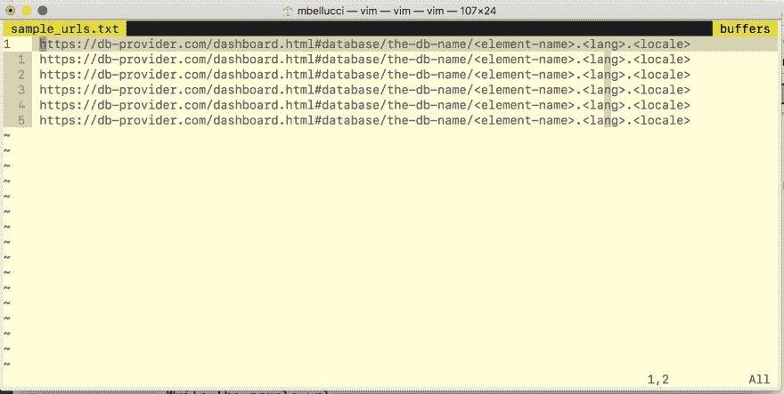
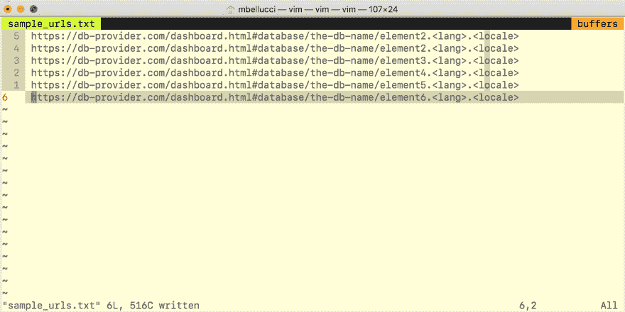
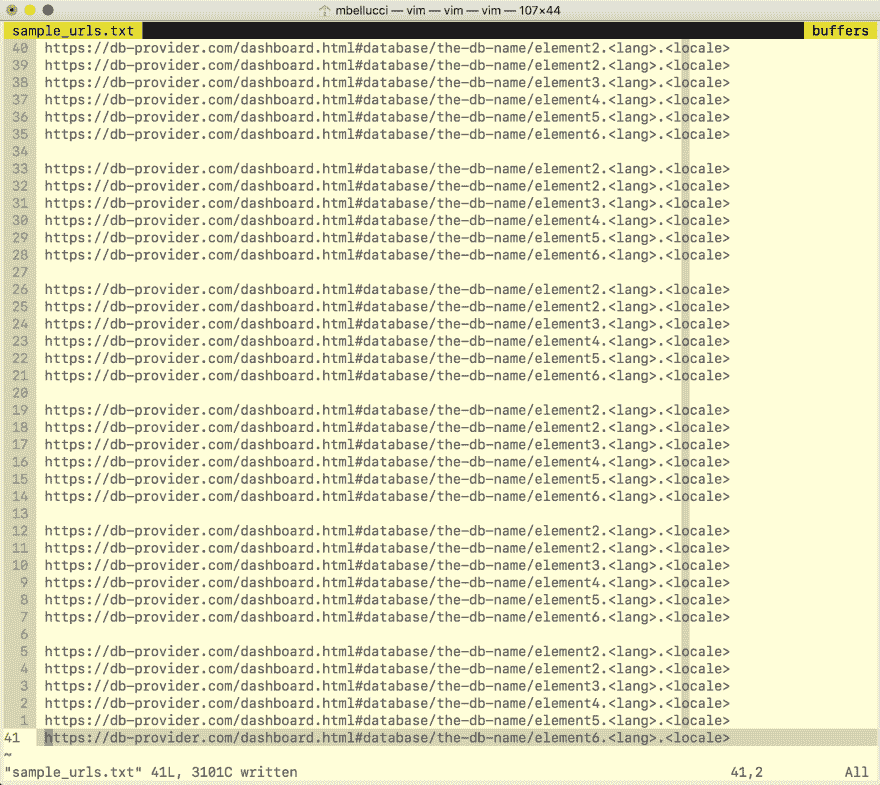
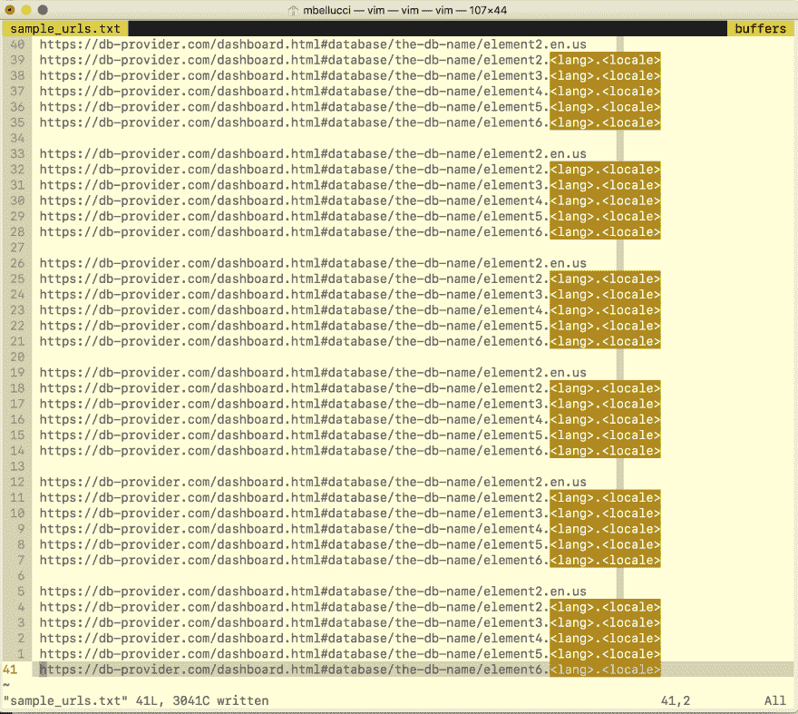
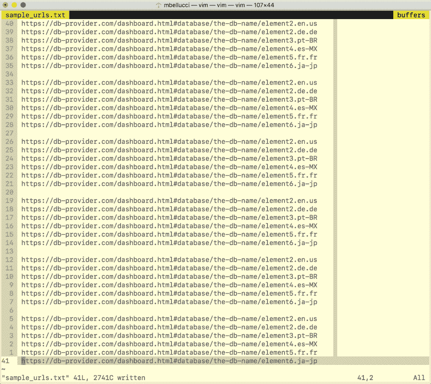

# Vim 实例

> 原文：<https://dev.to/delbetu/vim-practical-example-1kbk>

## 问题

在我的工作中，我不得不在浏览器中打开一系列相似的网址。
一个样本网址
`https://db-provider.com/dashboard.html#database/the-db-name/<element-name>.<lang>.<locale>`

在这个具体的例子中，我必须访问 6 个元素，每个元素都使用 6 种不同的语言。36 个不同的网址。

## 解

方法 1
打开浏览器，输入每一个网址
这会非常无聊。

**方法 2**
使用 Vim

打开 vim
写入示例 URL
，然后将该 URL 复制 5 次。

```
yy5p 
```

Enter fullscreen mode Exit fullscreen mode

现在我们每个元素有一行。
[T3】](https://res.cloudinary.com/practicaldev/image/fetch/s--SzuOEffk--/c_limit%2Cf_auto%2Cfl_progressive%2Cq_auto%2Cw_880/https://thepracticaldev.s3.amazonaws.com/i/qgs6mmiryjss6mwxjgsi.png)

写下每个元素名称

```
:1s/<element-name>/element1/ # scoped to line 1 replace <element-name> with element1
:<up_arrow> # show previous executed command
:2s/<element-name>/element2/ 
```

Enter fullscreen mode Exit fullscreen mode

重复此 4 次以上
[](https://res.cloudinary.com/practicaldev/image/fetch/s--E-k0r1aM--/c_limit%2Cf_auto%2Cfl_progressive%2Cq_auto%2Cw_880/https://thepracticaldev.s3.amazonaws.com/i/03unebkmdn1urxg5cdft.png)

每个语言环境复制这个块 5 次

```
ggy6jG # go to top, yank 6 lines down, go to bottom
qq # start recording in register q
o<esc> # insert blank line
p # paste yanked block
G # go to bottom
q # stop recording 
```

Enter fullscreen mode Exit fullscreen mode

至此，我们已经记录了`insert a new line and paste yanked block`。
这样重复 5 次吧。

```
5@q # execute register q 5 times 
```

Enter fullscreen mode Exit fullscreen mode

[](https://res.cloudinary.com/practicaldev/image/fetch/s--Wg3uLubs--/c_limit%2Cf_auto%2Cfl_progressive%2Cq_auto%2Cw_880/https://thepracticaldev.s3.amazonaws.com/i/zx6lilxroc5ca37iew75.png)T3】

```
gg # Go to the top 
```

Enter fullscreen mode Exit fullscreen mode

对于每个程序块，用`en.us`
替换第一个语言环境，创建一个替换一行的宏，并转到下一行进行替换。

```
qq # start recording
:.s/<lang>.<locale>/en.us/ # scoped to current line replace <lang>.<locale> with en.us
7jq # go 7 lines down and stop recording
5@q # repeat this macro 5 more times once per each block. 
```

Enter fullscreen mode Exit fullscreen mode

此时你应该有这样的东西:
[](https://res.cloudinary.com/practicaldev/image/fetch/s--WHyUzm5F--/c_limit%2Cf_auto%2Cfl_progressive%2Cq_auto%2Cw_880/https://thepracticaldev.s3.amazonaws.com/i/axk77wcxrdb43mkwvros.png)

转到第二行，用`de.de`
重复该过程

```
2gg # go to second line 
```

Enter fullscreen mode Exit fullscreen mode

用`pt.BR`、`es.MX`、`fr.fr`和`ja.jp`重复该过程

此时，你应该有类似
[](https://res.cloudinary.com/practicaldev/image/fetch/s---McplNRi--/c_limit%2Cf_auto%2Cfl_progressive%2Cq_auto%2Cw_880/https://thepracticaldev.s3.amazonaws.com/i/5m7cygsgub69uh90omk0.png) 的东西

删除每一个空行。

```
:g/^$/d # apply d command to lines matching /^$/ 
```

Enter fullscreen mode Exit fullscreen mode

我们已经建立了每一个可能的网址。现在我们需要在默认浏览器中打开它们。

```
:%! xargs open # pass all lines as the argument to open command 
```

Enter fullscreen mode Exit fullscreen mode

[T2】](https://i.giphy.com/media/3o7TKP9ln2Dr6ze6f6/giphy.gif)

默认浏览器会在不同的标签中打开所有这些 URL。
(MAC-OS 上有 open 命令。对于 Linux，您应该有一个类似的)

我希望你喜欢。
欢迎所有评论！