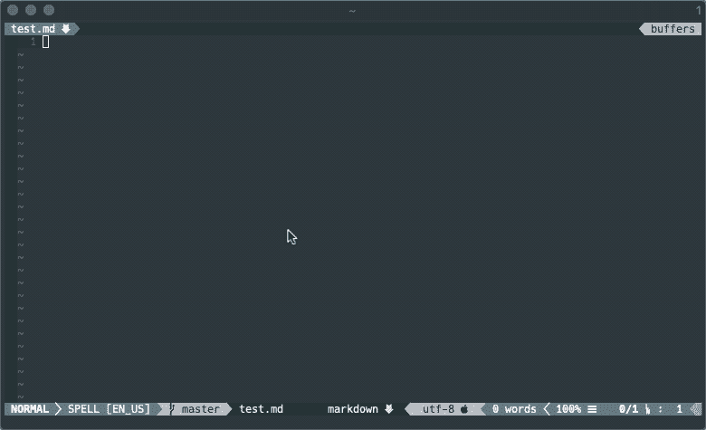

# 使用 fzf 的 VIM 拼写建议

> 原文：<https://dev.to/coreyja/vim-spelling-suggestions-with-fzf-1ccc>

*此文最初发布于[coreyja.com](https://coreyja.com/vim-spelling-suggestions-fzf/)T3】*

[T2】](https://res.cloudinary.com/practicaldev/image/fetch/s--2_U2hI4l--/c_limit%2Cf_auto%2Cfl_progressive%2Cq_66%2Cw_880/https://thepracticaldev.s3.amazonaws.com/i/q5ype764epxb3tfawnvd.gif)

## TlDr

使用 fzf 显示 VIM 拼写建议，并覆盖内置的`z=`快捷键

```
function! FzfSpellSink(word)
  exe 'normal! "_ciw'.a:word
endfunction
function! FzfSpell()
  let suggestions = spellsuggest(expand("<cword>"))
  return fzf#run({'source': suggestions, 'sink': function("FzfSpellSink"), 'down': 10 })
endfunction
nnoremap z= :call FzfSpell()<CR> 
```

## 背景

最近，我想在 VIM 中添加拼写检查功能，偶然看到了这篇很棒的 ThoughtBot 文章， [Vim 拼写检查](https://robots.thoughtbot.com/vim-spell-checking)，这让我开始着手做这件事。
这篇文章向我展示了如何打开拼写检查，以及如何为特定的文件打开它。以下是从这篇博客文章中直接获得灵感的`.vimrc`片段。

```
autocmd BufRead,BufNewFile *.md setlocal spell spelllang=en_us
autocmd FileType gitcommit setlocal spell spelllang=en_us
set complete+=kspell 
```

## 问题

这在相当长的一段时间里对我很有帮助，但是当我遇到拼写错误的单词时，它经常让我寻找更好的方法来替换它们。

VIM 有一个内置的解决方案，它采用了`z=`键盘快捷键的形式。这将光标置于当前单词下并显示拼写建议，其中选择一个选项将替换当前单词。这是我想保留的功能，但是我不喜欢显示建议的界面。它们占据了整个 VIM 屏幕，强迫你输入与你想要的单词相对应的数字。我是 [fzf](https://github.com/junegunn/fzf) 的忠实粉丝，我想用这个来提拼写建议！

## 解

我需要的第一件事是当前光标下单词的拼写建议列表。用`expand('<cword>')`获得当前单词很简单，所以现在我只需要获得它的拼写建议。
经过一番挖掘 <sup id="fnref1">[1](#fn1)</sup> 我发现了 VIM 函数`spellsuggest`。这个函数将我们需要建议的单词作为它的第一个参数。它还需要一个可选的第二个和第三个参数，我们目前没有使用。第二个参数是要返回的建议数，默认为 25。第三个参数是一个标志，表示我们是否应该只过滤大写的单词。

```
spellsuggest(expand('<cword>')) 
```

所以我现在可以使用上面的命令来获取拼写建议的 VIM 列表。下一步是让 fzf 让我从这个列表中选择一个选项。

fzf repo 有一个 [readme](https://github.com/junegunn/fzf/blob/master/README-VIM.md#fzfrun) 详细说明了如何在 VIM 中使用 fzf。我最感兴趣的是如何使用`fzf#run`函数，这是调用 fzf 的主要函数。这可以接受一个 VIM 列表作为输入，因此它非常适合我们已经生成的拼写建议列表。我们把这个作为`source`传给`fzf#run`。另一个重要的选项是`sink`，它告诉 fzf 在我们选择了一个建议后该做什么。现在是时候用我们的建议替换光标下的单词了！`sink`的一个可接受的类型是 VIM 函数引用，所以我需要另一个函数作为回调来调用，它将负责实际替换光标下的单词。到目前为止，我们有以下内容

```
function! FzfSpell()
  let suggestions = spellsuggest(expand("<cword>"))
  return fzf#run({'source': suggestions, 'sink': function("FzfSpellSink"), 'down': 10 })
endfunction 
```

为此，我们可以使用 VIM 命令`ciw`将当前单词更改为我们选择的单词。为了从 vimscript 中执行它，我们使用了`exe`和`normal!`,给出了以下内容。这使用正常模式`ciw`并将旧值发送到黑洞寄存器`"_`，然后插入新字。

```
function! FzfSpellSink(word)
  exe 'normal! "_ciw'.a:word
endfunction 
```

我们最不需要的是一个键盘快捷键，这样我就可以快速访问它。我想用这个代替默认的`z=`行为，所以我决定重新映射这个快捷方式

```
nnoremap z= :call FzfSpell()<CR> 
```

最后，我们将所有这些放在一起...:鼓声:

```
function! FzfSpellSink(word)
  exe 'normal! "_ciw'.a:word
endfunction
function! FzfSpell()
  let suggestions = spellsuggest(expand("<cword>"))
  return fzf#run({'source': suggestions, 'sink': function("FzfSpellSink"), 'down': 10 })
endfunction
nnoremap z= :call FzfSpell()<CR> 
```

* * *

1.  通过深入研究[kopischke/unite-spell-suggest](https://github.com/kopischke/unite-spell-suggest/blob/master/autoload/unite/sources/spell_suggest.vim)repo 的源代码，我最终找到了这个函数。这个插件对 Unite 做了类似的事情，作为模糊查找工具。 [↩](#fnref1)