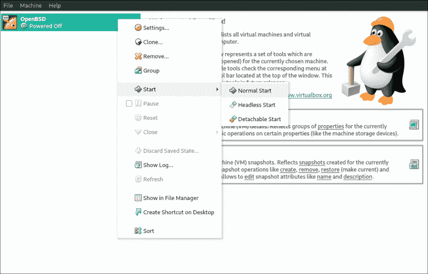
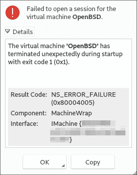
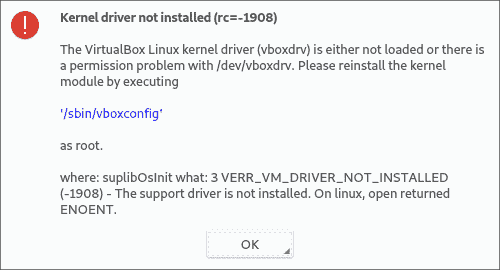
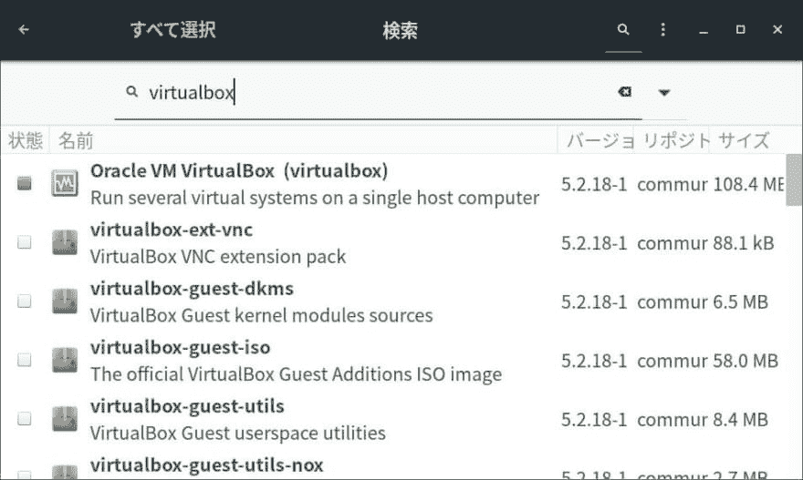
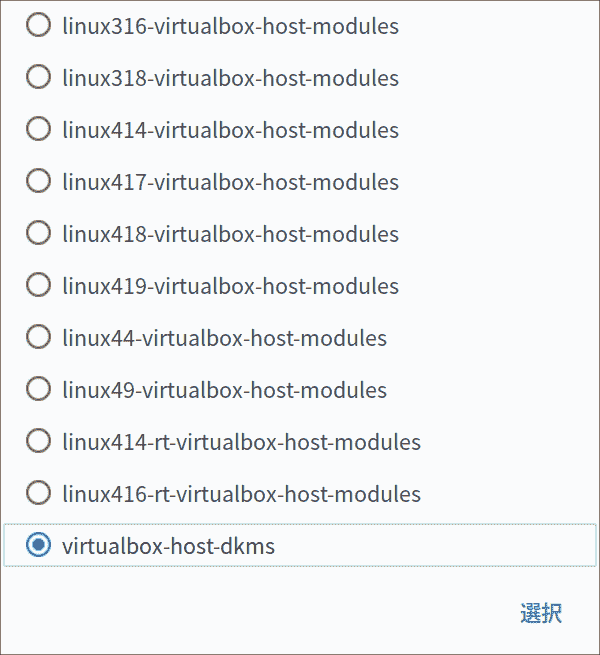
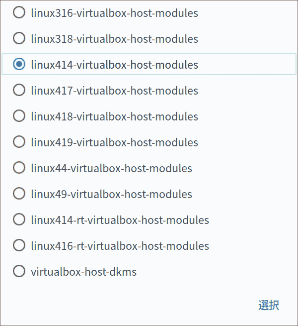

# VirtualBox:如何修复 VM 启动失败(在 Manjaro Linux 上)

> 原文：<https://dev.to/nabbisen/virtualbox-how-to-solve-a-problem-about-failure-in-starting-vm-on-manjaro-linux-49fg>

## [T1】简介](#intro)

Manjaro Linux 是基于 Arch Linux 的 Linux 发行版之一。
这是我最喜欢的一个，因为它灵活的用户界面和强大的软件包管理。

我在使用 [VirtualBox](https://www.virtualbox.org/) 运行虚拟机时失败过，但是，失败的次数不少。
这被发现仅仅是因为我安装 VirtualBox 的方式。因此，我决定写下并记录如何修复它，以避免再次失败。

*注*:公文此处为[。](https://wiki.manjaro.org/index.php?title=Virtualbox#Install_VirtualBox)

## 问题

尝试运行虚拟机时出错:

[T2】](https://res.cloudinary.com/practicaldev/image/fetch/s--Ges3zJ-5--/c_limit%2Cf_auto%2Cfl_progressive%2Cq_auto%2Cw_880/https://thepracticaldev.s3.amazonaws.com/i/iqd5ju7ajpiju5an5awl.png)

错误消息#1:

[T2】](https://res.cloudinary.com/practicaldev/image/fetch/s--LhM-XaN6--/c_limit%2Cf_auto%2Cfl_progressive%2Cq_auto%2Cw_880/https://thepracticaldev.s3.amazonaws.com/i/98ae1dqrmuxww87gacqg.png)

错误消息#2:

[T2】](https://res.cloudinary.com/practicaldev/image/fetch/s--6yVNg6Ks--/c_limit%2Cf_auto%2Cfl_progressive%2Cq_auto%2Cw_880/https://thepracticaldev.s3.amazonaws.com/i/mcg4skjzismh545okjxn.png)

上面写着:

*   "没有安装内核驱动程序(rc=-1908)"
*   " VERR 虚拟机驱动程序未安装"
*   " VirtualBox Linux 内核驱动程序(vboxdrv)未加载，或者/dev/vboxdrv 存在权限问题。"

但是，令我困惑的是，我的 Manjaro 机器里没有'`/sbin/vboxconfig`'。
我现在知道这是一个问题，即`/lib/modules/extramodules-[kernel version]-MANJARO/`中的一些模块如`vboxdrv`和`vboxpci`丢失了。

## 解

#### 准备

1.  获取内核版本

例如，使用`uname -r`命令:

```
$ uname -r
4.14.71-1-MANJARO 
```

Enter fullscreen mode Exit fullscreen mode

#### 程序

1.  运行 Pamac 安装程序。

2.  搜索“virtualbox”。

3.  选择“Oracle VM VirtualBox (virtualbox)”并安装。

    [T2】](https://res.cloudinary.com/practicaldev/image/fetch/s--Q5BmHEzU--/c_limit%2Cf_auto%2Cfl_progressive%2Cq_auto%2Cw_880/https://thepracticaldev.s3.amazonaws.com/i/x0vkfru7krmf36fzodjo.jpg)

4.  当下面的模式打开时，选择**不是**“virtualbox-host-modules”**而是**“Linux[内核版本]-virtualbox-host-modules”:

    **不是**:

    [T2】](https://res.cloudinary.com/practicaldev/image/fetch/s--b4h3ilnG--/c_limit%2Cf_auto%2Cfl_progressive%2Cq_auto%2Cw_880/https://thepracticaldev.s3.amazonaws.com/i/c3gglsllh87n9vvwpws2.png)

    **但是** :
    (版本由主机决定。)

    [T2】](https://res.cloudinary.com/practicaldev/image/fetch/s--57cdvrND--/c_limit%2Cf_auto%2Cfl_progressive%2Cq_auto%2Cw_880/https://thepracticaldev.s3.amazonaws.com/i/20acumnvmewrm16t363b.png)

5.  如果仍有错误，运行`vboxreload`命令。

```
$  sudo vboxreload 
Loading modules: vboxnetadp vboxnetflt vboxpci vboxdrv 
```

Enter fullscreen mode Exit fullscreen mode

## 其他

非常感谢您的阅读。如果这篇文章能在某种程度上帮助到有同样问题的人，我会很高兴: )