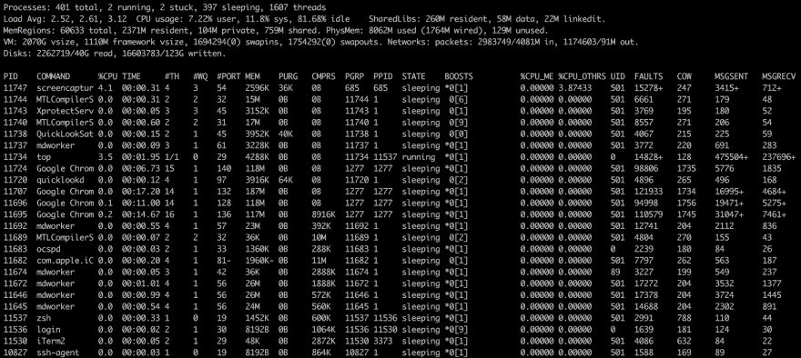

# 虚拟化:技术世界的俄罗斯娃娃。

> 原文：<https://dev.to/ishanigupta27/virtualization-russian-dolls-of-tech-world-3h5g>

Kubernetes，容器，虚拟机，裸机？对我来说全是希腊语。当我作为一名开发人员在 Oracle 工作时，我开始了理解它们的旅程，当时我们正在使用 Kubernetes。但是，相信我，使用 Kubernetes 和了解它是两个不同的世界，一般来说，我不喜欢用我不理解的概念工作。

让我把生活快进快八个月，现在，我是一名计算机专业的研究生。我自己承担了理解我之前实现的所有概念的责任(但是从来不知道它们复杂的工作原理)。所以，我将对 kubernetes 的理解拆分成三篇博客。好吧，我花了很长时间来理解它，我希望三个博客可以证明这个主题。

基础在于虚拟化。所以，让我从为什么、是什么和如何开始这个故事。

## 1。为什么要虚拟化？

在你的终端里写 top 会怎么样？

[T2】](https://res.cloudinary.com/practicaldev/image/fetch/s--FYPSiy_1--/c_limit%2Cf_auto%2Cfl_progressive%2Cq_auto%2Cw_880/https://thepracticaldev.s3.amazonaws.com/i/3hd14z9ozjbz6qojjh48.png)

如上所示，所有的进程都在您的机器上运行。其中的妙处在于，操作系统被设计成让所有这些进程相信它们是操作系统上运行的唯一进程。每个进程都被分配了一个时间片，在该时间片内，它将像单个进程一样运行。你可以在这里了解更多。这种假装 OS 上的进程的排他性的概念被称为进程隔离。扩展这一思想，出现了不仅隔离一个进程，而且将一堆进程作为一个整体隔离的方法(就像假装一台不同的计算机一样),因此，虚拟化诞生了。

[T2】](https://res.cloudinary.com/practicaldev/image/fetch/s--z5I386__--/c_limit%2Cf_auto%2Cfl_progressive%2Cq_auto%2Cw_880/https://thepracticaldev.s3.amazonaws.com/i/uegq59ypta3scnnqig6j.png)

## 2。如何虚拟化？

为了实现这个绝妙的想法，采取了许多方法。最直接的计划是拥有一个运行多个操作系统的操作系统。似乎是显而易见的选择？对吗？让我冒昧地称这个主机操作系统为管理程序。它有更多的复杂性，但现在，让我们假设这是一个专门的操作系统，它有最少的功能，可以作为主机运行所有不同的操作系统。
简单易行。一个简单的注意事项:在单个硬件上运行多个操作系统，并让它们相信好像只有它们是虚拟化的(而不是实际的)。

还有许多其他方式可以实现虚拟化。我可以向你灌输的一个快速想法是:为什么要大费周章地开发一个特定的操作系统来帮助其他操作系统独立工作呢？我们可以将各种进程的访问边界限制在特定的文件中，并将一堆进程隔离开来，这给人一种好像这些进程一起在不同的系统上工作的感觉。我知道这很沉重，一次要消化很多东西！所以暂停一下，重读本段提到的邪念。

相信我，理解虚拟化的时间表将会是一次有趣的经历！敬请关注，下一篇博客在路上:)