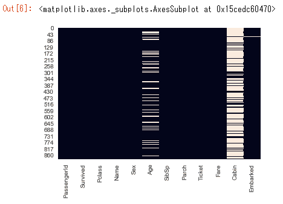
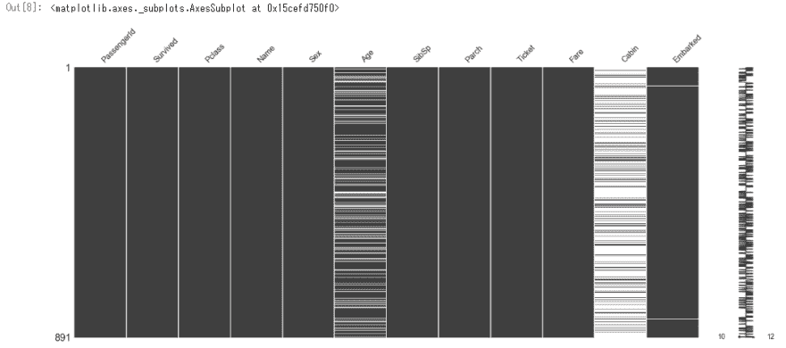
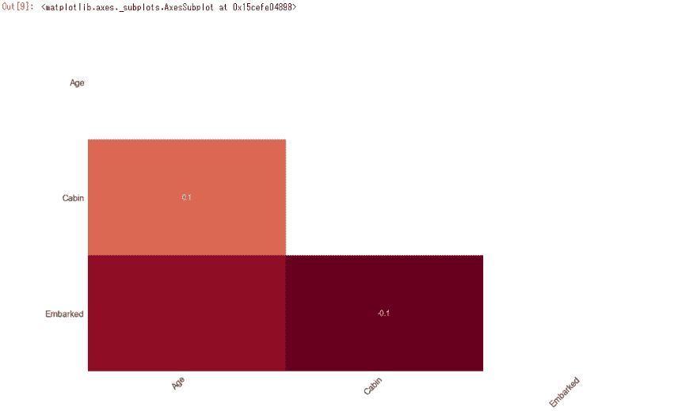

# 用 Python 可视化缺失值出现的模式

> 原文：<https://dev.to/tomoyukiaota/visualizing-the-patterns-of-missing-value-occurrence-with-python-46dj>

###### (此处有日文翻译[。)](https://qiita.com/TomoyukiAota/items/fd75c28b802bad9e6632)

在数据分析过程中，我们需要处理缺失值。处理缺失数据是如此深奥，以至于它将成为一本书的整个主题。然而，在对缺失值做任何事情之前，我们需要知道缺失值出现的模式。本文描述了使用 Python 处理缺失值的简单可视化技术。这些技术在探索性数据分析的早期阶段非常有用。

我已经在我的 GitHub repo 中上传了[一个 Jupyter 笔记本。您可以点击下面的徽章，使用活页夹运行它。](https://github.com/TomoyukiAota/visualization_of_missing_value_location)

[T2】](https://mybinder.org/v2/gh/TomoyukiAota/visualization_of_missing_value_location/master)

# 先决条件

我用来自 Kaggle 的[泰坦尼克号列车数据集作为例子。首先，假设执行以下代码。](https://www.kaggle.com/c/titanic/data) 

```
import numpy as np
import pandas as pd
import matplotlib.pyplot as plt
import seaborn as sns 
```

Enter fullscreen mode Exit fullscreen mode

```
df = pd.read_csv('train.csv') 
```

Enter fullscreen mode Exit fullscreen mode

```
# Confirm the number of missing values in each column. df.info() 
```

Enter fullscreen mode Exit fullscreen mode

```
<class 'pandas.core.frame.DataFrame'>
RangeIndex: 891 entries, 0 to 890
Data columns (total 12 columns):
PassengerId    891 non-null int64
Survived       891 non-null int64
Pclass         891 non-null int64
Name           891 non-null object
Sex            891 non-null object
Age            714 non-null float64
SibSp          891 non-null int64
Parch          891 non-null int64
Ticket         891 non-null object
Fare           891 non-null float64
Cabin          204 non-null object
Embarked       889 non-null object
dtypes: float64(2), int64(5), object(5)
memory usage: 83.6+ KB 
```

Enter fullscreen mode Exit fullscreen mode

# 方法一:seaborn.heatmap

第一种方法是通过`seaborn.heatmap`。下一行代码将可视化缺失值的位置。

```
sns.heatmap(df.isnull(), cbar=False) 
```

Enter fullscreen mode Exit fullscreen mode

[T2】](https://res.cloudinary.com/practicaldev/image/fetch/s--a6RI0m_q--/c_limit%2Cf_auto%2Cfl_progressive%2Cq_auto%2Cw_880/https://thepracticaldev.s3.amazonaws.com/i/blloy3vrfai3uxf3wf07.png)

根据索引，我可以看到

*   年龄列中有缺失值，且发生率有变化，
*   座舱栏几乎填满了发生变化缺失值
*   已装载的列在开始部分几乎没有丢失的值。

对于这个庞大的数据集来说，情况并非如此，但特别是在时间序列数据中，我们需要知道缺失值的出现是稀疏定位还是作为一大块定位。这张热图直观地告诉我们这种趋势。此外，如果两个以上的列在缺失值位置具有相关性，则这种相关性将被可视化。(同样，这个数据集也不是这种情况，但重要的是要知道这个数据集中没有这种相关性。)

这一行代码告诉我们许多丢失值发生的信息。

# 方法二:[缺少](https://github.com/ResidentMario/missingno)模块

如果您想进一步操作，[缺少任何](https://github.com/ResidentMario/missingno)模块都是有用的。
首先，安装并导入它。

```
pip install missingno 
```

Enter fullscreen mode Exit fullscreen mode

```
import missingno as msno 
```

Enter fullscreen mode Exit fullscreen mode

如果你想得到与前面描述的`seaborn.heatmap`相似的结果，使用`missingno.matrix`。

```
msno.matrix(df) 
```

Enter fullscreen mode Exit fullscreen mode

[T2】](https://res.cloudinary.com/practicaldev/image/fetch/s--6na7c-NM--/c_limit%2Cf_auto%2Cfl_progressive%2Cq_auto%2Cw_880/https://thepracticaldev.s3.amazonaws.com/i/srdhfazzaqw5ymos7sfh.png)

除了热图之外，该图的右侧还有一个条形。这是每行数据完整性的线图。在该数据集中，所有行都有 10 - 12 个有效值，因此有 0 - 2 个缺失值。

另外，`missingno.heatmap`可视化了关于列中缺失值位置的相关矩阵。

```
msno.heatmap(df) 
```

Enter fullscreen mode Exit fullscreen mode

[T2】](https://res.cloudinary.com/practicaldev/image/fetch/s--7TMeem8t--/c_limit%2Cf_auto%2Cfl_progressive%2Cq_auto%2Cw_880/https://thepracticaldev.s3.amazonaws.com/i/4chhgdutjimuyjzwfcbx.png)

`missingno`模块有更多的功能，比如每列缺失值个数的柱状图，缺失值位置关联生成的树状图。要了解更多信息， [README](https://github.com/ResidentMario/missingno) 是一本不错的入门书。

# 关闭

本文描述了两种简单的可视化方法。`seaborn.heatmap`是第一选择，因为它只需要`seaborn`，但如果你需要更多，[缺少的](https://github.com/ResidentMario/missingno)模块将帮助你。