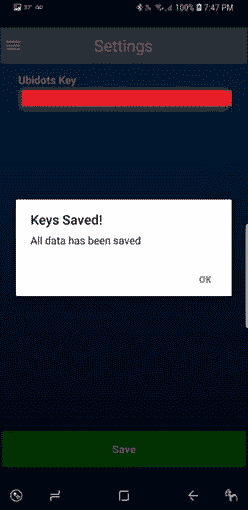
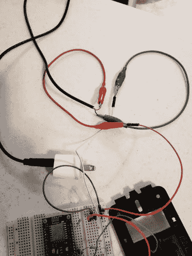
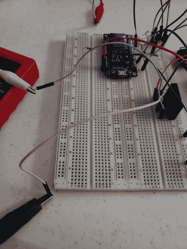

# 使用 Jason 应用程序从任何地方声控灯光

> 原文：<https://dev.to/zablon18/voice-controlled-lights-from-anywhere-with-jason-app-3i31>

## 描述

Jason 是一个语音控制的助手应用程序，我为 Android 设备编写了代码来控制 AC 设备的电气状态，直到现在它可以控制灯光。只要你有网络连接，你可以在世界任何地方控制灯光。这可以通过使用物联网代理来实现，在这种情况下，我们使用的是 Ubidots。

要使用它，你需要建立连接到灯泡的硬件模块，(说明在本教程中)，你还需要创建一个 Ubidots 帐户。

所以让我们开始吧...

### 组件

*   结点工人
*   NPN 晶体管
*   5V 固态继电器(可以是机械继电器)
*   开关(可以是电子爱好开关，如拨动开关或墙壁开关)
*   1k 欧姆电阻
*   2.2k 欧姆电阻器
*   试验板
*   USB-A 转微型 USB 电缆
*   交流灯泡
*   灯泡插座
*   电源线
*   5V 手机充电器
*   跳线

### 软件和服务

*   [Arduino IDE](https://www.arduino.cc/en/main/software)
*   杰森
*   [Ubidots](https://ubidots.com/education/)

### Ubidots 账户

你需要做的第一件事是去教育网站创建一个账户。如果你已经有了 Twitter、Github、Google 或脸书账户，你可以直接登录。

[T2】](https://res.cloudinary.com/practicaldev/image/fetch/s--fAhVQv2o--/c_limit%2Cf_auto%2Cfl_progressive%2Cq_auto%2Cw_880/https://hackster.imgix.net/uploads/attachments/530388/ubidots_register_ms86QxY4f7.PNG%3Fauto%3Dcompress%252Cformat%26w%3D1280%26h%3D960%26fit%3Dmax)

当您已经创建了您的帐户，您将可以访问您的令牌，但点击您的用户名在右上角，并点击 API 证书。保存您的令牌，因为我们稍后会用到它。

[T2】](https://res.cloudinary.com/practicaldev/image/fetch/s--jLmRt2Vy--/c_limit%2Cf_auto%2Cfl_progressive%2Cq_auto%2Cw_880/https://hackster.imgix.net/uploads/attachments/530397/ubidotsdashboard_smcDlh0j8B.PNG%3Fauto%3Dcompress%252Cformat%26w%3D680%26h%3D510%26fit%3Dmax)

[T2】](https://res.cloudinary.com/practicaldev/image/fetch/s--Y0mRdIs1--/c_limit%2Cf_auto%2Cfl_progressive%2Cq_auto%2Cw_880/https://hackster.imgix.net/uploads/attachments/530401/token_57BYXVvEi5.png%3Fauto%3Dcompress%252Cformat%26w%3D680%26h%3D510%26fit%3Dmax)

### 杰森 App

该应用程序可以从 [Play Store](https://play.google.com/store/apps/details?id=com.zablah.jason) 下载，有英语和西班牙语版本。

将您的 Ubidots 令牌复制到应用程序中，方法是点击设置选项卡，将其粘贴到 Ubidots 密钥字段，然后点击保存按钮。

[T2】](https://res.cloudinary.com/practicaldev/image/fetch/s--G7HzQkAk--/c_limit%2Cf_auto%2Cfl_progressive%2Cq_auto%2Cw_880/https://hackster.imgix.net/uploads/attachments/530415/whatsapp_image_2018-07-21_at_7_48_24_pm_htr3T60Cd6.jpeg%3Fauto%3Dcompress%252Cformat%26w%3D680%26h%3D510%26fit%3Dmax)

[T2】](https://res.cloudinary.com/practicaldev/image/fetch/s--CT2ndSsy--/c_limit%2Cf_auto%2Cfl_progressive%2Cq_auto%2Cw_880/https://hackster.imgix.net/uploads/attachments/530418/whatsapp_image_2018-07-21_at_7_48_24_pm_%282%29_cduYWnHhvr.jpeg%3Fauto%3Dcompress%252Cformat%26w%3D680%26h%3D510%26fit%3Dmax)

[T2】](https://res.cloudinary.com/practicaldev/image/fetch/s---L5EWOlw--/c_limit%2Cf_auto%2Cfl_progressive%2Cq_auto%2Cw_880/https://hackster.imgix.net/uploads/attachments/530422/whatsapp_image_2018-07-21_at_7_48_24_pm_%281%29_T1rBzAgKJr.jpeg%3Fauto%3Dcompress%252Cformat%26w%3D680%26h%3D510%26fit%3Dmax)

## 制作硬件

### 安全第一

[T2】](https://res.cloudinary.com/practicaldev/image/fetch/s--QNfiH-_D--/c_limit%2Cf_auto%2Cfl_progressive%2Cq_auto%2Cw_880/https://hackster.imgix.net/uploads/attachments/530922/caution-high-voltage-300x450_WfXuok0iXU.png%3Fauto%3Dcompress%252Cformat%26w%3D680%26h%3D510%26fit%3Dmax)

在这个项目中，我们使用的是市电电压(交流电压),如果你不知道自己在做什么，这是很危险的，要非常小心。如果电路连接到墙上电源，切勿触摸或操作电路的任何部分。如果你不知道自己在做什么，就在这里停下来，或者寻求专业人士的帮助。

我只是张贴这个教育教程，我绝不对你可能造成的任何伤害或损害负责。

### 示意图

[T2】](https://res.cloudinary.com/practicaldev/image/fetch/s--MYrpsdNQ--/c_limit%2Cf_auto%2Cfl_progressive%2Cq_auto%2Cw_880/https://hackster.imgix.net/uploads/attachments/530710/schematic_EHL21EeSdU.png%3Fauto%3Dcompress%252Cformat%26w%3D680%26h%3D510%26fit%3Dmax)

*   通过将 **VIN** 连接到 **VCC** (5V)并将 **GND 引脚**连接到 **GND** 来给 NodeMCU 供电。
*   将 **D8** 连接到开关的一个**端和连接到 **GND** 的一个 **2.2K 欧姆电阻**。**
*   将开关的另一端**连接到 **3.3V** ，因为 NodeMCU 只能处理其 I/O 引脚中的-电压。**
*   **D1** 到 **2.2k 欧姆电阻**到 NPN 晶体管的**基极**
*   **继电器的负 DC** 到晶体管的**集电极**。
*   晶体管**的发射极**到**的 GND** 。
*   **继电器的正极 DC** 到 **5V** 。
*   **灯泡的负极**接到继电器的一个**交流引脚**。
*   **灯泡正极**到**交流带电**(交流正极)。
*   继电器的其他**交流引脚**到**空档**(交流负极)。注意: **VCC 5V** 将由连接到一个简单的电话变压器充电器的 usb 电缆供电。

### 试验板

[T2】](https://res.cloudinary.com/practicaldev/image/fetch/s--w0pbohx4--/c_limit%2Cf_auto%2Cfl_progressive%2Cq_auto%2Cw_880/https://hackster.imgix.net/uploads/attachments/530775/whatsapp_image_2018-07-22_at_2_17_06_pm_%281%29_vvTgCj6VlN.jpeg%3Fauto%3Dcompress%252Cformat%26w%3D680%26h%3D510%26fit%3Dmax)

[T2】](https://res.cloudinary.com/practicaldev/image/fetch/s--eSz7u1YF--/c_limit%2Cf_auto%2Cfl_progressive%2Cq_auto%2Cw_880/https://hackster.imgix.net/uploads/attachments/530768/breadboardnoext1_plq9g4h8LD.jpeg%3Fauto%3Dcompress%252Cformat%26w%3D680%26h%3D510%26fit%3Dmax)

[T2】](https://res.cloudinary.com/practicaldev/image/fetch/s--pOGqpaTC--/c_limit%2Cf_auto%2Cfl_progressive%2Cq_auto%2Cw_880/https://hackster.imgix.net/uploads/attachments/530769/breadorardnoext2_XUExNJM0gi.jpeg%3Fauto%3Dcompress%252Cformat%26w%3D680%26h%3D510%26fit%3Dmax)

[T2】](https://res.cloudinary.com/practicaldev/image/fetch/s--zbmaqO9M--/c_limit%2Cf_auto%2Cfl_progressive%2Cq_auto%2Cw_880/https://hackster.imgix.net/uploads/attachments/530772/whatsapp_image_2018-07-22_at_2_17_06_pm_xsVLo7aTlf.jpeg%3Fauto%3Dcompress%252Cformat%26w%3D680%26h%3D510%26fit%3Dmax)

[T2】](https://res.cloudinary.com/practicaldev/image/fetch/s--QbS9AbUI--/c_limit%2Cf_auto%2Cfl_progressive%2Cq_auto%2Cw_880/https://hackster.imgix.net/uploads/attachments/530773/whatsapp_image_2018-07-22_at_2_17_05_pm_%282%29_dyvvk58ycq.jpeg%3Fauto%3Dcompress%252Cformat%26w%3D680%26h%3D510%26fit%3Dmax)

我使用的开关具有双掷，我们只需要一个，因此我将其引脚 1 连接到 NodeMCU 的 3V，并将开关的引脚 2 连接到 NodeMCU 引脚 D8。

[T2】](https://res.cloudinary.com/practicaldev/image/fetch/s--262-4J9I--/c_limit%2Cf_auto%2Cfl_progressive%2Cq_auto%2Cw_880/https://hackster.imgix.net/uploads/attachments/530774/whatsapp_image_2018-07-22_at_2_17_05_pm_%283%29_k5ToKxqRMr.jpeg%3Fauto%3Dcompress%252Cformat%26w%3D680%26h%3D510%26fit%3Dmax)

电源将是一个 5V 的电话壁式充电器，带有一根剥离的 usb 电缆。

[T2】](https://res.cloudinary.com/practicaldev/image/fetch/s--y0W3MZBp--/c_limit%2Cf_auto%2Cfl_progressive%2Cq_auto%2Cw_880/https://hackster.imgix.net/uploads/attachments/530776/whatsapp_image_2018-07-22_at_2_17_05_pm_%284%29_EChhLVAVuR.jpeg%3Fauto%3Dcompress%252Cformat%26w%3D680%26h%3D510%26fit%3Dmax)

通过控制继电器的接地连接，我们可以控制灯泡的交流状态

[T2】](https://res.cloudinary.com/practicaldev/image/fetch/s--6Lv3pgzp--/c_limit%2Cf_auto%2Cfl_progressive%2Cq_auto%2Cw_880/https://hackster.imgix.net/uploads/attachments/530780/whatsapp_image_2018-07-22_at_2_17_04_pm_lNFuRCmyMT.jpeg%3Fauto%3Dcompress%252Cformat%26w%3D680%26h%3D510%26fit%3Dmax)

[T2】](https://res.cloudinary.com/practicaldev/image/fetch/s--JpZJokKs--/c_limit%2Cf_auto%2Cfl_progressive%2Cq_auto%2Cw_880/https://hackster.imgix.net/uploads/attachments/530781/whatsapp_image_2018-07-22_at_2_17_04_pm_%281%29_uGuSZaE24t.jpeg%3Fauto%3Dcompress%252Cformat%26w%3D680%26h%3D510%26fit%3Dmax)

## 代码

在使用源代码之前，您需要下载一些库:

*   [用于 ESP8266 的 Arduino 内核](https://github.com/esp8266/Arduino#installing-with-boards-manager)(阅读“使用板卡管理器安装”步骤)
*   [Ubidots ESP MQTT](https://github.com/ubidots/ubidots-mqtt-esp)

注意:如果你不知道如何在 arduino IDE 中添加库，你可以跟随[这篇](https://www.arduino.cc/en/Guide/Libraries)简单教程。

将开发板设置为 NodeMCU 1.0 (ESP-12E 模块)。

您需要更改代码中的一些变量:

*   您的 SSID(您家庭 Wi-Fi 网络的名称)
*   您的 Wi-FI 网络密码
*   你的 Ubidots 令牌

```
 //Include Libraries

#include "UbidotsESPMQTT.h"  
//Define Constants

/*Replace the empty string
with your Ubidots TOKEN*/

#define TOKEN "" 
/*Replace the empty string
with your ssid, eg: "MyHomeNewtwork"*/

#define WIFINAME "" 
/*Replace the empty string with your
wi-fi password, eg: "mypass123456"*/

#define WIFIPASS "" 
/*Replace with any random string,
Ubidots requires it to be unique*/

#define MQTTCLIENTNAME "" 

Ubidots client(TOKEN, MQTTCLIENTNAME);

/**********************
  Auxiliar Functions
 *********************/

/*NOTE PINS ARE FROM THE 
INTERNAL ESP8266 MODULE 
NOT THE DIGITAL PINS FROM THE 
NODEMCU, MORE AT INFO: 
http://www.electronicwings.com/nodemcu/nodemcu-gpio-with-arduino-ide
*/
int outputs[] = {2,4,5,12};
int inputs[] = {13,14,15,16};
int btnStates[] = {0,0,0,0};

//This is called every time we 
//receive an update from the Ubidots server
void callback(char* topic, byte* payload, unsigned int length) {
  //Print the topic (pin) and its server state
  Serial.print("Message arrived [");
  Serial.print(topic);
  Serial.print("] ");
  for (int i=0;i<length;i++) {
    Serial.print((char)payload[i]);
  }
  bool reading = true;
  int count = 20;
  String topicPin = "";
  String payloadState = "";
  Serial.println(" ");
  while(reading){
    if((char)topic[count] != '/'){
      topicPin += (char)topic[count];
      Serial.print((char)topic[count]);
      count++;
    }
    else{
       Serial.println(" STRING: " + topicPin);
      reading = false;
    }
  }
  for (int i = 0; i < length; i++) {
    payloadState += (char)payload[i];
    Serial.print((char)payload[i]);
  }
  //Apply server value to pin
  int ledpin = topicPin.toInt();
  int state = payloadState.toInt();
  digitalWrite(ledpin, state);
  Serial.println();
}

/*********************
 Main Functions
 **********************/

void setup() {
  // put your setup code here, to run once:
  Serial.begin(9600);
  client.wifiConnection(WIFINAME, WIFIPASS);
  client.begin(callback);
  //Subscribe to all of out Outputs pins
  for(int i=0;i<4;i++){
    char b[2];
    String str;
    str=String(outputs[i]);
    str.toCharArray(b,2);
     //Insert the dataSource and Variable's Labels
    client.ubidotsSubscribe("esp32",b); 
  }
  //Set all of our pinModes and save button states
  for(int i = 0; i<4; i++){
    pinMode(outputs[i], OUTPUT);
    pinMode(inputs[i], INPUT);
    int buttonState = digitalRead(inputs[i]);
    btnStates[i] = buttonState;
  }
}

void loop() {
  // put your main code here, to run repeatedly:
  if(!client.connected()){
      client.reconnect();
      //Subscribe to all of out Outputs pins
      for(int i=0;i<4;i++){
        char b[2];
        String str;
        str=String(outputs[i]);
        str.toCharArray(b,2);
         //Insert the dataSource and Variable's Labels
        client.ubidotsSubscribe("esp32",b);
      }
  }
  //Check if switch has changed state
  //If it did chnage, change the light state and save it to array
  for(int i = 0; i<4; i++){
    int buttonState = digitalRead(inputs[i]);
    if(buttonState != btnStates[i]){
      digitalWrite(outputs[i], buttonState);
      btnStates[i] = buttonState;
    }
  }
  client.loop();
} 
```

Enter fullscreen mode Exit fullscreen mode

最后把你的代码上传到板上。
[https://www.youtube.com/embed/NAoc2JeHu2g](https://www.youtube.com/embed/NAoc2JeHu2g)T2】

有用！如果你有任何问题或建议，请在评论区留言。