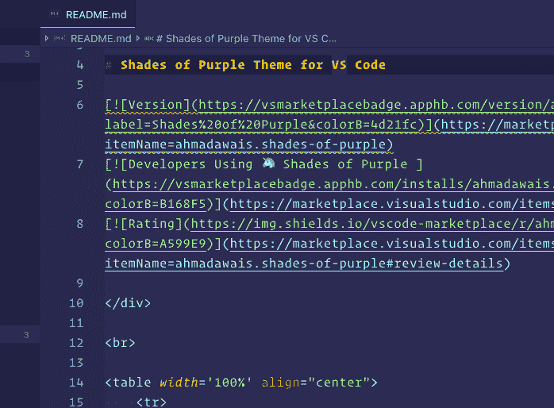
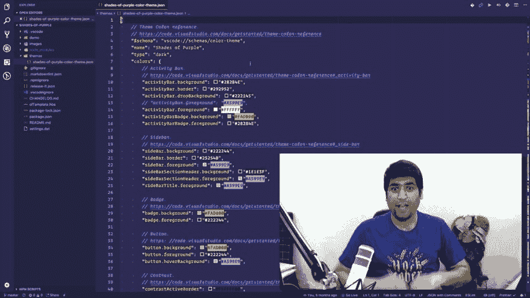
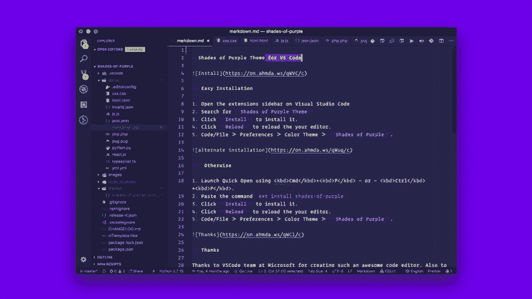

# 🔥VSCode 面包屑在这里，我喜欢它们！

> 原文：<https://dev.to/vscode/vscode-breadcrumbs-are-here-jkn>

Visual Studio Code 的最新版本`v1.26`今天发布，它充满了伟大的新特性。面包屑有一个漂亮的新功能。

[T2】](https://res.cloudinary.com/practicaldev/image/fetch/s--bAewNMam--/c_limit%2Cf_auto%2Cfl_progressive%2Cq_auto%2Cw_880/https://on.ahmda.ws/1N3c2q0Q0r2L/c)

### vs code 上下文中的面包屑是什么？！

> 面包屑导航可以让您从顶部跳到工作区中的符号和文件，而不必使用文件浏览器——对小屏幕最有帮助。
> 
> 编辑器现在在其内容上方有一个导航栏——我们称之为面包屑。它显示当前位置，并允许您在符号和文件之间快速导航。要开始使用面包屑，请使用查看>切换面包屑命令或通过`breadcrumbs.enabled`设置启用它。
> 
> 使用编辑器选项卡(默认)时，面包屑显示在编辑器标题下的单独一行中。如果您没有使用编辑器标签，面包屑显示为标题旁边的交互式文件路径。[更多…](https://code.visualstudio.com/updates/v1_26#_breadcrumbs)

我喜欢这个新功能，因为我会越来越少地使用浏览器的侧边栏。为优秀的旧代码提供更多的屏幕空间。通过此设置`"breadcrumbs.enabled": true`启用它们。

> <video loop="" controls=""><source src="https://video.twimg.com/tweet_video/DkiX3a4WsAAjeP7.mp4" type="video/mp4"></video>艾哈迈德·阿瓦斯🥑@ mrahmadawais🔥提示:[VSCode.pro/TIP/15](https://t.co/5izfcDKEeV)—最新发布的🆚@Code 有一个漂亮的面包屑新功能。我喜欢。按⌘ + ⇧ +。去访问它。
> 详情在下面提示:
> 
> VSCode.pro/tip/15[✅](https://t.co/cizhnvvp3L)(启用面包屑)
> ✅[VSCode.pro/tip/16](https://t.co/oQAqEWBNag)(快捷方式)
> 
> 🙌RTs 赞赏！2018 年 8 月 14 日上午 05:37

要与面包屑交互，使用聚焦面包屑命令或按下`SHIFT (⇧)` + `COMMAND (⌘)` + `PERIOD (.)`并使用箭头键`ARROW KEYS (←/→)`四处移动。

## 🥖VSCode 面包屑提示&招数

我在下面的提示中分享了更多的细节:

*   VSCode.pro/tip/15 的✅[→](https://VSCode.pro/tip/15)(在 VSCode 中启用面包屑)
*   VSCode.pro/tip/16 的✅[→](https://VSCode.pro/tip/16)(快捷键/迭代提示&技巧)

> <video loop="" controls=""><source src="https://video.twimg.com/tweet_video/DkiYRI5XgAAgEGY.mp4" type="video/mp4"></video>艾哈迈德·阿瓦斯🥑@ mrahmadawais🔥提示:[VSCode.pro/TIP/16](https://t.co/rtuRGUHG9n)—你也可以在没有选取器的情况下与面包屑进行交互，只需按⌘+⇧+；而要四处移动按下⌥ +箭头键
> 
> 详情在下面提示:
> 
> VSCode.pro/tip/15
> [VSCode.pro/tip/16](https://t.co/oQAqEWBNag)2018 年 8 月 14 日上午 05:37

## 🦄[紫色的阴影`v2.5` →](https://marketplace.visualstudio.com/items?itemName=ahmadawais.shades-of-purple)

新的面包屑功能是可样式化的，每个好的主题都应该有它的样式，否则看起来会很奇怪。无耻的插在这里，我是一个 VSCode 主题的作者，叫做🦄[紫色的阴影→](https://marketplace.visualstudio.com/items?itemName=ahmadawais.shades-of-purple) ,大约有 15，000 名开发人员在使用它。

[T2】](https://marketplace.visualstudio.com/items?itemName=ahmadawais.shades-of-purple)

我试图在每一个 VSCode 主版本中更新它，这就是为什么到目前为止有 50 多个版本。在紫色的阴影中`v2.5`更新两个主要的更新是:

*   🎨VSCode 面包屑的样式
*   🗂风格为即将到来的 VSCode 设置编辑器，目前在预览，但它的风格是根据🦄[紫色主题的阴影→](https://marketplace.visualstudio.com/items?itemName=ahmadawais.shades-of-purple)

[T2】](https://marketplace.visualstudio.com/items?itemName=ahmadawais.shades-of-purple)

和平！✌️