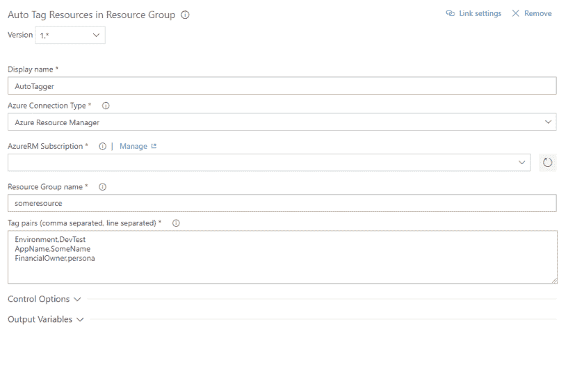

# VSTS 扩展–标记资源组中的所有资源

> 原文：<https://dev.to/sogeti/vsts-extension-tagging-all-resources-within-a-resource-group-27f6>

在我目前的项目中，我偶然发现了一个问题。我们有许多 ARM 模板，需要为所有资源添加标签。在模板中这样做可能很麻烦，所以我创建了一个小的 VSTS 扩展，为特定资源组中的所有资源添加标签。

可以从[https://marketplace.visualstudio.com/items?安装扩展 itemName = peterrombouts . auto tagging-extension](https://marketplace.visualstudio.com/items?itemName=PeterRombouts.autotagging-extension)

工作非常简单；输入 subscription 和 resourcegroup 的值，然后添加标记。

[T2】](https://res.cloudinary.com/practicaldev/image/fetch/s--1p5fwBfw--/c_limit%2Cf_auto%2Cfl_progressive%2Cq_auto%2Cw_880/https://peterrombouts.files.wordpress.com/2018/12/screenshots-vsts-auto-tagging-1.png%3Fw%3D840)

应该输入标记对，每行一对，用逗号分隔。扩展会将这些标签添加到给定资源组中的所有资源，而不会对现有标签做任何事情。

备注？请务必给予反馈！如果你想投稿，这个项目可以在 Github 上找到！