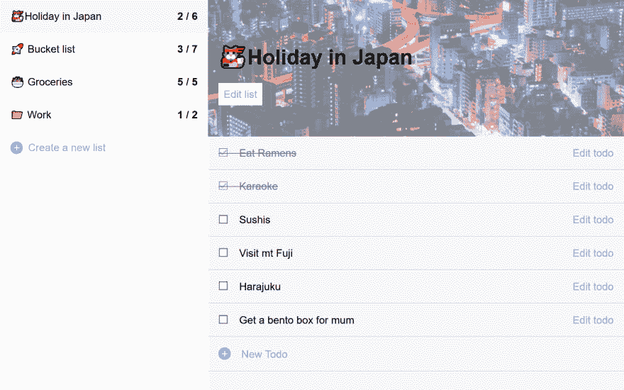
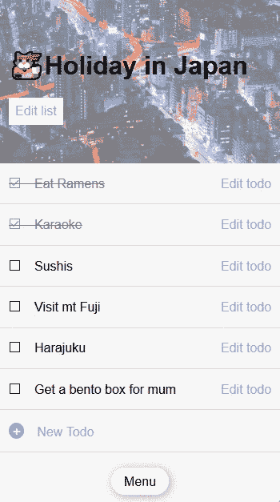

# Vue.js 101 todo PWA 教程

> 原文：<https://dev.to/vinceumo/vuejs-101-todo-pwa-tutorial-4bne>

本教程的目的是给 vue.js ❤.一个介绍

这些内容最初是为 DAM Digital London 的一个研讨会编写的。

Vue.js 是一个用于构建用户界面(UI)的渐进式框架。

本教程假设你已经有一些关于 HTML、CSS 和 Javascript 的中级知识。如果你没有这些领域的任何知识，可以去看看 [freeCodeCamp](https://www.freecodecamp.org/) ，他们有很好的资源来学习这些话题😉。

以下是本教程将涉及的主题:

*   v 绑定指令
*   类和样式绑定
*   事件处理
*   属性中的数据绑定
*   列表呈现
*   插值-胡子
*   表单输入绑定-复选框
*   v 型车
*   方法
*   条件渲染
*   虚拟中频
*   v-否则
*   PWA 简介

我们将创建一个能够拥有多个待办事项列表的待办事项应用程序。

[T2】](https://res.cloudinary.com/practicaldev/image/fetch/s--tQs4uCsA--/c_limit%2Cf_auto%2Cfl_progressive%2Cq_auto%2Cw_880/https://image.ibb.co/g3g8Gy/Screenshot_2018_07_17_Todo_list.png)

## 入门

从 github 中克隆[起始材料。它包括基本的 HTML，CSS 和 JS。](https://github.com/vinceumo/todo-vue-starter-materials)

你可以在 [github](https://github.com/vinceumo/todo) 上找到这个教程的最终代码，如果你点击这个[链接](http://vinceumo.github.io/todo)就可以看到演示。

Vue CDN 已经包含在我们的 index.html 中，还有我们的 CSS 和 content/js/app.js😃。

## 在手机上切换导航

首先，手机侧边导航(📱< 850px)应该显示和隐藏。

[T2】](https://res.cloudinary.com/practicaldev/image/fetch/s--6QKWGQPi--/c_limit%2Cf_auto%2Cfl_progressive%2Cq_66%2Cw_880/https://image.ibb.co/c7qGmy/menu.gif)

当我们点击**菜单**时，我们希望`<nav>`切换类别`.is-open`。

在 vue.js 中，`v-bind`允许我们在 html 属性中绑定数据。如`v-bind:id=""`、`v-bind:style=""`、`v-bind:data-target=""`等。`v-bind`的简称是`:`。

在`index.html`中，我们将使用`v-bind:class`动态传递`.is-open`。如果`isNavOpen`为真，那么我们将添加我们的类。

```
<nav v-bind:class="{'is-open': isNavOpen}">
<!-- ... -->
</nav> 
```

Enter fullscreen mode Exit fullscreen mode

在`content/js/app.js`中，我们的数据中需要`isNavOpen`。如果你把最后一个的值改成**真**，导航就会显示出来。

vue.js 中的**数据**属性是我们存储应用程序数据和 UI 状态的地方。例如，`isNavOpen`默认设置为 false，但是通过将其值改为 true，我们可以将类 *is-open* 绑定到 DOM。

在我们的 app.js 中，我们需要添加`isNavOpen: false`。

```
var app = new Vue({
  el: "#app",
  data: {
    isNavOpen: false
  }
}); 
```

Enter fullscreen mode Exit fullscreen mode

现在我们想在点击**菜单**按钮时改变`isNavOpen`的值。

我们将使用“点击”事件处理程序。在 vue.js 中，我们可以使用`v-on:`或`@` (Shorthands)，来监听 DOM 事件。在我们的例子中，我们想要监听一个点击事件。然后我们将使用`v-on:click` / `@click`。

```
<button v-on:click="isNavOpen = !isNavOpen" class="menu">Menu</button> 
```

Enter fullscreen mode Exit fullscreen mode

正如你所看到的，我们可以传递一个内联 javascript 语句，我们也可以使用一个方法(函数)，我们将在本教程的后面看到如何使用最后一个。

### 文献引用

*   [类和样式绑定](https://vuejs.org/v2/guide/class-and-style.html)
*   [事件处理](https://vuejs.org/v2/guide/events.html)
*   [v-bind 指令](https://vuejs.org/v2/api/#v-bind)
*   [属性中的数据绑定](https://vuejs.org/v2/guide/syntax.html#Attributes)

## 将待办事项列表绑定到侧边导航

在`content/js/app.js`中，让我们添加一些虚拟列表，这样我们就可以开始整合我们的侧边导航。

```
var app = new Vue({
  el: "#app",
  data: {
    isNavOpen: false,
    todoLists: [
      {
        title: "✈️ Trip to japan",
        keyword: "japan",
        items: [
          { name: "Eat ramen", isCompleted: true },
          { name: "Visit mt Fuji", isCompleted: false },
          { name: "Learn japanese", isCompleted: false }
        ]
      },
      {
        title: "🏂 Ski trip to the Alps",
        keyword: "Alps",
        items: [
          { name: "Find a chalet", isCompleted: true },
          { name: "Learn how to ski", isCompleted: false }
        ]
      },
      {
        title: "🍉 Groceries",
        keyword: "Food",
        items: [
          { name: "Apples", isCompleted: false },
          { name: "Banana", isCompleted: true },
          { name: "Tomatoes", isCompleted: false },
          { name: "Bread", isCompleted: true }
        ]
      }
    ]
  }
}); 
```

Enter fullscreen mode Exit fullscreen mode

为了在侧边导航中呈现我们的列表，我们需要使用`v-for`指令。

```
<nav v-bind:class="{'is-open': isNavOpen}">
  <ul>
    <li v-for="todoList in todoLists">
      <button>
        {{todoList.title}}
        <span>
          {{todoList.items.length}}
        </span>
      </button>
    </li>
    <li>
      <button class="is-add">Create a new list</button>
    </li>
  </ul>
</nav> 
```

Enter fullscreen mode Exit fullscreen mode

`todoLists`是源数据，`todoList`是用于在数组中迭代的别名。

我们使用“小胡子”语法`{{}}`将文本绑定到视图。小胡子标签被替换为`todoLists`中的目标值。

### 文献引用

*   [列表渲染](https://vuejs.org/v2/guide/list.html)
*   [插值-小胡子](https://vuejs.org/v2/guide/syntax.html#Text)

## 主要章节

### 表头

我们希望能够在主要部分看到我们的待办事项。现在，我们将只呈现第一个`todoLists`列表(索引 0)。

在`content/js/app.js` = > `data`中添加`currentListIndex: 0`。

```
var app = new Vue({
  el: "#app",
  data: {
    isNavOpen: false,
    currentListIndex: 0,
    todoLists: [
      //...
    ]
  }
}); 
```

Enter fullscreen mode Exit fullscreen mode

在标题中使用小胡子语法绑定列表的标题。

```
<h1>{{todoLists[currentListIndex].title}}</h1> 
```

Enter fullscreen mode Exit fullscreen mode

页眉有一个背景图像。我们正在使用[去毛刺源](https://source.unsplash.com/)来获得一个随机图像。我们可以指定一个关键字来获取标题的相关图像。

```
https://source.unsplash.com/featured/?{KEYWORD},{KEYWORD} 
```

Enter fullscreen mode Exit fullscreen mode

当我们在属性中绑定关键字时，我们使用了`v-bind`

```
<header v-bind:style="'background-image: url(https://source.unsplash.com/featured/?' + todoLists[currentListIndex].keyword + ')'">
  <!-- ... -->
</header> 
```

Enter fullscreen mode Exit fullscreen mode

### Todos

为了在主要部分呈现我们的 todos，我们将需要使用`v-for`。因为我们希望每个输入都有单独的 ID 和名称，所以我们在 for 循环`v-for="(value, index) in object"`中传递索引。

我们使用`v-bind`到*检查/勾选*我们的 todos 输入，如果这些输入已经检查过的话。

当我们点击复选框时，我们使用`v-model`从我们的 todos 更新`isCompleted`的值。当我们的复选框被选中时，isCompleted 将获得 true 值，父类`li`将自动获得类`.is-completed`，因为 isCompleted 是`true`。

`v-model`指令创建了一个双向数据绑定，这意味着当值被更新时，UI 也会被更新。

```
<ul>
  <li v-for="(todo, index) in todoLists[currentListIndex].items" v-bind:class="{'is-completed': todo.isCompleted}">
    <label v-bind:for="'todo' + index">
      <input
      type="checkbox"
      v-bind:name="'todo' + index"
      v-bind:id="'todo' + index"
      v-bind:checked="todo.isCompleted"
      v-model="todo.isCompleted">
      {{todo.name}}
    </label>
    <button class="is-danger">Edit todo</button>
  </li>
  <li>
    <button class="is-add">New Todo</button>
  </li>
</ul> 
```

Enter fullscreen mode Exit fullscreen mode

### 文献引用

*   [表单输入绑定-复选框](https://vuejs.org/v2/guide/forms.html#Checkbox)
*   [v 型车](https://vuejs.org/v2/api/#v-model)

## 改变当前列表

我们希望能够改变当前显示的列表。这个是我们 app 的数据里`currentListIndex`设置的。当我们点击其中一个列表项时，我们希望将`currentListIndex`更改为这个列表项的索引，并关闭打开的侧边导航。

我们还需要向用户显示当前显示的列表，为此，我们添加了类`.is-active` if `currentListIndex === index`。

```
<li v-for="(todoList, index) in todoLists"  v-bind:class="{'is-active' : currentListIndex === index}">
    <button v-on:click="currentListIndex = index; isNavOpen = false">
        {{todoList.title}}
        <span>
            {{todoList.items.length}}
        </span>
    </button>
</li> 
```

Enter fullscreen mode Exit fullscreen mode

## 创建新列表

### 切换工具条

当点击**创建新列表**时，我们显示`.sidebar`。为此，我们希望将类`.is-open`添加到这个类中，然后如果这个类在移动设备上是打开的，则关闭导航栏。这样做的方式与我们在手机上导航的方式非常相似。

在我们的数据中，我们将首先添加一个新条目`isSidebarOpen: false` :

```
var app = new Vue({
  el: "#app",
  data: {
    isNavOpen: false,
    isSidebarOpen: false,
    currentListIndex: 0
    //...
  }
}); 
```

Enter fullscreen mode Exit fullscreen mode

现在让我们将我们的类`.is-open`绑定到我们的`.sidebar` :

```
<div class="sidebar" v-bind:class="{'is-open' : isSidebarOpen}">
 <!-- ... -->
</div> 
```

Enter fullscreen mode Exit fullscreen mode

我们需要添加一个事件处理程序，点击**创建一个新的列表**，这将打开侧栏，并关闭手机上的导航:

```
<button class="is-add" v-on:click="isSidebarOpen = true; isNavOpen = false;">Create a new list</button> 
```

Enter fullscreen mode Exit fullscreen mode

很好，现在我们可以打开侧边栏了🎉。

现在，当我们点击**取消** :
时，让我们关闭侧栏

```
<button type="button" class="is-danger" v-on:click="isSidebarOpen = false">Cancel</button> 
```

Enter fullscreen mode Exit fullscreen mode

### 添加新列表

为了创建一个新的列表，我们需要输入标题为*的*和关键字为*的*的值。当用户点击**创建列表**时，我们将把我们的新值推送到数据中的`todoLists`。如果其中一个输入为空，我们将显示一个默认值。

在我们的 *app.js* 中，添加一个`tempNewList`数组，它将存储我们输入的值。

```
var app = new Vue({
  el: "#app",
  data: {
    isNavOpen: false,
    isSidebarOpen: false,
    currentListIndex: 0,
    tempNewList: [
      {
        title: null,
        keyword: null
      }
    ]
    //...
  }
}); 
```

Enter fullscreen mode Exit fullscreen mode

现在我们将使用`v-model`绑定我们的输入。

```
<form>
  <h3>Create a new list</h3>
  <label for="listTitle">Title:</label>
  <input id="listTitle" name="listTitle" type="text" placeholder="My amazing next trip to south america" v-model="tempNewList.title">
  <label for="listKeyword">Keyword:</label>
  <input id="listKeyword" name="listKeyword" type="text" placeholder="Colombia" v-model="tempNewList.keyword">
  <div class="buttons">
      <button type="button" class="is-danger" v-on:click="isSidebarOpen = false">Cancel</button>
      <button type="button" class="is-confirm">Create List</button>
  </div>
</form> 
```

Enter fullscreen mode Exit fullscreen mode

好了，现在让我们将新的`tempNewList`值推送到`todoLists`。

创建一个叫做`addNewList`的**方法**。一个**方法**是一个存储为对象属性的函数。这里的对象是 vue 实例。在 vue 中，我们的方法将存储在一个`methods`对象中。

`addNewList`方法将遵循以下场景:

1.  如果*标题*为空，使用默认字符串`"🕵️‍ List with no name"`
2.  如果*关键字*为空，则使用默认字符串`"earth"`
3.  将我们的值推至`todoLists`
4.  将当前列表更改为新列表
5.  关闭侧边栏
6.  重置我们输入的值

```
var app = new Vue({
  el: "#app",
  data: {
    //...
  },
  methods: {
    addNewList: function() {
      var listTitle = this.tempNewList.title;
      var listKeyword = this.tempNewList.keyword;
      if (listTitle == null) {
        listTitle = "🕵️‍ List with no name";
      }
      if (listKeyword == null) {
        listKeyword = "earth";
      }
      this.todoLists.push({
        title: listTitle,
        keyword: listKeyword,
        items: []
      });
      this.currentListIndex = this.todoLists.length - 1;
      this.isSidebarOpen = false;
      this.tempNewList.title = null;
      this.tempNewList.keyword = null;
    }
  }
}); 
```

Enter fullscreen mode Exit fullscreen mode

最后，我们将把我们的方法绑定到我们的**创建列表**按钮。

```
<button type="button" class="is-confirm" v-on:click="addNewList">Create List</button> 
```

Enter fullscreen mode Exit fullscreen mode

### 文献引用

*   [方法事件处理程序](https://vuejs.org/v2/guide/events.html#Method-Event-Handlers)

## 编辑列表

好，现在我们可以创建一个新的列表，我们希望能够编辑现有的列表。我们将能够编辑标题，关键字和删除列表。

### 切换侧边栏内容

创建一个新方法`openSidebar`。这一个将:

1.  打开边栏
2.  显示我们想要使用的表单
3.  如果此导航打开，请将其关闭

在数据中，让我们添加`sidebarContentToShow: null`，这将让我们知道应该显示什么形式。

```
var app = new Vue({
  el: "#app",
  data: {
    isNavOpen: false,
    isSidebarOpen: false,
    sidebarContentToShow: null,
    currentListIndex: 0
    //...
  },
  methods: {
    //...
  }
}); 
```

Enter fullscreen mode Exit fullscreen mode

我们将在侧栏中切换 4 个表单:

1.  `"createNewList"`
2.  `"editList"`
3.  `"createNewTodo"`
4.  `"editTodo"`

在我们的 HTML 中，我们将根据`sidebarContentToShow`的值有条件地呈现表单。为此，我们使用了`v-if`指令。如果条件为真，它将允许我们渲染我们的块。我们需要取消表单的注释，并添加一个`v-if`指令。

```
<div class="sidebar" v-bind:class="{'is-open' : isSidebarOpen}">
  <div class="sidebar-content">
      <form v-if="sidebarContentToShow === 'createNewList'">
          <h3>Create a new list</h3>
          <!-- ... -->
      </form>
      <form v-if="sidebarContentToShow === 'editList'">
        <h3>Edit list</h3>
          <!-- ... -->
      </form>
      <form v-if="sidebarContentToShow === 'createNewTodo'">
        <h3>Create a new todo</h3>
          <!-- ... -->
      </form>
      <form v-if="sidebarContentToShow === 'editTodo'">
        <h3>Edit todo</h3>
          <!-- ... -->
      </form>
  </div>
</div> 
```

Enter fullscreen mode Exit fullscreen mode

现在，当我们点击**创建新列表**时，侧栏出现，我们看到...没有任何东西😱。说明正常记住，`sidebarContentToShow`设置为空😉。

为了改变`sidebarContentToShow`的值，我们将创建一个`openSidebar`方法，它将打开侧边栏并改变我们想要显示的表单。

```
var app = new Vue({
  el: "#app",
  data: {
    //...
  },
  methods: {
    openSidebar: function(contentToShow) {
      this.isSidebarOpen = true;
      this.isNavOpen = false;
      this.sidebarContentToShow = contentToShow;
    }
    //...
  }
}); 
```

Enter fullscreen mode Exit fullscreen mode

现在我们可以改变**创建一个新的列表**，这样我们就可以使用`openSidebar`

```
<button class="is-add" v-on:click="openSidebar('createNewList')">Create a new list</button> 
```

Enter fullscreen mode Exit fullscreen mode

我们现在正在渲染**创建一个新的列表表单**。正如你可能已经猜到的，我们将使用**编辑列表**按钮重用我们的方法。

```
<button class="is-primary" v-on:click="openSidebar('editList')">Edit list</button> 
```

Enter fullscreen mode Exit fullscreen mode

### 编辑列表表单

#### 删除列表

我们将从**删除列表**按钮开始。创建一个名为`deleteList`的新方法。它将删除当前显示的列表并显示第一个列表。

```
//...
deleteList: function() {
  this.todoLists.splice(this.currentListIndex, 1);
  this.currentListIndex = 0;
  this.isSidebarOpen = false;
}
//... 
```

Enter fullscreen mode Exit fullscreen mode

```
<button type="button" class="is-danger" v-on:click="deleteList">Delete list</button> 
```

Enter fullscreen mode Exit fullscreen mode

现在，我们可以删除列表，但如果我们试图删除所有列表，我们会得到一个错误，我们的应用程序停止工作。

```
[Vue warn]: Error in render: "TypeError: todoLists[currentListIndex] is undefined" 
```

Enter fullscreen mode Exit fullscreen mode

正如您可能已经猜到的，我们有这个错误，因为我们的`todoLists`是空的，我们仍然试图呈现依赖于`todoLists`值的应用程序的某个部分。我们将使用条件渲染`v-if`和`v-else`，为了解决这个问题，我们将只渲染我们的主要内容，如果`todoLists.length > 0`。此外，我们希望用户能够创建一个新的列表，我们将使用`v-else`显示一个替代的主要内容，这将有助于用户创建一个新的列表。

```
<main v-if="todoLists.length > 0">
  <!-- ... -->
</main>
<main v-else>
  <header style="background-image: url(https://source.unsplash.com/featured/?cat">
      <div class="header-content">
          <h1>Please create a new list</h1>
          <button class="is-add" v-on:click="openSidebar('createNewList')">Create a new list</button>
      </div>
  </header>
</main> 
```

Enter fullscreen mode Exit fullscreen mode

#### 改变标题和关键字值

让我们回到我们的**编辑列表**表单。我们希望:

*   使用`v-model`将我们的输入与正确的`todoLists`元素绑定。
*   当我们点击 **done** 时，我们想要关闭我们的滑块。
*   只有在`todoLists.length > 0`的情况下才希望呈现此表单

```
<form v-if="sidebarContentToShow === 'editList' && todoLists.length > 0">
    <h3>Edit list</h3>
    <label for="listTitle">Title:</label>
    <input id="listTitle" name="listTitle" type="text" placeholder="My amazing next trip to south america" v-model="todoLists[currentListIndex].title">
    <label for="listKeyword">Keyword:</label>
    <input id="listKeyword" name="listKeyword" type="text" placeholder="Colombia" v-model="todoLists[currentListIndex].keyword">
    <div class="buttons">
        <button type="button" class="is-danger" v-on:click="deleteList">Delete list</button>
        <button type="button" class="is-confirm" v-on:click="isSidebarOpen = false">Done</button>
    </div>
</form> 
```

Enter fullscreen mode Exit fullscreen mode

### 文献引用

*   [条件渲染](https://vuejs.org/v2/guide/conditional.html)
*   [v-if](https://vuejs.org/v2/api/#v-if)
*   [v-else](https://vuejs.org/v2/guide/conditional.html#v-else)

## 创建和编辑待办事宜

我们应用程序的用户界面已经基本完成，我们还需要:

*   在列表中创建新的待办事项
*   编辑和删除现有待办事项

听起来像我们对列表所做的，对吗？这将是几乎相同的步骤。

#### 创建待办事宜

在我们的数据中创建一个新元素`tempNewList` :

```
tempNewTodo: [
  {
    name: null,
    isCompleted: false
  }
], 
```

Enter fullscreen mode Exit fullscreen mode

我们需要一个新的方法，这样我们可以在`todoLists`
中添加新的 todo 到一个列表中

```
addNewTodo: function() {
  var todoName= this.tempNewTodo.name;
  var todoCompleted = this.tempNewTodo.isCompleted;
  if (todoName == null) {
    todoName = "🕵️‍ unnamed todo";
  }
  this.todoLists[this.currentListIndex].items.push({
    name: todoName,
    isCompleted: todoCompleted
  });
  this.isSidebarOpen = false;
  this.tempNewTodo.name = null;
  this.tempNewTodo.isCompleted = false;
} 
```

Enter fullscreen mode Exit fullscreen mode

现在让我们深入我们的 HTML。

我们需要用**create newdo**表单打开侧栏。

```
<button class="is-add" v-on:click="openSidebar('createNewTodo')">New Todo</button> 
```

Enter fullscreen mode Exit fullscreen mode

正如我们之前所做的，我们将使用`v-model`绑定我们的输入，并使用`addNewTodo`方法来推送我们的新值。

```
<form v-if="sidebarContentToShow === 'createNewTodo'">
    <h3>Create a new todo</h3>
    <label for="todoName">Name:</label>
    <input id="todoName" name="todoName" type="text" placeholder="Do things..." v-model="tempNewTodo.name">
    <label for="todoCompleted"><input name="todoCompleted" id="todoCompleted" type="checkbox" v-bind:checked="tempNewTodo.isCompleted" v-model="tempNewTodo.isCompleted"> Is completed</label>
    <div class="buttons">
        <button type="button" class="is-danger" v-on:click="isSidebarOpen = false">Cancel</button>
        <button type="button" class="is-confirm" v-on:click="addNewTodo">Create todo</button>
    </div>
</form> 
```

Enter fullscreen mode Exit fullscreen mode

由于我们现在正在将`isCompleted`的数据绑定到我们的待办事项中，我们将在导航中显示已完成待办事项的数量。

在我们的 **app.js** 中，创建一个`totalTodosCompleted`方法，传递当前 todoList 的索引。

```
totalTodosCompleted: function(i){
  var total = 0;
  for (var j = 0; j < this.todoLists[i].items.length; j++) {
    if(this.todoLists[i].items[j].isCompleted){
      total++;
    }
  }
  return total;
} 
```

Enter fullscreen mode Exit fullscreen mode

现在在我们的`navigation`中，我们将使用我们的新方法返回已完成的 todos 的总数。

```
<li v-for="(todoList, index) in todoLists" v-bind:class="{'is-active' : currentListIndex === index}">
    <button v-on:click="currentListIndex = index; isNavOpen = false">
        {{todoList.title}}
        <span>
            {{totalTodosCompleted(index)}} / {{todoList.items.length}}
        </span>
    </button>
</li> 
```

Enter fullscreen mode Exit fullscreen mode

#### [t1【编辑全部】](#edit-a-todo)

要编辑 todo，首先，我们需要知道将要编辑的 todo 的索引，在我们的数据中，创建`currentTodoIndex`。

```
currentTodoIndex: 0, 
```

Enter fullscreen mode Exit fullscreen mode

我们需要一个`deleteTodo`方法来删除当前的 todo。

```
deleteTodo: function() {
  this.todoLists[this.currentListIndex].items.splice(this.currentTodoIndex, 1);
  this.isSidebarOpen = false;
  this.currentTodoIndex = 0;
} 
```

Enter fullscreen mode Exit fullscreen mode

现在让我们看看我们的 HTML。

首先，我们想打开滑块并改变`currentTodoIndex`的值。

```
<button class="is-primary" v-on:click="openSidebar('editTodo'); currentTodoIndex = index">Edit todo</button> 
```

Enter fullscreen mode Exit fullscreen mode

在我们的 **editTodo** 表单中，我们将:

*   仅当`todoLists[currentListIndex].items.length > 0`时显示我们的表单
*   绑定待办事项名称，如果完成，使用`v-model`
*   当我们点击*删除待办事宜*时，触发方法`deleteTodo`
*   当我们点击*完成*时，关闭我们的侧边栏

```
<form v-if="sidebarContentToShow === 'editTodo' && todoLists[currentListIndex].items.length > 0">
  <h3>Edit todo</h3>
  <label for="todoName">Todo:</label>
  <input id="todoName" name="todoName" type="text" placeholder="Do things..." v-model="todoLists[currentListIndex].items[currentTodoIndex].name">
  <label for="todoCompleted"><input name="todoCompleted" id="todoCompleted" type="checkbox" v-bind:checked="todoLists[currentListIndex].items[currentTodoIndex].isCompleted" v-model="todoLists[currentListIndex].items[currentTodoIndex].isCompleted"> Is completed</label>
  <div class="buttons">
      <button type="button" class="is-danger" v-on:click="deleteTodo">Delete todo</button>
      <button type="button" class="is-confirm" v-on:click="isSidebarOpen = false">Done</button>
  </div>
</form> 
```

Enter fullscreen mode Exit fullscreen mode

🎉🎉🎉🎉🎉我们 todo 的 UI 现在已经完成了！

## 本地存储

当我们重新加载页面时，它回到我们的虚拟值。如果我们可以在本地存储我们的列表和待办事项，那该有多好？

我们将使用 [window.localStorage](https://developer.mozilla.org/en-US/docs/Web/API/Window/localStorage) 。它是[网络存储 API](https://developer.mozilla.org/en-US/docs/Web/API/Web_Storage_API) 的一部分。

本地存储允许我们存储没有截止日期的数据。

在我们的 **app.js** 中，创建一个新方法`updateTodoLocalStorage`

```
//...
updateTodoLocalStorage: function () {
  localStorage.setItem('todoLocalStorage', JSON.stringify(this.todoLists));
}
//... 
```

Enter fullscreen mode Exit fullscreen mode

我们使用 Web 存储 API 中的`setItem()`方法。我们传递以下参数:

*   `setItem(keyName, keyValue);`
    *   `keyName`:我们想要创建/更新的密钥的名称(`'todoLocalStorage'`)。
    *   `keyValue`:我们希望赋予您正在创建/更新的密钥的值(`JSON.stringify(this.todoLists)`)。

我们现在想在每次更新 todos 或 lists 的值时使用这个方法。Vue 允许我们使用`watch`选项对数据变化做出反应。每当我们的`todoLists`发生变化时，我们就会调用我们的`updateTodoLocalStorage`方法。因为我们的对象有嵌套的值，所以我们想检测这些值内部的变化。我们可以通过`deep: true`这样做。

```
var app = new Vue({
  el: "#app",
  data: {
    //...
  },
  watch: {
    todoLists: {
      handler() {
        this.updateTodoLocalStorage();
      },
      deep: true
    }
  },
  methods: {
    //...
    updateTodoLocalStorage: function() {
      localStorage.setItem("todoLocalStorage", JSON.stringify(this.todoLists));
    }
  }
}); 
```

Enter fullscreen mode Exit fullscreen mode

现在让我们检查一下我们的应用程序，看看**本地存储**。如果我们创建/更新一个列表或待办事项，我们可以看到我们的`todoLocalStorage`存储被更新。

现在，当我们加载页面时，我们需要将我们的`todoLists`设置为我们的`todoLocalStorage`。Vue 自带[生命周期挂钩](https://vuejs.org/v2/api/#created)。我们将使用`created: function()`来设定我们的价值观。我们也将移除我们的虚拟价值。

```
var app = new Vue({
  el: "#app",
  data: {
    //...
    todoLists: []
  },
  created: function() {
    this.todoLists = JSON.parse(
      localStorage.getItem("todoLocalStorage") || "[]"
    );
  },
  watch: {
    //...
  },
  methods: {
    //...
  }
}); 
```

Enter fullscreen mode Exit fullscreen mode

现在，如果我们重新加载，关闭并重新打开我们的应用程序，我们所有的待办事项和列表都已保存🤟。

### 文献引用

*   [观察者](https://vuejs.org/v2/guide/computed.html#Watchers)
*   [已创建](https://vuejs.org/v2/api/#created)

# 奖励-离线渐进式网络应用程序(PWA)

在本教程的这个附加部分，我们将设置一个渐进式 web 应用程序(PWA)和服务工人，这样我们就可以在智能手机上离线使用这个 Web 应用程序。

## 设置 PWA

PWA 是:

> 渐进式 web 应用程序是常规网页或网站的 Web 应用程序，但可以像传统应用程序或本地移动应用程序一样出现在用户面前。应用程序类型试图将大多数现代浏览器提供的功能与移动体验的优势结合起来。 *[维基百科](https://en.wikipedia.org/wiki/Progressive_Web_Apps)*

它基本上是一个利用最新技术的网络应用，感觉就像一个本地应用。

要设置我们的 PWA，我们需要创建一个`manifest.json`文件，并设置我们的服务人员。

PWA 必须来自安全的来源(HTTPS)。

*   [渐进式网络应用初学者指南](https://www.smashingmagazine.com/2016/08/a-beginners-guide-to-progressive-web-apps/)
*   [渐进式网络应用——谷歌](https://duckduckgo.com/?q=progressive+web+app+definition&t=ffab&atb=v123-1&ia=about)

### 生成图标资产

首先，在我们的项目中包含所有的图标资产。图标已经使用[https://realfavicongenerator.net/](https://realfavicongenerator.net/)生成。它们包含在`content/img/`中。

在我们的 HTML 的头部，我们希望包含:

```
<link rel="apple-touch-icon" sizes="180x180" href="content/img/apple-touch-icon.png">
<link rel="icon" type="image/png" sizes="32x32" href="content/img/favicon-32x32.png">
<link rel="icon" type="image/png" sizes="16x16" href="content/img/favicon-16x16.png">
<link rel="mask-icon" href="content/img/safari-pinned-tab.svg" color="#5bbad5">
<link rel="shortcut icon" href="content/img/favicon.ico">
<meta name="msapplication-TileColor" content="#ffffff">
<meta name="msapplication-config" content="content/img/browserconfig.xml">
<meta name="theme-color" content="#77c4d3"> 
```

Enter fullscreen mode Exit fullscreen mode

### Web 应用清单

Web 应用程序清单(manifest.json)是一个文件，它提供了关于我们的 web 应用程序的信息，如图标、应用程序的名称等。这是用于 PWAs 的技术的一部分。您可以在 [MDN web docs](https://developer.mozilla.org/en-US/docs/Web/Manifest) 上获得有关 Web 应用清单的更多信息。

在我们项目的根目录下创建这个文件。

```
{  "name":  "todo",  "short_name":  "todo",  "author":  "Vincent Humeau",  "lang":  "en-GB",  "icons":  [  {  "src":  "content/img/android-chrome-192x192.png",  "sizes":  "192x192",  "type":  "image/png"  },  {  "src":  "content/img/android-chrome-512x512.png",  "sizes":  "512x512",  "type":  "image/png"  }  ],  "theme_color":  "#77c4d3",  "background_color":  "#77c4d3",  "display":  "standalone",  "orientation":  "portrait",  "scope":  "/todo/",  "start_url":  "/todo/"  } 
```

Enter fullscreen mode Exit fullscreen mode

在我们的 HTML 文件中，我们希望包含它。

```
<link rel="manifest" href="manifest.json"> 
```

Enter fullscreen mode Exit fullscreen mode

### 服务人员

什么是服务人员？

> 服务工作器是一种新的浏览器功能，它提供独立于网页运行的事件驱动脚本。与其他工作人员不同，服务工作人员可以在事件结束时关闭，请注意缺少来自文档的保留引用，并且他们可以访问域范围的事件，如网络获取。服务人员也有可脚本化的缓存。除了能够通过脚本响应来自特定网页的网络请求之外，这还为应用程序提供了一种“离线”的方式。*[W3C/service worker-Github](https://github.com/w3c/ServiceWorker)T3】*

本教程不打算深入介绍服务人员，您可以在网上找到一些不错的教程和资源:

*   [如何设置基本服务工作者(带缓存)- bitsofcode(视频)](https://www.youtube.com/watch?v=BfL3pprhnms)
*   [服务人员:介绍](https://developers.google.com/web/fundamentals/primers/service-workers/)
*   [pwa builder-service workers](https://www.pwabuilder.com/serviceworker)
*   [pwa builder-service workers](https://www.pwabuilder.com/serviceworker)
*   [灯塔](https://developers.google.com/web/tools/lighthouse/)
*   [用服务人员制作一个简单的离线网站](https://css-tricks.com/serviceworker-for-offline/)
*   [服务人员入门](https://www.sitepoint.com/getting-started-with-service-workers/)

对于我们的服务人员，我们正在使用 Omranic 的[要点](https://gist.github.com/Omranic/4e648fa38caab7b8207d3e237fde0c77#create-service-worker)

在我们项目的根目录下创建一个`sw.js`文件。

在我们的**index.html**:

```
<script>
    if ('serviceWorker' in navigator) {
        window.addEventListener('load', () => {
            navigator.serviceWorker.register('sw.js');
        });
    }
</script> 
```

Enter fullscreen mode Exit fullscreen mode

然后，在我们的 **sw.js** 中，我们将缓存所有的资产，使我们的应用程序可以离线使用:

```
var shellCacheName = "pwa-todo-v1";
var filesToCache = [
  "./",
  "./index.html",
  "./content/css/screen.min.css",
  "./content/js/app.js",
  "https://cdn.jsdelivr.net/npm/vue",
  "https://cdnjs.cloudflare.com/ajax/libs/normalize/8.0.0/normalize.min.css"
]; 
```

Enter fullscreen mode Exit fullscreen mode

现在，我们只需遵循这一要点，并添加部分**监听安装事件**、**更新资产缓存**和**从缓存离线服务应用外壳**。

* * *

本教程现在终于完成了。我们的 **todo vue.js PWA** 现在可以在这里访问【https://vinceumo.github.io/todo

* * *

*   [Vincent-humau . com](http://vincent-humeau.com/)