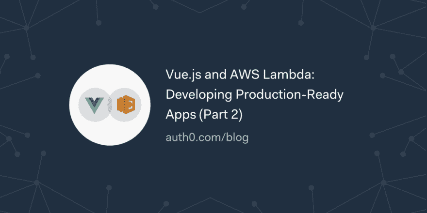

# Vue.js 和 AWS Lambda:开发生产就绪的应用程序(第 2 部分)

> 原文：<https://dev.to/auth0/vuejs-and-aws-lambda-developing-production-ready-apps-part-2-2lgf>

在本系列中，您将使用 Vue.js、AWS Lambda、Express、MongoDB 和 Auth0 等现代技术来创建一个可用于生产的应用程序，其行为就像一个微博引擎。本系列的第一部分主要关注 Vue.js 客户端的设置和 Express 后端 API 的定义。

第二部分将向您展示如何为 showtime 准备应用程序。您将首先注册 AWS 和 mLab(在那里您将部署生产 MongoDB 实例)，然后您将专注于重构您的前端和后端应用程序以支持不同的环境(在本例中，是开发和生产)。

[读读☁️](https://auth0.com/blog/vue-js-and-lambda-developing-production-ready-apps-part-2/?utm_source=dev&utm_medium=sc&utm_campaign=vuejs_lambda)

[T2】](https://res.cloudinary.com/practicaldev/image/fetch/s--ZLhBPGVC--/c_limit%2Cf_auto%2Cfl_progressive%2Cq_auto%2Cw_880/https://thepracticaldev.s3.amazonaws.com/i/e2loiwblzili9oji5fwn.png)