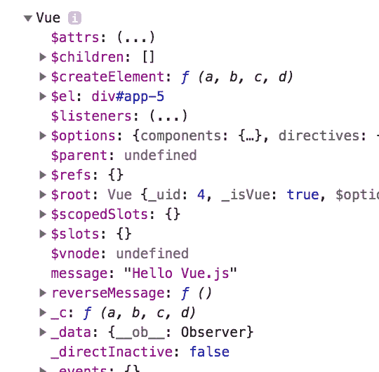
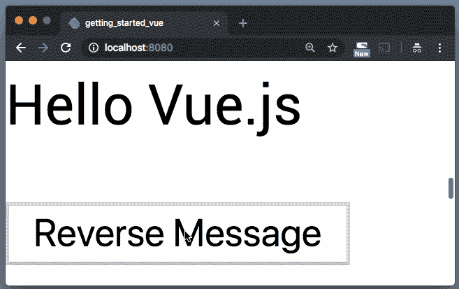

# vue . js–Dart 入门(第 2 部分)

> 原文：<https://dev.to/graphicbeacon/vuejsgetting-started-in-dart-part-2-4l90>

在本系列的第 1 部分中，我们浏览了 Vue.js 指南的几个例子，在*条件和循环*处结束。

在这一部分，我们将继续学习教程，看看*如何处理用户输入*和*如何用组件*组合。

[https://www.youtube.com/embed/O1E1TAeRlX8](https://www.youtube.com/embed/O1E1TAeRlX8)

→ [**在 YouTube 上观看**T3】](https://youtu.be/O1E1TAeRlX8)

* * *

## 处理用户输入

为了附加可以调用我们的`Vue`实例上的方法的事件监听器，我们得到了`v-on`指令来帮助我们处理这些。

假设我们的`web/index.html` :
中有这个模板

```
<div id="app-5">
  <p>{{ message }}</p>
  <button v-on:click="reverseMessage">Reverse Message</button>
</div> 
```

Enter fullscreen mode Exit fullscreen mode

JS 对应的是这样的:

```
var app5 = new Vue({
  el: '#app-5',
  data: {
    message: 'Hello Vue.js!'
  },
  methods: {
    reverseMessage: function () {
      this.message = this.message.split('').reverse().join('')
    }
  }
}); 
```

Enter fullscreen mode Exit fullscreen mode

从第 1 部分的解决方案中，我们现在能够创建一个`Vue`实例，并设置`el`和`data`信息。为了让我们能够定义`methods`，我们需要通知我们的实例这个属性。

在`web/app.dart`中，将`VueOptions`匿名类修改如下:

```
@JS()
@anonymous
class VueOptions {
  external factory VueOptions({
    String el,
    VueDataOptions data,
    VueMethodOptions methods, // <-- Add this line
  });
  external String get el;
  external VueDataOptions get data;
  external VueMethodOptions get methods; // <-- Add this line
} 
```

Enter fullscreen mode Exit fullscreen mode

接下来，在同一个文件
中创建`VueMethodOptions`工厂类

```
@JS()
@anonymous
class VueMethodOptions {
  external factory VueMethodOptions({
    Function reverseMessage,
  });
  external Function get reverseMessage;
} 
```

Enter fullscreen mode Exit fullscreen mode

`reverseMessage`是单击按钮后调用的方法。

让我们使用到目前为止在`web/main.dart`中的内容来调用我们的方法:

```
Vue(VueOptions(
  el: '#app-5',
  data: VueDataOptions(
    message: 'Hello Vue.js',
  ),
  methods: VueMethodOptions(
    reverseMessage: () {
      print('Hello, World!');
    }
  )
)); 
```

Enter fullscreen mode Exit fullscreen mode

运行本地服务器(`webdev serve --live-reload`)并访问`http://localhost:8080`。

单击按钮。你现在应该看到“你好，世界！”打印到控制台。

那么下面这一点呢？:

```
this.message = this.message.split('').reverse().join('') 
```

Enter fullscreen mode Exit fullscreen mode

您会立即发现这种尝试是行不通的，因为`Vue`上下文不在该函数中。为了在 JavaScript 中使用 Dart 函数，我们需要使用内置的`dart:js`库中的`allowInterop`或`allowInteropCaptureThis`包装函数:

```
// In main.dart
import 'dart:js'; // <-- Import this first
..
..
..
Vue(VueOptions(
  el: '#app-5',
  data: VueDataOptions(
    message: 'Hello Vue.js',
  ),
  methods: VueMethodOptions(
    reverseMessage: allowInteropCaptureThis((gotThis) {
      window.console.dir(gotThis);
    })
  )
)); 
```

Enter fullscreen mode Exit fullscreen mode

这里，`allowInteropCaptureThis`不仅用于在 JavaScript 中使用 Dart 函数，还用于捕获`this`上下文，并通过函数的第一个参数使其可用。因此，运行该逻辑并单击按钮会将`Vue`实例打印到控制台。

[T2】](https://res.cloudinary.com/practicaldev/image/fetch/s--D0CkTkRD--/c_limit%2Cf_auto%2Cfl_progressive%2Cq_auto%2Cw_880/https://thepracticaldev.s3.amazonaws.com/i/mkqrko5yt7xwmjs6hxny.png)

你会马上发现做`gotThis.message`会给你一个错误。这是因为默认情况下`gotThis`被设置为`dynamic`类型，而动态类型没有`message`属性。

要解决这个问题，我们需要将参数转换为正确的类型:

```
// `gotThis` is cast to `Vue`
allowInteropCaptureThis((Vue gotThis) {...}); 
```

Enter fullscreen mode Exit fullscreen mode

并通知我厂`message`属性:

```
// In web/app.dart
@JS()
class Vue {
  external factory Vue(VueOptions options);
  external void set seen(bool val);
  external List<Todo> get todos;
  external String get message; // <-- Added this line
  external void set message(String updatedMessage); // <-- Added this line
} 
```

Enter fullscreen mode Exit fullscreen mode

返回`web/main.dart`并按照
的方法继续操作

```
allowInteropCaptureThis((Vue gotThis) {
  gotThis.message = gotThis.message.split('').reversed.toList('').join('');
}); 
```

Enter fullscreen mode Exit fullscreen mode

我们开始吧:

[T2】](https://res.cloudinary.com/practicaldev/image/fetch/s--O-W8nCBH--/c_limit%2Cf_auto%2Cfl_progressive%2Cq_66%2Cw_880/https://thepracticaldev.s3.amazonaws.com/i/434evxbf4oatdq3rfsrt.gif)

[**观看完整视频**](https://youtu.be/O1E1TAeRlX8) 浏览其他例子。

## 结论

我希望这是有见地的，你今天学到了一些新东西。

订阅 [**我的 YouTube 频道**](https://www.youtube.com/channel/UCHSRZk4k6e-hqIXBBM4b2iA?view_as=subscriber) 了解 Dart 上的最新视频。谢谢！

**喜欢，分享，关注我**😍有关 Dart 的更多内容。

## 进一步阅读

1.  [js 包](https://pub.dartlang.org/packages/js)
2.  [如何在您的 Dart 应用程序中使用 JavaScript 库](https://dev.to/graphicbeacon/how-to-use-javascript-libraries-in-your-dart-applications--4mc6)
3.  [**用 Dart 进行全栈 web 开发**](http://bit.ly/2P2N1jC)