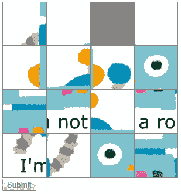

# 在 Vue 上有 Web Components 小游戏认证样本

> 原文：<https://dev.to/dala00/vueweb-components-2jp8>

好像可以在 Vue.js 上制作 Web Components 了呢。 并不是说 Vue 像 Web Components，而是可以生成真正的 Web Components。 我试着做了包括小游戏在内的样品，所以试着解说一下实际上是如何制作的。

这次用 vue-cli3 制作的项目进行了安装。

## Achievements

制作了下述内容。 要说这是什么，就是经常在网站的咨询表等上面打上“我不是机器人”这样的复选框才能发送的功能，就是那个。

[T2】](https://res.cloudinary.com/practicaldev/image/fetch/s--Da0lS5Od--/c_limit%2Cf_auto%2Cfl_progressive%2Cq_auto%2Cw_880/https://storage.googleapis.com/deviita/upload_images/0fe6836506e7d710d619551ffa0da9b65b54041cd1697.png)

图片下方只是一个 Submit 按钮，顶部图片是常见的 15 个谜题。 15 如果不解开谜题，Submit 按钮就不会生效。

接下来继续解说，因为在文章的最后有可以移动的 GitHub 网页的链接，所以如果有人读起来很麻烦的话，我完全不介意，所以请看那里(一边垂着肩膀)

## 与普通的 Vue.js 的组件有什么不同？

如果是普通的 Vue.js 组件，我想 HTML 应该如下所示。

```
<div id="app">
  <puzzle-button src="/img.png"></puzzle-button>
</div> 
```

Enter fullscreen mode Exit fullscreen mode

是用`id="app"`的 div 使 Vue 组件动作的形式呢。

与此不同，Web Components 是自己定义自己的标签，所以不需要这个 div。

```
<puzzle-button src="/img.png"></puzzle-button> 
```

Enter fullscreen mode Exit fullscreen mode

## 怎么做？

因为现在 Vue 中已经包含了`@vue/web-component-wrapper`，所以基本上只需要使用它。 似乎是以使用 vue-cli 为前提制作的，但直接通过 webpack 似乎也可以。

vue js/Vue-web-component-wrapper:将一个 Vue 组件包装成一个 web 组件/自定义元素。

通常，我想在启动 Vue 时创建 Vue 的实例，但不需要该操作，而是在上面生成 Web Components 并注册它。

```
import Vue from 'vue'
import wrap from '@vue/web-component-wrapper'
import PuzzleButton from './components/PuzzleButton.vue?shadow'

window.customElements.define('puzzle-button', wrap(Vue, PuzzleButton)); 
```

Enter fullscreen mode Exit fullscreen mode

只有这样才能使用 puzzle-button 标签。

## 与通常的基于 Vue.js 的开发的不同点

因为有几个和通常的基于 Vue.js 的开发方法有点不同，所以来解说一下。

### 属性的类型

对于 Vue.js 的组件，如果属性指定了类型，则必须按如下方式绑定:

```
<calc :value="100000"></calc> 
```

Enter fullscreen mode Exit fullscreen mode

如上所述，如果 value 为 Number，则需要绑定并直接指定数值。 但是，Web Compoents 与 Vue.js 的语法无关，因此不能用冒号绑定。 你只需要普通地指定属性。

```
<calc value="100000"></calc> 
```

Enter fullscreen mode Exit fullscreen mode

前面的`@vue/web-component-wrapper`的自述中也有记载，如果在属性的定义中指定了类型，则在组件中可以初始化为该类型的值进行使用。

### CSS 的定义

在 Vue.js 中，可以在 vue 文件中定义 CSS。 但是，Web Components 有 Shadow DOM 这个概念，这样就可以将 Web Components 的 DOM 内部与原始调用方的 DOM 隔离开来。 这样就不会反映在 vue 文件中定义的 CSS，无论是否存在 scoped。 为什么这么说呢？因为这个 style 标签会被插入到调用的 HTML 的 head 内。

因此，需要通过以下设置，将 style 标签设置为插入到 Shadow DOM 的内部。

(创建名为 vue.config.js 的文件)

```
module.exports = {
  chainWebpack: config => {
    config.module
      .rule('vue')
      .use('vue-loader')
        .loader('vue-loader')
        .tap(options => {
          options.shadowMode = true;
          return options;
        });

    config.module
      .rule('css')
      .oneOf('vue')
      .use('vue-style-loader')
        .tap(options => {
          options.shadowMode = true;
          return options;
        });
  }
} 
```

Enter fullscreen mode Exit fullscreen mode

serve 热加载时没有问题，但 production 构建时 CSS 的构建方法会稍有不同，因此会出现错误。 因此，需要将`VUE_CLI_CSS_SHADOW_MODE`的环境变量设为`true`进行构建。

我用了 cross-env，如果要做同样的事情的话，首先安装 cross-env。

```
yarn add cross-env 
```

Enter fullscreen mode Exit fullscreen mode

然后将 cross-env 说明添加到 package.json 的 build 的 scripts 中。

```
 "scripts":  {  "serve":  "vue-cli-service serve",  "build":  "cross-env VUE_CLI_CSS_SHADOW_MODE=true vue-cli-service build",  "lint":  "vue-cli-service lint"  }, 
```

Enter fullscreen mode Exit fullscreen mode

这样，build 也可以正常进行。

## Achievements

源代码已发布在 GitHub 上。

[vue-web-components-sample-GitHub](https://github.com/dala00/vue-web-components-sample)

也有可以移动的样品。 因为没有放入 polyfill，所以需要在对应的浏览器中尝试。 我用 Chrome 或者 Android 确认了。

[可以移动的样品](https://dala00.github.io/vue-web-components-sample/)

## 总结

我觉得 Web Components 非常适合反复使用细小的零件和功能。 只要构建并分发，任何人只要读入并设定标签就可以使用其功能。

在网站制作中，经常可以通过读取 jQuery 插件来实现各种功能，但是如果 Web Components 在任何浏览器中都可以正常工作，那么所有这些都将被 Web Components 所代替 设置也非常轻松，属性上可以自然设定，所以不用特意写 script 也很直观。

我扫了一眼，发现还有其他各种各样的 Web Components 开发框架性的东西，但是因为我觉得 Vue 本来就有很多人可以使用，所以从这个意义上来说，也很有可能成为选项。

接下来是履带如何分析，Vuex 的 store 是否可以在多个组件上使用共同的 state (似乎与作为 Web Components 的优点相矛盾)，各种各样的尝试看起来都很有趣。