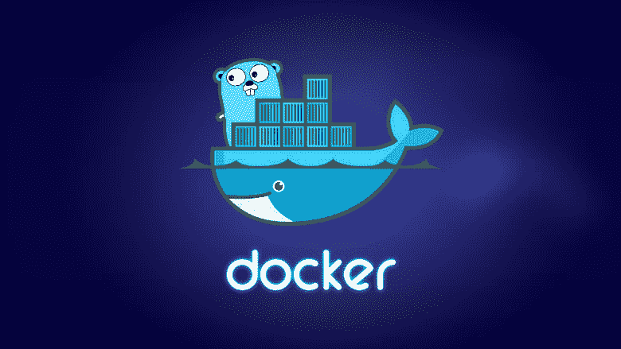

# 走过码头

> 原文：<https://dev.to/samsha1/walk-through-docker-5bm3>

[T2】](https://res.cloudinary.com/practicaldev/image/fetch/s--DrxYQQgw--/c_limit%2Cf_auto%2Cfl_progressive%2Cq_auto%2Cw_880/https://loige.co/conteimg/2014/Jun/dockerize-go-app.png)

## Docker 是什么？

Docker 是开发人员和系统管理员在笔记本电脑、虚拟机或云上构建、发布和运行分布式应用程序的开放平台。Docker 广泛用于以集装箱形式运行多个应用程序的操作。例如:一个容器可能有运行应用程序的 web 服务器，而另一个容器可能处理 web 应用程序使用的 mysql 数据库。**来源** [维基](https://en.wikipedia.org/wiki/Docker_(software))

## docker 用在哪里？

Docker 可以在很多情况下使用，现在的软件包是以更高效、更快速、更安全的方式病毒式运行的。那么，为什么不是码头工人？

让我们举个简单的例子:比如说，你的朋友想要分享一个项目，这个项目需要最新的 golang 版本，mysql 数据库和 nginx 网络服务器....现在，要手动运行这个项目，你需要的是在你的本地机器上安装相同版本的 go 系统文件、mysql 和 web 服务器。您还需要解决版本配置问题。

为了摆脱这个令人头痛的问题，让我们停止我们的项目。

首先，编写一个简单的 docker 文件。在 root_project 目录下创建一个文件名 Dockerfile。

```
FROM amd64/golang:1.10.3
WORKDIR /go/src/app
COPY . .
RUN go get -u github.com/gorilla/mux
RUN go get github.com/pilu/fresh
RUN go get github.com/sirupsen/logrus 
CMD ["fresh"] 
```

Enter fullscreen mode Exit fullscreen mode

让我们深入研究我们创建的脚本

`FROM amd64/golang:1.10.3`

使用 go 版本 go:1.10.3
提取 docker 远程报告

`WORKDIR /go/src/app`

定义 docker 容器中的工作目录。

`COPY . .`

将当前工作目录复制到 docker 容器中的/go/src/app。

`RUN go get -u github.com/gorilla/mux
RUN go get github.com/pilu/fresh
RUN go get github.com/sirupsen/logrus`

根据您的项目安装不同的包。在这里，我安装了/gorilla/mux，它实现了请求路由器和分配器，用于将传入的请求匹配到它们各自的处理程序。/pilu/fresh 是一个命令行工具，它可以在您每次保存代码时构建和(重新)启动您的 web 应用程序。同样，logrus 用于记录状态数据。请记住，这些软件包不是强制性的，会根据您的要求而有所不同。

`CMD ["fresh"]`

CMD 运行一旦我们成功地构建并运行了 docker 文件。如果你想运行一些命令，使用 CMD 就是这么简单。在这里，我使用了新命令，因为当我们 docker 运行或投影时，它会自动在 docker 中的命令中运行。

一旦我们的 docker 文件准备好，就可以构建您的 docker 应用程序

`docker build -t docker-golang.`

构建 docker 应用程序，其中-t flag 是给构建的存储库或映像的名称，就这么简单。

一次，你成功地建立了形象。您已经准备好运行

```
docker run -d -p 8090:8090 -v $(pwd):/go/src/app  --env EXAMPLE_ENV_SETUP=test_value_env --name golang-env docker-golang 
```

Enter fullscreen mode Exit fullscreen mode

docker run 命令在创建的图像上运行，其中:

```
-d //runs docker image in backgroud (optional)
-p is the port number to run the docker,left:right indicates the port to run outside and inside docker container.
-v //volume created that represents the direcory of file outside and inside docker repository
--env //enviroment value needed while running the project
--name //name of the container which makes easy to remember rather using container id 
--docker-golang //name of image or image id you created while building docker 
```

Enter fullscreen mode Exit fullscreen mode

docker 在守护模式下运行后，使用

`docker ps`

了解 docker 内部正在运行的实例。

输出:

```
CONTAINER ID        IMAGE               COMMAND             CREATED             STATUS              PORTS                    NAMES
ed07831e976a        docker-icinga-env   "fresh"             About an hour ago   Up About an hour    0.0.0.0:8090->8090/tcp   golang-env 
```

Enter fullscreen mode Exit fullscreen mode

好了，docker 中有一个正在运行的实例，您可以通过浏览器 **localhost:8090** 访问它

现在，在运行容器中运行下面的命令:

`docker exec -it <runnning container name or id> /bin/bash`

这将在容器 golang-env 中创建一个新的 Bash 会话。这个命令将带您进入 running 命令，在这里您可以检查日志并做任何您想做的事情，因为您有一个正在运行的实例。就这么简单