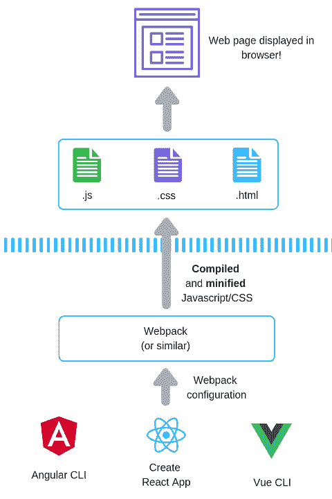

# 想转向全栈开发，但不确定从哪里开始？

> 原文：<https://dev.to/jonhilt/want-to-move-to-full-stack-development-but-not-sure-where-to-start-56pi>

曾几何时，制作一个网页很简单。

你可以创建一个 HTML 文件，包括链接到你的 CSS 和 Javascript，发布到你的 web 服务器，你就完成了。

公平地说，最近事情变得有点复杂了。

现在，如果不谈论 Node.js、webpack 和 NPM，你就无法深入“前端”开发。

然后是要处理的框架。Angular、Vue.js 或 React.js 都带来了重要的特性，但需要学习更多的概念！

那么后端开发人员该如何处理这些东西呢？

我发现这有助于将正在发生的事情形象化(嗯，谁不喜欢好的图表呢？！)

<center>

</center>

顶部是最简单的部分。这是浏览器获取 HTML、CSS 和 Javascript 并在浏览器中显示网页的地方。

蓝色虚线上方的内容是部署到 web 服务器的内容，当浏览器请求页面时会提供给浏览器。

蓝色虚线下面的部分是所有复杂性的来源。

你可以把它看作是在你的开发机器上运行的一部分。

让我们把它分解一下。

## 缩小和捆绑

如今，我们正在构建越来越大的前端应用程序，需要越来越多的代码。

虽然互联网连接相当快(总的来说),但我们仍然不想要求我们的用户下载太多代码，只是为了查看我们的 web 应用程序。

为此，如今大多数 javascript 和 CSS 都被**缩小了**。

在这个过程中，所有无关的空格、新行和长的变量/函数名等都被删除。中的 javascript 被删除或缩短，以使生成的 javascript 和 css 文件尽可能小。

多个 javascript/css 文件通常被捆绑在一起。

例如，如果您有 index.js、about.js 和 listings.js，这些都将被打包到一个文件中。这个想法是你可以改善应用程序的加载时间(通过减少浏览器加载它的请求数量)。

如今需要编译，因为你可能会发现自己编写的 Javascript 使用了并非所有浏览器都支持的新语言特性。

javascript 编译器可以将这个 Javascript“简化”成浏览器可以处理的版本。

## 网袋、包裹等应用捆扎机

你可以把 webpack 和 co .看作是前端代码的构建工具。

它们可以被配置来运行你的 Javascript 编译器，捆绑和精简你的代码以及其他各种各样的“构建时”任务。

对于像 webpack 这样的工具来说，这是一个陡峭的学习曲线，特别是对于我们这些更熟悉后端代码的人来说。

webpack 有自己独特的语法，它并不总是直观的。

这里有一个例子。

```
module.exports = {
  mode: 'development',
  entry: './foo.js',
  output: {
    path: path.resolve(__dirname, 'dist'),
    filename: 'foo.bundle.js'
  }
}; 
```

最近，我发现包是一个方便的选择(配置少得多/没有配置)。

## Javascript 框架来拯救

最后，我们有主要的 Javascript 框架。

令人高兴的是，三个主要框架背后的团队意识到你并不真的想浪费时间配置(然后调试)webpack。

这三个现在都抽象了 webpack 配置，所以你不需要担心它。

Vue.js 和 Angular 都有自己的命令行界面工具。

这些让您可以直接从命令行执行常见的任务(比如启动一个新项目)。

随着您添加新功能、引入新的依赖项等。webpack 配置是为您处理的，这意味着您永远不需要查看它(除非您真的想看！).

Create React App 做类似的工作。它本身不是一个 CLI，但也抽象了 webpack 配置。

## 现在怎么样了？

这就是大局。

当谈到主要的框架时，它们都在让你快速构建新的应用程序以便你可以进行编码方面有了飞跃。

但是他们仍然有自己的学习曲线和完成基本相同任务的不同方法(用更小的组件构建应用程序)。

那么，如何构建您的功能呢？

以下是我的方法(当学习任何“大 JS 框架”时)。

*   想出你想要构建的应用程序的想法(开始时尽可能多地进行头脑风暴)
*   选择一个感觉足够小可以建造的(但是足够有趣可以让你在困难的时候坚持下去！)
*   列出你能想到的尽可能多的特性(再次强调，不要在这一点上过滤，这是下一步)
*   现在选择一个微小的特征(开始时保持它非常小和简单)

现在你的挑战是学习足够的知识来构建这个特性。

简单的功能在这里胜出，所以显示一些文本或标题是赢家。从那里开始，接受某种输入并更新用户界面是一个很好的下一步。

现在所有的框架都有很好的文档，所以不要害怕投入并开始构建:-)

*如果你没有时间或耐心进入前端开发(我听说了)，我正在做一个[方便的袖珍指南，让你快速上手](https://products.jonhilton.net/front-end-in-four-hours/)。*