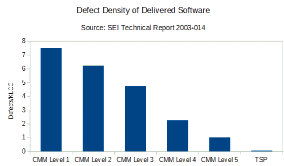

# 想写出无缺陷的软件？学习个人软件流程

> 原文：<https://dev.to/bosepchuk/want-to-write-defect-free-software-learn-the-personal-software-process-2n2>

我正在通过减少代码中的缺陷数量来成为一名更好的软件开发人员。个人软件过程(PSP)是实现超低缺陷率的少数已被证明的方法之一。在过去的几个月里，我对此进行了深入的研究。在这篇文章中，我将告诉你关于 PSP 你需要知道的一切。

### 个人软件过程的承诺(PSP)

Watts Humphrey， [PSP](https://en.wikipedia.org/wiki/Personal_software_process) / [TSP](https://en.wikipedia.org/wiki/Team_software_process) 的创造者，对遵循他的过程的个人和团队所能达到的缺陷率和生产率提出了不同寻常的要求。他写了几本关于这个主题的书，但是我今天写的是 [PSP:软件工程师的自我提升过程](https://www.amazon.com/PSP-Self-Improvement-Process-Software-Engineers/dp/0321305493/) (2005)。

[T2】](https://res.cloudinary.com/practicaldev/image/fetch/s--E9fIgRXK--/c_limit%2Cf_auto%2Cfl_progressive%2Cq_auto%2Cw_880/https://thepracticaldev.s3.amazonaws.com/i/y7y09r8l4qw7zcwuyemi.PNG)

这个图表显示了软件开发的正式性和交付软件中的缺陷数量之间的强相关性。正如你所看到的，PSP/TSP 交付了令人震惊的 0.06 缺陷/KLOC，这比你在 [CMM 二级](https://en.wikipedia.org/wiki/Capability_Maturity_Model) (6.24 缺陷/KLOC)附近徘徊的平均组织的缺陷大约少 **100 倍。印象深刻吧。**

汉弗莱进一步声称:

> 40%的 TSP 团队报告交付了无缺陷的产品。这些团队的平均生产率提高了 78% (Davis and Mullaney 2003)。质量不是免费的，而是有回报的。

底线:缺陷使得软件开发比它需要的要慢。如果您采用 PSP，并让您的团队采用 TSP，您可以显著地减少缺陷并更快地交付软件。

这似乎有悖直觉，但史蒂夫·麦康奈尔在本文中解释了为什么降低缺陷率实际上可以让你更快地交付软件:[以最高速度交付软件质量](https://stevemcconnell.com/articles/software-quality-at-top-speed/)

当然，只有遵循 PSP 这样的流程，才能获得那些收获。稍后我会解释更多，但我想绕个小弯给你讲个故事。

### 想象你理想的工作

想象一下，你是一家真正开明的公司的软件开发人员——我说的是远远超出谷歌、脸书或亚马逊或任何你认为目前软件开发最好的公司。

#### 你被指派了一名生产力教练

现在，你的雇主非常关心开发人员的生产力，以至于你公司的每个软件开发人员都被指派了一名教练。它是这样工作的。你的教练坐在你后面，看着你每天工作(没有干扰)。他详细记录了:

*   每项任务花费的时间
*   编程任务被分成几类，如需求、需求评审、设计、设计评审、编码、个人代码评审、测试、同行代码评审等。
*   非编程任务也被划分为有意义的类别，如会议、培训、管理等。
*   您注入和纠正的缺陷被记录和分类
*   你认为还有什么有用的吗

#### 你的教练代表你进行实验

在你回家之后，你的教练运行你的工作产品(需求、设计、代码、文档等。)通过几个工具提取更多的数据，比如在代码中添加和修改的代码行。当结果变得具有统计学意义时，他将来自 bug 跟踪器和其他数据源的额外数据组合并分析成有用的报告，供您审阅。

你的教练的工作是**帮助你发现如何成为最好的程序员**。所以，你可以提出实验，你的教练会安排好一切，收集数据，并向你展示结果。也许你想知道:

*   测试优先开发是否比测试最后开发更适合你？
*   设计评审值得努力吗？
*   结对编程对你有用吗？
*   每周工作超过 40 小时真的能完成更多工作吗？
*   你的个人代码审查有效吗？

你的教练会很乐意做这样的实验。或者，你的教练可能会建议你尝试一个由你的几个同事进行的实验，并取得良好的结果。重要的一点是，你的教练正在为你做所有的数据收集和分析，而你专注于编程。

听起来是不是很棒？想象一下你会变得多么富有成效。

#### 不幸的是，这是真实的世界，所以你必须成为自己的教练

这是个人软件过程(PSP)的本质。所以， ***除了开发软件，你还要学习统计学，提出实验，收集数据，分析数据，得出有意义的结论，并根据你的实验揭示的东西*** 调整你的行为。

### 什么样的个人软件流程是正确的

Humphrey 找到了软件开发中许多问题的根源:

*   项目经常被武断且不可能的截止日期所终结
*   项目中缺陷存在的时间越长，修复它的成本就越高
*   缺陷在大型项目中积累，并导致昂贵的调试和系统测试中计划外的返工
*   随着项目规模的增长，调试和缺陷修复时间呈指数增长
*   严重依赖测试是低效、耗时且不可预测的

以下是他的解决方案概述:

> 因此，目标必须是尽快从需求、设计和代码中去除缺陷。通过在您生产每一个工作产品时就对其进行评审和检查，您可以在每一个阶段将缺陷的数量减到最少。这也最小化了返工量和返工成本。它还提高了开发生产率和可预测性，并加快了开发进度 。

汉弗莱让我相信他对这个问题的所有方面都是正确的。他有数据，有说服力。然而，这个处方——你需要做什么来解决这个问题——并不吸引人，我将在下一节解释。

### 为什么几乎没有人实践个人软件过程

PSP 对于 99.9%的软件开发者来说太难理解了。成为你自己的生产力教练所需的纪律超出了大多数人的能力，尤其是在缺乏组织支持和赞助的情况下。软件开发已经是要求很高的工作了，如果你打算实践个人软件过程，现在你需要增加这整个另一层的思考、记录、数据分析和行为改变。

大多数软件开发人员不会这么做，除非你拿枪指着他们的头。如果你真的用枪指着某人的头，PSP 根本就不起作用。他们只会破坏它或者退出。

这里引用 Humphrey 书中的一段话，让你感受一下 PSP 是多么详细和过程驱动:

> PSP 推荐的个人质量管理策略是用你的计划和历史数据来指导你的工作。也就是说，从努力达到 PQI 准则开始。专注于制作一个全面完整的设计，然后用第 11 章和第 12 章中的四个 PSP 设计模板来记录这个设计。然后，当您检查设计时，花足够的时间来找到可能的缺陷。如果设计工作花了四个小时，计划花至少两个小时，最好三个小时来做检查。为了有效地完成这项工作，请根据第 9 章描述的 PSP 设计评审脚本中的指南来计划评审步骤....

从那里开始...大约 150 页。我可以看到你如何使用这种过程来创建“几乎无缺陷”的软件，但是我很难想象你可以让一屋子的开发人员自愿采用这样一个复杂的过程并成功地应用它。

但这并不是收养的唯一障碍。

### 采用的额外障碍

#### 个人软件过程应该作为一门课堂课程来教授

这门课程费用高得令人望而却步。所以，对于大多数人来说，这本书是唯一现实的选择。

你会发现，在没有同学或老师帮助的情况下，阅读这本书，应用这个过程，弄清楚如何正确填写所有表格，然后分析你的数据是很困难的。

#### 这本书假设你当前的过程是某种形式的瀑布

TDD 与你将在书中学到的 PSP 版本不兼容。你写几行，编译，运行，重复直到完成的过程也是如此。它打破了你需要计算的统计和测量，以获得你需要的反馈来跟踪你的进展。想出自己的方法来解决这些问题并不是不可能的，但这绝对是你前进道路上的另一个障碍。

没有编译阶段的语言(python，PHP 等。)也以类似的方式搞乱统计。

#### 关于评估的章节对敏捷/scrum 实践者来说没有什么价值

PSP 中有一个完整的评估过程，包括收集数据，分解任务，使用历史数据对任务的规模进行非常详细的评估，这在敏捷/scrum 时代并不重要。事实上，我没有看到任何证据表明个人软件过程评估方法比仅仅召集一群有经验的开发人员一起玩规划扑克更好。

#### 在现实世界的项目中很难收集到好的数据

如果你要计算缺陷和代码行数，你需要好的定义。乍看之下，PSP 似乎有一个合理连贯的答案。但当我真正试图收集这些数据时，我被那些我没有好答案的边缘案例淹没了。

例如，在维护中发现的缺失需求可能需要一个小时来修复，或者可能需要几个月来修复，但是您应该将它们记录为需求缺陷并记录修复时间。然后你在你的统计中使用固定时间的算术平均值。因此，一个主要的缺失需求可能会完全扭曲你的统计数据，即使它不太可能被重复。

垃圾进，垃圾出。非常令人担忧。

顺便说一下，有一些免费软件可以帮助你为 PSP 收集和分析数据。根据我的经验，这不是很有用，但它可能比纸质表格要好。

#### 你的组织需要完全参与进来

学习个人软件过程是一项巨大的投资。我想我在某处读到过，一般开发人员需要花费大约 200 个小时的专门学习来精通 PSP 流程和实践。没有多少组织会为此做准备。

PSP/TSP 工作是因为使用它的人遵循一个详细的过程。但是大多数软件开发发生在 CMM 1 级，因为整个业务都处于 CMM 1 级。我认为，一个混乱的企业不太可能看到赞助超级过程驱动的软件开发方法的价值，因为这将使软件开发人员更有生产力，并提高他们的软件质量。

你可能会说 PSP 中的第一个“P”代表“个人”,你不需要任何组织上的支持就可以自己做 PSP。这在技术上可能是正确的，但这意味着你必须自己学习它，自己实践它，并抵制所有的组织压力，无论何时管理层决定你的项目花费太长时间，都要放弃它。

### 那么个人软件过程(PSP)是不是浪费时间呢？

不，我不这么认为。汉弗莱指出了软件开发中的问题。PSP 充满了伟大的想法。大多数人无法采用个人软件过程的原因——或者甚至不愿尝试——和人们在二月份之前放弃减肥或更多锻炼的新年决心的原因是一样的:我们的大脑抵制激进的改变。这种人类怪癖背后有很多研究，如果你想了解更多，你可以阅读[改善的精神](https://www.amazon.com/Spirit-Kaizen-Creating-Lasting-Excellence-ebook/dp/B009Q0CQMA/)或[习惯的力量](https://www.amazon.com/Power-Habit-What-Life-Business-ebook/dp/B00564GPKY/)。

汉弗莱解决这个问题就像一个工程师试图让一个机器人更有效地工作，这是 PSP 的致命缺陷。软件开发人员是人，不是机器人。

因此，这里有一些关于如何从个人软件过程(PSP)中获得更符合人类心理的好处的想法。

#### 1。遵循建议，不做任何跟踪

你遵循 PSP 的目标是尽快消除尽可能多的缺陷。当你把工作交给另一个人进行同行评审和/或系统测试时，你肯定不希望工作中有任何错误。Humphrey 推荐书面需求、个人需求评审、书面设计、个人设计评审、小批量仔细编码、个人代码评审、开发和使用[清单](https://smallbusinessprogramming.com/code-review-checklist-prevents-stupid-mistakes/)等。

你可以做所有这些事情，而不用做跟踪。他甚至推荐你可以采用的不同任务的努力比例。这会让你达到 0.06 缺陷/KLOC 吗？不。但是你可能用 20%的努力完成 80%的路程。

#### 2。一次一点点采用 PSP

为了绕过你大脑中抵制彻底改变的部分，你可以在几个月内采用 PSP。也许你只是每一两个月采纳一个章节的建议。不要预先投资 200 个小时，你可以从 5-10 个小时开始，看看效果如何。

或者你可以跟踪足够的数据来证明方法 A 比方法 b 更好，一旦你满意了，你可以完全停止跟踪。例如，如果你想知道个人设计评论是否对你有帮助，你不需要一直做所有的 PSP 跟踪。你可以设置一个实验，你可以选择五个任务作为控制，五个任务作为设计评审，运行一到两周，停止跟踪，然后根据你学到的东西决定采用哪种设计评审方法。

#### 3。阅读 PSP 书籍，然后遵循一个从长远来看更有可能成功的过程

Steve McConnell 的《快速开发》讲述的是如何让你的项目处于控制之下，并更快地交付工作软件。与汉弗莱不同，麦康奈尔并不忽视人类心理。事实上，他欣然接受了。我相信大多数团队在考虑采用个人软件过程(PSP)之前，会听从 McConnell 的建议。

《快速开发》中的大多数建议是针对团队或组织的，而不是针对个人的，我认为这才是正确的焦点。PSP 是针对个人的，但是我看不出你如何用它得到好的结果，除非几乎每个为你的项目工作的人都使用它。例如，如果你团队中的每个人都在尽可能快地生产蹩脚的软件，那么你生产无缺陷软件的努力就不会对成品软件的质量或交付日期产生太大的影响。

### 我要做什么

我在两个人的团队中开发电子商务软件。我和我的同事采用了许多流程来确保只有高质量的软件才能投入生产。我们在这方面已经取得了成功；去年，我们只有 4 个严重的(但容易修复的)缺陷和几个小缺陷投入生产。我们的问题是我们有相当多的返工，因为太多的缺陷进入了同行代码评审阶段。

我给我的同事看了 PSP，他并没有兴奋地采用它，尤其是所有的跟踪。但是他愿意在我们的流程中加入设计评审。因此，我们将从那里开始，并在回顾中逐步改进我们的流程——就像我们一直在做的那样。

Rod Chapman 在 PSP 上录制了一个很好的演讲，我喜欢他的“向左移动”的想法。如果你想走得更快，节省更多的钱，你应该把你的 QA 移到开发过程的左边，或者更靠近开始的地方。对我来说听起来是对的。

### 附加资源

这里有一些资源可以帮助你更多地了解 PSP:

*   Rod Chapman 对 PSP 的精彩概述(视频)
*   [Watts Humphrey 谈论 TSP/PSP](https://youtu.be/4GFqodvsugY) (视频)
*   [支持 PSP 的 PSP 案例研究](https://pdfs.semanticscholar.org/86b9/16e062217867543889fc2c487ac368414698.pdf) (pdf)
*   对 PSP 的好处提出质疑的研究论文
*   PSP:软件工程师的自我改进过程
*   [链接到本书的编程练习](https://smallbusinessprogramming.com/where-to-find-the-psp-programming-exercises/)(网站)
*   [流程仪表板](https://www.processdash.com/)-PSP 支持工具(网站)

### 外卖

很难推荐个人软件过程(PSP ),除非你正在构建安全关键软件，或者你已经得到了优秀的组织支持和赞助。大多数开发人员会发现个人软件过程势不可挡，令人沮丧，并且与他们的工作需求不太兼容。

另一方面，PSP 充满了好主意。我知道你们大多数人不会采纳。但是这并不妨碍你使用 PSP 的一些想法来提高你的软件质量。我概述了三条替代途径，你可以在不做完整的个人软件过程(PSP)的情况下获得 PSP 的一些好处。我希望这些选项中有一个能吸引你。

你试过 PSP 吗？你试过 PSP 吗？我很想在评论中听到你的想法。