# 沃森视觉识别—定制模型

> 原文：<https://dev.to/lidderupk/watson-visual-recognition--custom-models-15go>

[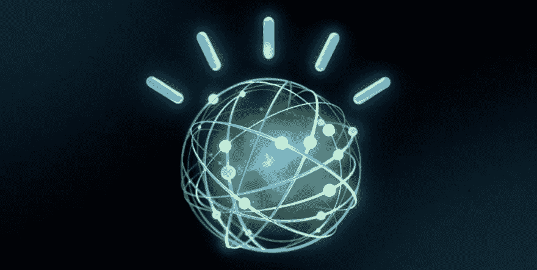T2】](https://res.cloudinary.com/practicaldev/image/fetch/s--iDiH1mZa--/c_limit%2Cf_auto%2Cfl_progressive%2Cq_auto%2Cw_880/https://cdn-images-1.medium.com/max/1024/1%2AZa2J-XXjPUPcsXdQ9DNWKA.jpeg)

在图像和视频中识别对象和模式曾经是一项复杂的任务，只有熟悉机器学习的数据科学家和软件工程师才能完成。由于开源库的进步和大量数据的可用性，该领域的准入门槛在过去几年中大幅降低。正如我们将在这篇文章中看到的那样，IBM 通过其 Watson 视觉识别服务使检测图像中的物体变得非常简单。

如果你想跟随而不是阅读这篇博客，这里有[快速视频](https://youtu.be/7gVVJnNZw5o)。

[https://www.youtube.com/embed/7gVVJnNZw5o](https://www.youtube.com/embed/7gVVJnNZw5o)

他们提供了几个内置模型

1.  **通用模型** —从数千个类别中默认分类

2.  **人脸模型** —年龄和性别的人脸分析

3.  **显式模型** —图像是否不适合一般用途

4.  **食品模型** —专门用于食品的图像

5.  **文本模型** —从自然场景图像中提取文本

此外，它们提供了一个非常直观的界面来构建和训练定制模型。你只需要几样东西就可以开始了。

*   IBM Cloud 帐户登录到 Watson 数据平台
*   至少两个类别用于分类，每个类别至少 10 个阳性图像。
*   建议使用不属于任何其他目标类别的阴性样本。

#### 一步一步的指令来训练一个自定义模型

Watson 视觉识别服务有一个[ [API Explorer 站点](https://watson-api-explorer.ng.bluemix.net/apis/visual-recognition-v3)]([https://Watson-API-Explorer . ng . bluemix . net/APIs/Visual-Recognition-v3](https://watson-api-explorer.ng.bluemix.net/apis/visual-recognition-v3))可以用来分析图像。我给了它一个[[Raspberry Pi image](https://www.raspberrypi.org/app/uploads/2017/05/Raspberry-Pi-Model-B-1-462x322.jpg)]([https://www . Raspberry Pi . org/app/uploads/2017/05/Raspberry-Pi-Model-B-1-462 x322 . jpg](https://www.raspberrypi.org/app/uploads/2017/05/Raspberry-Pi-Model-B-1-462x322.jpg))，它返回了以下关键词。

[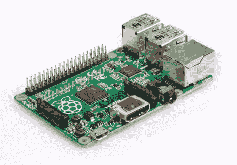T2】](https://res.cloudinary.com/practicaldev/image/fetch/s--3KJF-gN2--/c_limit%2Cf_auto%2Cfl_progressive%2Cq_auto%2Cw_880/https://cdn-images-1.medium.com/max/462/1%2A9cvwKx2mLgyu9cvaadRnpg.jpeg)

[https://medium . com/media/79 f1 b 680 fc 50 e 681 fa 073 aff 337 a5db 9/href](https://medium.com/media/79f1b680fc50e681fa073aff337a5db9/href)

成绩一点都不差。该图片被识别为具有高可信度的电路。

> **电气装置— 0.905**
> 
> **计算机电路— 0.904**

这些类别本身是正确的， ***但是我们希望能够区分不同类型的 Raspberry Pi 板。*T3】**

#### 关于创建自定义模型的分步说明，可以区分不同的 Raspberry Pi 板。

**第一步——登录沃森数据平台**

[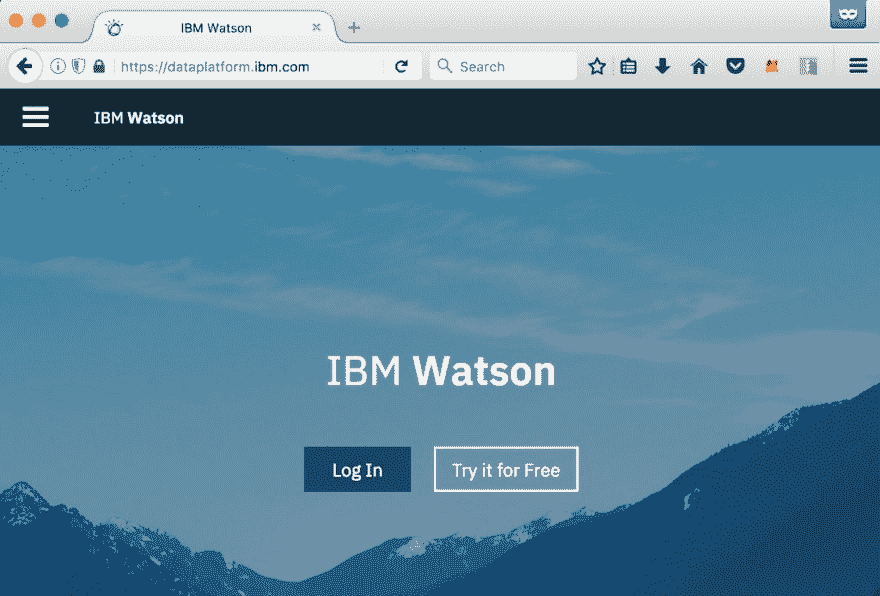T2】](https://res.cloudinary.com/practicaldev/image/fetch/s--xZFMGRJ2--/c_limit%2Cf_auto%2Cfl_progressive%2Cq_auto%2Cw_880/https://cdn-images-1.medium.com/max/1024/1%2Ai1XB0gA_V6FV1BAaQObLcg.jpeg)

登录后，您将会在主控制面板上看到有用的提示。

[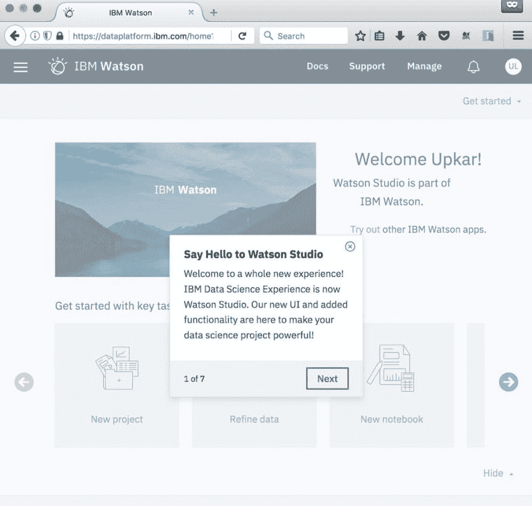T2】](https://res.cloudinary.com/practicaldev/image/fetch/s--igQ5ayJg--/c_limit%2Cf_auto%2Cfl_progressive%2Cq_auto%2Cw_880/https://cdn-images-1.medium.com/max/1024/1%2Agk24ksNrk3crIFWHJrEAiA.jpeg)

**步骤 2——创建一个新的*视觉识别*项目**

[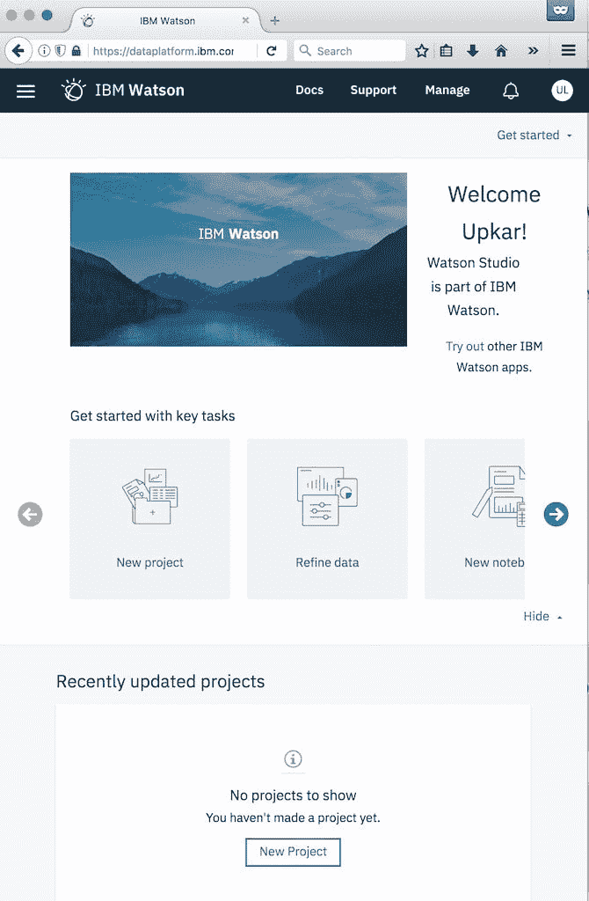T2】](https://res.cloudinary.com/practicaldev/image/fetch/s--QjhbvE_L--/c_limit%2Cf_auto%2Cfl_progressive%2Cq_auto%2Cw_880/https://cdn-images-1.medium.com/max/670/1%2AKngY8UkDzP315z8lMNAuLQ.jpeg)

[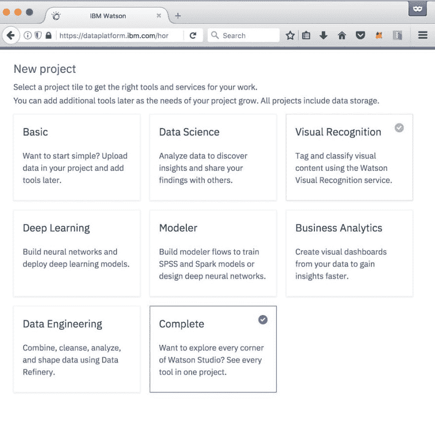T2】](https://res.cloudinary.com/practicaldev/image/fetch/s--pwLuGGjI--/c_limit%2Cf_auto%2Cfl_progressive%2Cq_auto%2Cw_880/https://cdn-images-1.medium.com/max/995/1%2Ah5so7n-Ey_FtMExdSVwtcw.jpeg)

**步骤 3——向您显示定制型号屏幕**

[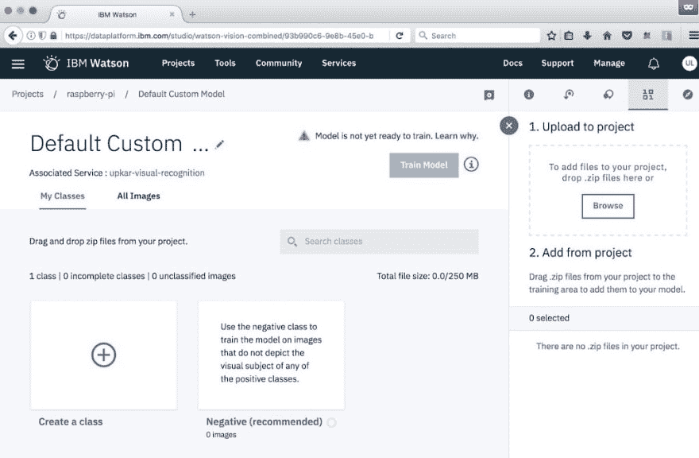T2】](https://res.cloudinary.com/practicaldev/image/fetch/s--8Mv3bIev--/c_limit%2Cf_auto%2Cfl_progressive%2Cq_auto%2Cw_880/https://cdn-images-1.medium.com/max/1024/1%2AuISX_XFHXHo7P804Nxxt2g.jpeg)

**步骤 4——将训练图像组织到正确的文件夹中**

我下载了一打 Raspberry Pi 型号 A Plus 和 Raspberry Pi 型号 B Plus 板的图像。此外，我下载了一些消极的形象(董事会都不是)。文件夹结构应该如下所示:

[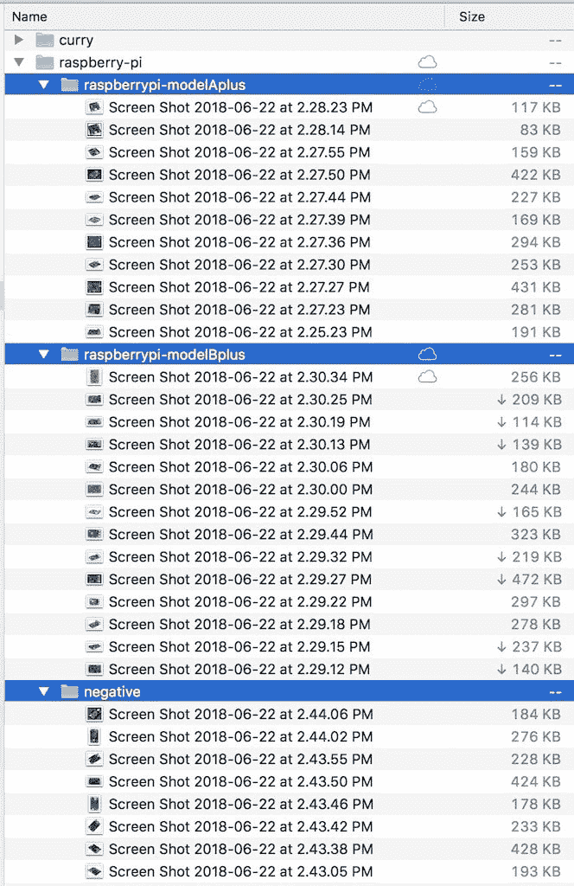T2】](https://res.cloudinary.com/practicaldev/image/fetch/s--EgFqqSL3--/c_limit%2Cf_auto%2Cfl_progressive%2Cq_auto%2Cw_880/https://cdn-images-1.medium.com/max/664/1%2AeMRf43blwWCXxx9oL3qYLQ.jpeg)

**步骤 5——创建要上传的 zip 文件**

[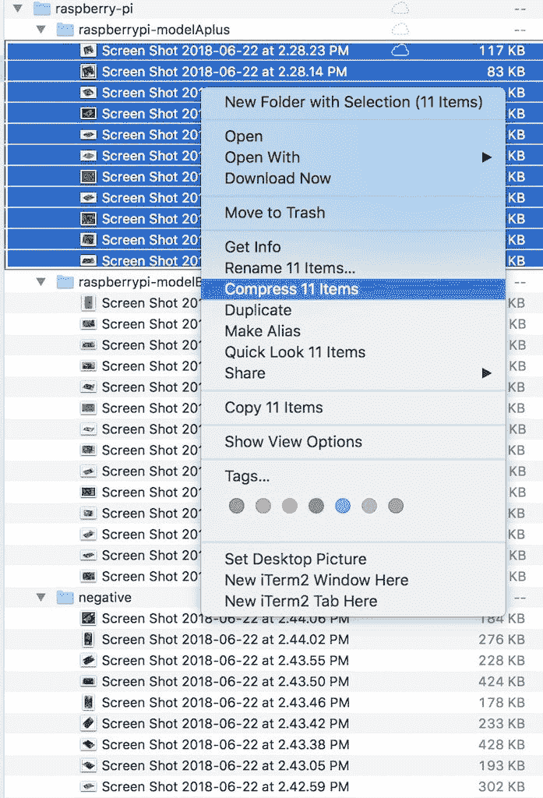T2】](https://res.cloudinary.com/practicaldev/image/fetch/s--fVwe5a7z--/c_limit%2Cf_auto%2Cfl_progressive%2Cq_auto%2Cw_880/https://cdn-images-1.medium.com/max/697/1%2AmuFnFWm_L6Jmw9xEqOu0zg.jpeg)

为所有文件夹完成此操作后，它应该看起来像这样:

[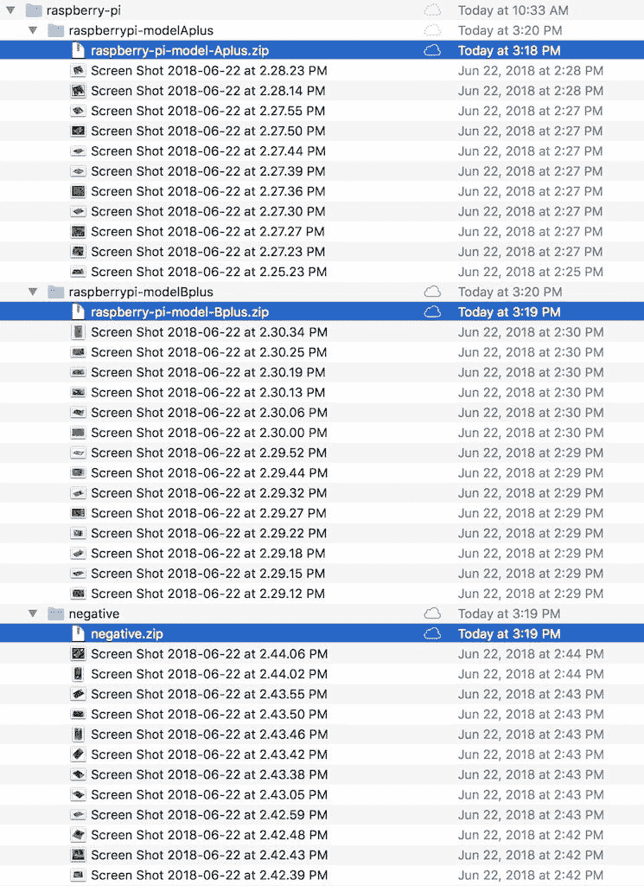T2】](https://res.cloudinary.com/practicaldev/image/fetch/s--CBk1WLto--/c_limit%2Cf_auto%2Cfl_progressive%2Cq_auto%2Cw_880/https://cdn-images-1.medium.com/max/745/1%2AVWT3oJ68EZSy6TfQAa1icg.jpeg)

**步骤 6 —将 zip 文件拖放到资产部分**

[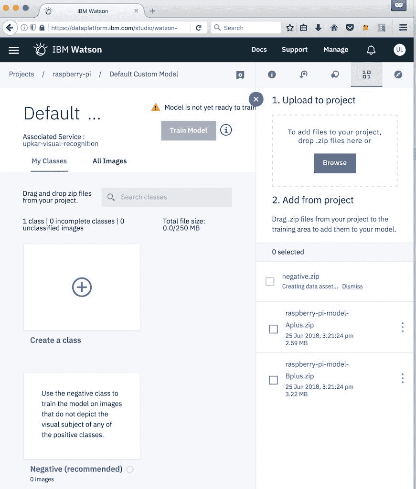T2】](https://res.cloudinary.com/practicaldev/image/fetch/s--dwpZDXyM--/c_limit%2Cf_auto%2Cfl_progressive%2Cq_auto%2Cw_880/https://cdn-images-1.medium.com/max/871/1%2AUCHlioP_q-0UNTRjg7CX4w.jpeg)

**步骤 7 —创建两个类**

*   RaspberryModelAPlus
*   RaspberryModelBPlus

**步骤 8 —将培训文件拖放到各自的文件夹中**

[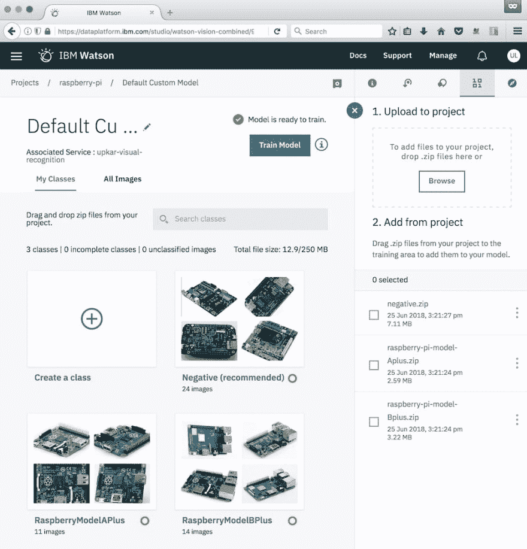T2】](https://res.cloudinary.com/practicaldev/image/fetch/s--pAtR4R0E--/c_limit%2Cf_auto%2Cfl_progressive%2Cq_auto%2Cw_880/https://cdn-images-1.medium.com/max/983/1%2ApJ3Osm5SJ2GJ2oZZCHSgKw.jpeg)

第九步——就这样！现在让我们来训练这个定制模型

[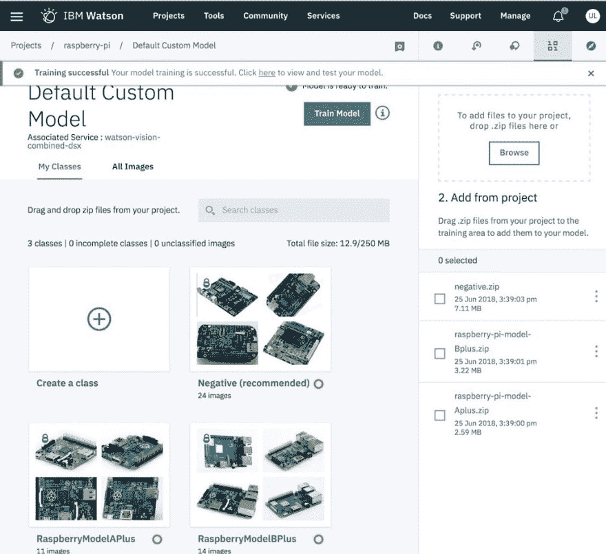T2】](https://res.cloudinary.com/practicaldev/image/fetch/s--zq5Kh8FI--/c_limit%2Cf_auto%2Cfl_progressive%2Cq_auto%2Cw_880/https://cdn-images-1.medium.com/max/1024/1%2AadsYZaAKE7rFJz2PI4NE_g.jpeg)

**步骤 10——测试我们模型的时间**

模型训练完成后，页面会给你一个测试模型的链接。该链接的第一页总结了该模型。

[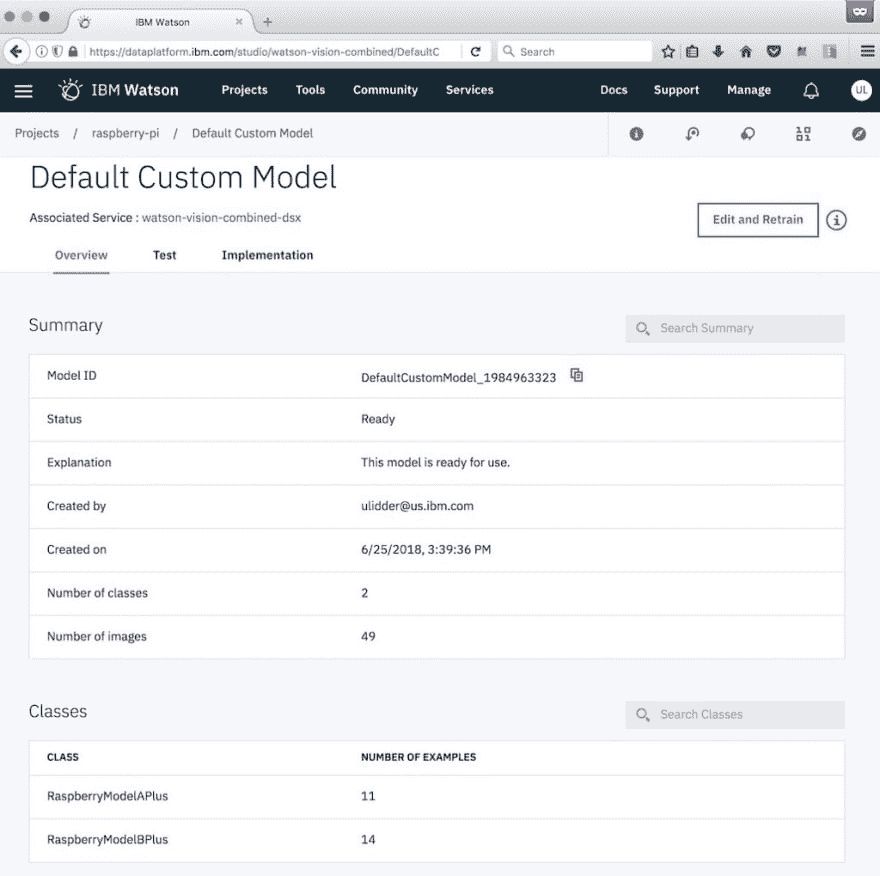T2】](https://res.cloudinary.com/practicaldev/image/fetch/s--SYZgEa-d--/c_limit%2Cf_auto%2Cfl_progressive%2Cq_auto%2Cw_880/https://cdn-images-1.medium.com/max/1024/1%2A2Uo1b2Wbujf-KCVvOCovEQ.jpeg)

单击测试选项卡。

我下载了一些不同角度和背景的测试图片，看看模型的表现如何。

[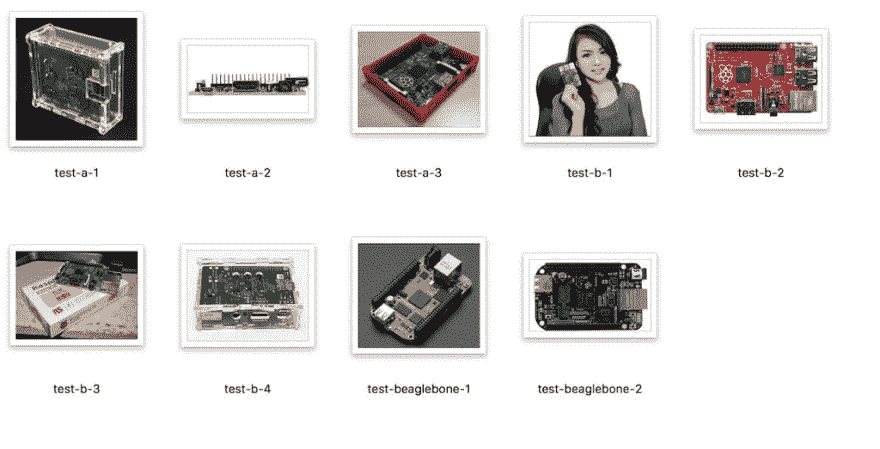T2】](https://res.cloudinary.com/practicaldev/image/fetch/s--Q1dT0U4z--/c_limit%2Cf_auto%2Cfl_progressive%2Cq_auto%2Cw_880/https://cdn-images-1.medium.com/max/1024/1%2AzZB8LgkYhb5hLEc0VNa-nQ.jpeg)

将图像拖放到测试页面上。

**测试结果**

***1。树莓 Pi 模型 A Plus 在一个开放的外壳。*T3】**

[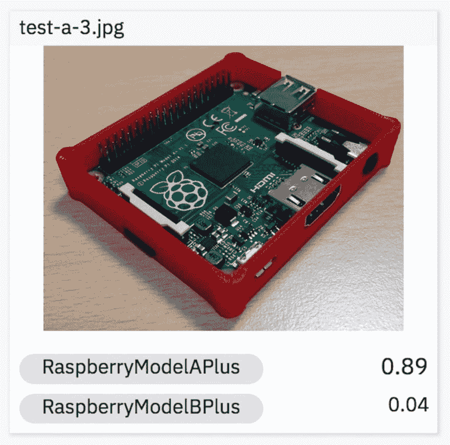T2】](https://res.cloudinary.com/practicaldev/image/fetch/s--FAfi3R2h--/c_limit%2Cf_auto%2Cfl_progressive%2Cq_auto%2Cw_880/https://cdn-images-1.medium.com/max/1024/1%2ACP7PGgY6Q3LD-HBeUBZXNw.jpeg)

0.89 还不算太差，因为我们没有在开放的封闭空间内拍摄任何训练照片。

***2。树莓 Pi 型号 A 加侧角。*T3】**

[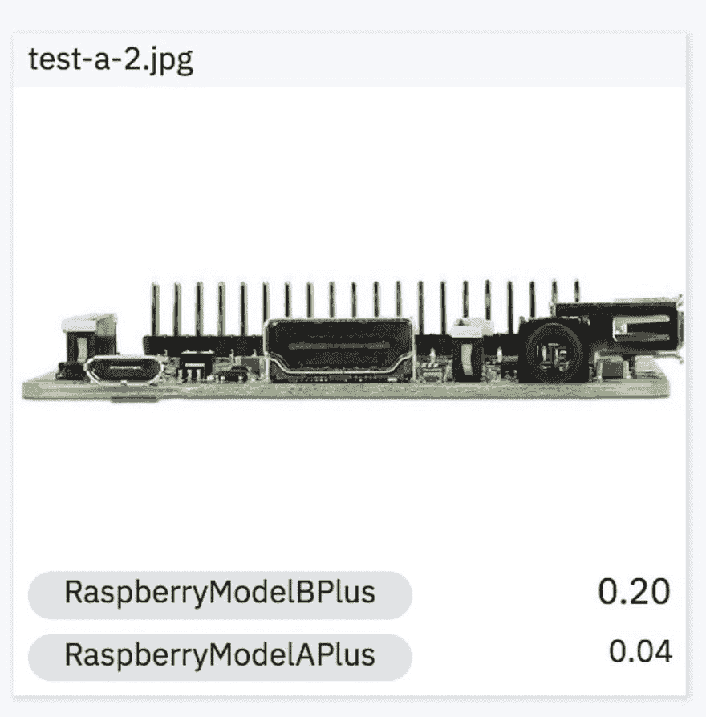T2】](https://res.cloudinary.com/practicaldev/image/fetch/s--mccx0bA2--/c_limit%2Cf_auto%2Cfl_progressive%2Cq_auto%2Cw_880/https://cdn-images-1.medium.com/max/1008/1%2AUhXDJaguL1WJovjxZ6H-8A.jpeg)

我们没有任何这个角度的训练图片。这解释了低置信区间。

***3。Raspberry Pi 型号 A Plus 在封闭电路板中，引脚不可见。*T3】**

[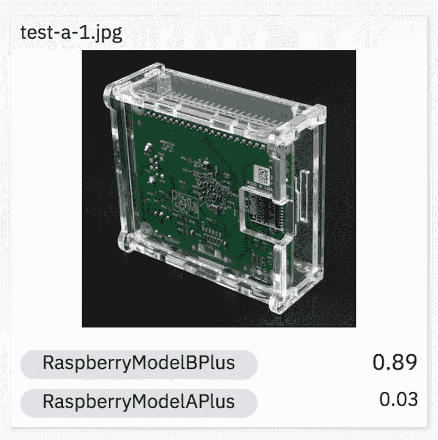T2】](https://res.cloudinary.com/practicaldev/image/fetch/s--Ip_SdUWs--/c_limit%2Cf_auto%2Cfl_progressive%2Cq_auto%2Cw_880/https://cdn-images-1.medium.com/max/1021/1%2ANJXzvY57VsztvwfNkvZztg.jpeg)

这张图很模糊。我认为即使是人类也会有非常低的自信。在这种情况下，模型识别出这是完全错误的板。

***4。树莓 Pi 模型 b+在某人的手中。*T3】**

[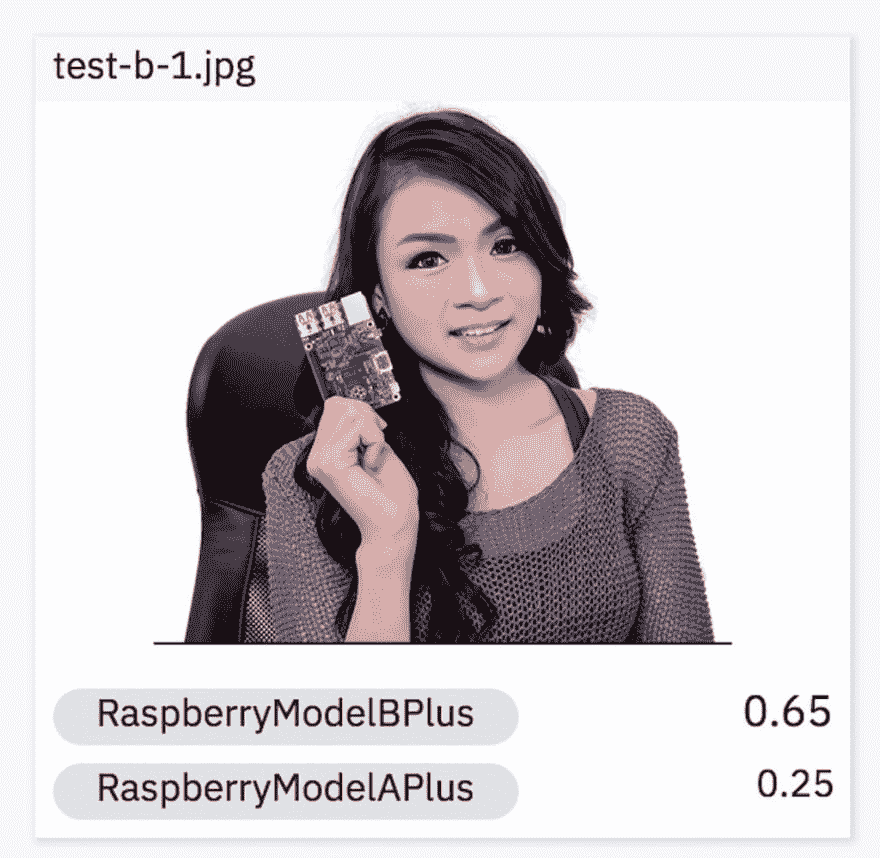T2】](https://res.cloudinary.com/practicaldev/image/fetch/s--lyC_kjsR--/c_limit%2Cf_auto%2Cfl_progressive%2Cq_auto%2Cw_880/https://cdn-images-1.medium.com/max/1024/1%2AJvWQt1ZK7zqz9cRB50a14A.jpeg)

我希望通过引入一个人来欺骗这张图片的模型，并使实际的电路板变小。但是该模型在这里表现相对较好，置信度为 0.65。这肯定可以通过训练人们手中拿着圆周率的图片来提高。

***5。Raspberry Pi Model B Plus 的颜色在训练图像中不存在。*T3】**

[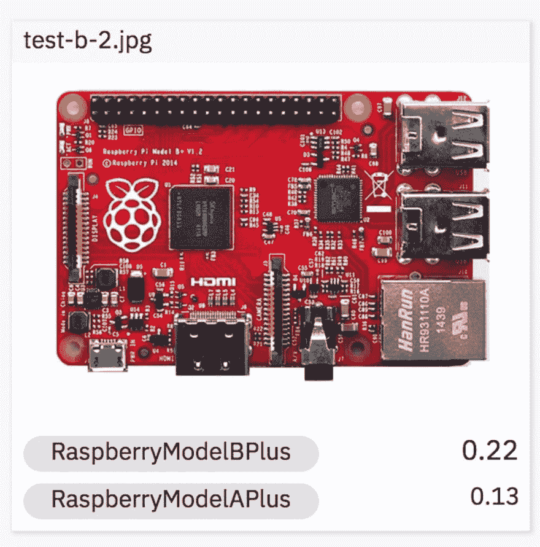T2】](https://res.cloudinary.com/practicaldev/image/fetch/s--NVEyXv-g--/c_limit%2Cf_auto%2Cfl_progressive%2Cq_auto%2Cw_880/https://cdn-images-1.medium.com/max/1011/1%2AePi-kZAHufjpi7_gOFBVxA.jpeg)

两个模型的置信区间都很低。我想这是因为我们所有的训练图像都是绿色的。该模型创建层或信息来自学，其中一个重要的信息是颜色。因此，即使测试图像具有正确的结构，模型之前也从未见过红色圆周率。这也可以通过在训练集中包含红色图像来纠正。

***6。树莓 Pi 模型 b+在一个盒子的顶部与远程拍摄。*T3】**

[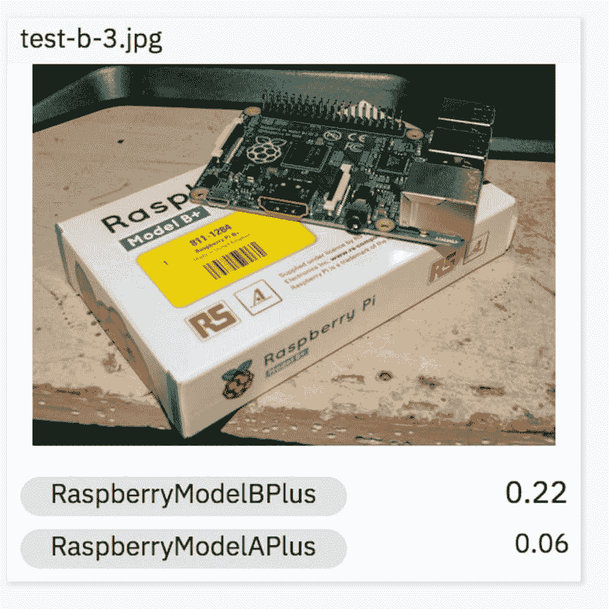T2】](https://res.cloudinary.com/practicaldev/image/fetch/s--8aBTIwl0--/c_limit%2Cf_auto%2Cfl_progressive%2Cq_auto%2Cw_880/https://cdn-images-1.medium.com/max/1024/1%2AhURHi37oq_VCfRvJ3KF3dQ.jpeg)

训练数据都有特写镜头，这个测试图像离相机有点远。这里的教训是，训练集需要有尽可能多的变化。

***7。raspberry Pi B Plus 型号在外壳中，看不到引脚。*T3】**

[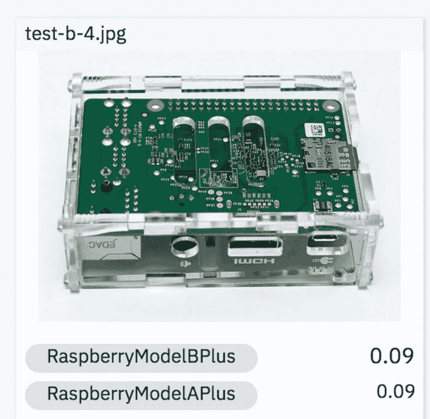T2】](https://res.cloudinary.com/practicaldev/image/fetch/s--omRXnZ6o--/c_limit%2Cf_auto%2Cfl_progressive%2Cq_auto%2Cw_880/https://cdn-images-1.medium.com/max/1024/1%2A6detXg8xOC5DN2aIjP_GGg.jpeg)

***8。猎兔犬*T3】**

[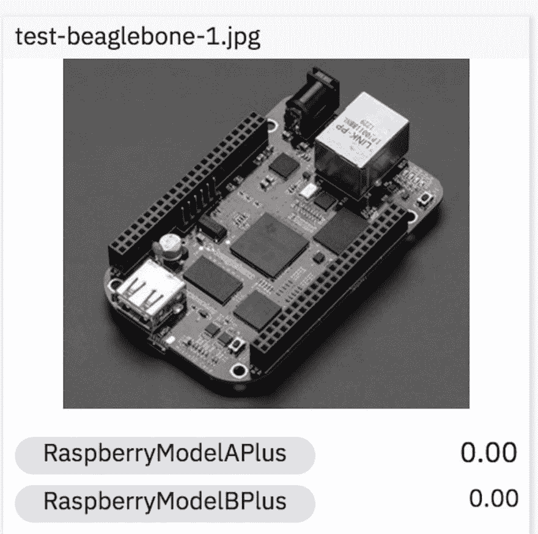T2】](https://res.cloudinary.com/practicaldev/image/fetch/s--eVGxIRER--/c_limit%2Cf_auto%2Cfl_progressive%2Cq_auto%2Cw_880/https://cdn-images-1.medium.com/max/1024/1%2Ac0o9DdGWqptJ06PDRAzWZA.jpeg)

[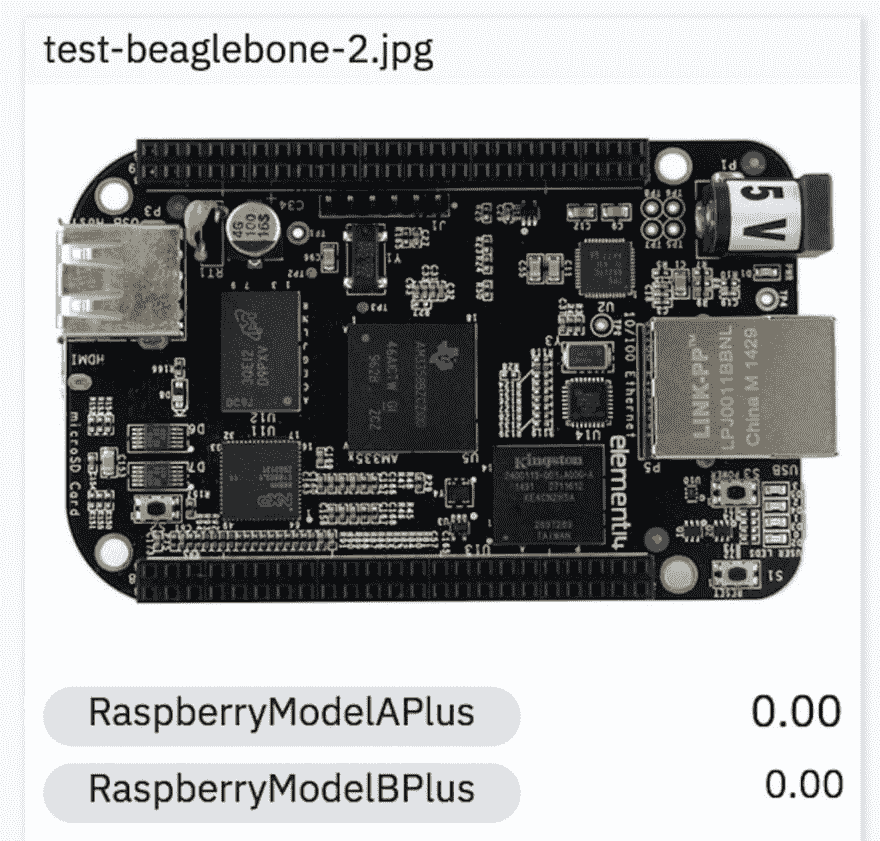T2】](https://res.cloudinary.com/practicaldev/image/fetch/s--J1kVEzpf--/c_limit%2Cf_auto%2Cfl_progressive%2Cq_auto%2Cw_880/https://cdn-images-1.medium.com/max/1024/1%2Au0KbJBaE_6syU6sD1QuWjA.jpeg)

最后两张图片来自不同的电路板。那块特定的木板(不是这些图片本身)是模型被训练的负面场景的一部分。因此，它正确地将该板识别为两个测试类中的任何一个。

#### 总结

所以你有它。我们在 Watson 视觉识别器上建立了一个自定义模型，并训练它检测不同版本的 Raspberry Pi 板，而无需编写任何一行代码或了解机器学习的来龙去脉。你的模型和它被训练的图像一样好。如果我用我的 iPhone 拍一张照片，并对这个模型进行测试，我预计我对这两个类别的信心都很低。

本系列的下一篇博客将讨论认知服务可用于以编程方式对图像进行分类的各种 API。我们将在 Glitch 上构建一个简单的应用程序，这是我最喜欢的在线应用程序❤️

[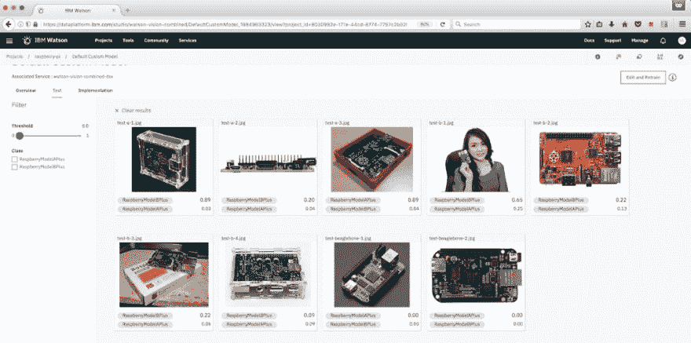T2】](https://res.cloudinary.com/practicaldev/image/fetch/s--GSi3zlSG--/c_limit%2Cf_auto%2Cfl_progressive%2Cq_auto%2Cw_880/https://cdn-images-1.medium.com/max/1024/1%2A5yNGzixlXiuuzGrmYmwiMg.jpeg)

Nick Bourdakos 有另一篇精彩的[文章，它延伸到了关于 Watson 的 CoreML](https://hackernoon.com/simplify-adding-ai-to-your-apps-core-ml-say-hello-to-watson-c4dfebf66802)。

* * *