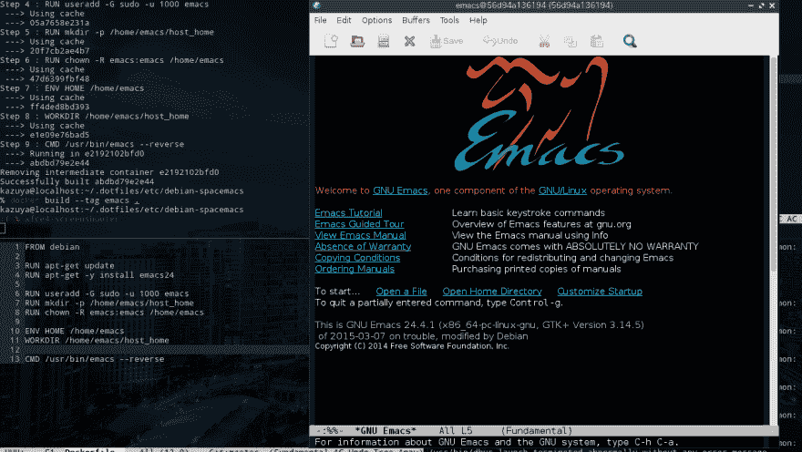
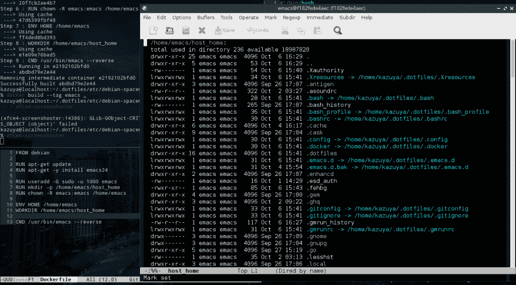

# 我们甚至可以用 Docker 虚拟化 GUI 文本编辑器

> 原文：<https://dev.to/acro5piano/we-can-virtualize-even-gui-text-editor-with-docker-container--5bhh>

最近，我用 Docker 虚拟化了几乎所有东西。

最后，我用 GUI 虚拟化了我的 Emacs，因为我使用的是 Arch Linux，它不能为包名称空间冲突提供`emacs-mozc`和`fcitx-mozc`。

所以我在 Docker 容器中安装了带有 X11 客户端的 Emacs，然后向主机的 X11 服务器显示 Emacs 屏幕。

# 环境

*   主机操作系统:Arch Linux
*   来宾操作系统:Debian GNU/Linux
*   Docker 版本:1.12.1

# 程序

首先，写得相当简单`Dockerfile`。希望安装一些像`emacs-mozc`或者`cask`这样的工具。

```
FROM debian:latest

RUN apt-get update
RUN apt-get -y install emacs24

RUN useradd -G sudo -u 1000 --create-home emacs

ENV HOME /home/emacs
WORKDIR /home/emacs

CMD /usr/bin/emacs --reverse 
```

Enter fullscreen mode Exit fullscreen mode

然后在`Dockerfile`以上的目录下运行`docker build --tag emacs .`。

接下来，创建一个启动脚本，并将其放在一个目录中。`$PATH`必须包括目录。

```
#!/bin/bash

xhost +local:
docker run -it --rm \
       -v /tmp/.X11-unix:/tmp/.X11-unix \
       -v $HOME:/home/emacs/host_home \
       -e DISPLAY=$DISPLAY \
       --user 1000 \
       emacs

xhost -local: 
```

Enter fullscreen mode Exit fullscreen mode

上面的代码就是这么做的

*   将`$DISPLAY` env 变量传递给容器
*   共享`$HOME`目录用于一般用途
*   在主机和容器之间共享`/tmp/.X11-unix`以连接 X11 套接字

最后启动 emacs:

`emacs-docker`

有用！

[T2】](https://res.cloudinary.com/practicaldev/image/fetch/s--5BDF0-Jm--/c_limit%2Cf_auto%2Cfl_progressive%2Cq_auto%2Cw_880/https://qiita-image-store.s3.amazonaws.com/0/103885/078982d6-5daa-263a-2542-50e0c1c6f2f4.png)

为了检查主机和客户机的交互，让我们运行`dired` emacs 文件浏览器。

[T2】](https://res.cloudinary.com/practicaldev/image/fetch/s--eYEtC7K_--/c_limit%2Cf_auto%2Cfl_progressive%2Cq_auto%2Cw_880/https://qiita-image-store.s3.amazonaws.com/0/103885/fdc59c7a-6144-975f-4ee4-04f17240baa9.png)

是，主机的`$HOME`已安装到容器中。
在容器中这些文件的所有者被识别为 Docker 执行用户(emacs)。因为 UID `1000`匹配。

# 注意

*   如果主机 UID 和来宾 UID 不匹配，由于权限问题，我们无法编辑文件。
*   我们不能像 Docker，LXC 那样在容器中使用符号链接。这有时候真的很不方便。

这个帖子某种程度上是一种玩笑，但我会积极使用 emacs-docker。

# 附录

有`/tmp/.XIM-unix`目录。如果我们安装它，那么我们可能可以虚拟化 XIM 功能。

集装箱是一个梦想。