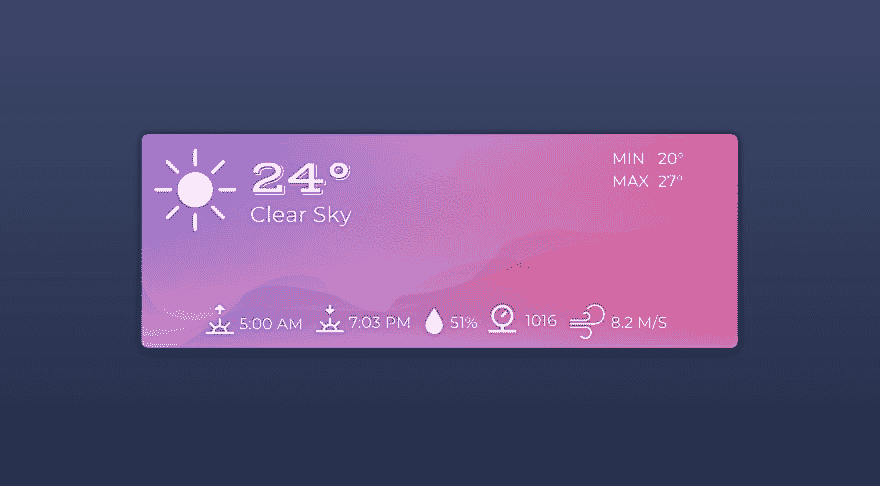

# 天气应用:使用 Vue 和 Axios

> 原文：<https://dev.to/fabiorosado/weather-app-using-vue-and-axios-4ia6>

[](https://res.cloudinary.com/practicaldev/image/fetch/s--qNuVDPOx--/c_limit%2Cf_auto%2Cfl_progressive%2Cq_auto%2Cw_880/https://thepracticaldev.s3.amazonaws.com/i/tqby077qjt8g6z8smqcv.jpg) 
*我花了相当多的时间来写这个教程，主要是我写博客来确保我正确地学到了一些东西。这是从我的[个人博客](http://fabiorosado.co.uk)发来的帖子，我希望你喜欢这个教程，我渴望得到你的反馈！*

* * *

freecodecamp 面临的挑战之一是构建一个天气应用程序。这个想法很简单。从提供的 API 中获取天气数据，构建一个函数将温度从摄氏度转换为华氏度，并显示当前天气。

在本文中，我不打算写一个如何完全解决这个挑战的演练，但是如果您不知道该怎么做，这可能是一个好的开始。

我将向您展示的是如何使用 Vue 和 Axios 连接到 [OpenWeatherMap Api](https://openweathermap.org) ，从一个城镇(伦敦)获取天气数据并显示出来。

## OpenWeatherMap API

为了让您连接到 API，您需要一个 API 密钥，否则，服务器将拒绝您的连接尝试。

点击[本页面](https://openweathermap.org/api)中当前天气数据下的`subscribe`按钮，可以获得一个免费的 API 密匙。

API 将返回 JSON 格式的数据，但是您需要提供一些东西来获得它:

*   终点
*   API 密钥
*   获取数据的单位(摄氏度、华氏度)-默认为英制
*   城市名称、坐标、邮政编码或城市 id

您可以检查 API 期望您传递的参数，以从[文档页面](https://openweathermap.org/current)获得正确的 JSON 数据。

在本文中，我声明**公制(摄氏度)**为单位，**伦敦**为城市名称。因此，API 链接将如下所示:

`http://api.openweathermap.org/data/2.5/weather` + `?q=London` + `&?units=metric` + `&APPID={API KEY}`

我已经划分了链接，因此您可以看到如何向 API 端点添加参数以获得您想要的数据。

这是 API 链接的外观:

`http://api.openweathermap.org/data/2.5/weather?q=London&?units=metric&APPID={API KEY}`

如果您在链接的末尾添加您的 API 密钥，并将其粘贴到您的浏览器中，您将获得您需要的所有数据。现在，我们要做的就是将数据导入 Vue。

## 用 Axios 获取天气数据

在 Javascript 中，您可以使用不同的工具从 API 获取数据。在本文中，我使用的是 axios。从 API 获取数据的方式实际上没有太大变化。如果你使用不同的工具，你应该不会有任何问题。

要使用 axios，你可以选择`npm install axios`或将 CDN 链接`<script src="https://unpkg.com/axios/dist/axios.min.js"></script>`添加到你的页面。

在本文中，我使用的是 CDN 链接中的 axios。

您需要编写的代码非常简单。首先，我们调用 axios，然后我们从一个 URL 发出 get 请求，然后我们要么得到一个响应，要么在返回一个错误时捕获错误。

代码将如下所示:

```
axios
  .get(url)
  .then(response => {
    console.log(response.data);
})
  .catch(error => {
    console.log(error);
}); 
```

Enter fullscreen mode Exit fullscreen mode

如果你想知道为什么我们得到`response.data`而不仅仅是回应，原因很简单。`response`不仅会返回数据，还会返回状态代码、标题和请求类型。

使用 openweathermap URL 并添加另一个`console.log(response);`，看看当您运行代码时会得到什么。

## 创建 Vue 应用

我不会深入讨论 VueJs 或者如何用它创建一个应用程序。但是非常简单的基础是通过触发 Vue 对象到 div id 来创建一个应用程序。

一个 Vue app 长这样:

```
let weather = new Vue ({
  el: "#app",
  data: {

  },
  methods: {

  }
}) 
```

Enter fullscreen mode Exit fullscreen mode

`el`参数是您的`html`中 div 的`id`。这个 div id 通常被称为`app`，但是你可以随意命名它，只要确保你在 Vue 对象中改变了`el`。

`data`参数包含你的应用程序可能需要的所有数据，通常，你会在这里创建变量，然后使用或修改它们。这也是 VueJs 试图获取变量名来翻译 HTML 中的标签`{{name}}`的地方。

`methods`参数是您指定使用应用程序时可能要调用的所有函数的地方。

为了使用 VueJs，你必须使用命令`npm install vue`或者在你的页面上添加 CDN 链接`<script src="https://cdn.jsdelivr.net/npm/vue@2.5.17/dist/vue.js"></script>`来安装它。

如果你对这个框架一无所知，我希望这个简短快速的介绍能帮助你理解 Vue。

## 打造天气 App

现在我们已经有了如何连接到 OpenWeatherMap API、如何使用 axios 以及如何创建 Vue 应用程序的基本知识，我将向您展示如何创建天气应用程序。

### HTML & CSS

应用程序的 HTML 将是非常基本的。该页面将有一个背景和一个中心 div，带有 Vue 将使用的`id="app"`。这个 div 也将有一个简单的背景图像，只是为了让它看起来更好。

所以，让我们从创建 HTML 代码开始。我们将导入我们的`css`和`js`文件，以拥有一个工作网页，我们还将导入 VueJs、axios 和我们将在应用程序中使用的两种字体。

```
<!doctype html>
<html>
  <head>
    <meta charset="utf-8">
    <meta http-equiv="x-ua-compatible" content="ie=edge">
    Weather App
    <meta name="viewport" content="width=device-width, initial-scale=1">
    <link rel="stylesheet" type="text/css" media="screen" href="main.css" />
    <link href="https://fonts.googleapis.com/css?family=Montserrat:extra-light|Vast+Shadow" rel="stylesheet">
  </head>

  <body>
    <div id="app">
    </div>
    <script src="https://unpkg.com/axios/dist/axios.min.js"></script>
    <script src="https://cdn.jsdelivr.net/npm/vue/dist/vue.js"></script>
    <script src="main.js"></script>
  </body>

</html> 
```

Enter fullscreen mode Exit fullscreen mode

现在，所有需要的文件都已导入，页面也有了标题，我们将为 div 创建框架。为了显示您的数据，您将使用格式`{{ variableName }}`，这个`variableName`将是我们 Vuejs 应用程序中 Vue `data`内使用的名称。

HTML 将被分成三个部分。左上部分将显示图标，当前天气和天气的描述。右上部分将显示当天的最低和最高温度。最后，我们将在底部显示其他信息，如湿度、压力、日出/日落时间和风速。

`<div id="app">`将看起来像这样:

```
<div id="app">
  <div id="weather">
     {{overcast}}
    <span class="temperature">{{currentTemp}}°</span><br>
    <span id="temp-values">Min {{minTemp}}° <br> Max {{maxTemp}}°</span>
  </div>
  <div id="info">
     {{sunrise}}
     {{sunset}}
     {{humidity}}
     {{pressure}}
     {{wind}}
  </div> 
```

Enter fullscreen mode Exit fullscreen mode

现在页面的框架已经完成，我们需要更新我们的`main.css`文件，以便让页面看起来更好一点。

*注意:我将在这里展示的代码没有响应性，而且有点粗糙。我确信有更好的方法来做事情，但它将满足本教程的目的。*

#### main.css 文件

```
body {
  background: #3d4869; /* Old browsers */
  background: -moz-linear-gradient(#3d4869, #263048) fixed; /* FF3.6-15 */
  background: -webkit-linear-gradient(#3d4869,#263048) fixed; /* Chrome10-25,Safari5.1-6 */
  background: linear-gradient(#3d4869,#263048) fixed; /* W3C, IE10+, FF16+, Chrome26+, Opera12+, Safari7+ */
  background-repeat: no-repeat;

  font-family: 'Montserrat', sans-serif;
  font-weight: 100;
  text-shadow: 0px 0px 2px #000000;
  color: #ffffff;
}

#app {
  background: url(images/waves.svg) no-repeat;

  width:    520px;
  height:   170px;

  position: absolute;
  top:      35%;
  left:     35%;
}

#weather {
  padding: 15px;
  vertical-align: middle;
}

.temperature {
  font-family: 'Vast Shadow', cursive;
  font-size: 40px;
  vertical-align: top;
  position: absolute;
  left: 80px;
}

#temp-values {
  text-align: right;
  text-justify: distribute;
  display: block;
  position: relative;
  top: -60px;
}

#info {
  padding-left: 20px;
  position: relative;
  top: -20px;
}

.icon {
  position: inherit;
  top: 2px;
  padding-left: 8px;
} 
```

Enter fullscreen mode Exit fullscreen mode

#### index.html 文件

```
<!doctype html>
<html>
  <head>
    <meta charset="utf-8">
    <meta http-equiv="x-ua-compatible" content="ie=edge">
    Weather App
    <meta name="viewport" content="width=device-width, initial-scale=1">
    <link rel="stylesheet" type="text/css" media="screen" href="main.css" />
    <link href="https://fonts.googleapis.com/css?family=Montserrat:extra-light|Vast+Shadow" rel="stylesheet">
  </head>

  <body>
    <div id="app">
      <div id="weather">
         {{overcast}}
        <span class="temperature">{{currentTemp}}°</span><br>
        <span id="temp-values">Min {{minTemp}}° <br> Max {{maxTemp}}°</span>
      </div>
      <div id="info">
         {{sunrise}}
         {{sunset}}
         {{humidity}}
         {{pressure}}
         {{wind}}
      </div>
    </div>
    <script src="https://unpkg.com/axios/dist/axios.min.js"></script>
    <script src="https://cdn.jsdelivr.net/npm/vue/dist/vue.js"></script>
    <script src="main.js"></script>
  </body>
</html> 
```

Enter fullscreen mode Exit fullscreen mode

如果你试着打开这个页面，你会注意到这个应用现在看起来不是很好，那是因为我们没有 Vue 为我们做这些繁重的工作。让我们继续解决这个问题。

*注意:我使用 SVG 文件作为天气应用的背景和图标，你可以在这里得到文件*。

### 视图

Vue 和 axios 已经通过 html 代码中的 script 标签导入，这意味着我们已经准备好开始设计我们的应用程序了。

```
let weatherApp = new Vue ({
  el: '#app',
  data: {

  },
  methods: {
    getWeather() {
    },
  }
  beforeMount() {
    this.getWeather();
    }
}); 
```

Enter fullscreen mode Exit fullscreen mode

代码非常简单，我们启动一个新的 Vue 应用程序，附加到 id 为`app`的 div 上。在 Vue 应用程序中，我们在`data`对象中声明所有需要的变量，这些变量将被我们用来填充通过 API 获得的信息。

此外，我们声明了一个名为`getWeather`的方法，这个方法将使用 axios 从 OpenWeatherMap API 获取我们需要的所有信息。

我们希望天气应用程序显示当前天气和其他天气信息，如:

*   一天的最低温度
*   一天的最高温度
*   日落时间
*   日出时间
*   风速
*   压力
*   湿度百分比

API 将返回所有这些细节，所以我们不需要做太多。在我们的 Vue 对象中，一旦我们连接到 API 并获得所需的数据，我们将声明更新 HTML 中的标签(`{{variableName}}`)所需的所有变量。

我们的 VueJs 中的数据对象将如下所示:

```
data: {
  currentTemp: '',
  minTemp: '',
  maxTemp:'',
  sunrise: '',
  sunset: '',
  pressure: '',
  humidity: '',
  wind: '',
  overcast: '',
  icon: ''
  }, 
```

Enter fullscreen mode Exit fullscreen mode

#### 用 Axios 获取 API 数据

Openweathermap API 返回如下所示的 JSON 响应:

```
{  "coord":  {  "lon":  -0.13,  "lat":  51.51  },  "weather":  [  {  "id":  803,  "main":  "Clouds",  "description":  "broken clouds",  "icon":  "04d"  }  ],  "base":  "stations",  "main":  {  "temp":  24.82,  "pressure":  1016,  "humidity":  51,  "temp_min":  23,  "temp_max":  27  },  "visibility":  10000,  "wind":  {  "speed":  8.2,  "deg":  270  },  "clouds":  {  "all":  75  },  "dt":  1534695600,  "sys":  {  "type":  1,  "id":  5091,  "message":  0.003,  "country":  "GB",  "sunrise":  1534654394,  "sunset":  1534706018  },  "id":  2643743,  "name":  "London",  "cod":  200  } 
```

Enter fullscreen mode Exit fullscreen mode

我们将使用我们之前的例子 [axios](#getting-the-weather-data-with-axios) 来构建我们的 Vue 应用程序的`getWeather`方法。这个方法会是这样的:

```
getWeather() {
  let url = "http://api.openweathermap.org/data/2.5/weather?q=London&?units=metric&APPID={API KEY}";
  axios
    .get(url)
    .then(response => {
          this.currentTemp = response.data.main.temp;
          this.minTemp = response.data.main.temp_min;
          this.maxTemp = response.data.main.temp_max;
          this.pressure = response.data.main.pressure;
          this.humidity = response.data.main.humidity + '%';
          this.wind = response.data.wind.speed + 'm/s';
          this.overcast = response.data.weather[0].description;
          this.icon = "images/" + response.data.weather[0].icon.slice(0, 2) + ".svg";
          this.sunrise = new Date(response.data.sys.sunrise*1000).toLocaleTimeString("en-GB").slice(0,4);
          this.sunset = new Date(response.data.sys.sunset*1000).toLocaleTimeString("en-GB").slice(0,4);
  })
  .catch(error => {
    console.log(error);
  })
} 
```

Enter fullscreen mode Exit fullscreen mode

从我们从 API 获得的 JSON 响应中可以看到，上面的代码只是将从 API 检索到的每一位数据分配给 Vue 中的`data`对象中声明的变量，这将允许我们在应用程序中的任何地方使用这些数据。

请注意，我们正在给一些变量添加一些东西。

在`icon`变量中，我们添加了图像文件夹的路径、文件名和文件扩展名。当 Vue 运行时，它会将图像的`src`更改为`icon`中的值。

对于文件名，我们将把从 API 获得的字符串从位于索引 0 的字符分割到位于索引 2 的字符——这是因为 openweathermap 根据图标名称是白天还是夜晚来改变图标名称。

在 Unix 纪元时间中给出了`sunrise`和`sunset`时间，因此我们只需将时间转换为人类可读的格式，然后对字符串进行切片，以便只获得小时和分钟。

您的`main.js`文件和 Vue 应用程序现在应该是这样的:

```
let weatherApp = new Vue({
  el: '#app',
  data: {
    currentTemp: '',
    minTemp: '',
    maxTemp:'',
    sunrise: '',
    sunset: '',
    pressure: '',
    humidity: '',
    wind: '',
    overcast: '', 
    icon: ''
  },
  methods: {
    getWeather() {
      let url = "http://api.openweathermap.org/data/2.5/weather?q=London&units=metric&APPID={Your API Key}";
      axios
        .get(url)
        .then(response => {
          this.currentTemp = response.data.main.temp;
          this.minTemp = response.data.main.temp_min;
          this.maxTemp = response.data.main.temp_max;
          this.pressure = response.data.main.pressure;
          this.humidity = response.data.main.humidity + '%';
          this.wind = response.data.wind.speed + 'm/s';
          this.overcast = response.data.weather[0].description;
          this.icon = "images/" + response.data.weather[0].icon.slice(0, 2) + ".svg";
          this.sunrise = new Date(response.data.sys.sunrise*1000).toLocaleTimeString("en-GB").slice(0,4);
          this.sunset = new Date(response.data.sys.sunset*1000).toLocaleTimeString("en-GB").slice(0,4);
      })
      .catch(error => {
        console.log(error);
      });
    },
  },
  beforeMount() {
    this.getWeather();
  },
}); 
```

Enter fullscreen mode Exit fullscreen mode

用从 openweathermap 获得的 API 键替换`{Your API Key}`,并重新加载页面，现在你应该看到带有当前天气数据的应用程序。

## 结论

这篇文章很长，我想首先感谢你坚持下来。我希望你学会了如何结合使用 axios 和 Vue 从 API 获取数据。我现在想问你，你是想让我解释得更清楚些，还是想让我解释些别的。

最后，你用 API 创造的第一个东西是什么？