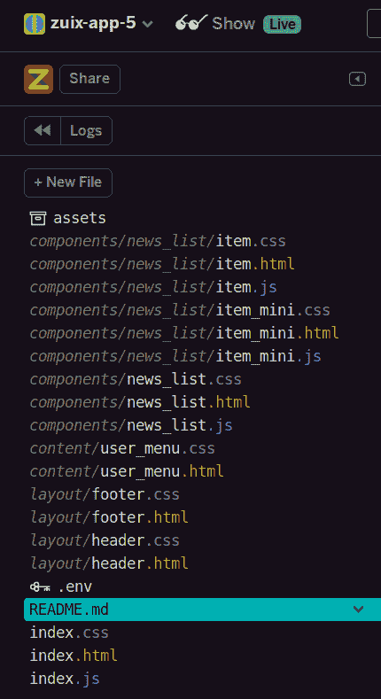
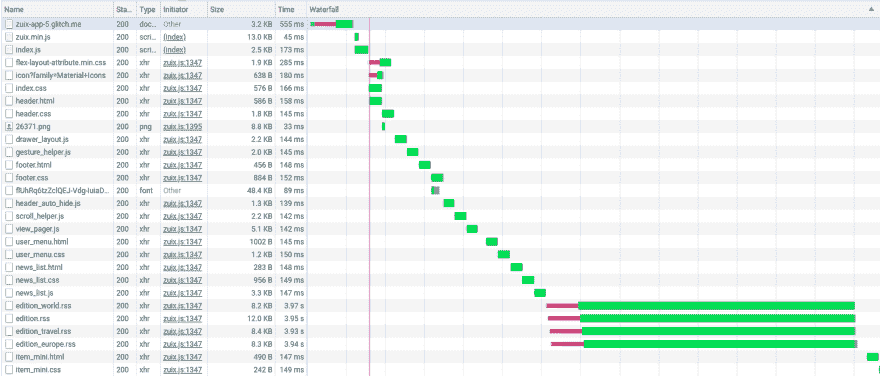
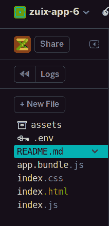
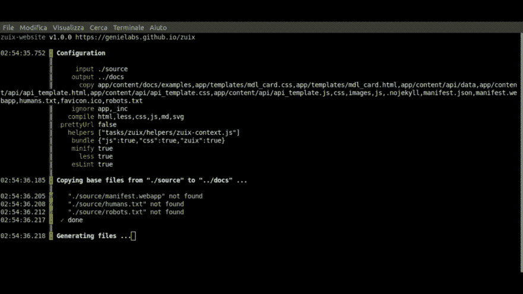

# 使用 zuix.js 在浏览器中捆绑 Web 应用程序

> 原文：<https://dev.to/genejams/web-app-bundling-in-the-browser-with-zuixjs-4efm>

(图片 Racorn | Dreamstime)

 <small>虽然这篇文章中的主题可能仍然是真实的，但是这些内容引用了一个旧版本的 *zuix.js* 库。最新文档见 [zuix.js](https://zuixjs.org) 网站。</small> 

* * *

## 什么是网页/app 捆绑？

捆绑是收集页面中使用的所有资源，然后将它们编译成单个优化文件的过程。

这将大大减少浏览器完成页面加载所需的网络请求数量，从而加快页面加载速度。

实际上有两种方法可以做到这一点:

*   浏览器内捆绑器:
    这种方法不需要任何构建工具或插件，它只是在浏览器中工作。

*   **Web-Starter** bundler:
    是 [zuix-web-starter](https://github.com/zuixjs/zuix-web-starter) 的裸模板，有一堆额外的特性和增强功能。需要安装 *Node.js* 。

## 浏览器内捆绑

通常当一个网站准备生产时，你可以决定捆绑它以获得更好的性能。它的所有组件和资源将被压缩到一个文件中，并从内存而不是从网络/本地主机加载。

### 逐步引导

在您的页面中，在主 *zuix* 脚本包含:
之后包含 **zuix-bundler** 扩展脚本

```
<script src="https://cdn.jsdelivr.net/npm/zuix-dist@1.0.0/js/zuix.min.js"></script>
<script src="https://cdn.jsdelivr.net/npm/zuix-dist@1.0.0/js/zuix-bundler.min.js"></script> 
```

Enter fullscreen mode Exit fullscreen mode

添加这个脚本后，您可以通过在**浏览器控制台**中键入命令
来重新加载页面并生成应用包

```
zuix.saveBundle() 
```

Enter fullscreen mode Exit fullscreen mode

这将创建并保存 **app.bundle.js** 文件到*下载*文件夹。

将生成的文件复制到您的网站根目录，并将其包含在主 *zuix* 脚本包含之后。

```
<script src="https://cdn.jsdelivr.net/npm/zuix-dist@1.0.0/js/zuix.min.js"></script>
<script src="app.bundle.js"></script> 
```

Enter fullscreen mode Exit fullscreen mode

创建包后，从页面中删除`zuix-bundler`脚本包含。

### 备注

当使用*延迟加载*时，只有到目前为止加载的组件才会包含在捆绑包中(增量捆绑)。

要强制包含页面中使用的所有组件/资源，请在控制台中发出以下命令:

```
// disable lazy-loading
zuix.lazyLoad(false)
// force loading of all components
zuix.componentize()
// create the bundle
zuix.saveBundle() 
```

Enter fullscreen mode Exit fullscreen mode

外部 JavaScript 库和 CSS 文件也可以包含在页面包中。为了实现这一点，移除`<script src="..."></script>`或`<link rel="stylesheet">`并使用方法`zuix.using(...)`来加载脚本/css。

```
// Loading a .css style
const flaCss = 'https://cdnjs.cloudflare.com/ajax/libs/flex-layout-attribute/1.0.3/css/flex-layout-attribute.min.css';
zuix.using('style', flaCss, function(res, styleObject) {
    console.log("Added Flex Layout Attributes CSS.", res, styleObject);
});
// Loading a .js script
const momentJs = 'https://momentjs.com/downloads/moment.js';
zuix.using('script', momentJs, function(res, scriptObject){
    console.log("Added Moment.js.", res, scriptObject);
});
// Loading a zuix component
zuix.using('component', '@lib/extensions/animate_css', function(res, componentContext){
   console.log("Added AnimateCSS extension for zUIx.", res, componentContext);
}); 
```

Enter fullscreen mode Exit fullscreen mode

如果在已经加载的资源上调用`zuix.using`方法，它将忽略请求。

这个方法也用于创建自包含的组件,这些组件可以被加载，而不必担心要包含的外部依赖。

## 举例

作为一个例子，我把我上一篇文章的 *zuix-app-4* 重新混合成了 [zuix-app-5](https://zuix-app-5.glitch.me) 。

如果你错过了我之前的帖子:

[](/genejams) [## 向您的 web 应用程序添加 ViewPager

### { Gene } Jul 28 ' 182min read

#showdev #webdev #javascript #zuixjs](/genejams/adding-a-viewpager-to-the-mobile-web-app-n67)

这是新的[源代码](https://glitch.com/edit/#!/zuix-app-5)，这是我做的:

*   用一个真正的列表(`components/news_list`)取代了“假列表”，这个列表可以从 RSS 提要中加载数据
*   将`components/random_item`替换为`components/news_list/item`和`components/news_list/item_mini`
*   从`index.html`的`head`部分移除所有*脚本*和 *css* 内含物，并将它们与`zuix.using(..)`一起添加到`index.js`

我希望 RSS 提要是来自 *Google News* 的提要，但不幸的是 Google 不再提供这项服务(如此悲哀)，所以我最终使用了 *CNN* 提要，因为它是唯一一个有漂亮图片和最新标题的提要。

这种类型的大多数提要不允许从不同的域下载，所以我使用了`cors-anywhere.herokuapp.com`代理来攻击 [CORS](https://en.wikipedia.org/wiki/Cross-origin_resource_sharing) 的行为。这个代理有时会变得非常慢，但是作为一个例子，这是可以的。

因此，总而言之， [zuix-app-5](https://zuix-app-5.glitch.me) 是没有`app.bundle.js`的版本(未捆绑)，我用它创建了在 [zuix-app-6](https://zuix-app-6.glitch.me) 上可用的捆绑版本。

这是两个版本的比较。

#### zuix-app-5:总档案 **18**

[T2】](https://res.cloudinary.com/practicaldev/image/fetch/s--20OHgYki--/c_limit%2Cf_auto%2Cfl_progressive%2Cq_auto%2Cw_880/https://thepracticaldev.s3.amazonaws.com/i/g02hdgw86q2nfivsfhzu.png)

#### zuix-app-5:网络性能

[T2】](https://res.cloudinary.com/practicaldev/image/fetch/s--CPVcwyJd--/c_limit%2Cf_auto%2Cfl_progressive%2Cq_auto%2Cw_880/https://thepracticaldev.s3.amazonaws.com/i/2gk48dshoa4zok3rh1z4.png)

#### zuix-app-6:总档案 **4**

[T2】](https://res.cloudinary.com/practicaldev/image/fetch/s--gCzzrzlC--/c_limit%2Cf_auto%2Cfl_progressive%2Cq_auto%2Cw_880/https://thepracticaldev.s3.amazonaws.com/i/e6g0ex68dmf08msb41rf.png)

#### zuix-app-6:网络性能

[T2】](https://res.cloudinary.com/practicaldev/image/fetch/s---KtaBY6c--/c_limit%2Cf_auto%2Cfl_progressive%2Cq_auto%2Cw_880/https://thepracticaldev.s3.amazonaws.com/i/ysapo252grk4t7g2xa4p.png)

这是`zuix-app-6`的[源代码](https://glitch.com/edit/#!/zuix-app-6)。

## Web Starter 捆绑

[T2】](https://res.cloudinary.com/practicaldev/image/fetch/s--as0GcYIJ--/c_limit%2Cf_auto%2Cfl_progressive%2Cq_66%2Cw_880/https://thepracticaldev.s3.amazonaws.com/i/wkumb20jphd5k5a8mt22.gif)

上图是 zuix 网站本身使用的`zuix-web-starter`的捆绑过程。

但是...因为这已经是一篇很长的文章了，我将在这里简单介绍一下它的主要特点:

*   zuix.js web 组件和 app bundler
*   静态网站:前台事务，数据文件，助手，集合，模板
*   少到 CSS 编译
*   埃斯林特。林挺 js 代码
*   迷你机
*   渐进式 Web 应用程序生成器

[T2】](https://i.giphy.com/media/3o7btYYfqOuQAz7SYE/giphy.gif)

阅读下一篇:

[](/genejams) [## 客户端 HTML/CSS 预处理

### { Gene } Aug 7 ' 184 分钟读取

#showdev #webdev #javascript #html](/genejams/client-side-htmlcss-pre-processing-12h)