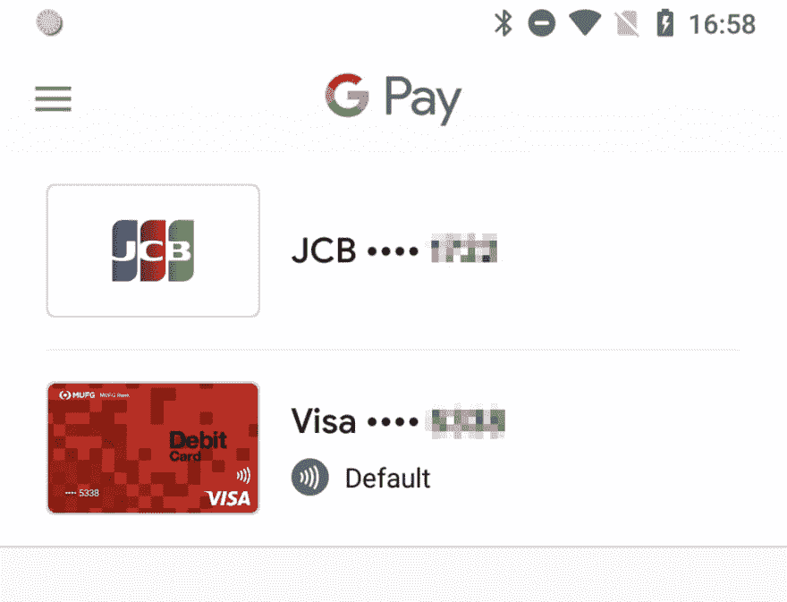
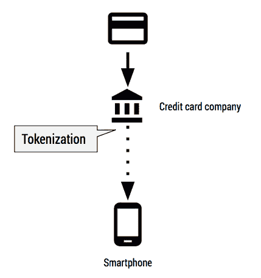
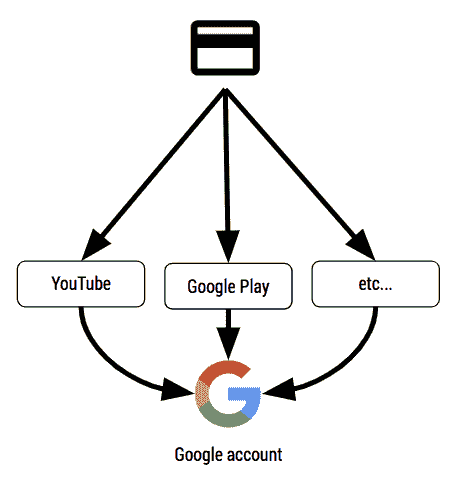
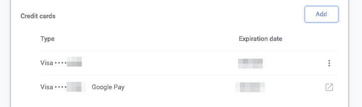

# 网络支付、支付请求 API 和 Google Pay

> 原文：<https://dev.to/agektmr/web-payments-payment-request-api-and-google-pay-1g3o>

许多人对 Web 支付、支付请求 API 和 Google Pay 之间的区别感到困惑。在本文中，我将阐明它们的区别，并解释我对商家应该实现什么的建议。

### **TL；博士**

*   Web Payments 是 W3C 的一个工作组的名称，该工作组试图对浏览器中的一组开放标准支付进行标准化。它通常也用来表示在网上进行更好的支付的所有努力。
*   支付请求 API 是 Web 支付工作组编写的规范之一。API 控制用户代理(浏览器)如何与实现(网站)通信以交换支付凭证。支付请求 API 是 Google Pay API 的较低层 API，可以启动 Google Pay 等支付应用。
*   如果你是商家，用它的 [JavaScript 库](https://developers.google.com/pay/api/web/guides/tutorial)实现 Google Pay API，而不是支付请求 API。

请继续阅读，了解更多信息。

### **什么是 Google Pay？**

Google Pay 是谷歌最近推出的面向消费者的支付应用。它将各种支付服务统一到一个品牌中，并提供简单、简化的体验。它的主要特点是让支付更容易，无论你的客户是在实体店购物，还是在你的应用程序或网站上在线购物。

Google Pay 允许用户使用任何保存在其谷歌账户中的信用卡或借记卡进行支付，包括使用 Google Pay 应用程序在 Android 设备上提供的卡。

 

<figcaption>*带有非接触式标识的(底部)是设备上的网络令牌；另一张(上图)是保存在用户谷歌账户上的卡片。*</figcaption>

**网络令牌**使用虚拟账号供应并存储到设备。令牌化卡便于在实体店进行点击支付，但它们也包含一次性使用元素，这使它们比普通卡更安全。如果卡的具体信息因任何原因发生变化，发卡机构也可以自动更新这些信息。

[T2】](https://res.cloudinary.com/practicaldev/image/fetch/s--hWxdxi3v--/c_limit%2Cf_auto%2Cfl_progressive%2Cq_auto%2Cw_880/https://cdn-images-1.medium.com/max/429/1%2AEJif2DEt3EYFdxIWH00Kaw.png)

**保存到谷歌的卡**是存储在用户谷歌账户中的信用卡号。它们通常是在用户为 Google Play、YouTube、Google Cloud 等付费时存储的。用户可以在 https://pay.google.com/payments/的[刷卡。](https://pay.google.com/payments/)

保存到谷歌的卡可供数亿通过各种谷歌服务进行支付的用户使用，因此这可能包括尚未安装或启动 Google Pay 应用程序的用户。

[T2】](https://res.cloudinary.com/practicaldev/image/fetch/s--5I7ZtByM--/c_limit%2Cf_auto%2Cfl_progressive%2Cq_auto%2Cw_880/https://cdn-images-1.medium.com/max/454/1%2AAutdFbgDvJdc7XGwk6B3mA.png)

### 支付请求 API 和 Google Pay API

#### 付款申请 API 概述

正如许多读过我之前文章的人已经知道的那样，支付请求 API 是一个开放的网络标准，它为浏览器带来了本地用户界面，而 T2 则在网站和用户之间进行支付。它是一种新的、灵活的、结构化的表单，具有静态的原生浏览器 UI。

API 已经在 Chrome、Edge、Safari、Samsung 互联网浏览器中实现，Firefox 也即将完成实现。

支付请求 API 规范的设计方式非常灵活，浏览器可以支持任何支付方式。有两种支付方式，*标准化*和*基于 URL 的*。请参见[“付款方式在付款申请 API 中的工作方式”](https://dev.to/agektmr/how-payment-methods-work-in-the-payment-request-api-5ie)了解这些付款方式类型的更多信息。

#### Google Pay 支付请求 API

Google Pay 是一种基于 URL 的支付方式，可通过支付请求 API 获得。保存在 Google 上的网络令牌和卡都可以通过支付请求 API 无缝使用。但是这两者之间有一个不可忽视的区别。

**网络令牌:**因为它需要访问设备的安全区域(实际上 Google Pay 使用的是 [HCE](https://developer.android.com/guide/topics/connectivity/nfc/hce) 但在这种情况下让我忽略)，网络令牌只有在用户使用有能力的设备时才可用。对于 Google Pay 来说，这意味着在 Android 上使用 Chrome 浏览器(截至 2018 年 8 月)。换句话说，网络令牌目前在桌面或不支持第三方支付应用的浏览器中不可用。

**保存到谷歌的卡片:**同时，保存到谷歌的卡片不一定需要该应用程序。因为它们存储在谷歌服务器上，你可以使用[支付处理 API](https://developers.google.com/web/updates/2018/06/payment-handler-api) 来利用支付请求 API 上的卡信息，甚至是在桌面上。卡的详细信息通常使用来自支持网关的密钥进行加密(网关令牌化)，这避免了直接与商家共享凭证。

#### 无支付请求的 Google Pay

用户的浏览器可能不支持支付请求 API(或支付处理 API)。这促使 Google Pay 提供了一个 JavaScript 库来弥补这个缺口。

通过使用该库，Google Pay 可以使用支付请求 API 和支付处理 API(如果它们可用)，或者它可以使用传统的弹出窗口方法。通过这样做，Google Pay 可以在任何现代浏览器上使用。

### 基本卡和 Google Pay

保存到谷歌的卡可以通过 Chrome 支付请求 API 中的基本卡获得。的确如此，但仅限于 Chrome 70。

<figcaption>*chrome://设置/自动填充*</figcaption>

通过进入 chrome://settings/autofill(在更高版本的 chrome 中，chrome://settings/payments)，你可以检查可用于表单自动填充的信用卡号。旁边标有“Google Pay”的实际上是保存到谷歌的卡，从谷歌服务器上传播。没有的是本地输入和存储的卡号。

这意味着保存在谷歌上的相同卡片在 Chrome Autofill 和 Google Pay 上都可用。但是正如我在“[将支付请求 API 与支付服务提供商](https://dev.to/agektmr/integrating-the-payment-request-api-with-a-payment-service-provider-62f)集成”中提到的，基本卡是一种中间解决方案。事实上， [Chrome 已经宣布弃用谷歌上为 Chrome 70](https://blog.chromium.org/2018/07/bringing-google-pay-to-paymentrequest.html) 中的 [b](https://blog.chromium.org/2018/07/bringing-google-pay-to-paymentrequest.html) asic-card [保存的卡。](https://blog.chromium.org/2018/07/bringing-google-pay-to-paymentrequest.html)

请注意，基本卡将继续使用本地存储的卡号。

### 使用 JS 库来使用 Google Pay API

鉴于我在之前的帖子中提到的 basic-card 的风险，建议优先考虑基于令牌的支付方法，因此应该使用 [JavaScript 库](https://developers.google.com/pay/api/web/guides/tutorial)来实现 Google Pay，而不是直接通过支付请求 API 来实现。

当然，支付请求 API 对于基本卡以外的支付方式仍然有用，例如 Apple Pay、Samsung Pay，或者通过[支付处理 API](https://developers.google.com/web/updates/2018/06/payment-handler-api) 提供的新兴支付方式。(顺便说一下，通过使用支付处理器 API，任何人都可以构建自己的支付方式和支付 app。试试你自己的。)

将来，当许多支付方式在不同的浏览器上同样可用时，我们将能够依赖纯支付请求 API。

在下一篇文章中，我计划介绍一个使用多种支付方式的 UX 建议。敬请关注。

* * *