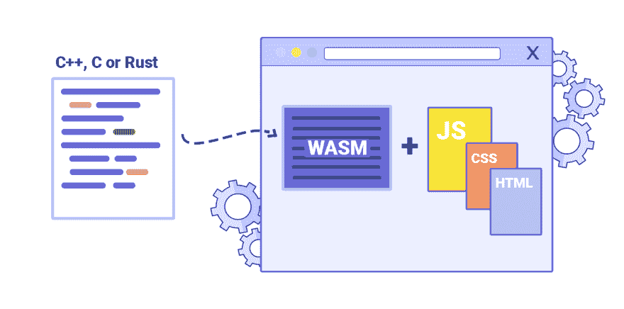
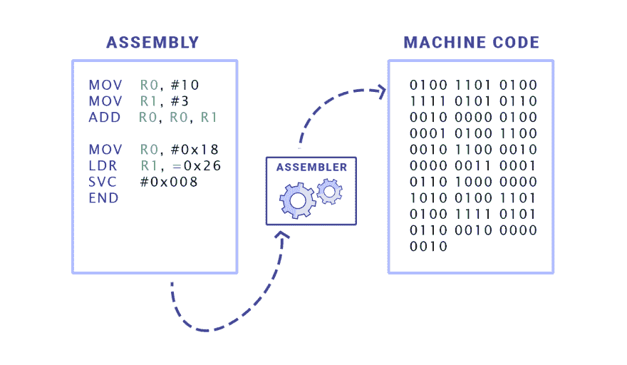
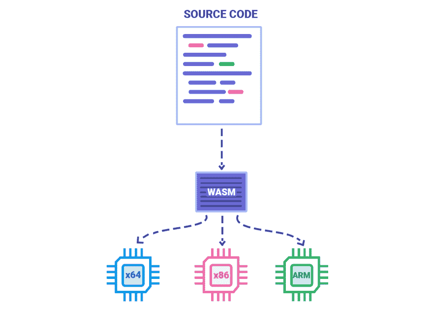
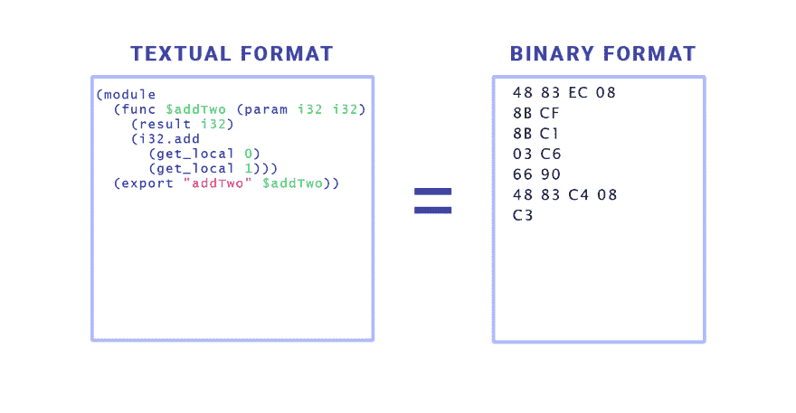
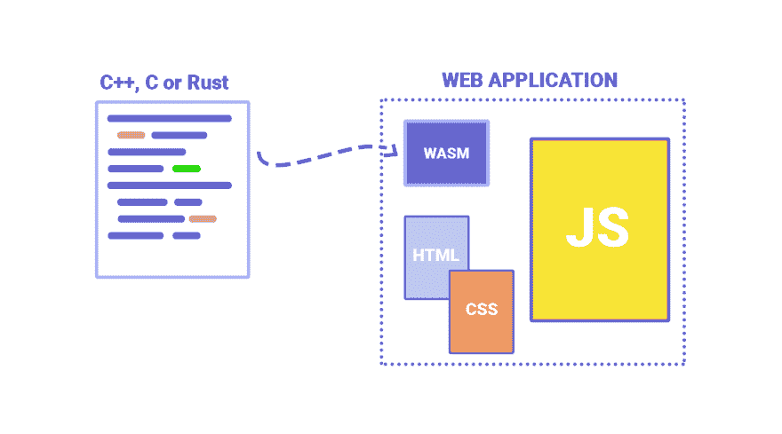
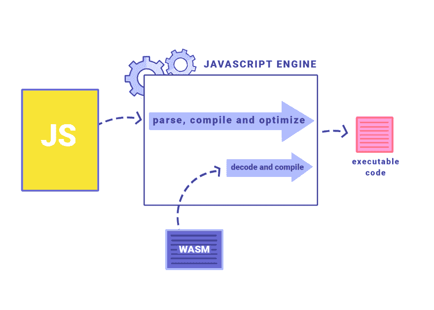
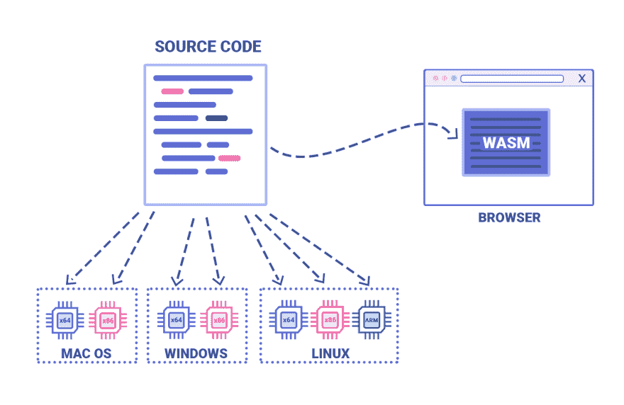
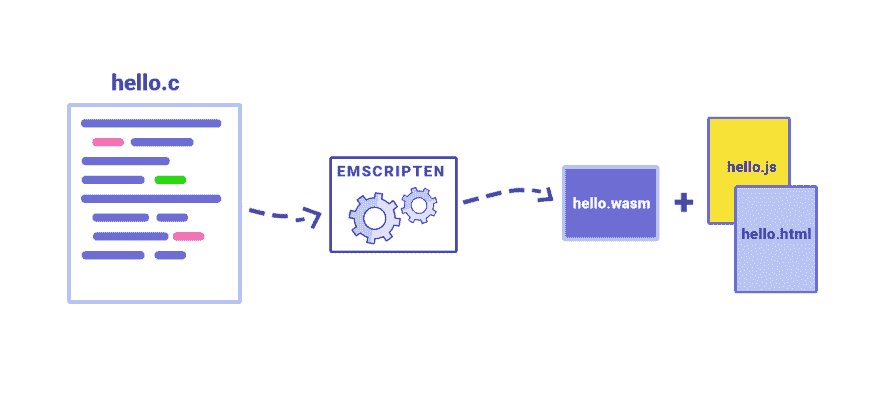
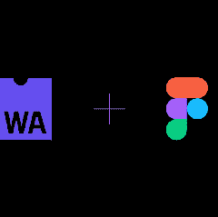
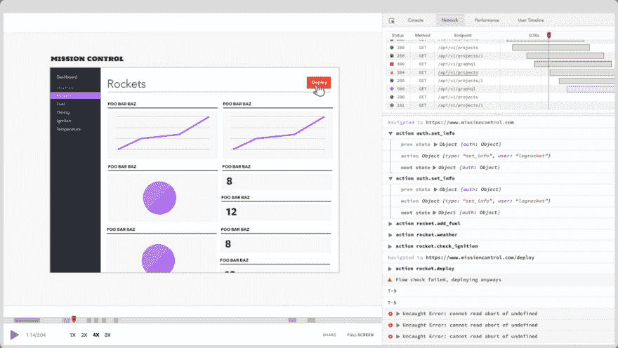

# WebAssembly :“为什么”和“怎么做”[翻译文章]

> 原文：<https://dev.to/nabbisen/webassembly--3385>

本文是以下文章的翻译:
[WebAssembly: How and why](https://blog.logrocket.com/webassembly-how-and-why-559b7f96cd71) by [Milica Mihajlija](https://blog.logrocket.com/@micikato) on [LogRocket](https://blog.logrocket.com/)

* * *

#### 

*   How to execute native code in browser
*   What kind of background is there?
*   What is it for JavaScript and even Web development?

[T2】](https://res.cloudinary.com/practicaldev/image/fetch/s--0sxnToO7--/c_limit%2Cf_auto%2Cfl_progressive%2Cq_auto%2Cw_880/https://cdn-images-1.medium.com/max/2000/1%2A4ZMcCrF95AUvVzJ4S6Lo-g.png)

在所有浏览器中，无论是 Chrome / Firefox / Edge / Safari，代码都是由 JavaScript 引擎解释和执行的——只是执行 JavaScript。
遗憾的是，JavaScript 不是您希望执行的任何操作的理想选择。
这里有 WebAssembly 的进入空间。

WebAssembly 是一种新类型的代码，可以在现代浏览器中执行。
是为了提高 Web 的性能而开发的。
是低级的二进制文件，容量小，因此从加载到执行都很高速。
WebAssembly 不是记述其本身，而是从其他高级语言编译制作。

汇编是人类可读且接近机器代码的语言的典型。
机器码是指处理器能够理解的数字的罗列。

[T2】](https://res.cloudinary.com/practicaldev/image/fetch/s--JabqGr2G--/c_limit%2Cf_auto%2Cfl_progressive%2Cq_auto%2Cw_880/https://cdn-images-1.medium.com/max/2000/1%2AY0nZhsD-0ac5gKHc_OG3TQ.png)

###### 

<center>汇编语言和机器码</center>

所有高级编程语言都被翻译成机器代码，以便在处理器上运行。
不同类型的处理器体系结构需要不同的机器代码，以及对应的不同组件。

[T2】](https://res.cloudinary.com/practicaldev/image/fetch/s--t9eoVVO5--/c_limit%2Cf_auto%2Cfl_progressive%2Cq_auto%2Cw_880/https://cdn-images-1.medium.com/max/2000/1%2AfY3Nj1rqpy1sveLt_Np9jg.png)

###### 

<center>源代码被分别编译以对应不同的处理器架构</center>

与它的名字相反，WebAssembly 不是**本来意义上的汇编语言。**
因为不对应特定的机器(机器)。 是支持浏览器的东西。
代码在浏览器中运行时，实际上不知道在什么机器上运行。

[T2】](https://res.cloudinary.com/practicaldev/image/fetch/s--NHXZkdur--/c_limit%2Cf_auto%2Cfl_progressive%2Cq_auto%2Cw_880/https://cdn-images-1.medium.com/max/2000/1%2ApdkebdFYtLbrvjL88dQ-BA.png)

###### 

<center>作为对编译目标的中介者的 WebAssembly</center>

WebAssembly 是一种概念机语言，用于表示现实世界中广泛使用的硬件最小公倍数。
浏览器下载 WebAssembly 的代码后，该代码会迅速转换为任何机器的程序集。

这是 WebAssembly 的样子——具有可读性高的文本形式的样子(.wat )，但实际上在传送到浏览器时会采取二进制形式的样子(.wasm )。

[T2】](https://res.cloudinary.com/practicaldev/image/fetch/s--utgsibiT--/c_limit%2Cf_auto%2Cfl_progressive%2Cq_auto%2Cw_880/https://cdn-images-1.medium.com/max/2000/1%2AcuLEJje56uGtxt37cUGIWw.png)

###### 

<center>WebAssembly 的文本形式和二进制形式</center>

通过 WebAssembly，可以处理**C / C++ / Rust** 的代码类，可以编译为**WebAssembly 模块**。
它们可以加载到 web APP 应用程序中，并通过 JavaScript 调用。

WebAssembly 不是 JavaScript 的替代品，而是合作伙伴。

[T2】](https://res.cloudinary.com/practicaldev/image/fetch/s--xE6kKNZU--/c_limit%2Cf_auto%2Cfl_progressive%2Cq_auto%2Cw_880/https://cdn-images-1.medium.com/max/2000/1%2AzaeiNOe-kSznuKi1ndPbpw.png)

###### 

<center>APP 中的 WebAssembly 模块</center>

## 为什么需要 WebAssembly

请考虑需要使用浏览器以外的软件的情况:
**电视游戏/视频编辑/ 3D 渲染/音乐制作**等情况。
这些 APP 应用程序进行大量运算，因此需要高性能。
用 JavaScript 很难达到这种性能。

JavaScript 作为简单的脚本语言出现了。 目的是在只有轻量级超文本文件时的 Web 上，实现双向通信。
虽然设计为可以容易地学习和记述，但并不是设计为高速运行。
多年后，在[JavaScript 的解释](https://hacks.mozilla.org/2017/02/a-crash-course-in-just-in-time-jit-compilers/)时，浏览器增加了用于运行时优化的功能。 这样可以显著改善性能。

随着 JavaScript 的加快，可以在浏览器中执行的事情越来越多。
新的 API 被制作出来，可以进行交互式的图像处理/视频流媒体/离线浏览和其他很多事情了。
一个接一个地，此前只能通过母语 APP 实现的丰富处理，现在可以通过 Web 实现了。
今天，从浏览器编辑文档并用邮件发送很简单。
但是，在 JavaScript 的性能中还有很难理解的地方。

电视游戏是特别有挑战性的尝试。 这是因为不仅要进行声音处理和影像处理，还必须经常与物理学和人工智能进行组合。
如果能在 Web 上有效地发挥足以运行游戏的性能的话，就会变成[为了能在 Web 上实现很多其他的 APP 应用程序，就会变成](https://webassembly.org/docs/use-cases/)。
WebAssembly 想要实现的就是这一点。

## 为什么 Web 这么有魅力呢

网络的美妙在于它像魔法一样——在任何地方工作。
不需要下载也不需要安装。
需要的时候点击一次，网络 APP 应用程序马上就会来到这里。
与将二进制文件下载到计算机上直接执行相比，这种机制更安全。
为什么这么说，是因为浏览器的设计考虑到了[安全性](https://www.howtogeek.com/169139/sandboxes-explained-how-theyre-already-protecting-you-and-how-to-sandbox-any-program/)，使得代码执行时你的系统一团糟。
而且在 Web 上，共享什么就像得到什么一样，很容易实现——链接是可以携带在任何地方的字符串。

Web 是唯一真正普遍的平台，允许将 APP 应用于所有设备。
我们只要维护单一的代码库就好了。 更新将是一项简单的任务。 此外，预计所有用户都将有权访问 APP 应用程序。

在这些内涵的力量和 Web 带来的相互作用的背景下，我们从超文本和小型脚本语言出发。 在遥远的旅途中，我们获得了一个强大而广泛的平台，具有惊人的 APP 和潜力。
但是直到今天，其根本的基础，绝对不是以这些之中的某种东西为首要目的而设计的，而是一种脚本语言。

## WebAssembly 带来的恩惠

使 WebAssembly 特别适合 Web 的是以下几点:

*   **速度**
*   **Transplantability**
*   **softness**

WebAssembly 是以**速度**为焦点而设计的。
其二进制文件的文件大小与文本格式的 JavaScript 文件相比非常小。
因为有大小的好处，所以可以快速下载。 这在缓慢的网络中特别重要。

WebAssembly 二进制文件从解码到运行的速度也很快。
JavaScript 是动态类型化语言，但变量类型无需事先确定，且无需事先编译。
因此，在记述上可以简单迅速地进行。
但同时，JavaScript 引擎在运行时还需要做非常多的工作。
在页面上运行时，必须进行解析、编译、代码运行时优化。

解析 JavaScript 是指将平面文本转换为称为[抽象语法树](https://ja.wikipedia.org/wiki/%E6%8A%BD%E8%B1%A1%E6%A7%8B%E6%96%87%E6%9C%A8)( AST )的数据结构，并将其转换为二进制格式。
在 WebAssembly 中，转移以二进制形式进行。 通过之后解码，速度会更快。
与 JavaScript 不同，因为是静态类型化语言，所以引擎在编译时不用在意使用的是什么类型。
大部分运行时优化都是在编译源代码时进行的。 在连浏览器都没有到达的时候进行。
内存管理完全一样，分别进行。 完全不存在垃圾回收。
所有这些都会带来更快更稳定的性能。
**WASM 二进制文件的执行时间与用本机代码执行相同处理的情况相比，只增加了 20%。**

[T2】](https://res.cloudinary.com/practicaldev/image/fetch/s--9cMRaym8--/c_limit%2Cf_auto%2Cfl_progressive%2Cq_auto%2Cw_880/https://cdn-images-1.medium.com/max/2000/0%2AxU7akQpF9KctXbQA.png)

###### 

<center>JavaScript 引擎中的 WebAssembly 的相对处理时间</center>

WebAssembly 设计时的主要目标之一是**可移植性**。
要在设备上执行 APP 隐藏，必须与该设备的处理器体系结构和操作系统相匹配。
也就是说，源代码必须能够编译以适合所支持的操作系统和 CPU 体系结构的所有组合。
使用 WebAssembly，只需执行一个编译步骤，你的 APP 就可以在所有时髦的浏览器上执行了。

[T2】](https://res.cloudinary.com/practicaldev/image/fetch/s--9Jaqrt3---/c_limit%2Cf_auto%2Cfl_progressive%2Cq_auto%2Cw_880/https://cdn-images-1.medium.com/max/1600/1%2ANT8Fw1gCXa0eYBuCU-MiJA.png)

###### 

<center>本机代码编译
是在多个平台上工作还是 vs.web assembly</center>

能够带入 Web 世界的，不仅仅是自制的 APP。
还可以运送与 Web 无关的、现有的 C++库和开源 APP 等难以置信的资产。
C++是所有实用平台(包括 iOS 和 Android )都支持的语言。
通过使用 WebAssembly，可以将 C++作为既可以向 Web 发送也可以向移动发送的通用语言来活用。

关于 WebAssembly，最让我兴奋的是，可以更加灵活地**记述 Web。
到目前为止，JavaScript 是 Web 浏览器中唯一完全支持的语言。
有了 WebAssembly，Web 开发人员就可以选择 JavaScript 以外的语言了。 此外，还将有更多的开发人员能够为 Web 编写代码。
对于大多数开发，JavaScript 仍然是最佳选择。
但是如果真的需要提高性能，根据情况和情况，可以考虑部署专门的语言。
UI 和 APP 的逻辑等部分不用 JavaScript 处理，可以用 WebAssembly 安装核心功能。
在现有的 js APP 中，如果在性能运行时优化时存在瓶颈，也可以用更适合解决这个问题的语言重写该部分。**

目前，完全支持 WebAssembly 的语言是 C / C++ / Rust。
但是现在正在开发中的[其他的候补](https://github.com/appcypher/awesome-wasm-langs)也有很多。
这其中也包括 Kotlin / .NET。 两个都已经开始了实验支持。

## 如何移动

需要用于将源代码编译到 WebAssembly 中的工具。
作为一个解决方法，可以考虑使用稳定的模块化编译工具链[LLVM](https://ja.wikipedia.org/wiki/LLVM) 。 它被配置为针对多种语言工作。
编译 c 和 C++时，也可以使用被称为[Emscripten](http://kripken.github.io/emscripten-site/) 的以 LLVM 为基础的更简单的工具。
在 Rust 的 Nightly 版中，可以使用嵌入式编译器[rustc](https://www.hellorust.com/setup/wasm-target/) 直接输出 WebAssembly。

想想用 c 写" Hello world "时的事情。
以下 Emscripten 命令可收集在浏览器上运行所需的文件集:
结果将生成与**HTML** 和**JS** 文件一起工作的 WebAssembly 模块。

```
emcc hello.c -s WASM=1 -o hello.html 
```

[T2】](https://res.cloudinary.com/practicaldev/image/fetch/s--icgH2utA--/c_limit%2Cf_auto%2Cfl_progressive%2Cq_auto%2Cw_880/https://cdn-images-1.medium.com/max/1600/0%2AxNUJSNFWssBQcekQ.png)

###### 

<center>用 Emscripten 将 C / C++的代码编译成 web assembly</center>

需要 HTML 和 JS 文件的原因是，无论在什么平台上，WebAssembly 都无法直接访问其 API 组――DOM / WebGL / WebAudio 等。
为了利用其中的某些东西，即使它只是在页面上显示 WebAssembly 的执行结果，也必须通过 JavaScript 来进行。
Emscripten 生成 JS 代码，它做好了[模块的准备，可以与](https://developer.mozilla.org/ja/docs/Web/JavaScript/Reference/Global_Objects/WebAssembly/instantiate)Web API 群进行交互。
HTML 文件负责加载该 JS，并将 WebAssembly 的输出内容显示在`textarea`或`canvas`要素中。

可以认为 WebAssembly 二进制文件是普通 APP 的模块:
可以从浏览器读取、加载和运行。
具有导入和导出的机制，可以像 JavaScript 的对象一样进行操作。
**可以在 JavaScript 的代码中调用 WebAssembly 的函数，也可以在 WebAssembly 的模块中调用 JavaScript 的函数。**

WebAssembly 中只有四种基元类型。
都是数值型――整数型以及浮点数型( i32 / i64 / f32 / f64 )。
这意味着在 JavaScript 和 WebAssembly 之间传递更复杂的数据类型不是一件容易的事情。
例如，进行字符串的交换时，需要编码为数值的数组，然后传递该指针。
WebAssembly 只能在自己的线性存储器中读和写。
不能直接访问外部的 JavaScript 变量。
为此，需要将其复制到内存中或者通过调用堆栈传递。

在现阶段，从 JavaScript 进行大量调用会非常慢。
是因为引擎每次都要进行设置的处理。
将来这个规格可能会变更。
但是目前，把 WebAssembly 看作是独立的、经常工作的系统，用来交给重量级的工作似乎比较好。

如果不进行任何设置就想尝试 WebAssembly 的话，请访问[webassembly.studio](http://webassembly.studio/) 或[WebAssembly Explorer](https://mbebenita.github.io/WasmExplorer/)

## 我也能用吗？

**好的！**

WebAssembly 在现实中触手可及。
去年，所有主要的浏览器都实现了[WebAssembly 的支持](https://caniuse.com/#search=webassembly)。
目前，全世界用户的**74.93%** 成为支持对象。 仅限桌面用户的对象为**82.92%** 。
作为覆盖旧式浏览器的应对措施，也可以用 Emscripten 编译为[asm.js](http://asmjs.org/faq.html) ——这是只处理数值(不处理字符串和对象等)的 JavaScript
asm.js 是直接关系到 WebAssembly 诞生的手法，在 Web 上被广泛使用。 例如，在 Facebook 上上传照片时压缩图像，在 Adobe 的[Lightroom](https://lightroom.adobe.com/) 上编辑图像时使用。

[T2】](https://res.cloudinary.com/practicaldev/image/fetch/s--2xDDvXNB--/c_limit%2Cf_auto%2Cfl_progressive%2Cq_auto%2Cw_880/https://cdn-images-1.medium.com/max/1600/0%2APliXmTDmymYjfm2G.png)

###### 

<center>支持 WebAssembly 的浏览器</center>

现在现实世界中存在着让 WebAssembly 非常兴奋的实例。

我说过电子游戏将是 WebAssembly 的一大目标，但 Unity 和 Unreal Engine 4 都已经制作了活动演示。
在 Unity 引擎上运行 WebAssembly 的[Tanks！](https://webassembly.org/demo/) 可以玩(坦克)游戏。
Epic 公司公开了[WebAssembly 的短在线演示](https://mzl.la/webassemblydemo)。

<center>
 [**Tanks! Demo — WebAssembly**


*これは Tanks! のデモです。
Unity のチュートリアルにあるゲームを WebAssembly にエクスポートしたものです。
砂漠の戦車を操縦してください...*
<small>webassembly.org</small>](https://webassembly.org/demo/) 
</center>

Figma 是界面的设计工具。
在浏览器上运行，使设计者们一起工作共享成果变得容易。
主要用 C++描述，通过使用 WebGL 呈现引擎实现了对大容量文档的控制。
Figma 的开发人员最初使用 asm.js 为 Web 编译 C++代码。
通过将其切换为 WebAssembly，可以与文档大小无关地将加载时间改善到不到 1/3。

<center>
 [**WebAssembly cut Figma’s load time by 3x**


*WebAssembly のケーススタディ*
<small>blog.figma.com</small>](https://blog.figma.com/webassembly-cut-figmas-load-time-by-3x-76f3f2395164) 
</center>

[AutoCAD](http://blogs.autodesk.com/autocad/autocad-web-app-google-io-2018/) 是设计软件。
主要用于各种工程领域，可以绘制户型图/电路/配管计划等。
用 C++记述，有 35 年左右的历史。 比 Web 本身的历史更长。
多亏了 WebAssembly，不需要重新编写用其他语言编写的庞大的代码库，就可以作为 web APP 使用了。

会出现更多利用 WebAssembly 的 APP 应用程序吧。
在线上还出现了由浏览器工作的[动画编辑工具](https://d2jta7o2zej4pf.cloudfront.net/)/ [光线跟踪器( 3D 图像渲染器)](https://mtharrison.github.io/wasm-raytracer/)/ [脸部识别算法](https://github.com/Web-Sight/WebSight)等有趣的演示

## 该来的东西

浏览器已经开始着手实现[新功能](https://blog.scottlogic.com/2018/07/20/wasm-future.html#ecma-module-integration-)。
**线程管理**和**垃圾回收**的支持正在逐步实现。 这将使 WebAssembly 更适合作为 Java / C# / Go 等语言的编译目标。
重要目标中还包括实现源地图支持，制作**调试工具**。 这将使开发人员能够轻松地将 WebAssembly 映射到源代码。

**JavaScript 将一如既往地继续占据 Web 开发的重要地位。**
是伟大的语言，在构筑几乎所有的东西方面，足够灵活。
然后 WebAssembly 可以填补 JavaScript 无法很好处理的为数不多的间隙。
虽然不能将 JavaScript 编译为 WebAssembly，但实际上即使能这样做也没有多大意义。 这是因为浏览器已经过设计，可以直接与 JS 进行交互，以最大化其性能。

但是，假设只使用 JavaScript 继续开发，WebAssembly 的好处及其带来的速度的效果也可以通过库和框架的改善得到。
在不用感到焦急等待的情况下，通过`<script type='module'>`，就像其他所有的 ECMAScript 模块一样，可以下载这些模块并进行[导入](https://www.youtube.com/watch?v=qR_b5gajwug&feature=youtu.be)。 然后，就可以从 JavaScript 中简单地调用这些函数了。
框架如何呢，Ember 已经在调查 WebAssembly 在[Glimmer VM](https://github.com/glimmerjs/glimmer-vm/pull/752) 上的安装方法。 [React 的一些功能](https://www.youtube.com/watch?v=3GHJ4cbxsVQ)也隐藏着在 WebAssembly 上实现的可能性。

来たるべき未来が今ここにあり、高速で動きながら輝いています🚀🌞

<center>. . .</center>

 [
T4】](https://logrocket.com/signup/)

### 广告:[LogRocket](https://logrocket.com/signup/) -用于 web APP 的 DVR

[T2】](https://res.cloudinary.com/practicaldev/image/fetch/s--t9y0Nb8l--/c_limit%2Cf_auto%2Cfl_progressive%2Cq_auto%2Cw_880/https://cdn-images-1.medium.com/max/1500/1%2As_rMyo6NbrAsP-XtvBaXFg.png)

###### 

<center>https://logrocket.com/signup/</center>

[LogRocket](https://logrocket.com/signup/) 是前端工具。
可以像在自己的浏览器上发生一样再现问题。
LogRocket 不是推测为什么发生了错误，或者委托用户截图或日志转储，而是通过再现会话来迅速理解发生了什么问题。
不依赖框架，任何 APP 都能完美动作。
此外，还有用于附加记录 Redux / Vuex / @ngrx/store 上下文的插件。

除了记录 Redux 的操作和状态外，LogRocket 还记录网络请求和响应信息/浏览器元数据/定制，包括控制台日志/ JavaScript 错误/堆栈跟踪/标头和主体信息
即使是最复杂的单页 APP 应用程序，通过分析 DOM 并记录 HTML 和 CSS，也能以 1px 的清晰影像再现。

[可以免费试用。](https://logrocket.com/signup/)

* * *

谢谢您的阅读。

本記事は、以下の記事の翻訳です:
[WebAssembly:如何和为什么](https://blog.logrocket.com/webassembly-how-and-why-559b7f96cd71)由[米利卡·米哈伊利亚](https://blog.logrocket.com/@micikato)在 [LogRocket](https://blog.logrocket.com/)

致米利卡:非常感谢你允许我翻译你的帖子。