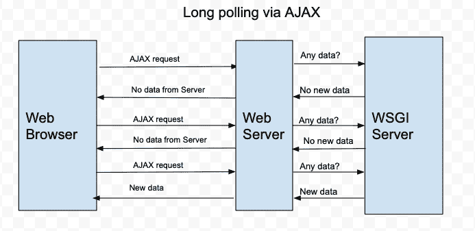
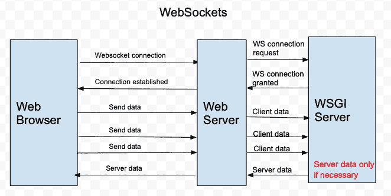

# WebSocket 与长轮询 HTTP

> 原文：<https://dev.to/moz5691/websocket-vs-long-polling-http-412f>

WebSocket 是客户端和服务器之间双向数据传输的标准协议。webSocket 协议建立在 TCP 之上，而不是运行在 HTTP 协议之上。使用 HTTP 轮询是非常不利的，因为它浪费资源，并可能导致连接超时。

我最近在 Chatapp 上使用 AJAX 将聊天记录存储到服务器端的数据库中。服务器端也运行 Socket.io。由于 AJAX 是为了在服务器端获取/发送聊天数据到 DB，我不希望 Socket.io 客户端也为 socket.io 使用 HTTP AJAX 轮询，但它确实使用了通过 AJAX 的 HTTP 轮询。

下面简单解释一下通过 AJAX 和 WebSockets 进行 HTTP 长轮询的区别。

通过 AJAX 进行长时间轮询，服务器不断轮询 WSGI 服务器以检查任何新数据。HTTP 并不意味着保持连接开放，以便服务器向客户机频繁发送数据。下面是一种通过 AJAX 请求实现长轮询的老方法。

[T2】](https://res.cloudinary.com/practicaldev/image/fetch/s--cqzHLKjh--/c_limit%2Cf_auto%2Cfl_progressive%2Cq_auto%2Cw_880/https://thepracticaldev.s3.amazonaws.com/i/4jbq91rqm8fx9ynx0mnt.png)

通过使用 WebSockets，服务器响应(或数据推送)更加高效。服务器端不需要一直不发送有效载荷分组给客户端。当一个服务器服务于大量的客户时，它的好处更加明显。

[T2】](https://res.cloudinary.com/practicaldev/image/fetch/s--vsObPxcb--/c_limit%2Cf_auto%2Cfl_progressive%2Cq_auto%2Cw_880/https://thepracticaldev.s3.amazonaws.com/i/05ml4nkyjmo8k2dxr96j.png)

如果您仍然需要一起使用 AJAX 和 Socket.io，您仍然可以强制 Socket.io 只使用 Websocket。下面的方法甚至会删除任何在客户机和服务器之间启动 Websocket 的初始 XHR 请求。太棒了！

**服务器端:**

下面的第二行可以强制服务器只使用 WebSocket。

```
module.exports = function(io) {
io.set('transports', ['websocket']); 
io.on('connection', socket => {
socket.on('join', params => { 
```

**客户端:**

下面的第一行告诉 Socket.io 客户端只使用 WebSocket，即使 AJAX 在相同的客户端代码中使用。

```
const socket = io({ transports: ['websocket'] });
const postMessage = function(message) {
$.post('http://localhost:5000/api', message);
}; 
```

这个简单的技巧适用于除旧 IE9 之外的大多数现代浏览器。建议避免任何 XHR 回退，只使用 WebSockt 传输。

参考:
[https://www.fullstackpython.com/websockets.html](https://www.fullstackpython.com/websockets.html)