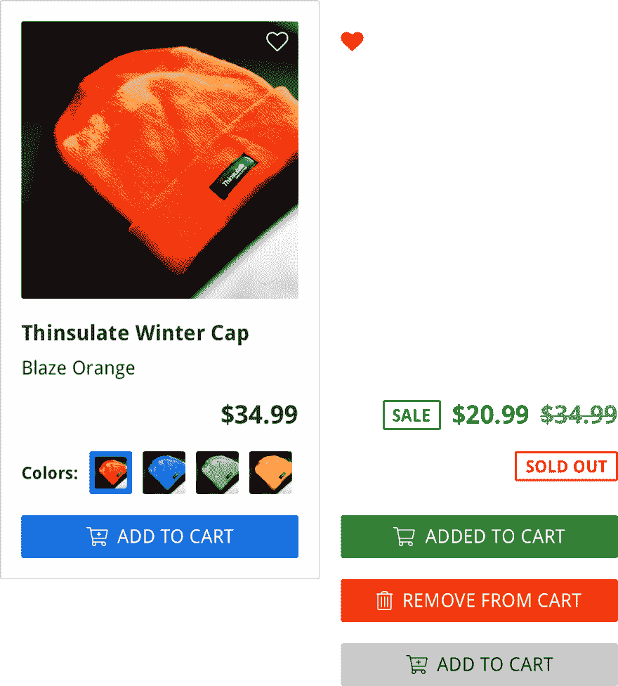
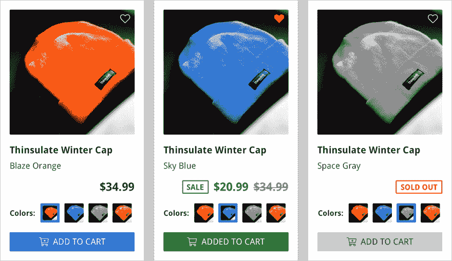

# 第 1 周第 1 天:设计一个电子商务列表

> 原文：<https://dev.to/geoff/week-1-day-1-design-an-ecommerce-listing-28fn>

欢迎来到第一周，我每周 UI 挑战的第一天！正如我在中所说的，第一周将关注**电子商务列表** UI 组件；在接下来的一周里的每一天，我都会挑选一两个(通常是相关的)子元素来实现。第一天，我们的目标是…

## 设计组件

我个人使用 Sketch 来设计本周的组件，但你可以使用 Sketch，一个类似 Adobe XD 的 UX/UI 设计程序，或者其他任何程序(或者只是纸和笔/铅笔！)来设计你的组件。

如果您决定不设计自己的组件，那么非常欢迎您使用我的设计，但是我认为如果您设计自己的组件，您会得到最大的好处。(另外，我很想看看你们都想出了什么！)

下面是清单组件的外观，包括组件的许多可选状态:

[T2】](https://res.cloudinary.com/practicaldev/image/fetch/s--9llYqDmb--/c_limit%2Cf_auto%2Cfl_progressive%2Cq_auto%2Cw_880/https://raw.githubusercontent.com/geoffdavis92/weekly-ui/master/assets/ecommerce-listing/ecl-single-variants%25402x.png)

这是一行清单中组件各部分的不同状态:

[T2】](https://res.cloudinary.com/practicaldev/image/fetch/s--lobAgJuW--/c_limit%2Cf_auto%2Cfl_progressive%2Cq_auto%2Cw_880/https://raw.githubusercontent.com/geoffdavis92/weekly-ui/master/assets/ecommerce-listing/ecommerce-listing-design%25402x.png)

## 现在轮到你了

跳上那些设计程序(或者拿出纸笔)，设计你自己的**电子商务清单**！下面是一个日历，上面列有我将在哪天实现的功能，以及一些可能对你有帮助的资源。

此外，请在评论中添加您的设计灵感的回复和/或图像！我很想看看你们都创作了什么样的设计。

快乐设计！🎉

### 第 1 周日历

1.  设计组件🎯
2.  显示产品名称、价格和图像
3.  添加到购物车按钮，收藏按钮
4.  销售价格显示，售完状态
5.  颜色变化缩略图按钮
6.  100% a11y 分数
7.  调整、重构、修复

### 资源

*   [卡片的最佳实践](https://uxplanet.org/best-practices-for-cards-fa45e3ad94dd)(因为我的设计，以及一些电子商务平台，利用“卡片”类型的设计进行列表)
*   [按钮的最佳实践](https://uxplanet.org/button-ux-design-best-practices-types-and-states-647cf4ae0fc6)
*   [打造华丽 UI 的 7 条法则](https://medium.com/@erikdkennedy/7-rules-for-creating-gorgeous-ui-part-1-559d4e805cda)
*   [a11y 项目](https://a11yproject.com/) ( *用于创建无障碍网站/应用程序的巨大*资源)
*   [编写 CSS 时考虑可访问性](https://medium.com/@matuzo/writing-css-with-accessibility-in-mind-8514a0007939)