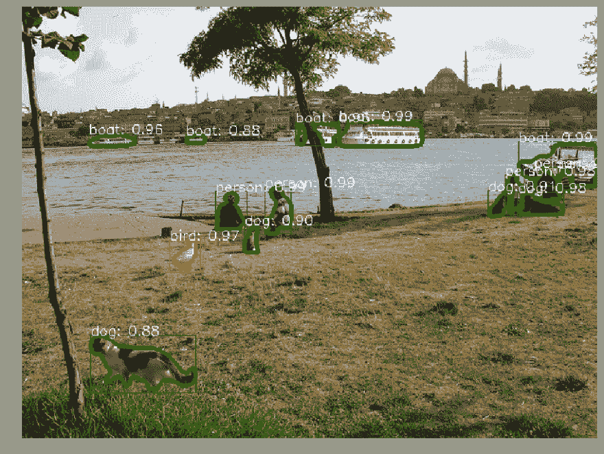
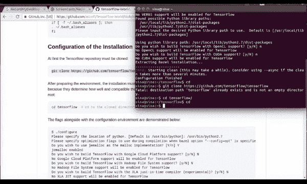
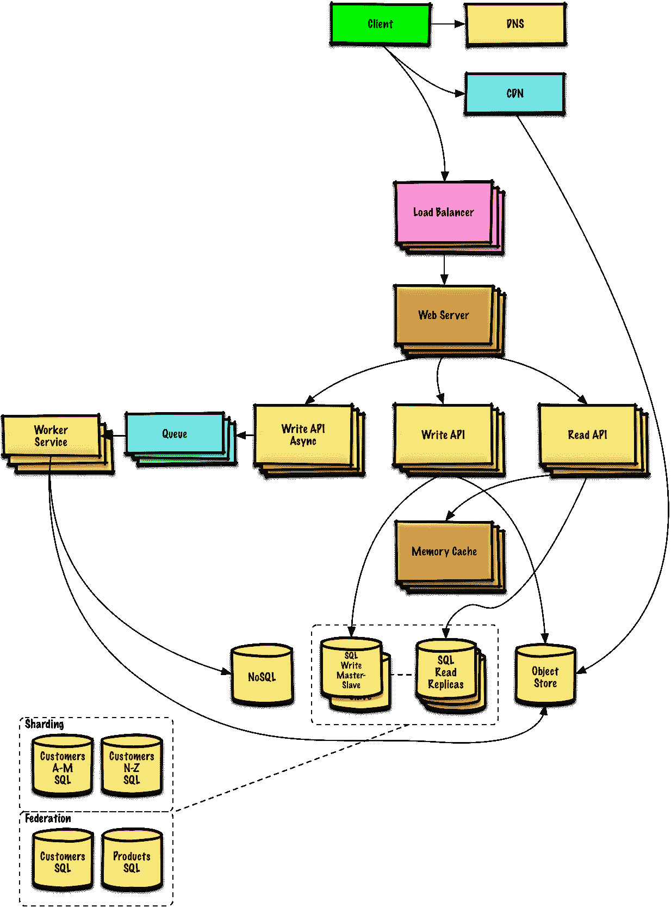
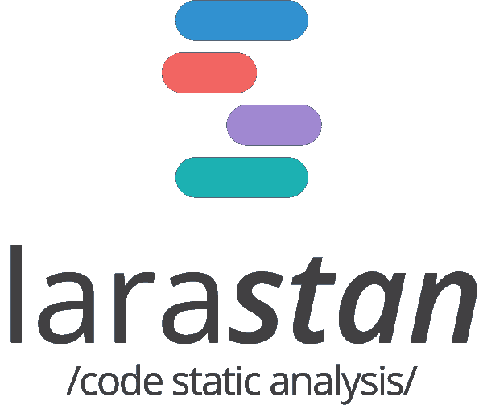
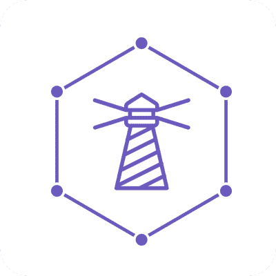
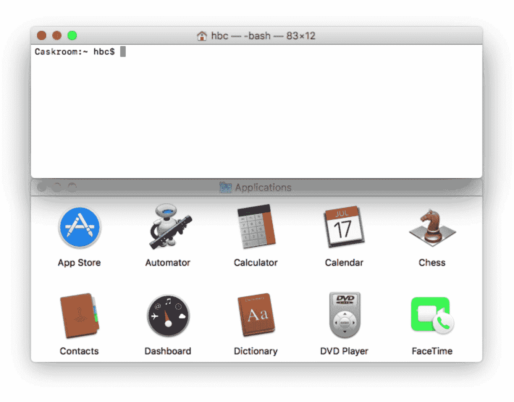
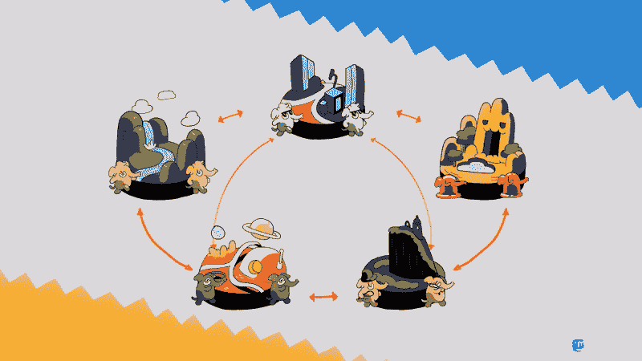
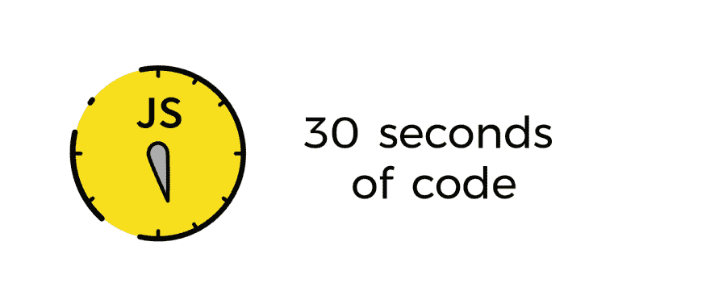
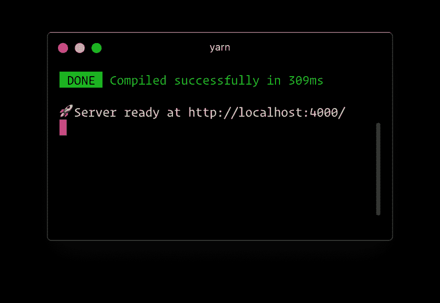
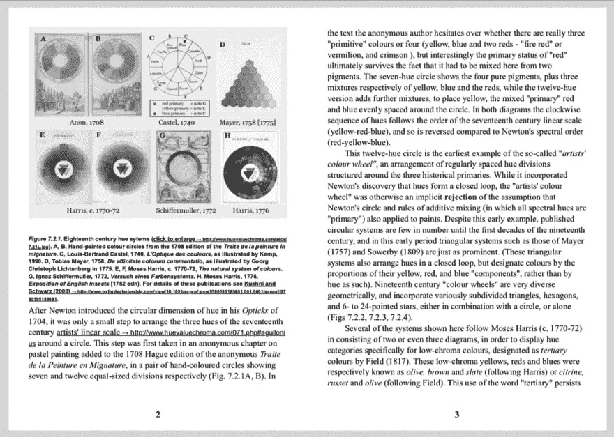

# GitHub 上的每周趋势知识库(10 月 21 日至 10 月 27 日)

> 原文：<https://dev.to/issuehunt/weekly-trending-repositories-on-github-oct21-to-oct27-5dg5>

本文由 IssueHunt 策划，issue hunt 是一个基于问题的开源项目资助平台。

OSS 开发者可以通过在 IssueHunt 上贡献和维护开源获得收入🌈

[https://issuehunt.io](https://issuehunt.io)

*   计算机编程语言
*   迅速发生的
*   服务器端编程语言（Professional Hypertext Preprocessor 的缩写）
*   红宝石
*   Java 语言(一种计算机语言，尤用于创建网站)
*   java 描述语言

* * *

# 巨蟒

### [Facebook research/maskrcnn-benchmark](https://github.com/facebookresearch/maskrcnn-benchmark)

[T2】](https://res.cloudinary.com/practicaldev/image/fetch/s--CvolFe65--/c_limit%2Cf_auto%2Cfl_progressive%2Cq_auto%2Cw_880/https://github.com/facebookresearch/maskrcnn-benchmark/raw/master/demo/demo_e2e_mask_rcnn_X_101_32x8d_FPN_1x.png)

PyTorch 中实例分割和对象检测算法的快速模块化参考实现。

### [科学开源/ TensorFlow-Course](https://github.com/open-source-for-science/TensorFlow-Course)

[T2】](https://res.cloudinary.com/practicaldev/image/fetch/s--KkLqO_VM--/c_limit%2Cf_auto%2Cfl_progressive%2Cq_66%2Cw_880/https://github.com/open-source-for-science/TensorFlow-Course/raw/master/_img/mainpage/installation.gif)

简单易用的 TensorFlow 教程

### [算法/ Python](https://github.com/TheAlgorithms/Python)

[T2】](https://camo.githubusercontent.com/40b8099e638526dce298f8dc91246173d56e389a/68747470733a2f2f75706c6f61642e77696b696d656469612e6f72672f77696b6970656469612f636f6d6d6f6e732f7468756d622f382f38332f427562626c65736f72742d6564697465642d636f6c6f722e7376672f32323070782d427562626c65736f72742d6564697465642d636f6c6f722e7376672e706e67)

所有算法都用 Python 实现

### [deep mind/graph _ nets](https://github.com/deepmind/graph_nets)

[T2】](https://res.cloudinary.com/practicaldev/image/fetch/s--pcpEvnsJ--/c_limit%2Cf_auto%2Cfl_progressive%2Cq_66%2Cw_880/https://github.com/deepmind/graph_nets/raw/mastimg/graph-nets-deepmind-shortest-path0.gif)

在 Tensorflow 中构建图形网络

### [张量流/模型](https://github.com/tensorflow/models)

用 TensorFlow 构建的模型和示例

### [美国广播公司新闻/数据-生活](https://github.com/abcnews/data-life)

### [唐纳马丁/系统-设计-初级读本](https://github.com/donnemartin/system-design-primer)

[T2】](https://camo.githubusercontent.com/e45e39c36eebcc4c66e1aecd4e4145112d8e88e3/687474703a2f2f692e696d6775722e636f6d2f6a6a3341354e382e706e67)

学习如何设计大型系统。准备系统设计面试。包括 Anki 抽认卡。

### [科迪莫/伯特-皮托奇](https://github.com/codertimo/BERT-pytorch)

Google AI 2018 BERT pytorch 实现

### [SummitKwan/transparent _ latent _ gan](https://github.com/SummitKwan/transparent_latent_gan)

[T2】](https://res.cloudinary.com/practicaldev/image/fetch/s--yCvSOlvX--/c_limit%2Cf_auto%2Cfl_progressive%2Cq_66%2Cw_880/https://github.com/SummitKwan/transparent_latent_gan/raw/master/static/online_demo_run_fast_01.gif%3Fraw%3Dtrue)

使用监督学习来照亮 GAN 的潜在空间，用于受控的生成和编辑

### [vinta /牛逼-python](https://github.com/vinta/awesome-python)

令人惊叹的 Python 框架、库、软件和资源的精选列表

## 雨燕

### [consenlabs/token-core-IOs](https://github.com/consenlabs/token-core-ios)

iOS 上的区块链私钥管理库

### [场景/浮动面板](https://github.com/SCENEE/FloatingPanel)

[T2】](https://res.cloudinary.com/practicaldev/image/fetch/s--Q0KT-Bl6--/c_limit%2Cf_auto%2Cfl_progressive%2Cq_66%2Cw_880/https://github.com/SCENEE/FloatingPanel/raw/master/assets/maps.gif)

一个干净易用的 iOS 浮动面板 UI 组件

### [Airbnb/aloe stack view](https://github.com/airbnb/AloeStackView)

[T2】](https://res.cloudinary.com/practicaldev/image/fetch/s--In5LR-Hz--/c_limit%2Cf_auto%2Cfl_progressive%2Cq_auto%2Cw_880/https://github.com/airbnb/AloeStackView/raw/master/Doimg/airbnb_app_1.png)

一个简单的类，用一个方便的 API 设计一组视图，同时利用自动布局的能力。

### [IBM/MAC-IBM-招生-app](https://github.com/IBM/mac-ibm-enrollment-app)

[T2】](https://res.cloudinary.com/practicaldev/image/fetch/s--5nmrDHwi--/c_limit%2Cf_auto%2Cfl_progressive%2Cq_auto%2Cw_880/https://github.com/ibm/mac-ibm-enrollment-app/raw/mastimg/appPlistAnchors.png)

Mac@IBM enrollment 应用程序使得用 Jamf Pro 设置 macOS 对用户来说更直观，对 IT 来说更容易。该应用程序使 IT 管理员能够在安装过程中收集有关其用户的更多信息，允许用户通过选择要在安装过程中安装的应用程序或应用程序包来自定义他们的注册，并为用户提供…

### [约翰科茨/天线](https://github.com/JohnCoates/Aerial)

[T2】](https://res.cloudinary.com/practicaldev/image/fetch/s--dZ4SEN5d--/c_limit%2Cf_auto%2Cfl_progressive%2Cq_66%2Cw_880/https://cloud.githubusercontent.com/assets/499192/10754100/c0e1cc4c-7c95-11e5-9d3b-842d3acc2fd5.gif)

苹果电视空中屏幕保护程序

### [【davdelong/mvctodo】](https://github.com/davedelong/MVCTodo)

一个非常简单的“待办事项”应用程序来说明我的“一个更好的 MVC”演讲中的原则

### [GitHawkApp/DropdownTitleView](https://github.com/GitHawkApp/DropdownTitleView)

[T2】](https://res.cloudinary.com/practicaldev/image/fetch/s--rKCd2RCM--/c_limit%2Cf_auto%2Cfl_progressive%2Cq_auto%2Cw_880/https://github.com/GitHawkApp/DropdownTitleView/raw/master/readme.png)

具有标题、副标题和下拉列表的 UINavigationItem.titleView 兼容 UIControl。

### [【vsouza/awesome-IOs】](https://github.com/vsouza/awesome-ios)

令人敬畏的 iOS 生态系统的精选列表，包括 Objective-C 和 Swift 项目

### [NSHipster/swift syntax highlight](https://github.com/NSHipster/SwiftSyntaxHighlighter)

Swift 代码的语法高亮器，使用 SwiftSyntax 生成 Pygments 兼容的 HTML。

### [莫滕/推土机](https://github.com/Mortennn/Dozer)

[T2】](https://res.cloudinary.com/practicaldev/image/fetch/s--uI3C0sIC--/c_limit%2Cf_auto%2Cfl_progressive%2Cq_auto%2Cw_880/https://github.com/Mortennn/Dozer/raw/master/Dozer/Resources/Assets.xcassets/AppIcon.appiconset/Icon_512x512%25402x.png)

隐藏 MacOS 菜单栏项目。

## PHP

### [望远镜/望远镜](https://github.com/laravel/telescope)

[T2】](https://camo.githubusercontent.com/037d63c6f8acb94f7b2332584ce824089978ee9c/68747470733a2f2f7265732e636c6f7564696e6172792e636f6d2f6474666276766b79702f696d6167652f75706c6f61642f76313533393130383438392f74656c6573636f70652d6c6f676f2e737667)

### [拉勒维尔/拉勒维尔](https://github.com/laravel/laravel)

[T2】](https://camo.githubusercontent.com/5ceadc94fd40688144b193fd8ece2b805d79ca9b/68747470733a2f2f6c61726176656c2e636f6d2f6173736574732f696d672f636f6d706f6e656e74732f6c6f676f2d6c61726176656c2e737667)

一个面向网络工匠的 PHP 框架

### [努诺马杜罗/拉拉斯坦](https://github.com/nunomaduro/larastan)

[T2】](https://res.cloudinary.com/practicaldev/image/fetch/s--zNTctvGb--/c_limit%2Cf_auto%2Cfl_progressive%2Cq_auto%2Cw_880/https://raw.githubusercontent.com/nunomaduro/larastan/master/docs/logo.png)

Larastan -不用运行就能发现代码中的错误。Laravel 的 Phpstan 包装器。

### [laravel /框架](https://github.com/laravel/framework)

[T2】](https://camo.githubusercontent.com/5ceadc94fd40688144b193fd8ece2b805d79ca9b/68747470733a2f2f6c61726176656c2e636f6d2f6173736574732f696d672f636f6d706f6e656e74732f6c6f676f2d6c61726176656c2e737667)

### [丹尼尔·米斯勒/塞克利斯](https://github.com/danielmiessler/SecLists)

[T2】](https://camo.githubusercontent.com/78c3052d3f17986584f0e6c6b62295f05e93372d/68747470733a2f2f64616e69656c6d696573736c65722e636f6d2f696d616765732f7365636c697374732d6c6f6e672e706e67)

SecLists 是安全测试人员的伴侣。它是安全评估期间使用的多种类型列表的集合，集中在一个位置。列表类型包括用户名、密码、URL、敏感数据模式、模糊负载、web 外壳等等。

### [fzaninotto / Faker](https://github.com/fzaninotto/Faker)

Faker 是一个 PHP 库，为你生成假数据

### [作曲家/作曲](https://github.com/composer/composer)

PHP 依赖管理器

### [nuwave /灯塔](https://github.com/nuwave/lighthouse)

[T2】](https://res.cloudinary.com/practicaldev/image/fetch/s--uBozYEc8--/c_limit%2Cf_auto%2Cfl_progressive%2Cq_auto%2Cw_880/https://github.com/nuwave/lighthouse/raw/master/logo.png)

Laravel GraphQL 服务器

### [狂饮/狂饮](https://github.com/guzzle/guzzle)

一个可扩展的 PHP HTTP 客户端

### [iluminar/goodwork](https://github.com/iluminar/goodwork)

[T2】](https://res.cloudinary.com/practicaldev/image/fetch/s--P0KTZsHJ--/c_limit%2Cf_auto%2Cfl_progressive%2Cq_auto%2Cw_880/https://github.com/iluminar/goodwork/raw/master/public/logos/logo.svg%3Fsanitize%3Dtrue)

由 Laravel & VueJS 支持的自托管项目管理和协作工具

## 红宝石

### [socketry / falcon](https://github.com/socketry/falcon)

[T2】](https://res.cloudinary.com/practicaldev/image/fetch/s--2IYoTKp5--/c_limit%2Cf_auto%2Cfl_progressive%2Cq_auto%2Cw_880/https://github.com/socketry/falcon/raw/master/logo.svg%3Fsanitize%3Dtrue)

一个现代的高性能 Ruby web 服务器，支持 HTTP/2 和 HTTPS。

### [矢必达-rb /矢必达](https://github.com/yabeda-rb/yabeda)

[T2】](https://camo.githubusercontent.com/608ad776fcb2da2b33f4f8265889cc5f1b8a6bad/68747470733a2f2f6576696c6d61727469616e732e636f6d2f6261646765732f73706f6e736f7265642d62792d6576696c2d6d61727469616e732e737667)

用于从 Ruby 应用程序中收集和导出指标的可扩展框架

### [家酿/酿造](https://github.com/Homebrew/brew)

🍺macOS 缺失的软件包管理器

### [家酿/家酿桶](https://github.com/Homebrew/homebrew-cask)

[T2】](https://camo.githubusercontent.com/ce7e6b69cb3068fed36c737ea390563a28ff89dc/68747470733a2f2f692e696d6775722e636f6d2f6450676d4c61782e676966)

🍻用于管理作为二进制文件分发的 macOS 应用程序的 CLI 工作流

### [rapid 7/metasploit-framework](https://github.com/rapid7/metasploit-framework)

Metasploit 框架

### [jondot/awesome-react-native](https://github.com/jondot/awesome-react-native)

[T2】](https://res.cloudinary.com/practicaldev/image/fetch/s--juJvUNfD--/c_limit%2Cf_auto%2Cfl_progressive%2Cq_auto%2Cw_880/https://github.com/jondot/awesome-react-native/raw/master/arn.svg%3Fsanitize%3Dtrue)

牛逼 React 原生组件、新闻、工具、学习资料！

### [杰基尔/杰基尔](https://github.com/jekyll/jekyll)

🌐Jekyll 是 Ruby 中一个支持博客的静态站点生成器

### [tootsuite /乳齿象](https://github.com/tootsuite/mastodon)

[T2】](https://camo.githubusercontent.com/24f50a04efd1bc2b6893a9fe65387aef918d7b93/68747470733a2f2f626c6f672e6a6f696e6d6173746f646f6e2e6f72672f323031382f30362f7768792d61637469766974797075622d69732d7468652d6675747572652f657a6769662d322d363066316230303430332e676966)

你的自我托管，全球互联的微博社区

### [铁轨/铁轨](https://github.com/rails/rails)

Ruby on Rails

### [coinbase / salus](https://github.com/coinbase/salus)

[T2】](https://res.cloudinary.com/practicaldev/image/fetch/s--G_RW4dY2--/c_limit%2Cf_auto%2Cfl_progressive%2Cq_auto%2Cw_880/https://github.com/coinbase/salus/raw/master/logo.png)

安全扫描仪协调员

## Java

### [JessYanCoding/Android autosize](https://github.com/JessYanCoding/AndroidAutoSize)

[T2】](https://res.cloudinary.com/practicaldev/image/fetch/s--1kNtXXwL--/c_limit%2Cf_auto%2Cfl_progressive%2Cq_auto%2Cw_880/https://github.com/JessYanCoding/AndroidAutoSize/raw/master/art/autosize_banner.jpg)

A-cost Android screen adaptation solution (the ultimate version of today's headline screen adaptation scheme, a very low-cost Android screen adaptation scheme).

### [consenlabs/token-core-Android](https://github.com/consenlabs/token-core-android)

android 上的区块链私钥管理库

### [平方/零度](https://github.com/square/subzero)

Square 的比特币冷藏解决方案。

### [弹簧项目/弹簧启动](https://github.com/spring-projects/spring-boot)

Spring Boot

### [iluwatar/Java-design-patterns](https://github.com/iluwatar/java-design-patterns)

用 Java 实现的设计模式

### [eugenp /教程](https://github.com/eugenp/tutorials)

“春天休息”课程:

### [算法/ Java](https://github.com/TheAlgorithms/Java)

[T2】](https://camo.githubusercontent.com/40b8099e638526dce298f8dc91246173d56e389a/68747470733a2f2f75706c6f61642e77696b696d656469612e6f72672f77696b6970656469612f636f6d6d6f6e732f7468756d622f382f38332f427562626c65736f72742d6564697465642d636f6c6f722e7376672f32323070782d427562626c65736f72742d6564697465642d636f6c6f722e7376672e706e67)

所有算法都用 Java 实现

### [阿里巴巴/阿尔萨斯](https://github.com/alibaba/arthas)

[T2】](https://res.cloudinary.com/practicaldev/image/fetch/s--M1poTG_y--/c_limit%2Cf_auto%2Cfl_progressive%2Cq_auto%2Cw_880/https://github.com/alibaba/arthas/raw/master/site/src/site/sphinx/arthas.png)

阿里巴巴 Java 诊断工具 Arthas/阿里巴巴 Java 诊断利器阿尔萨斯

### [弹力/弹力搜索](https://github.com/elastic/elasticsearch)

开源、分布式、RESTful 搜索引擎

### [spring-项目/spring-框架](https://github.com/spring-projects/spring-framework)

[T2】](https://res.cloudinary.com/practicaldev/image/fetch/s--M9CLOs8x--/c_limit%2Cf_auto%2Cfl_progressive%2Cq_auto%2Cw_880/https://github.com/spring-projects/spring-framework/raw/master/src/docs/asciidimg/spring-framework.png)

弹簧框架

## Javascript

### [莱昂纳多索/ 33-js-concepts](https://github.com/leonardomso/33-js-concepts)

[T2】](https://camo.githubusercontent.com/f1d0de1f1f0acb4f5d6e95ab7112c784a9900b49/68747470733a2f2f692e696d6775722e636f6d2f6473486d6b36482e6a7067)

📜每个 JavaScript 开发者都应该知道的 33 个概念。

### [腾讯/ omi](https://github.com/Tencent/omi)

[T2】](https://res.cloudinary.com/practicaldev/image/fetch/s--HoHnYqr---/c_limit%2Cf_auto%2Cfl_progressive%2Cq_auto%2Cw_880/https://github.com/Tencent/omi/raw/master/assets/omi-logo.svg%3Fsanitize%3Dtrue)

4kb JavaScript 下一代 web 框架(Web 组件+ JSX +代理+存储+路径更新)

### [三十秒/三十秒代码](https://github.com/30-seconds/30-seconds-of-code)

[T2】](https://res.cloudinary.com/practicaldev/image/fetch/s--tkEwfjTm--/c_limit%2Cf_auto%2Cfl_progressive%2Cq_auto%2Cw_880/https://github.com/30-seconds/30-seconds-of-code/raw/master/logo.png)

精选的有用的 JavaScript 代码片段，您可以在 30 秒或更短的时间内理解。

### [freeCodeCamp/freeCodeCamp](https://github.com/freeCodeCamp/freeCodeCamp)

[T2】](https://camo.githubusercontent.com/60c67cf9ac2db30d478d21755289c423e1f985c6/68747470733a2f2f73332e616d617a6f6e6177732e636f6d2f66726565636f646563616d702f776964652d736f6369616c2d62616e6e65722e706e67)

https://freeCodeCamp.org 开源代码库和课程。与数百万人一起免费学习编码。

### [palmerhq/the-platform](https://github.com/palmerhq/the-platform)

[T2】](https://res.cloudinary.com/practicaldev/image/fetch/s--350LmgUw--/c_limit%2Cf_auto%2Cfl_progressive%2Cq_auto%2Cw_880/https://github.com/palmerhq/the-platform/raw/master/.github/repo-banner.png)

网络。组件。😂

### [【vuej/vista】](https://github.com/vuejs/vue)

[T2】](https://camo.githubusercontent.com/728ce9f78c3139e76fa69925ad7cc502e32795d2/68747470733a2f2f7675656a732e6f72672f696d616765732f6c6f676f2e706e67)

🖖是一个渐进的、可增量采用的 JavaScript 框架，用于在 web 上构建 UI。

### [facebook / react](https://github.com/facebook/react)

一个用于构建用户界面的声明式、高效且灵活的 JavaScript 库。

### [【glennres/graph pack】](https://github.com/glennreyes/graphpack)

[T2】](https://res.cloudinary.com/practicaldev/image/fetch/s--MalRXDfT--/c_limit%2Cf_auto%2Cfl_progressive%2Cq_auto%2Cw_880/https://user-images.githubusercontent.com/5080854/47042315-3e426c80-d18b-11e8-941e-e193a339e3ee.png)

☄️一个极简的零配置 GraphQL 服务器。

### [丹伯佐/佩尔科拉特](https://github.com/danburzo/percollate)

[T2】](https://res.cloudinary.com/practicaldev/image/fetch/s--GsjVHpHE--/c_limit%2Cf_auto%2Cfl_progressive%2Cq_auto%2Cw_880/https://raw.githubusercontent.com/danburzo/percollate/master/img/dimensions-of-colour.png)

🌐 → 📖一个命令行工具，将网页转换成精美的 pdf 格式

### [脸书/创建-反应-应用](https://github.com/facebook/create-react-app)

[T2】](https://camo.githubusercontent.com/29765c4a32f03bd01d44edef1cd674225e3c906b/68747470733a2f2f63646e2e7261776769742e636f6d2f66616365626f6f6b2f6372656174652d72656163742d6170702f323762343261632f73637265656e636173742e737667)

通过运行一个命令设置一个现代化的 web 应用程序。

* * *

* * *

# 发出 Hunt

这篇文章是由 IssueHunt 策划的，issue hunt 是一个基于问题的开源项目资助平台。

IssueHunt 是一个面向开源项目的基于问题的赏金平台。

任何人都可以不仅悬赏一个 bug，还悬赏 IssueHunt 上列出的 OSS 特性请求。募集的资金将分配给项目所有者和捐助者。

[https://issuehunt.io](https://issuehunt.io)