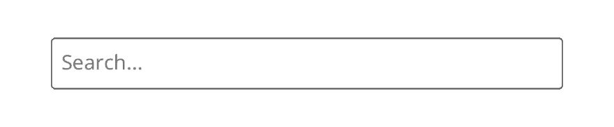
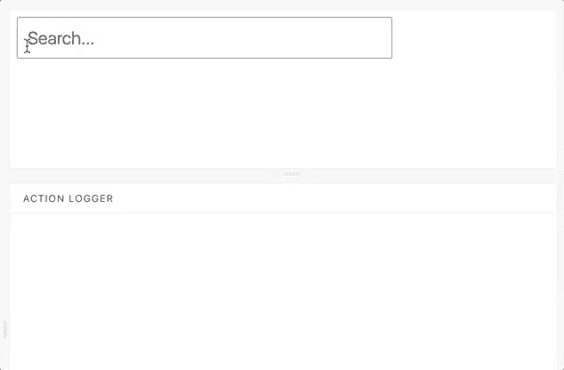

# 每周用户界面挑战第 2 周第 2 天:添加输入字段

> 原文：<https://dev.to/geoff/weekly-ui-challenge-week-2-day-2-add-an-input-field-3gg3>

欢迎来到第 2 周，我每周 UI 挑战的第 2 天！第 2 周将关注一个**搜索栏** UI 组件；在接下来的一周里的每一天，我将选择一个设计的子元素来实现。第二天，我们的目标是…

## 添加一个输入字段

在我们进入任何令人兴奋的领域之前，我们需要为搜索栏创建一个最基本的东西:一个输入框！毕竟，如果用户不能键入他们的搜索查询，他们怎么可能向搜索平台和/或服务器请求他们想要寻找的东西呢？继续创建著名的白色矩形，它因互联网巨头而闻名，如人人喜爱的搜索管家 **Ask Jeeves** ，来自**雅虎**的工具栏，你奶奶仍然坚持使用她的 Internet Explorer 8 版本，以及一家名为**谷歌**的小公司(听说过他们吗？).

根据我创作的原始设计，这是我为第二天准备的:

[T2】](https://res.cloudinary.com/practicaldev/image/fetch/s--odhjV72e--/c_limit%2Cf_auto%2Cfl_progressive%2Cq_auto%2Cw_880/https://raw.githubusercontent.com/geoffdavis92/weekly-ui-assets/master/search-bar/day2/w2d2-final-sized.png)

同样，我没有偏离“白色矩形”搜索输入的可靠传统；为此，我使用了一个带有`type="search"`属性的`input`元素；您可以使用`type="text"`或其他类型的元素来获取用户输入，但是使用适当的 HTML 元素和`type`属性将有助于组件的用户体验(或 UX ),因为浏览器和设备将基于搜索类型添加额外的功能。

为了让这个组件按原样工作，我将`input`包装在一个`form`元素中；这使得搜索到的文本可以提交给你用来搜索的任何服务器/服务/平台，只需按“回车”即可。

我保留了第一周的 2px `border-radius`风格，以及相同颜色的调色板；我发现这是一个很好的简约，仍然适合这个设计。如果您查看现场演示，您会注意到我从第 7 天开始添加了焦点状态，以获得额外的效果。

这是第一件作品的动画:

[T2】](https://res.cloudinary.com/practicaldev/image/fetch/s--rv21aZK6--/c_limit%2Cf_auto%2Cfl_progressive%2Cq_66%2Cw_880/https://raw.githubusercontent.com/geoffdavis92/weekly-ui-assets/master/search-bar/day2/w2d2-searchinput-animation.gif)

## 现在轮到你了

我使用了 [React.js](https://reactjs.org) 和 [Storybook](http://storybook.js.org) 来开发我的实现，但是你可以使用任何你喜欢的技术栈！(提示:如果你用 [Vue.js](https://vuejs.org/) 或者 [Angular.js](https://angularjs.org) ，那些库还是可以用 [Storybook 的)](https://storybook.js.org/basics/slow-start-guide/)

如果你不愿意，你甚至可以不使用视图库；HTML 和 CSS-only(和非视图 JavaScript 库)组件是可能的，特别是对于这一步。

此外，请在评论中添加您的设计灵感的回复和/或图像！我很想看看你们都创作了什么样的设计。

编码快乐！🎉

### 第二周日历

1.  (周日 4/15)设计组件✅
2.  输入栏🎯
3.  提交按钮
4.  集成自动完成功能
5.  过去的搜索词指示器
6.  100% a11y 分数
7.  调整、重构、修复

### 资源

*   [在 MDN 上搜索输入类型](https://developer.mozilla.org/en-US/docs/Web/HTML/Element/input/search)
*   [大纲:无(点 com)](http://www.outlinenone.com/) (使用/围绕`outline` CSS 属性工作的好入门)
*   [可访问的搜索元素](http://www.a11ymatters.com/pattern/accessible-search/)