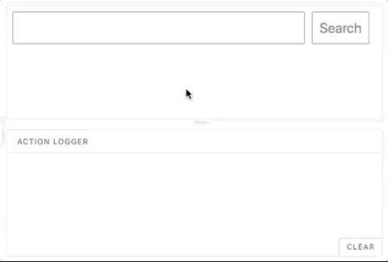

# 每周用户界面挑战第 2 周第 3 天:添加提交按钮

> 原文：<https://dev.to/geoff/weekly-ui-challenge-week-2-day-3-add-a-submit-button-20i8>

欢迎来到我每周 UI 挑战的第 2 周，第 3 天！第 2 周将关注一个**搜索栏** UI 组件；在接下来的一周里的每一天，我将选择一个设计的子元素来实现。第三天，我们的目标是…

## 添加一个提交按钮

尽管事实上许多(大多数？)搜索栏 UI 组件允许用户通过按下`enter` / `return`来提交搜索查询，包含一个可点击按钮也是[的最佳实践。](https://uxplanet.org/design-a-perfect-search-box-b6baaf9599c#c63f)

如果用户愿意，他们可以点击搜索。否则，这样的用户——也许还有不太懂技术的用户——可能会对如何提交搜索查询感到困惑。再说像素便宜谁不喜欢*多*个选项？

根据我创作的原始设计，这是我为第三天准备的:

[T2】](https://res.cloudinary.com/practicaldev/image/fetch/s--dtuw9M8---/c_limit%2Cf_auto%2Cfl_progressive%2Cq_auto%2Cw_880/https://thepracticaldev.s3.amazonaws.com/i/bha1bm0cqf0jn0exrskr.jpg)

submit/search 按钮使用了 search `input`元素的许多相同样式，为了统一，也因为它的大小非常适合点击，使得用户可以轻松完成搜索。

我使用类型为`submit`的`input`元素，而不是使用`button`元素——它仍然可以提交`form`元素；这更具语义性，并且清楚地定义了元素的用途。为了进一步巩固这个元素的语义效用，我将`value`属性更新为“搜索”，因为原生的“提交”并不十分清楚用户到底“提交”了什么或者以什么形式提交。请注意，您不需要为这个元素添加名称，因为搜索查询很少需要与查询一起发送的`submit`输入的值，并且没有`name`属性的[输入元素永远不会提交给服务器](https://stackoverflow.com/questions/24472017/are-input-fields-without-a-name-attribute-submitted-to-the-server)。

下面是搜索输入和提交按钮协同工作的动画:

[T2】](https://res.cloudinary.com/practicaldev/image/fetch/s--8FOiDjxD--/c_limit%2Cf_auto%2Cfl_progressive%2Cq_66%2Cw_880/https://raw.githubusercontent.com/geoffdavis92/weekly-ui-assets/master/search-bar/day3/w2d3-animation-xld.gif)

## 现在轮到你了

我使用了 [React.js](https://reactjs.org) 和 [Storybook](http://storybook.js.org) 来开发我的实现，但是你可以使用任何你喜欢的技术栈！(提示:如果你用 [Vue.js](https://vuejs.org/) 或者 [Angular.js](https://angularjs.org) ，那些库还是可以用 [Storybook 的)](https://storybook.js.org/basics/slow-start-guide/)

如果你不愿意，你甚至可以不使用视图库；HTML 和 CSS-only(和非视图 JavaScript 库)组件是可能的，特别是对于这一步。

此外，请在评论中添加您的设计灵感的回复和/或图像！我很想看看你们都创作了什么样的设计。

编码快乐！🎉

### 第二周日历

1.  (周日 4/15)设计组件✅
2.  Input field ✅
3.  提交按钮🎯
4.  集成自动完成功能
5.  过去的搜索词指示器
6.  100% a11y 分数
7.  调整、重构、修复

### 资源

*   [在 MDN](https://developer.mozilla.org/en-US/docs/Web/HTML/Element/input/submit) 上输入“提交”
*   [按钮 UX 设计:最佳实践、类型和状态](https://uxplanet.org/button-ux-design-best-practices-types-and-states-647cf4ae0fc6)
*   [设计一个完美的搜索框](https://uxplanet.org/design-a-perfect-search-box-b6baaf9599c)