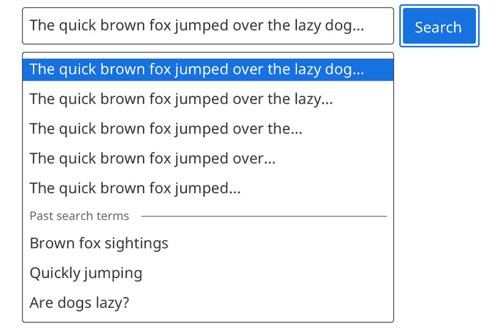
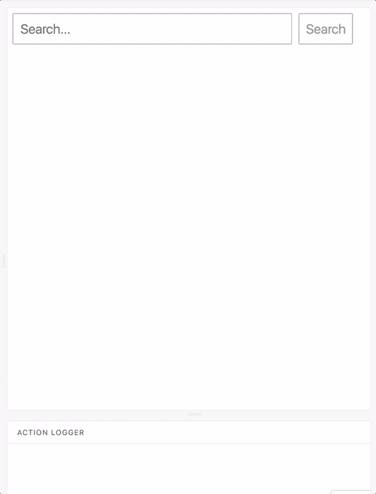

# 每周用户界面挑战第 2 周第 5 天:过去的搜索词指标

> 原文：<https://dev.to/geoff/weekly-ui-challenge-week-2-day-5-past-search-term-indicators-35o1>

欢迎来到我每周 UI 挑战的第 2 周第 5 天！第 2 周将关注一个**搜索栏** UI 组件；在接下来的一周里的每一天，我将选择一个设计的子元素来实现。第五天，我们的目标是…

## 添加过去的搜索词指标

当你使用搜索引擎时——尤其是有自动完成功能的——你通常不仅仅是在和服务器互动。最先进的搜索系统实现了某种类型的[机器学习](https://en.wikipedia.org/wiki/Machine_learning)来使搜索结果更快更相关。

我们今天不会构建一个机器学习平台，但会为已经搜索过的术语添加指示器(或者在我的情况下，在自动完成选项下添加一个单独的列表)。这让用户有机会重新访问他们已经完成的搜索，或者在其他情况下避免再次进行相同的搜索。

根据我创作的原始设计，这是我为第五天准备的:

[T2】](https://res.cloudinary.com/practicaldev/image/fetch/s--DJpwpMAZ--/c_limit%2Cf_auto%2Cfl_progressive%2Cq_auto%2Cw_880/https://thepracticaldev.s3.amazonaws.com/i/o4fogk8pe25rwwfazcq5.jpg)

出于一致性的考虑，过去搜索的术语位于自动完成项目的正下方。如果你有一个功能齐全的搜索平台，你可以用真实的结果填充这个列表，但在我的例子中，我只是使用了一个静态的术语列表，人们可以在我虚构的音乐应用程序中搜索。

以下是显示过去搜索词列表的动画:

[T2】](https://res.cloudinary.com/practicaldev/image/fetch/s--znzrIE-w--/c_limit%2Cf_auto%2Cfl_progressive%2Cq_66%2Cw_880/https://raw.githubusercontent.com/geoffdavis92/weekly-ui-assets/master/search-bar/day5/w2d5-animation.gif)

## 现在轮到你了

我使用了 [React.js](https://reactjs.org) 和 [Storybook](http://storybook.js.org) 来开发我的实现，但是你可以使用任何你喜欢的技术栈！(提示:如果你用 [Vue.js](https://vuejs.org/) 或者 [Angular.js](https://angularjs.org) ，那些库还是可以用 [Storybook 的)](https://storybook.js.org/basics/slow-start-guide/)

如果你不愿意，你甚至可以不使用视图库；HTML 和 CSS-only(和非视图 JavaScript 库)组件是可能的，特别是对于这一步。

此外，请在评论中添加您的设计灵感的回复和/或图像！我很想看看你们都创作了什么样的设计。

编码快乐！🎉

### 第二周日历

1.  (周日 4/15)设计组件✅
2.  Input field ✅
3.  Submit button ✅
4.  集成自动完成功能✅
5.  过去的搜索词指示器🎯
6.  100% a11y 分数
7.  调整、重构、修复