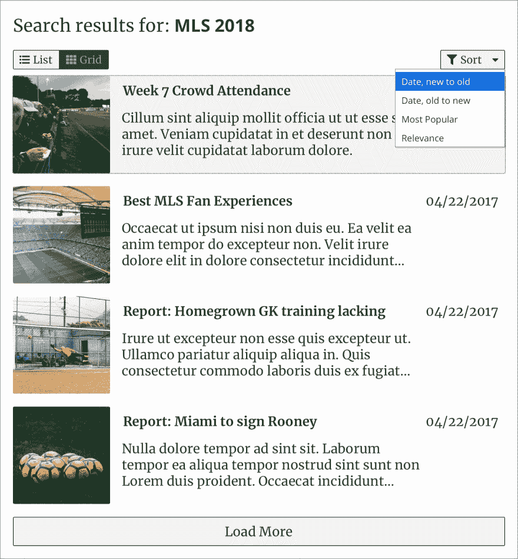
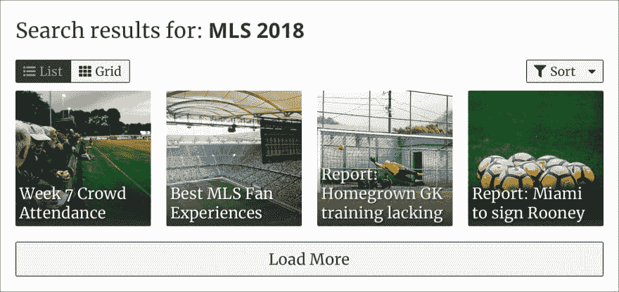

# 每周用户界面挑战第 3 周第 1 天:设计结果页面

> 原文：<https://dev.to/geoff/weekly-ui-challenge-week-3-day-1-design-a-results-page-1bok>

欢迎来到第 3 周，我每周 UI 挑战的第 1 天！第 3 周将关注一个**结果页面** UI 组件；在接下来的一周里的每一天，我都会挑选一两个(通常是相关的)子元素来实现。第一天，我们的目标是…

## 设计组件

我个人使用 Sketch 来设计本周的组件，但你可以使用 Sketch，一个类似 Adobe XD 的 UX/UI 设计程序，或者其他任何程序(或者只是纸和笔/铅笔！)来设计你的组件。

如果您决定不设计自己的组件，那么非常欢迎您使用我的设计，但是我认为如果您设计自己的组件，您会得到最大的好处。(另外，我很想看看你们都想出了什么！)

以下是我的结果组件的外观，包括组件的许多状态:

[T2】](https://res.cloudinary.com/practicaldev/image/fetch/s--w2s_2e_7--/c_limit%2Cf_auto%2Cfl_progressive%2Cq_auto%2Cw_880/https://thepracticaldev.s3.amazonaws.com/i/3d8rfrn8i29o8lomq7kv.jpg)

组件的网格视图如下所示:

[T2】](https://res.cloudinary.com/practicaldev/image/fetch/s--kTFOO-N7--/c_limit%2Cf_auto%2Cfl_progressive%2Cq_auto%2Cw_880/https://thepracticaldev.s3.amazonaws.com/i/jkzu0miy8adkolreczzn.jpg)

## 现在轮到你了

跳上那些设计程序(或者拿出纸笔)，设计你自己的**结果页面**！下面是一个日历，上面列有我将在哪天实现的功能，以及一些可能对你有帮助的资源。

此外，请在评论中添加您的设计灵感的回复和/或图像！我很想看看你们都创作了什么样的设计。

快乐设计！🎉

### 第 3 周日历

1.  (周日 4/22)设计组件🎯
2.  结果条目、赞助商/畅销书指标
3.  网格/列表视图切换
4.  整理
5.  分页/加载更多
6.  100% a11y 分数
7.  调整、重构、修复

### 资源

*   [搜索结果的最佳实践](https://uxplanet.org/best-practices-for-search-results-1bbed9d7a311)
*   [设计搜索的基本原则&结果](https://www.deeson.co.uk/blog/ux-series-basic-principles-designing-search-results)
*   [打造华丽 UI 的 7 条法则](https://medium.com/@erikdkennedy/7-rules-for-creating-gorgeous-ui-part-1-559d4e805cda)
*   [a11y 项目](https://a11yproject.com/) ( *用于创建无障碍网站/应用程序的巨大*资源)