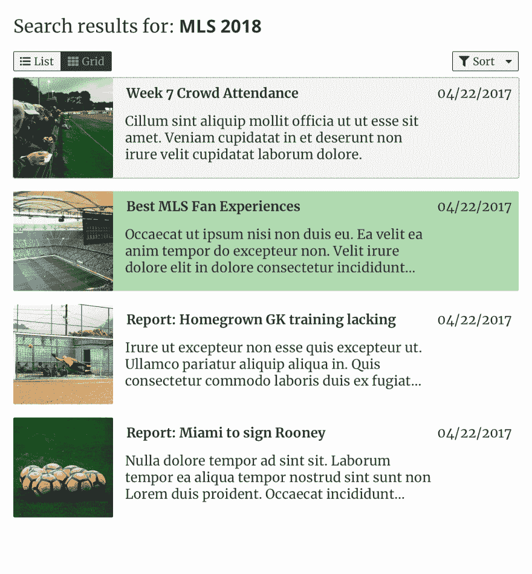
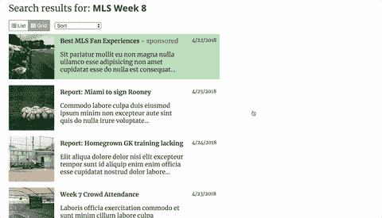

# 每周用户界面挑战第 3 周第 4 天:添加排序

> 原文：<https://dev.to/geoff/weekly-ui-challenge-week-3-day-4-add-sorting-7e>

欢迎来到我每周 UI 挑战的第 3 周第 4 天！第 3 周将关注一个**结果页面** UI 组件；在接下来的一周里的每一天，我都会挑选一两个(通常是相关的)子元素来实现。第四天，我们的目标是…

## 添加排序

搜索结果的排序是有用的结果页面的重要部分。无论是电子商务平台——按价格或客户评论排序，还是搜索引擎——按日期或相关性排序，或者其他类型的应用程序/网站，适当的排序方法都有助于用户充分利用您的搜索实施。

根据我创作的原始设计，这是我为第四天准备的:

[T2】](https://res.cloudinary.com/practicaldev/image/fetch/s--FhSRbPyp--/c_limit%2Cf_auto%2Cfl_progressive%2Cq_auto%2Cw_880/https://thepracticaldev.s3.amazonaws.com/i/j8cjtbklxomue6imuy5i.png)

由于我使用了原生 HTML `select`元素，所以设计略有不同，但是功能都在。该设计继续模拟模拟足球博客的结果，因此排序方法反映了博客的排序方法，即按日期排序。如果你使用一个更强大的搜索平台和灵活的 API，你也可以按照相关性(比如像 Google 和 Amazon 那样)或者价格或者客户评级来排序，就像前面提到的那样。

下面是该功能的动画效果:

[T2】](https://res.cloudinary.com/practicaldev/image/fetch/s--M_HNeL_2--/c_limit%2Cf_auto%2Cfl_progressive%2Cq_66%2Cw_880/https://thepracticaldev.s3.amazonaws.com/i/aw87o75t8vbp4rnqdb71.gif)

您可以在我的 Github pages 站点上查看我为这个项目编写的代码实现[。](https://geoffdavis92.github.io/weekly-ui/)

## 现在轮到你了

我使用了 [React.js](https://reactjs.org) 和 [Storybook](http://storybook.js.org) 来开发我的实现，但是你可以使用任何你喜欢的技术栈！(提示:如果你用 [Vue.js](https://vuejs.org/) 或者 [Angular.js](https://angularjs.org) ，那些库还是可以用 [Storybook 的)](https://storybook.js.org/basics/slow-start-guide/)

如果你不愿意，你甚至可以不使用视图库；HTML 和 CSS-only(和非视图 JavaScript 库)组件是可能的，特别是对于这一步。

此外，请在评论中添加您的设计灵感的回复和/或图像！我很想看看你们都创作了什么样的设计。

编码快乐！🎉

### 第 3 周日历

1.  (周日 4/22)设计组件✅
2.  结果条目，赞助/畅销书指标✅
3.  Grid/list view toggles ✅
4.  整理🎯
5.  分页/加载更多
6.  100% a11y 分数
7.  调整、重构、修复