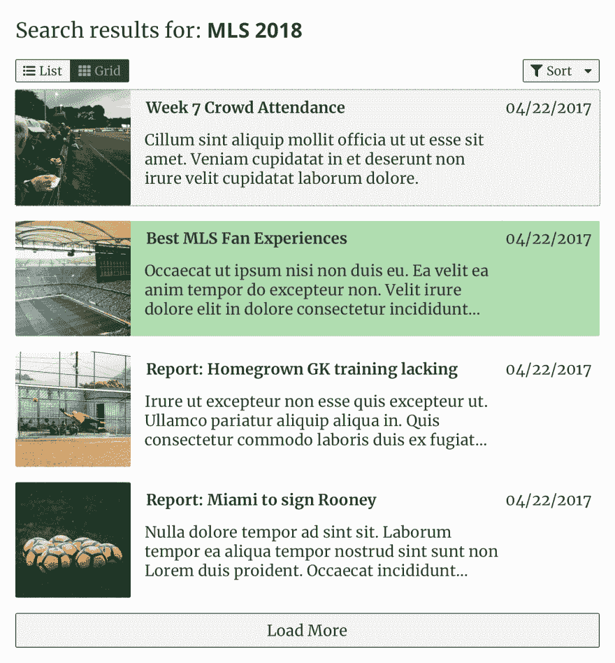
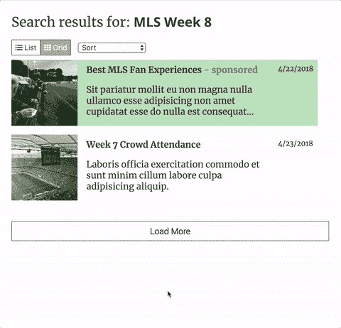

# 每周 UI 挑战第 3 周第 5 天:添加分页/加载更多功能

> 原文：<https://dev.to/geoff/weekly-ui-challenge-week-3-day-5-add-a-paginationload-more-feature-9je>

欢迎来到我每周 UI 挑战的第 3 周第 5 天！第 3 周将关注一个**结果页面** UI 组件；在接下来的一周里的每一天，我都会挑选一两个(通常是相关的)子元素来实现。第五天，我们的目标是…

## 添加分页/加载更多功能

你是否曾经提交一个搜索查询，发现自己从谷歌或亚马逊得到了超过一百万个结果？在那种情况下，有多少次你不得不滚动几个小时才能看到最后？没有吗？当然，因为大多数健壮的搜索引擎都提供搜索结果的分页或惰性加载。

分页(动态创建页面以显示内容)和惰性加载内容(如搜索结果或文章列表)是更多真正有助于在您的网站/应用程序上提供强大用户体验的功能。这不仅防止用户被结果淹没，而且通过在一次渲染中不加载数十/数百/可能数千个结果来提高整体性能和可访问性，并分别减少设备上的数据负载。

根据我创作的原始设计，这是我为第五天准备的:

[T2】](https://res.cloudinary.com/practicaldev/image/fetch/s--KjLkgT1H--/c_limit%2Cf_auto%2Cfl_progressive%2Cq_auto%2Cw_880/https://thepracticaldev.s3.amazonaws.com/i/nf6dvzp90w720cr0cl0g.png)

对于今天的特性实现，我选择使用“加载更多”;幸运的是，我编写了一个名为 [Floodgate](https://github.com/geoffdavis92/react-floodgate) 的小 React 组件来做这件事。

Floodgate 是一个组件，它利用[渲染道具](https://reactjs.org/docs/render-props.html)和生成器来递增地渲染传递给组件的项目子集。这样的条目可以是任何绑定到数组的东西，在本例中，条目是一个对象数组，其中保存了用于排序的`<ResultEntry/>`组件及其日期。Floodgate 还将函数作为参数传入，以加载下一批项目，加载所有项目，并重置组件状态。(我在所有项目渲染后使用重置功能，以便轻松演示该功能，因为正常的结果页面可能不一定会使用该功能)

为了给我的搜索结果的读者一个好的 UX，我还需要禁用 load more 按钮，也许显示一个标签来通知他们所有的结果都已经显示了。防洪闸掩护你！一个`loadComplete`布尔值也作为一个渲染函数参数被传入，如果所有的项目都被渲染了，那么它将产生一个值`true`。

如果您正在使用 React 构建您的搜索结果用户界面，请看看 Floodgate，看看它是否能帮助您！

下面是我的 load more 功能的动画:

[T2】](https://res.cloudinary.com/practicaldev/image/fetch/s--kRSjYUdy--/c_limit%2Cf_auto%2Cfl_progressive%2Cq_66%2Cw_880/https://thepracticaldev.s3.amazonaws.com/i/18jx0388xfzw7styclpi.gif)

您可以在我的 Github pages 站点上查看我为这个项目编写的代码实现[。](https://geoffdavis92.github.io/weekly-ui/)

## 现在轮到你了

我使用了 [React.js](https://reactjs.org) 和 [Storybook](http://storybook.js.org) 来开发我的实现，但是你可以使用任何你喜欢的技术栈！(提示:如果你用 [Vue.js](https://vuejs.org/) 或者 [Angular.js](https://angularjs.org) ，那些库还是可以用 [Storybook 的)](https://storybook.js.org/basics/slow-start-guide/)

如果你不愿意，你甚至可以不使用视图库；HTML 和 CSS-only(和非视图 JavaScript 库)组件是可能的，特别是对于这一步。

此外，请在评论中添加您的设计灵感的回复和/或图像！我很想看看你们都创作了什么样的设计。

编码快乐！🎉

### 第 3 周日历

1.  (周日 4/22)设计组件✅
2.  结果条目，赞助/畅销书指标✅
3.  Grid/list view toggles ✅
4.  排序\ \
5.  分页/加载更多🎯
6.  100% a11y 分数
7.  调整、重构、修复

### 资源

*   [`react-floodgate`](https://github.com/geoffdavis92/react-floodgate) -一个 React“加载更多”React 组件，用于增量显示数据
*   [分页–范例和良好实践](https://www.smashingmagazine.com/2007/11/pagination-gallery-examples-and-good-practices/)
*   [无限滚动最佳实践](https://uxplanet.org/infinite-scrolling-best-practices-c7f24c9af1d)
*   [无限滚动、分页或“加载更多”按钮？电子商务中的可用性发现](https://www.smashingmagazine.com/2016/03/pagination-infinite-scrolling-load-more-buttons/)