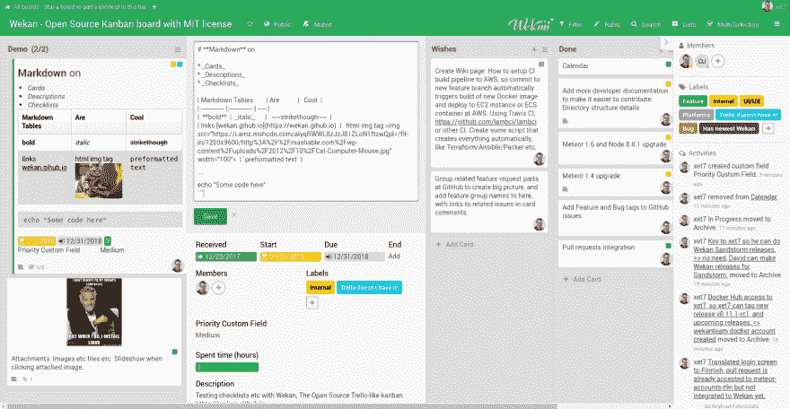
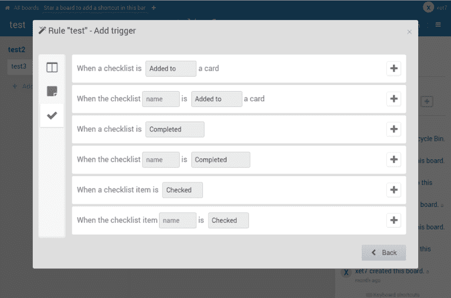
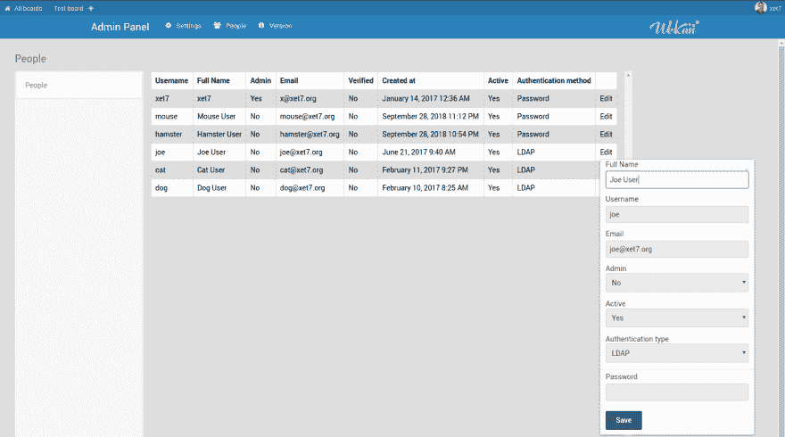

# Year 2018，我们的目标是什么

> 原文：<https://dev.to/xet7/wekan-year-2018-what-we-archieved-lhc>

Wekan 是开源看板，你可以把它安装到你的笔记本电脑或服务器上。您可以将所有数据置于自己的控制之下。您也可以使用一些 SaaS 提供商。

[T2】](https://res.cloudinary.com/practicaldev/image/fetch/s--NPDHDE7v--/c_limit%2Cf_auto%2Cfl_progressive%2Cq_auto%2Cw_880/https://thepracticaldev.s3.amazonaws.com/i/2y0grt95zrxa5f7q5afz.png)

## 2018 年有什么计划

在 2017 年 12 月 23 日，我写了关于 2018 年的[计划。其中许多确实完成了，还有一些计划在 2018 年剩余时间和 2019 年新年完成，并在计划中增加了一些内容。](https://blog.wekan.team/2017/12/2-years-of-wekan-what-we-archieved/index.html)

## 完成于 2018-11

### 单机和[沙尘暴](https://sandstorm.io) Wekan

*   [日历](https://github.com/wekan/wekan/issues/808#issuecomment-427962878)。
*   [搜索](https://github.com/wekan/wekan/pull/1503)。
*   [自定义字段](https://github.com/wekan/wekan/wiki/Custom-Fields)。
*   IFTTT (If-this-then-then-that)为自动化制定规则，类似于 Trello 的 Butler。我想这目前只在独立的 Wekan 上可见。

[T2】](https://res.cloudinary.com/practicaldev/image/fetch/s---Vww9BFy--/c_limit%2Cf_auto%2Cfl_progressive%2Cq_auto%2Cw_880/https://thepracticaldev.s3.amazonaws.com/i/n574fr2elhysa52rs4ks.png)

*   一些移动网络的改进。
*   更多信息，请参见[变更日志](https://github.com/wekan/wekan/blob/devel/CHANGELOG.md)获取完整列表。

### 独立 Wekan (Snap、Docker、Source、VirtualBox)

*   [LDAP](https://github.com/wekan/wekan/wiki/LDAP) 。

[T2】](https://res.cloudinary.com/practicaldev/image/fetch/s--vfmB_uOy--/c_limit%2Cf_auto%2Cfl_progressive%2Cq_auto%2Cw_880/https://thepracticaldev.s3.amazonaws.com/i/hi2ypi2vvpibhx3dmmtm.png)

*   在[快照设置](https://github.com/wekan/wekan-snap/wiki/Supported-settings-keys)和 [Docker 合成文件](https://github.com/wekan/wekan/blob/devel/docker-compose.yml)的环境变量中有所有设置(SMTP 等)，不需要在管理面板中手动设置。管理面板中的电子邮件设置被删除，然后添加回来，电子邮件密码隐藏在管理面板。

## 2018 年剩余时间及 2019 年新年计划

### 单机和沙尘暴微侃

*   字体大小的改进。
*   安排事件。
*   导入/导出/添加/删除修复和添加内容。
*   错误修正。
*   更多移动网络改进。
*   提供[不同的方式来存储附件](https://github.com/wekan/wekan/issues/142)。

### 独立 Wekan

*   [团队/组织管理员和用户管理员新增内容](https://github.com/wekan/wekan/issues/802)。
*   [顶级项目](https://github.com/wekan/wekan/issues/641)。
*   白标:[自定义 Logo](https://github.com/wekan/wekan/issues/1196) ，[自定义 CSS](https://github.com/wekan/wekan/wiki/Custom-CSS-themes) ，自定义产品名称代替 Wekan 等。
*   如有可能，Snap 适用于其他处理器架构，如 [arm64](https://blog.wekan.team/2018/01/wekan-progress-on-x64-and-arm/index.html) 。
*   [朋友](https://github.com/wekan/wekan/wiki/Friend):
    *   将 Wekan 日历同步到朋友日历。
    *   好友登录也会自动登录 Wekan。
*   更多支持的数据库，如果可能的话。

## 感谢所有让 Wekan 成为可能的人

*   CNCF / Linux 基金会[提供裸机服务器](https://blog.wekan.team/2018/01/wekan-progress-on-x64-and-arm/index.html)用于开发和下载托管。
*   GitHub、Snap、Quay.io、Docker Hub、Sandstorm 等位于[的所有 Wekan 平台](https://github.com/wekan/wekan/wiki/Platforms)，用于下载和托管 Wekan 运行的数千台服务器。
*   每个人都在添加关于 Wekan bugs 和功能请求的新 GitHub 问题。
*   公司和个人作为 pr 向 Wekan 贡献特性和补丁，并增加奖金。
*   芬兰 Unix 用户组基金会[为 Wekan 特性开发](https://fuug.fi/2018/wekan-kanban-taulun-perustoimintojen-kehityksen-tulokset/)提供资助。
*   公司和个人使用我的 [Wekan 商业支持](https://wekan.team/)获得支持和新的 Wekan 功能，[理解](https://dev.to/xet7/confessions-of-an-open-source-contributor-2a1i)的延迟。我真的试图把一切都实现，发展是不容易的。

我目前几乎全职做 Wekan。我没有接受任何非 Wekan 全职工作的工作邀请。因为你一直以来的支持，我还在维护 Wekan。感谢所有人！

xet7

(最初发布于:[https://blog . wekan . team/2018/11/year-2018-what-we-archieved/index . html](https://blog.wekan.team/2018/11/year-2018-what-we-archieved/index.html))