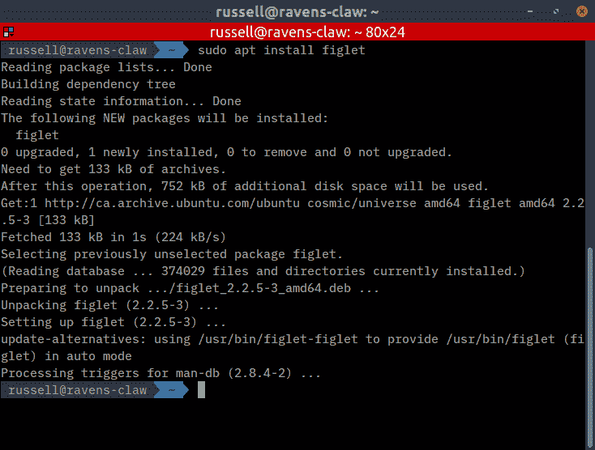
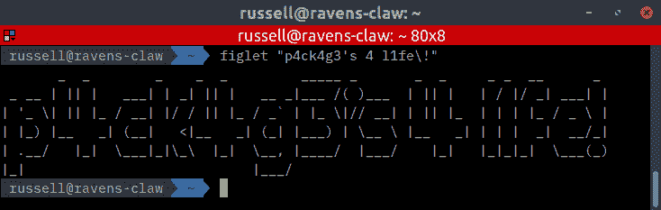
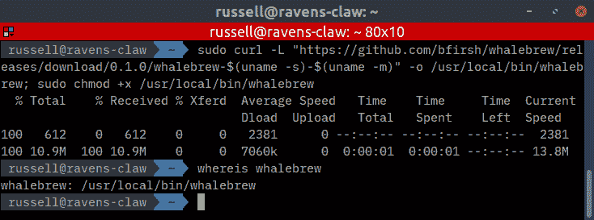
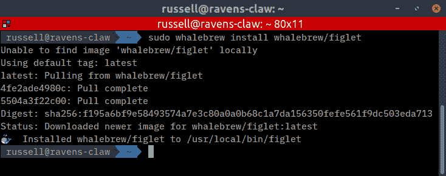
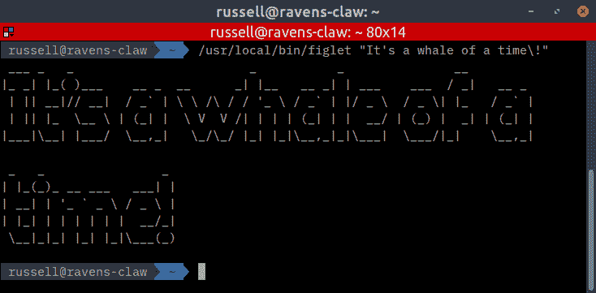
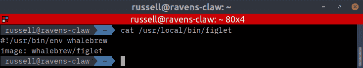
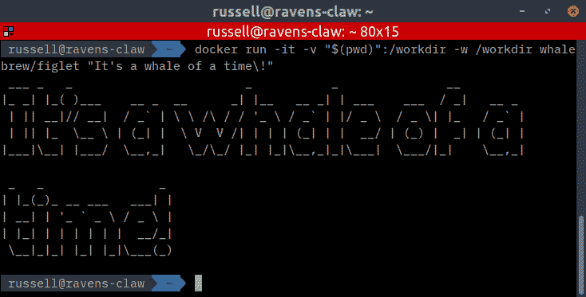

# 捕鲸啤酒

> 原文：<https://dev.to/jonesrussell/whalebrew-5540>

#### Docker 图像作为‘原生’命令

Ahnee！如果你来自苹果世界，你可能用过，或者至少听说过[家酿](https://brew.sh/)。对于不了解内情的人来说，家酿软件是【macOS 缺失的软件包管理器。或者更准确地说，这是一个 macOS 的软件包管理系统，可以与 Redhat 的 [RPM](http://rpm.org/) ，Debian 的 [APT](https://wiki.debian.org/Apt) ，以及 Window 的 [Chocolatey](https://chocolatey.org/) 相媲美。

软件包管理器通过自动获取预编译的二进制文件及其依赖项，然后将它们复制到您的$PATH 中，使得安装软件变得容易。

根据软件的不同，从源代码编译通常是困难和耗时的。软件包管理器让您可以继续使用软件。

### 用 APT 安装

<figure>[](https://res.cloudinary.com/practicaldev/image/fetch/s--VZKbO2b1--/c_limit%2Cf_auto%2Cfl_progressive%2Cq_auto%2Cw_880/https://cdn-images-1.medium.com/max/734/1%2AMLwvtPEG0yoOEtCzml-R9Q.png) 

<figcaption>figlet 显示由普通屏幕字符组成的大字符</figcaption>

</figure>

我将演示在 Ubuntu 18.10 中用 APT 安装一个包:

```
**$** sudo apt install figlet 
```

Enter fullscreen mode Exit fullscreen mode

截图中可以看到，APT 下载了 figlet 包(fig let _ 2 . 2 . 5–3 _ amd64 . deb)，解包，然后最后安装到/usr/bin/figlet。

```
**$** figlet "p4ck4g3's 4 l1fe\!" 
```

Enter fullscreen mode Exit fullscreen mode

<figure>[](https://res.cloudinary.com/practicaldev/image/fetch/s--jiFB7y4T--/c_limit%2Cf_auto%2Cfl_progressive%2Cq_auto%2Cw_880/https://cdn-images-1.medium.com/max/734/1%2AXkvZZOmATGe8p6Ri2ZqOaA.png) 

<figcaption>战斗中的人物</figcaption>

</figure>

### 我会永远爱你

捕鲸业是集装箱激增不可避免的副作用。它们的易用性、速度和低资源消耗使它们成为执行单一命令或功能的理想工具。

正如我之前写的那样，容器可以在几毫秒内启动，执行任务，然后停止。这正是 Whalebrew 允许您在$PATH 中以 Docker 图像的形式做的事情。

现在让我们把放大镜放在 Whalebrew 上，浏览它的安装，然后“安装一个包”。

### 鲸豚示范

通过为运行 Docker 容器创建别名并将其存储在$PATH 中，在容器中运行命令是无缝的，实际上与在环境中直接运行命令没有什么区别。

那看起来到底像什么？假设您已经安装了[Docker](https://medium.com/@jonesrussell42/docker-for-legacy-drupal-development-6df4dec8b309#db40)，我们将从安装 Whalebrew(来自【https://github.com/bfirsh/whalebrew】T2):
开始

```
**$** sudo curl -L "https://github.com/bfirsh/whalebrew/releases/download/0.1.0/whalebrew-$(uname -s)-$(uname -m)" -o /usr/local/bin/whalebrew; sudo chmod +x /usr/local/bin/whalebrew 
```

Enter fullscreen mode Exit fullscreen mode

<figure>[](https://res.cloudinary.com/practicaldev/image/fetch/s--n0J0NWLl--/c_limit%2Cf_auto%2Cfl_progressive%2Cq_auto%2Cw_880/https://cdn-images-1.medium.com/max/734/1%2AEzjhwX8SPJ-Zlcjxiayt2A.png) 

<figcaption>Whalebrew 安装到/usr/local/bin/Whalebrew</figcaption>

</figure>

现在让我们再次安装 figlet，但是这次使用 Whalebrew:

```
**$** sudo whalebrew install whalebrew/figlet 
```

Enter fullscreen mode Exit fullscreen mode

<figure>[](https://res.cloudinary.com/practicaldev/image/fetch/s--BKY7fjG_--/c_limit%2Cf_auto%2Cfl_progressive%2Cq_auto%2Cw_880/https://cdn-images-1.medium.com/max/734/1%2AbLCbFgBYsdCcLfeKnr2UpA.png)

<figcaption>whalebrew/fig let 安装到/usr/local/bin/figlet</figcaption>

</figure>

现在，让我们再次运行 figlet 并赞美它的辉煌结果(如果合适的 figlet 在$PATH 中位于第一位，我们将使用完整路径):

```
**$** /usr/local/bin/figlet "It's a whale of a time\!" 
```

Enter fullscreen mode Exit fullscreen mode

<figure>[](https://res.cloudinary.com/practicaldev/image/fetch/s--1YUPPIbe--/c_limit%2Cf_auto%2Cfl_progressive%2Cq_auto%2Cw_880/https://cdn-images-1.medium.com/max/734/1%2AX8Eew1wrMcMjbw2-skNPGQ.png) 

<figcaption>在 Docker 容器中运行的 fig let</figcaption>

</figure>

Tada！我们刚刚在一个容器中运行了 figlet。你可能已经注意到它需要更长的时间来执行，这取决于你的计算机的运行时间。

刚刚发生了什么？在我们结束之前，我们将快速浏览一下，检查一下运行本地二进制文件和 Whalebrew 命令之间的区别。

### 原生对‘原生’

<figure>[](https://res.cloudinary.com/practicaldev/image/fetch/s--wNZz34ee--/c_limit%2Cf_auto%2Cfl_progressive%2Cq_auto%2Cw_880/https://cdn-images-1.medium.com/max/799/1%2AzpAHqMDHdy4hqXN3fo1hAQ.jpeg) 

<figcaption>[一幅印度画的摹本](http://bibliodyssey.blogspot.com/2006/08/bodmer-series-on-native-america.html)</figcaption>

</figure>

Maazhichige，错了‘土著’！用 APT 安装的 figlet 程序是一个 ELF 可执行文件，由 C 编译的[源代码](https://github.com/cmatsuoka/figlet)，它直接运行在你的系统上。

Whalebrew 别名如下:

```
**$** cat /usr/local/bin/figlet 
```

Enter fullscreen mode Exit fullscreen mode

[T2】](https://res.cloudinary.com/practicaldev/image/fetch/s--HtKmU_I---/c_limit%2Cf_auto%2Cfl_progressive%2Cq_auto%2Cw_880/https://cdn-images-1.medium.com/max/734/1%2AzMYeFQLlnwjjhttXCnVGiw.png)

> 当执行一个包时，Whalebrew 将使用 Docker 运行指定的映像，在/workdir 中挂载当前工作目录，并传递所有参数。

这基本上是 Whalebrew 执行的:

```
**$** docker run -it -v "$(pwd)":/workdir -w /workdir whalebrew/figlet "It's a whale of a time\!" 
```

Enter fullscreen mode Exit fullscreen mode

[T2】](https://res.cloudinary.com/practicaldev/image/fetch/s--qyBC-Gjc--/c_limit%2Cf_auto%2Cfl_progressive%2Cq_auto%2Cw_880/https://cdn-images-1.medium.com/max/734/1%2AlSmdCGIGlEE6KDWGBHfFMA.png)

好吧，就这样，往前走。Baamaapii。